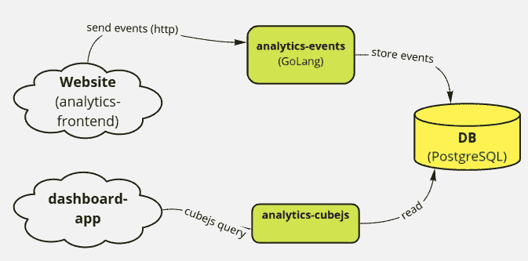
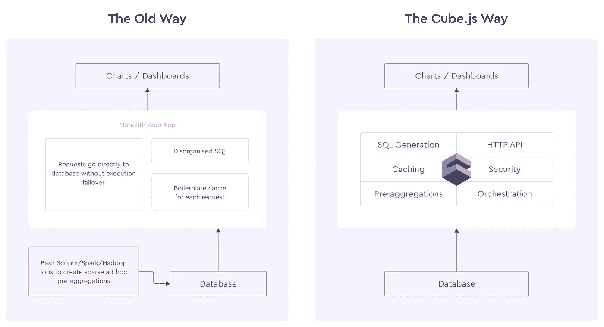
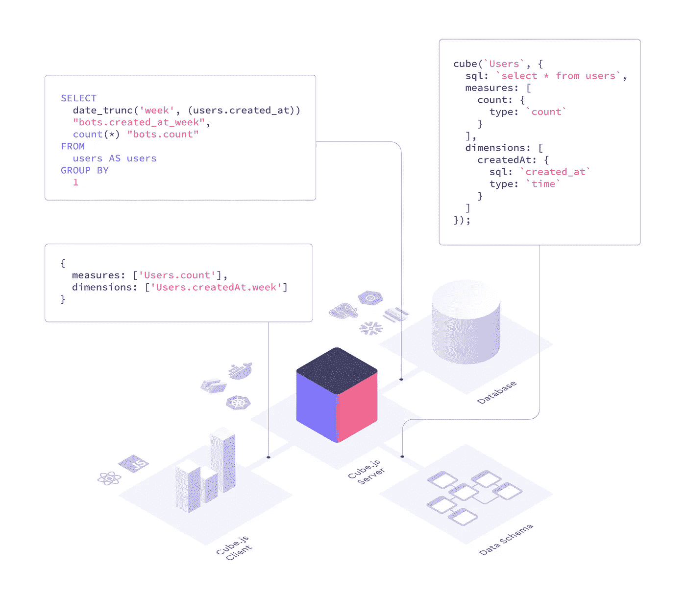
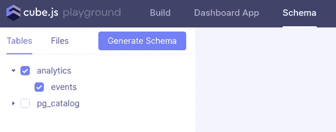
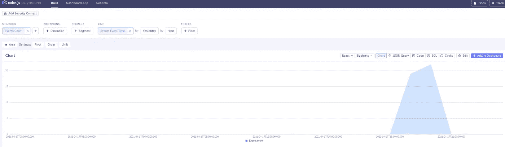
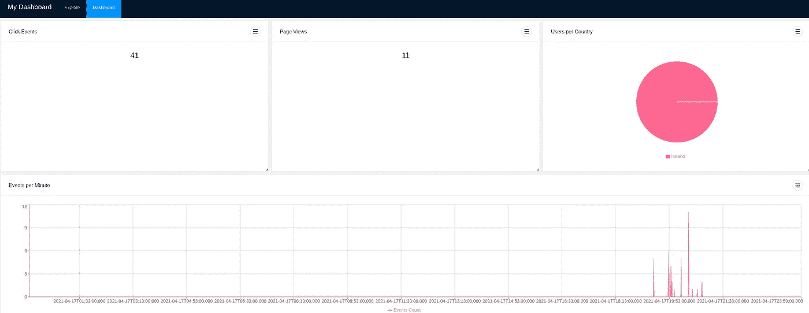

# 用 Cube.js 在 10 分钟内构建您自己的网站分析

> 原文：<https://itnext.io/build-your-own-website-analytics-with-cube-js-in-10-minutes-f195ed5d4d21?source=collection_archive---------1----------------------->


照片由[马龙·科罗纳](https://unsplash.com/@marlon10?utm_source=medium&utm_medium=referral)在 [Unsplash](https://unsplash.com?utm_source=medium&utm_medium=referral) 拍摄

# 介绍

这篇文章的目的是展示**用** [**Cube.js**](https://cube.dev/) 创建网站分析是多么容易。我已经在我的 [**上一篇文章**](/visualization-tools-for-big-data-c3361241a67e) 中谈到了 [Cube.js](https://cube.dev/) ，在这篇文章中，我将通过一个真实世界的例子来展示它的易用性。此外，我们将使用 [Cube.js](https://cube.dev/) 附带的内置 [**模板**](https://github.com/cube-js/cubejs-playground-templates) 来创建一个初始的前端应用程序，以后您可以按照您想要的任何方式定制它，因为它是一个标准的 [**React**](https://reactjs.org/) 应用程序。

# 我们在建造什么？

简而言之，我们正在构建一个非常简单的网站分析应用程序，它将**跟踪页面浏览量和点击事件**，并将它们存储到**数据库**。然后，我们将使用[**Cube.js**](https://cube.dev/docs/introduction)**来访问数据，并使用 cube . js 模板构建 React 应用程序。这里 可以找到**源代码** [**。**](https://github.com/javiramos1/analytics_cubejs)**

**我们将把它分成 3 个项目:**

*   **[**分析-前端**](https://github.com/javiramos1/analytics_cubejs/tree/main/analytics-frontend) :这个项目包含一个非常简单的静态网站，带有一个模拟的 HTML 页面和一个跟踪页面视图和事件的普通 JavaScript 文件。在现实世界中，这将是你的网站。**
*   **[**analytics-back end**](https://github.com/javiramos1/analytics_cubejs/blob/main/analytics-backend/README.md):这是一个 REST 端点，接收并持久保存前端发送的事件。**
*   **[**analytics-cubejs**](https://github.com/javiramos1/analytics_cubejs/blob/main/analytics-frontend/README.md) :这是 Cube.js 项目，其中也包含仪表板 React 应用程序。**

****

**我们将在 [**GoLang**](https://golang.org/) 中实现 analytics-events，因此它可以轻松地扩展到大量请求。在本例中，我们使用 **PostgreSQL** 来存储事件，但是您可以使用 Cube.js 支持的任何 [**数据源**](https://cube.dev/docs/connecting-to-the-database)**

**最后，核心应用程序是 **Cube.js API** ，它将为我们提供一个分析 API，允许我们轻松构建前端应用程序。**

***我们先来复习一下 Cube.js！***

## **Cube.js**

**[**Cube.js**](https://cube.dev/docs/introduction) 是一个 [**开源**](https://github.com/cube-js/cube.js) **分析 API 平台**，使访问您的原始数据变得非常容易和高效；它不提供可视化，但它有许多[模板](https://cube.dev/docs/frontend-introduction)，模块和例子[让你快速入门](https://cube.dev/docs/frontend-introduction)。**这是根据设计**，因此您可以选择自己喜欢的库，并与任何前端框架或图表库集成。**

**你只需要遵循 3 个简单的步骤:**

*   **[**安装 Cube**](https://cube.dev/docs/getting-started) **.js.** 它可以在任何地方运行:Kubernetes、Serverless、on-prem 等。**
*   **[**连接到数据源**](https://cube.dev/docs/connecting-to-the-database) 。它支持许多不同类型的数据源，从无服务器云数据仓库到传统的 RDBMs。您可以连接到许多信号源。**
*   **构建您的前端。 Cube.js 可以生成一个[仪表盘 App](https://cube.dev/docs/dashboard-app) 供你入门，然后你可以随心所欲地定制它，并将其与你的产品/网站集成。**

***就是这样！*，Cube.js 处理剩下的。**

****

****Cube.js** 在你的数据之上添加了一个**语义 API 层**来加速你的可视化开发；Cube.js 还管理访问控制、缓存和聚合数据。它可以与 Google BigQuery 和 AWS Athena 等**无服务器**数据仓库协同工作。因为 Cube.js 与可视化无关，所以您可以使用任何前端库来构建自己的定制 UI。**

****

**Cube.js 为任何严重依赖缓存和预聚合层的分析应用程序提供了必要的基础架构，以在几分钟内从原始数据中提供见解，并为多达万亿个数据点提供亚秒级响应时间的 API。**如果你必须自己实施，这将很难实现。**查看主题 [**示例**](https://cube.dev/docs/examples) 感受一下 Cube.js 的功能和卓越特性。**

****建筑****

**Cube.js 客户端向 REST API 发送符合[查询格式](https://cube.dev/docs/query-format)的查询。服务器使用模式来生成 SQL 查询，该查询由您选择的数据库执行。服务器处理所有数据库连接，以及预聚合和缓存层。然后，结果被发送回客户端。客户端本身是可视化无关的，可以很好地与任何图表库一起工作。**

****

# **动手！**

**让我们在 10 分钟内完成它。我假设你已经安装了 [**NPM**](https://nodejs.org/en/) 并且运行在 Linux/Mac 上，Windows 用户可能需要做一些小的改动。**

## **分析-前端**

**先说[前端](https://github.com/javiramos1/analytics_cubejs/tree/main/analytics-frontend)。首先，您需要创建一个 **JavaScript** 标签来跟踪页面视图和事件。你可以使用 [**GTM**](https://developers.google.com/tag-manager/) 或者任何其他工具在每一页上插入这个脚本。我们还将跟踪元数据，如用户的国家，IP，浏览器等。您可以根据您的网站使用情况添加更多数据点，如用户名、用户 id 等。**

**这是一个简单的标签，你可以用它作为你的起点，随意添加更多的元数据！**

**我们使用 [**IPAPI**](https://ipapi.co) 来获取用户元数据。当这个脚本被加载(在页面视图上)时，我们向后端发送一个 POST HTTP 请求，我们添加一个事件监听器来跟踪每次点击，我们跟踪带有 *onclick* 事件的链接、按钮或元素。这只是一个非常简单的例子，您应该针对实际的生产用途对其进行改进，但这是一个很好的起点。**

**你需要在网站的每一页都包含这一点，例如:**

**为了让 **IpAPI** 工作并且不被阻塞，你需要在服务器上运行示例页面。如果您使用的是我们的 [**源代码**](https://github.com/javiramos1/analytics_cubejs/tree/main/analytics-frontend) ，只需运行:**

*   **`make init`:初始化服务器**
*   **`make run`:运行静态 web 服务器**

**去`[http://localhost:8001](http://localhost:8001)`**

**然后打开您的 web developer 工具，您应该会看到记录的数据和一个关于事件端点的错误，我们还没有实现这个错误。*接下来就这么干吧！***

## **分析-后端**

**让我们转移到[后端](https://github.com/javiramos1/analytics_cubejs/tree/main/analytics-backend)。首先，让我们为我们的事件定义一个非常简单的模式:**

**只有一个包含我们在前端捕获的所有数据的表。接下来，让我们创建一个简单的 **GO** 服务来持久化事件:**

**这创建了一个 **REST** 端点 */event* ，它将接收页面视图和点击事件。它会将它们保存到我们的 PostgreSQL 数据库中。它使用一个*。env* 文件，您需要在其中输入您的数据库凭证。**

**为了方便起见，我包含了一个 **docker-compose** 文件和一个 Makefile 文件，以便于启动数据库和服务:**

*   **`made db`:使用已经创建的模式和表启动 PostgreSQL 实例。**
*   **`make run`:在`localhost:8000`运行服务器**

**现在，如果您再次启动 [analytics-frontend](https://github.com/javiramos1/analytics_cubejs/tree/main/analytics-frontend) ，您应该看到事件被持久化到 PostgreSQL 中，您可以使用 [**DBeaver**](https://dbeaver.io/) 或任何其他工具来检查 *analytics.events* 表。**

**此时，我们有一个跟踪用户的 JavaScript 标签和一个保存所有这些有价值数据的后端。现在是时候使用 Cube.js 的力量来查询它了。**

## **分析-cubejs**

**现在让我们转到 [analytics-cubejs](https://github.com/javiramos1/analytics_cubejs/tree/main/analytics-cubejs) 项目。这是最关键的部分，但由于 Cube.js，这将变得非常容易。**

**首先，创建运行该命令的项目，确保您已经安装了 **NPM** :**

```
npx cubejs-cli create [analytics-cubejs](https://github.com/javiramos1/analytics_cubejs/tree/main/analytics-cubejs) -d postgres
```

**在我们的例子中，我们使用 **PostgreSQL** ，但是可以随意使用任何其他的[数据存储](https://cube.dev/docs/connecting-to-the-database)。`create`命令将创建一个新的项目目录，其中包含新的 Cube.js 项目的搭建。这包括启动 Cube.js 后端所需的所有文件。**

**这个项目目录中的`.env`文件包含相关数据库凭证的占位符。在那里输入您的数据库详细信息，例如:**

```
DB_HOST=localhost
DB_PORT=5432
DB_USER=postgres
DB_PASSWORD=password
DB_NAME=postgres
```

**接下来，我们需要定义[数据模式](https://cube.dev/docs/getting-started-cubejs-schema)，它充当数据库的 ORM 来生成和执行 SQL。您可以使用 [Developer Playground](https://cube.dev/docs/dev-tools/dev-playground) 生成模式文件。为此，您可以从项目目录启动 dev 服务器，如下所示:**

```
$ npm run dev
```

**然后转到`http://localhost:4000`并使用 Developer Playground 在模式菜单中生成模式文件。**

****

**如何生成模式**

**如果你正在跟随我们的 s [源代码](https://github.com/javiramos1/analytics_cubejs/tree/main/analytics-cubejs)，你可以运行`make cube`。**

**在我们的例子中，我们需要对模式进行一些修改，以根据事件类型创建两个多维数据集(单击 vs 视图)。转到*模式*文件夹，编辑 *Events.js* 文件，并添加以下内容:**

**现在你可以回到**游乐场**开始构建图表了。**

****

**可以生成任何图表的 Cube.js 游乐场**

**您可以使用 playground 了解更多关于 Cube.js 的功能，尝试不同的框架和图表库，查看正在生成的 **SQL** 等等。**

****Cube.js** 提供大规模查询数据所需的后端，生成预聚合，并使用 **Redis** 作为缓存。查看他们的[文档](https://cube.dev/docs/introduction)以了解更多信息。**

**最后一步是使用 **Cube.js 模板**生成一个启动的 **React** 应用程序，非常类似于 Cube.js playground。在游乐场，进入**仪表盘应用**选择第一个选项。也可以尝试其他模板。完成后，单击**启动 Dashboard App** 按钮，启动在 *dashboard-app* 文件夹下的 Cube.js 项目中生成的应用程序。**

**这是一个常规的 React 应用程序，您可以按照自己想要的方式进行定制。你可以将它与你现有的产品集成或构建一个新的产品，Cube.js 的酷之处在于，与其他可视化工具相比，你没有任何限制，它支持许多数据库和任何 UI 框架的图表库，如 **React、Vue 或 Angular** 。**

**一旦应用程序启动，请转到:[*http://localhost:3000/*](http://localhost:3000/)**

**你可以以任何你想要的方式定制应用程序，并添加认证、持久性等等。即使没有任何定制，您也可以创建漂亮的图表，并从您的网站中获得许多见解:**

****

**使用生成的 React 应用程序创建的仪表板**

**如果您正在遵循所附的[源代码](https://github.com/javiramos1/analytics_cubejs/tree/main/analytics-cubejs)，您可以运行以下代码:**

*   **`make cube: To run CubeJS`**
*   **`make app: To run the React App`**

# **结论**

**我们已经看到用 [**Cube.js**](https://cube.dev/) **创建**有意义的分析**是多么容易。最棒的是，由于强大的 Cube.js 后端，这可以大规模实现。****

**您可以使用我的示例代码作为参考，并针对生产环境对其进行改进。虽然你可以使用 [**谷歌分析**](https://analytics.withgoogle.com/) 和其他产品，拥有自己的分析产品为你**提供更多的控制**和定制选项，例如将分析添加到你自己的现有产品中。此外，许多公司无法将使用数据导出到第三方提供商，因此他们没有其他选择，只能在内部实施。得益于其强大的语义 API 和内置模板，Cube.js 使这变得非常容易。**

**如果您有任何问题或需要任何建议，请随时进入 [**触摸**](https://twitter.com/JavierRamosRod) 。**

**[**订阅**](https://javier-ramos.medium.com/subscribe) 获得**通知**当我发表一篇文章和 [**加入 Medium.com**](https://javier-ramos.medium.com/membership)访问百万或文章！**