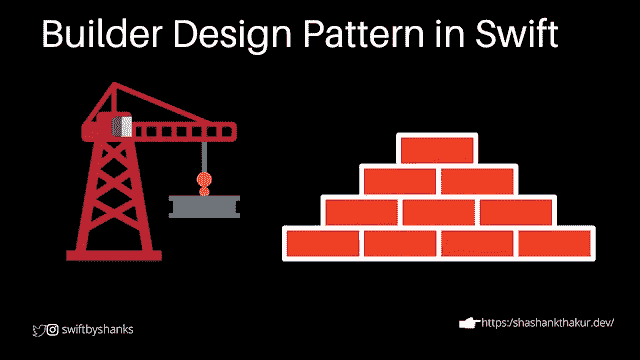

# Swift 中的构建器设计模式

> 原文：<https://itnext.io/builder-design-pattern-in-swift-2de3f7cdc357?source=collection_archive---------4----------------------->

## 如何在 Swift 中使用 Build 设计模式？

## 在 Swift 中使用构建器模式



在 Swift 中实施生成器设计模式

作为一名开发人员，我们应该始终遵循一个设计原则，作为构建代码的指南，使其模块化、易于阅读、易于理解和可伸缩。在本文中，我将讨论行为设计模式，如何使用它们，以及它们在 Swift 中的实现。请继续阅读！

# 设计模式的分类

设计模式主要分为以下几类

# 1.创造型的

# 2.结构的

# 3.行为的

在本文中，我们将介绍生成器设计器模式，这是一种创造性的设计模式

# 生成器设计模式

## 为什么？

我们为类创建对象来利用类提供的功能。有时对象创建很简单，可以通过简单的初始化器来完成。其他对象可能有复杂的需求，例如，它可能需要大量的参数来初始化对象，这在我看来太麻烦了，而且没有效率。此外，我们可能需要混合和匹配这些参数进行初始化。在这些情况下，我们应该进行分段初始化/构造。为了实现这一点，我们需要一个实现为我们提供一步一步的机制，这样我们就有一个更简单的 API 方法来访问对象创建版本的粒度控制。

我们举个例子来了解一下。假设我们想为 recipe 应用程序创建一个对象 APIRequest 类。这个类帮助我们创建请求对象来发出不同的 API 请求。首先，当前的 API 请求类帮助我们创建只有两个参数的对象。

```
**enum** Endpoint:String {**case** receipesUrl = "/recipes"**case** receipeDetail = "/recipes/id"}**class** ApiRequest {**var** endpoint:Endpoint**init**(endPoint:Endpoint) {**self**.endpoint = endPoint}}**var** apiRequest = ApiRequest(endPoint: .receipesUrl)
```

现在假设您想在 Http 方法(POST、GET 等)、头、URL 参数等中传递它。假设我们给我们的初始化式增加了更多的参数，看起来像这样。

```
**enum** HTTPMethod:String {**case** get = "GET"**case** post = "POST"}**enum** Endpoint:String {**case** receipesUrl = "/recepies"**case** receipeDetail = "/recepies/id"}**class** ApiRequest {**var** endpoint:Endpoint**var** urlParams:[String:String]**var** httpMethod:HTTPMethod**var** headers:[String:String]**init**(endPoint:Endpoint, httpMethod:HTTPMethod, headers:[String:String], urlParams:[String:String]) {**self**.endpoint = endPoint**self**.httpMethod = httpMethod**self**.headers = headers**self**.urlParams = urlParams}}**var** apiRequest = ApiRequest(endPoint: .receipesUrl, httpMethod: .get, headers: [:],urlParams: [:])
```

正如你现在看到的，我们的初始化器已经开始成长了。我们仍然需要添加更多的参数，如搜索参数、HTTP 方案(HTTP 或 HTTPS)、路径参数、有效载荷、过滤器等。有了这么多的参数，这将变得非常难看，而且我们还必须为初始化传递不同的参数，这可能是我们不需要的。我们可以有一个缺省值，或者让一些参数可选，但仍然是不理想的。

# 解决办法

所以在这种情况下，builder 设计模式真的大放异彩。生成器设计模式对于创建需要各种配置选项的对象非常有用。它不仅为我们提供了一个很好的 API 方式，还让我们可以控制我们想要的异议创建风格。所以基本上我们将有一个函数来通过函数传递不同的参数，每个函数将返回 **ApiRequestBuilder** 类型。

## 例子

现在让我们使用构建器模式实现上面的例子

```
**class** ApiRequestBuilder {**var** httpMethod:HTTPMethod**var** endpoint: Endpoint**var** urlParams:[String:String]?**var** headers:[String:String]?**init**(endpoint:Endpoint, httpMethod:HTTPMethod) {**self**.endpoint = endpoint**self**.httpMethod = httpMethod}**func** urlParams(urlParams:[String:String]?) -> ApiRequestBuilder {**self**.urlParams = urlParams**return** **self**}**func** headers(headers:[String:String]?) -> ApiRequestBuilder {**self**.headers = headers**return** **self**}}**let** apiRequest = ApiRequestBuilder(endpoint: .receipesUrl, httpMethod: .get).headers(headers: ["clientId":"xyz"]).urlParams(urlParams: ["id":"abc"])
```

比方说，如果我们想增加对额外参数的支持，我们可以很容易地扩展我们的 API。我们现在将添加对传递搜索、有效载荷、过滤器等的支持。

```
**class** ApiRequestBuilder {**var** httpMethod:HTTPMethod**var** endpoint:Endpoint**var** urlParams:[String:String]?**var** headers:[String:String]?**var** payload:[String:**Any**]?**var** filters:[String:String]?**var** searchBy:[String:String]?**init**(endpoint:Endpoint, httpMethod:HTTPMethod) {**self**.endpoint = endpoint**self**.httpMethod = httpMethod}**func** urlParams(urlParams:[String:String]?) -> ApiRequestBuilder {**self**.urlParams = urlParams**return** **self**}**func** headers(headers:[String:String]) -> ApiRequestBuilder {**self**.headers = headers**return** **self**}**func** payload(payload:[String:**Any**]) ->ApiRequestBuilder {**self**.payload = payload**return** **self**}**func** filters(filters:[String:String]) ->ApiRequestBuilder {**self**.filters = filters**return** **self**}**func** searchBy(searchBy:[String:String]) ->ApiRequestBuilder {**self**.searchBy = searchBy**return** **self**}}
```

现在，假设我们想要发出一个请求来获取一个食谱列表。我们将以这种简单的方式提出我们的请求

```
**let** apiRequest = ApiRequestBuilder(endpoint: .receipesUrl, httpMethod: .get).headers(headers: ["clientId":"xyz"]).urlParams(urlParams: ["id":"abc"])
```

为了得到精确的结果，让我们添加过滤器和搜索

```
**let** apiRequest = ApiRequestBuilder(endpoint: .receipesUrl, httpMethod: .get).headers(headers: ["clientId":"xyz"]).urlParams(urlParams: ["id":"abc"]).filters(filters: ["createdTime >=":"1601261533"]).searchBy(searchBy: ["name":"pasta"])
```

因此，看看我们如何方便地以更易于理解和使用的 API 形式扩展异议创建。

# 结论

生成器是一种创造性的设计模式，它允许一步一步地创建对象。创建需要各种配置选项的对象非常有用。

*原载于 2020 年 9 月 28 日*[*https://www . shashankthakur . dev*](https://www.shashankthakur.dev/2020/09/how-to-use-builder-design-pattern-in.html)*。*