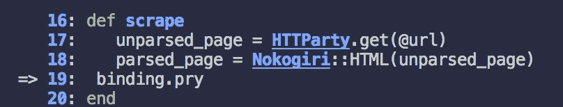
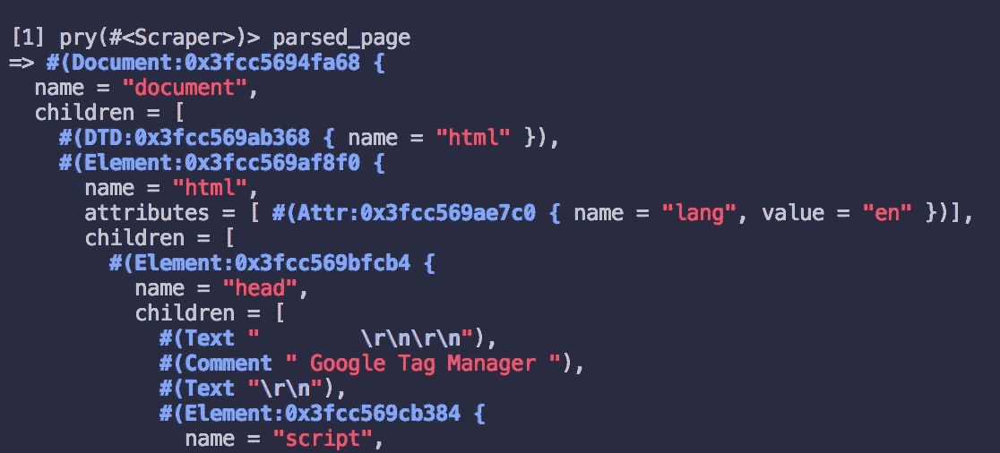
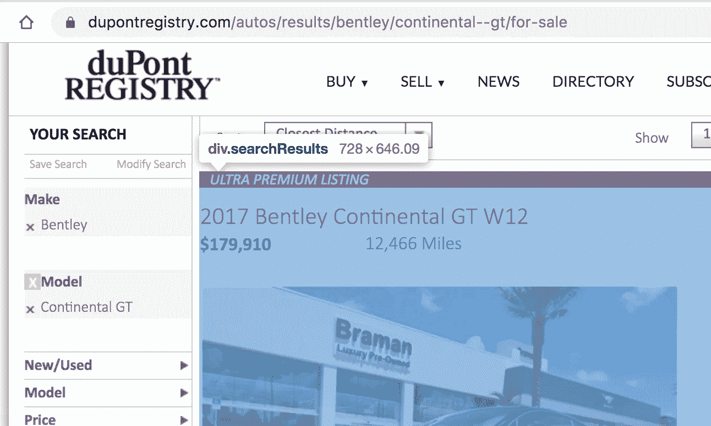
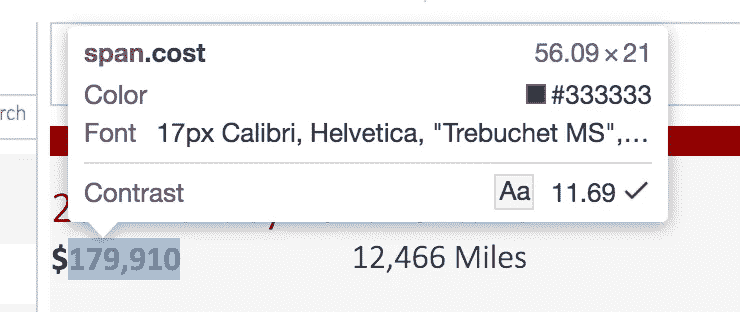

# 用 Ruby 构建一个基本的刮刀

> 原文：<https://itnext.io/building-a-basic-scraper-with-ruby-1cec071ada83?source=collection_archive---------6----------------------->

我喜欢网络抓取。近年来，它不仅成为了一个大产业，而且充满了乐趣。它可以帮助您使用已有的数据轻松找到有趣的见解。今天，我将构建一个非常基本的 web scraper，可以搜索 DuPont Registry(一个昂贵汽车、住宅和游艇的市场)；对于这个刮刀，我将重点放在汽车部分。

我将使用两个相关的宝石: [Nokogiri](https://rubygems.org/gems/nokogiri/versions/1.6.8) 和[http party](https://rubygems.org/gems/httparty)。Nokogiri 是一块宝石，它允许你把 HTML 和 XML 解析成 Ruby 对象。另一方面，HTTParty 简化了将原始 HTML 拉入 Ruby 代码的过程。这两个宝石将在我们的刮刀中一起工作。

需要注意的是，虽然 Nokogiri 和 HTTParty 很酷，但它们更像是上面的 sprinkles。用它构建程序的核心技能是定义和初始化一个类及其实例，遍历散列和数组，以及构建助手方法。

**入门**

如果您还没有，请确保您已经安装了基本的 gem，并且在代码中需要这些 gem。此外，我喜欢使用 byebug 或 pry，这样我就可以在需要时停止代码，看看发生了什么！

```
require 'nokogiri'require 'httparty'require 'byebug'require 'pry'class Scraper
 #we will be adding code here shortly
end
```

## 初始化实例

现在，让我们考虑一下我们的 Scraper 类。它应该有什么样的方法？这个类需要跟踪什么？

在定义如何初始化我们的新 scraper 之前，我们需要决定这一点。我已经考虑过这个问题，以下是我的想法:

我们来分析一下。Scraper 类的每个实例应该知道它应该查看什么样的 **make** 和 **model** ，以及它需要访问哪个 **URL** 来找到它的数据。如果这些实例变量是可读的，那就更好了，所以我给它们都添加了一个 attr_reader。

DuPont Registry 的 URL 路径相当简单，因此我们可以从“make”和“model”中提取模板文字来生成我们的目标 URL，然后将其保存到我们的实例变量 **@url** 。*。URL 字符串末尾的 sub("，"—"*只是一个用两个破折号替换空白的方法。

是时候添加更多的功能了。我们需要我们的 scraper 实例来进行实际的刮擦。让我们开始构建一些实例方法。

我想在我们的 **#scrape** 方法成为小说之前，尽早开始使用这些助手方法。 **#parse_url** 方法接受一个 url 作为参数，调用**http party**获取原始 HTML，然后 **Nokogiri** 获取那个未解析的页面并……嗯……*解析它*。就像这样，我们可以把整个网页转换成一个可用的 Ruby 对象！然后，我们将整个对象保存到#scrape 中一个名为 **parsed_page 的局部变量中。**现在是设定绑定的好时机。在我们继续下一步之前，窥探一下我们实际拥有的东西。

让我们继续，在我们的终端中使用 bash 命令 **ruby scraper.rb** 运行这段代码(这里假设您在一个名为 scraper.rb 的文件中编码，如果您的文件有不同的名称，那么相应地进行调整)。确保您位于正确的目录中。

现在，您处于(或者应该处于)窥探会话中，所以我们可以开始在终端中键入 Ruby 代码了。首先，让我们创建一个新的 Scraper 实例:

```
bentley = Scraper.new("bentley", "continental GT")
```

酷，我们有一个新的铲运机实例，它将在[https://www . DuPont registry . com/autos/results/Bentley/Continental-gt/for-sale](https://www.dupontregistry.com/autos/results/bentley/continental--gt/for-sale)上查找宾利欧陆 GTs。我们可以通过在终端中键入以下内容来确认这一点:

```
bentley.url#=> "[https://www.dupontregistry.com/autos/results/bentley/continental--gt/for-sale](https://www.dupontregistry.com/autos/results/bentley/continental--gt/for-sale)"
```

太好了！现在让我们言归正传。我们需要在我们的 **bentley** 的 Scraper 实例上调用我们的#scrape 方法，这样我们可以点击我们的第二个 binding.pry，看看我们得到了什么:

```
bentley.scrape
```



我们现在正在窥探#scrape 方法的内部

在这一点上，我感兴趣的是到底什么是被解析的，因为有很多 Ruby gem 的诡计正在进行。让我们调用 **parsed_page** 局部变量。

```
pry(#<Scraper>)> parsed_page
```

哇哦。好吧。那是一大堆东西。很明显它在做什么，我只是不确定该怎么处理这些。我的看起来像这样:



Nokogiri 将 HTML 解析成类似这样的内容

如果您抓取的是不同的网站，这看起来可能会有所不同。

在我们深入研究如何从这个庞大的对象中获取我们的数据之前，让我们来看看我想得到什么，这样我们就可以对它进行逆向工程。我想要一个类似这样的散列:

很好，所以我们并没有试图提取每一条数据，我们只是在寻找这五条数据:年份、品牌、型号、价格和链接。但是等等！当我们实例化 scraper 实例时，我们已经知道了我们的品牌和型号，所以我们实际上只需要寻找 3 个数据点。

## 处理 HTML

现在我们知道了我们在寻找什么，让我们浏览我们想要抓取的页面的 HTML 来找到我们的路径。首先，让我们看看能否找到包含所有相关汽车信息的容器。我们需要访问列表页面并打开开发者工具。



看起来每个汽车列表都存储在一个名为**‘search results’**的独立 div 中

让我们将每个列表保存在一个变量中，以便以后使用。我们将使用。Nokogiri 的 css 方法来构建这个数组。

```
**cars = parsed_page.css('div.searchResults')**#creates an array where each element is parsed HTML pertaining to a different listing
```

现在，让我们试着找出价格。



价格包含在一个叫做“成本”的区间内

为了提取出我们需要的文本，我们将不得不摆弄它。最好在 pry 或 byebug 会话中这样做。我能够使用以下代码得出价格:

```
**car.css('.cost').children[1].text.sub(",","").to_i**#looks in an instance of car for the *cost* div
#looks in its children at an index of 1 (this is where it lives)
#converts it to text
#gets rid of the comma 
#converts the string into an integer
```

我们知道了价格，现在让我们知道年份。同样，我们需要使用开发人员工具来查找包含汽车年份的字符串。在我的例子中，这是一个看起来像“2017 Bentley Continental GT V8 S”的字符串，所以我决定只窃取前 4 个字符并将其转换为整数:

```
**car.css('a').children[0].text[0..4].strip.to_i**#looks in an instance of car for the *<a> tag* #looks in its children at an index of 0 (this is where it lives)
#converts to text
#takes the first 4 characters (ie "2017")
#strips any whitespace if it exists
#converts to integer
```

最后但同样重要的是，让我们获得汽车页面的链接。

```
**car.css('a').attr('href').value**#looks in an instance of car for the *<a> tag
#gets the attribute of <href>
#pulls out is value (as a string)*
```

所以，我们已经想好了所有 JQuery 风格的东西。继续读下去，你会看到这些是如何在助手方法 **create_car_hash** 中实现的。

## 完成刮刀

从这里，很容易完成我们的铲运机。让我们设置我们的助手方法，这样我们的#scrape 方法将拥有它所需要的一切。

我最终制作了 4 个不同的助手方法:

1.  **create_car_hash** 根据我们需要的值创建一个散列
2.  **get_all_page_urls** 果然如其名！将所有 URL 收集到一个数组中，这将允许我们考虑分页
3.  get_number_of_pages 非常简单——这也将帮助我们处理分页
4.  **build_full_cars** 给出了第 2 页及以后的汽车散列数组

让我们用#scrape 方法把它们放在一起，这样我们就可以得到我们想要的东西了。最后，我的代码是这样的:

分别为第一页和其余页面构建散列可能看起来有点奇怪(见第 32 行)，您可能会合并这一点，但是第一页的 URL 有一点不同，并且对于设置初始数据很重要。

让我们快速运行一下，确保它按照我们的要求运行。

```
ruby scraper.rb
bentley = Scraper.new("bentley", "continental gt")
bentley.scrape
```

我们的产量很大！我不得不把它截短一点。这是我得到的:

如果我们打电话。长度，我们确实得到了 120，这与我们的列表数相匹配。完美！

我们还想在其中加入许多方法，让它变得有用。例如，我们可以创建一个方法，返回当前列出的最便宜的 Bentley 的链接，或者创建一个计算平均要价的方法。你甚至可以美化一下这段代码，因为它远非完美。然而，在这篇文章变成*战争与和平*之前，我今天就到此为止了！这里有一个[到 GitHub 库](https://github.com/alexfarmer91/DuPont-Registry-Scraper)的链接，如果你想用它来启发你自己的网页抓取器。