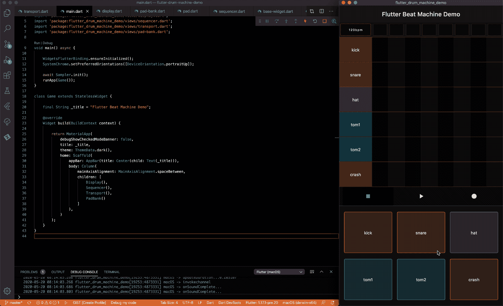
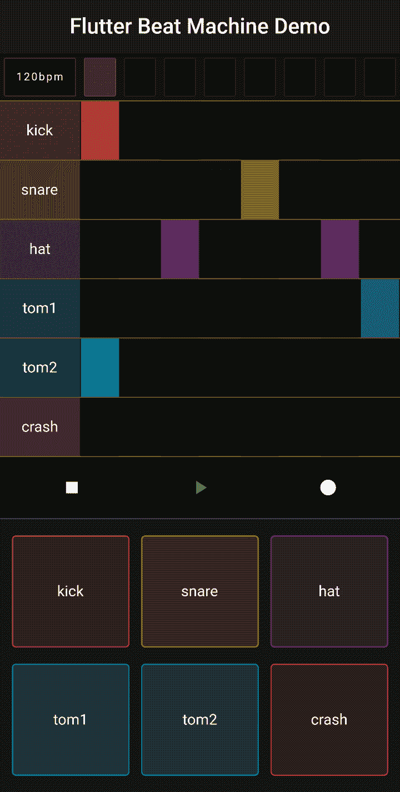

# 在颤动中建造一台打浆机

> 原文：<https://itnext.io/building-a-beat-machine-in-flutter-2b25b27d5a5b?source=collection_archive---------1----------------------->

## 如何在 Dart / Flutter 中构建带有序列器的节拍机器

示例应用程序的屏幕记录

## 介绍

自 2018 年末首次发布 1.0 版本以来，lutter 的人气一直在上升。随着公司和企业家努力保持低开发成本，人们继续寻找更好、更有效的方法来构建移动应用和跨平台软件。Flutter 支持所有主要的移动平台，对 web 和所有主要桌面操作系统的支持正在开发中。

在本文中，我们将查看一个简单的 beat machine 演示，并了解开发该应用程序时使用的底层设计模式。

要建立并运行一个颤振环境，请访问[安装页面](http://For more information about installing Flutter, see the installation page here.)。要获得演示项目源代码的副本，请查看[资源库](https://github.com/kenreilly/flutter-drum-machine-demo)。

## 概念

Flutter 中有几个关键概念在这个演示应用程序的设计中被广泛使用，以利用 Dart 的功能，避免编写大量不必要的样板文件或 [copypasta](https://en.wikipedia.org/wiki/Copypasta) 。这对代码的可读性、可靠性和性能有深远的影响。

> 最大限度地利用一门语言可能意味着生产一个笨拙的易出错的应用程序或一件艺术品之间的区别。Dart 有许多功能来帮助构建具有状态管理的高度交互式异步 UX。

这些基本概念是:

*   诸如[容器](https://api.flutter.dev/flutter/widgets/Container-class.html)、[大小框](https://api.flutter.dev/flutter/widgets/SizedBox-class.html)和[列](https://api.flutter.dev/flutter/widgets/Column-class.html)之类的抖动小部件
*   使用[计时器](https://api.dart.dev/stable/2.8.2/dart-async/Timer-class.html)和[秒表](https://api.dart.dev/stable/2.8.2/dart-core/Stopwatch-class.html)进行时间间隔工作
*   用[Stream](https://api.flutter.dev/flutter/dart-async/Stream-class.html)/[Stream controller](https://api.flutter.dev/flutter/dart-async/StreamController-class.html)实现服务

在整个演示应用程序中，这些概念以各种方式组合在一起，以实现一种设计，其中 UI 呈现和控制逻辑被整齐地组织到具有易于使用的接口和属性的类中。

## 概观

节拍机器架构和 UX 尽可能保持简单，以模仿 20 世纪 70 年代和 80 年代的复古鼓机，在这些鼓机中，机械开关、铜和新奇的 8 位 CPU 等资源有限，音乐家可以负担得起的机器需要将设计和制造成本保持在最低水平。

核心 UI 框架被分成四个“前面板”部件，每个部件都提供一些交互性，机器逻辑包含在示例回放服务和音频引擎服务中。

> 这类似于真实硬件乐器上的组件通过跳线或 MIDI 电缆传递数据(这两种电缆至今仍在音频工程和音乐制作中大量使用)。

## 应用入口点

应用程序在 **main.dart** 中初始化:

`main`功能首先通过确保微件已初始化，然后设置设备方向，将应用程序锁定为纵向模式。UI 框架很简单，有一列显示四个主要的界面小部件。让我们看看用来处理用户输入并根据需要有效地呈现和刷新 UI 的小部件和类。

## 基本部件

支架中的四个主要小部件扩展了一个公共基类来连接音频引擎。这个类位于**视图/基类. dart** :

BaseWidget 和 BaseeState 类分别扩展 StatefulWidget 和 State，并实现一个内部流，该流在初始化时将侦听器连接到 AudioEngine，并在从引擎收到信号时刷新状态。因此，每个扩展 BaseWidget 的小部件都将在音频引擎发送信号(表示引擎中发生了事件，需要重新构建 UI)时重新构建。

## 表示盘

脚手架立柱上最上面的组件是**视图/显示器。dart** :

DisplayPanel 在屏幕顶部呈现 BPM 和步进位置指示器，并且当基类接收到信号时会自动刷新。单击 BPM 指示器将打开 BPMSelector 对话框，其中包含从 1 到 256 的选项列表。选择一个将在音频引擎上设置 BPM。

生成步骤指示器，当引擎运行且当前步骤与每个渲染周期的索引相匹配时，每个指示器都会“亮起”。

## 模式序列发生器

模式序列编辑器部件在**视图/sequencer.dart** 中:

Sequencer 是一个无状态小部件，因为它本身不提供任何交互性，而是呈现提供每个轨迹 UX 的轨迹小部件。

为每个样本生成一个扩展行，标签在左侧，轨道将自动扩展以适应该行的剩余空间。

## 音序器轨道

在 **views/track.dart** 中描述了序列编辑器轨迹:

Track widget 扩展了 BaseWidget，因此当它收到来自音频引擎的信号时会自动重建。每个轨道都包含一个由八个音符指示器生成的列表，单击该列表会将一个事件传递给音频引擎，然后音频引擎会在内部切换音符开/关状态，并发出刷新信号。每个音符块指示器的颜色由当前位置是否存在音符以及该音符当前是否正在播放来确定。当不存在注释时，颜色会因可见性和 UX 而每隔一列发生变化。

## 运输控制

让我们看看 **views/transport.dart** 中的传输控制小部件:

Transport 类构建了一行传输控制按钮，每个按钮在被点击时都会调用`onTap`,向引擎触发一个状态改变事件，这又会通过其基类向小部件发出刷新信号。当一个按钮与当前引擎状态匹配时，通过将`null`传递到 MaterialButton 的`onPressed`方法中来禁用它。

## Pad Bank

鼓垫组在**视图/垫组中定义。dart** :

PadBank 扩展了 StatelessWidget，因为它没有可变属性，因此不需要状态。这个小部件在父级可用空间高度的 1/3 处呈现一个容器，其中有两行 Pad 小部件，每一行都有一个定义的大小，以及一个从当前列表索引派生的值。

## 电子鼓垫

鼓垫部件在**视图/pad.dart:** 中定义

Pad 小部件是无状态的，并接受三个最终的(不可变的)参数作为参数。定义了三个`get`属性来拉动`DRUM_SAMPLE`以及相应的样本名称和颜色。当一个板被点击时，一个板事件被传递到音频引擎进行进一步处理。

接下来，我们来看看 beat machine 的内部工作原理。

## 取样器

样本定义和加载/回放在 **services/sampler.dart** 中:

使用`DRUM_SAMPLE`定义样本类型，并在服务上初始化相应的文件名和颜色，该服务在应用程序初始化期间加载音频文件。当从音频引擎调用采样器上的`play`时，播放相应的缓存音频文件。

## 音频引擎

让我们在**services/audio-service . dart:**中查看音频服务

AudioEngine 服务管理传输控制状态，处理输入事件，在录制时对传入的音符执行[量化](https://en.wikipedia.org/wiki/Quantization_(signal_processing))，存储轨道数据，并根据需要向所有收听小部件发送信号以刷新 UI。

为所需的每种类型的音频引擎事件定义了事件类，并且占位符信号类被定义为用作刷新 UI 的通用信号。在更复杂的场景中，Signal 类可以扩展为向 UI 传递不同类型的信号。

定义了模式分辨率和步长，以及控制状态、BPM、初始跟踪数据、计时器/手表`/ _tick`计算和带有监听器的流控制器，以允许监听小部件接收信号。

当一个控制表面(比如鼓垫)用一个事件实例调用`on`时，该方法利用泛型来切换事件类型并采取正确的动作。这样，所有传入的消息都通过一个位置进行路由，并得到相应的处理。每种事件类型对应于引擎中的一组操作。一旦所有更新完成，`control`、`edit`、`next`和`synchronize`方法都会向 UI 发出一个信号。

音频引擎的设计允许在不重启引擎的情况下即时进行更新，例如通过简单的状态改变来实现记录，这将导致未来传入的音符通过`process`方法，并且能够在模式中间调整速度，以及将当前运行的计时器`synchronize`调整到新的 BPM。

当接收到 EditEvent 时，事件数据用于翻转该轨道和步长位置的音符开/关条件的布尔值。当音频引擎启动时，会创建一个定期计时器，它将按每个`_tick`值推进音序器一次，并调用`next`，后者将递增或重置计时器，然后检查当前步骤中每个音轨的音符，最后重置量化`_watch`并向 UI 发送信号。

## 结论

该项目展示了 Flutter SDK 中用于快速应用设计和开发的强大功能。

对于构建具有出色性能和可靠性的高度交互的跨平台应用程序来说，Flutter 是一个很好的选择。通过对移动、桌面和 web 目标的支持，开发人员可以构建高质量的应用程序，这些应用程序可以在任何地方运行，并且易于维护，具有通用的语法和对库和包的几乎通用的支持。

这大大简化了保持大型多平台更新的任务，使其具有一致的功能、坚如磐石的可靠性和超快的性能。

感谢您的阅读，祝您的下一个颤振项目好运！

~ [8_bit_hacker](https://twitter.com/8_bit_hacker)