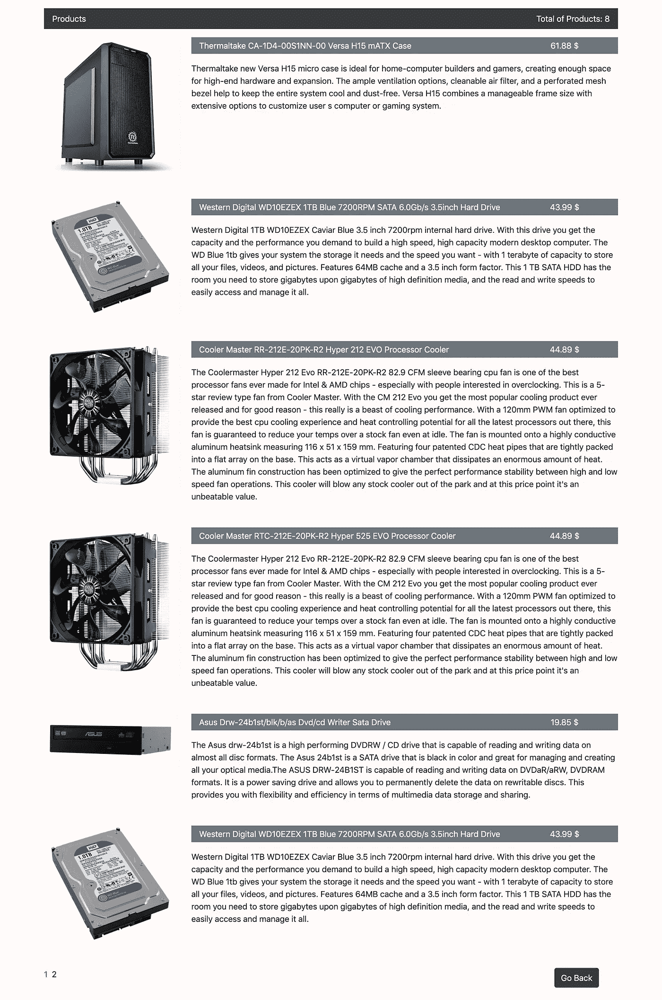

# 用 Gatsby 的分页和动画建立一个超快的产品列表

> 原文：<https://itnext.io/building-a-blazing-fast-product-list-with-pagination-and-animations-with-gatsby-8ffa4baeb623?source=collection_archive---------6----------------------->

在本教程中，我们将创建一个有两个页面的 Gatsby 网站。主页介绍了商店和一些功能，第二页是一个简单的分页产品列表页面。

本教程的主要目标是:

-给你看看盖茨比的基本知识。

-了解如何在页面间导航。

-创建简单的分页。

-如何更改站点元数据和添加新内容。

-学习如何使用不同的插件，如 gatsby-source-filesystem，并从 json 文件中获取动态数据。

——如何让盖茨比编 SASS？

*   如何使用 react-spring 创建一些漂亮简单的动画？

 [## nunosoares27/GatsbyTutorial01

### CD hello-world NPM install & & NPM start Gatsby build Gatsby serve Mindera.com 软件前端工程师。主要使用…

github.com](https://github.com/nunosoares27/GatsbyTutorial01) 

接下来，我们要创建的应用程序的两个屏幕截图。

盖茨比是 React 的一个非常快的现代站点生成器。

为了创建项目，我们将遵循 gatsby 文档并使用 gatsby hello-world starter 模板。

盖茨比中的导航很简单。要添加页面，您只需要在/src/pages 中创建一个文件。我们创建了两个页面，一个名为 index.js(主页),另一个名为 products.js。主要路径始终是 index.js，为了导航到产品页面，您只需转到/products。

在深入研究之前，我们将添加一些 gatsby 插件来处理 sass 文件，并从 json 文件中获取动态数据。我们将在存储库根目录下的 gatsby-config.js 文件中添加插件。

在 siteMetaData 中，我们可以添加一些静态内容。您可以添加任何想要的数据，在我们的例子中，我们添加了标题、描述和一系列特性。我们在主页上使用了这些数据。gatsby-plugin-sass，因为它为 SASS/SCSS 样式表提供了插件支持。我们使用 gatsby-source-filesystem 将数据从我们的本地文件系统提供给 gatsby 应用程序。

我们使用 gatsby-transformer-json，因为它将原始 json 字符串解析为 JavaScript 对象，例如来自 JSON 文件的对象，支持对象数组和单个对象。这个插件检查文件夹 src/data 中的 json 数据。

我们将主 sass 文件导入到应用程序的 gatsby-browser.js 文件中

现在让我们向 index.js 文件添加内容，并使用 gatsby graphql 查询一些数据。Graphql 棒极了，你可以查询并得到你想要的数据。因此，我们查询整个网站，以便找到站点元数据，从而获得主页所需的所有数据。为了呈现内容，我们需要访问 props.data.site.siteMetadata。

在 Gatsby 中，为了在页面之间导航，我们只需要添加一个带有“to”属性的链接组件，并传递 url 路径。

为了在产品页面上呈现产品列表，我们将创建一个 json 文件。

请记住，对于查询这个文件，插件需要一个名为 allProductsJson 的查询。

我们继续向页面产品添加内容，查询数据并添加分页。为了从 products json 中获取数据，我们需要查询 allProductsJson，输入节点并调用我们想要检索的属性。然后我们用 this . props . data . all products JSON . nodes 访问组件内部的内容。

calcpagenumbers 方法负责呈现分页。为了获得每个页面的当前条目，我们创建了几个变量。

为了得到最后一项的索引，我们需要将当前页码乘以每页的项数。为了得到第一项的索引，我们需要用每页的项数减去最后一项的索引。为了获得当前项目，我们使用 slice 对所有产品数据进行切片，并传递第一个项目的索引和最后一个项目的索引。

我们添加了一个 onClick 方法来处理产品列表的分页和页面更改。我们使用 scrollTop 在产品列表的页面之间导航，以便让页面重置其位置。

# 功能完成后，让我们添加一些风格！

一旦我们完成了所有的功能，是时候使用 react-spring 库添加一些风格和一些简单的动画了。

我们将使用 bootstrap，这样我们可以加快样式化过程，让我们下载 bootstrap minified css 版本(我们不需要 bootstrap 的 js 部分),并将其粘贴到 styles 文件夹，然后导入 index.js，如下所示:

导入"../styles/bootstrap.min.css "

可以从 http://getbootstrap.comT3[下载引导文件](http://getbootstrap.com)

在 styles 文件夹中，您应该会看到两个文件，bootstrap.min.css 和 global.sass，我们将使用它们进行一些额外的定制。

导入之后，Bootstrap 将在我们的所有项目中工作，所以我们不需要在任何其他文件中导入它。

现在，我们准备在 index.js 和 products.js 上删除一些标准的引导 css 类，这样我们就可以快速改变我们应用程序的“面貌”。

现在我们的应用程序看起来好一点了，所以让我们把重点放在动画上。

我们将使用 react-spring 库制作一些简单的 spring 动画( [www.react-spring.io](http://www.react-spring.io) )。打开控制台，使用 npm 安装库:

*npm 安装—保存反作用弹簧*

打开 index.js 文件并将其导入到我们的项目中，我们需要从 react-spring 库中导入 useSpring、animated 和 config

从“react-spring”导入{ useSpring，animated，config }

我们将在这个文件上创建 5 个不同的动画，但是让我们把重点放在第一个上，这样我们就可以看到 react-spring 是如何工作的。

对于 index.js 文件，我们将使用 hooks api，因为它是一个功能组件，对于类组件，我们将需要使用 render-props api。

首先，我们用我们希望赋予动画的名称创建一个变量，然后将 useSpring 函数传递给它，接下来 useSpring 将接收一个带有几个值的对象，对于这个示例，我们将添加:

*从- >动画的初始状态
到- >动画的最终状态
配置- >我们的动画的通用预设
延迟- >动画开始前的毫秒延迟*

现在我们只需要定义我们想要添加这个动画的位置。在这个特殊的例子中，我们将把它添加到一个

标签中，为此我们将动画添加到

标签中:

<animated.p>…</animated.p>

并添加一个带有动画名称的样式道具，最终结果会是这样的:

<animated.p style="{leftAnimation}">…</animated.p>

就这样，我们完成了第一个 react-spring 动画。

我们最终的 index.js 将如下所示:

→index . js 的 github 链接([https://github . com/nunos oares 27/gatsbytutorial 01/blob/master/src/pages/index . js](https://github.com/nunosoares27/GatsbyTutorial01/blob/master/src/pages/index.js))

对于 products.js 文件，我们将使用 render-props 库，因为它是一个类组件，所以我们将以不同的方式导入它:

从“react-spring/renderprops”导入{ useSpring，config }

现在我们将把我们的原始组件包装在一个<spring>组件中，我们可以像在钩子示例中那样添加动画的值，Spring 组件将如下所示:</spring>

<spring>config = { config . wobbly }
from = { {
transform:" translate 3d(0，30px，0)"，
opacity:0
}
to = { {
translate 3d(0，0，0)"，
opacity:1
}>}
{ props =>(
…
)}
</Sping</spring>

我们最终的 products.js 将如下所示:

→products . js 的 github 链接([https://github . com/nunos oares 27/gatsbytutorial 01/blob/master/src/pages/products . js](https://github.com/nunosoares27/GatsbyTutorial01/blob/master/src/pages/products.js))

这就是我们如何快速制作一个 gatsby 站点，使用 bootstrap 来设计它的样式，并使用令人惊叹的 react-spring 库添加一些简单的动画。

最后，我想补充一点，react-spring 有一个非常棒的文档，里面有很多真实的例子和场景，我们可以尝试不同的价值组合，探索这个库的全部功能。

# 作者:

努诺·苏亚雷斯——Mindera.com 的软件前端工程师。主要使用 React，React Native，Redux，Laravel，Wordpress。

[https://nunosoares.dev/](https://nunosoares.eu/)

**努诺佩雷拉** —前端开发者。我不喜欢用我做过的工作来定义自己。我用我想做的工作来定义自己。技能是可以教的，性格是与生俱来的。我喜欢不断学习，不断挑战自己，做有意义的有趣的事情。

[https://www . nunopereira . dev](https://www.nunopereira.dev/)