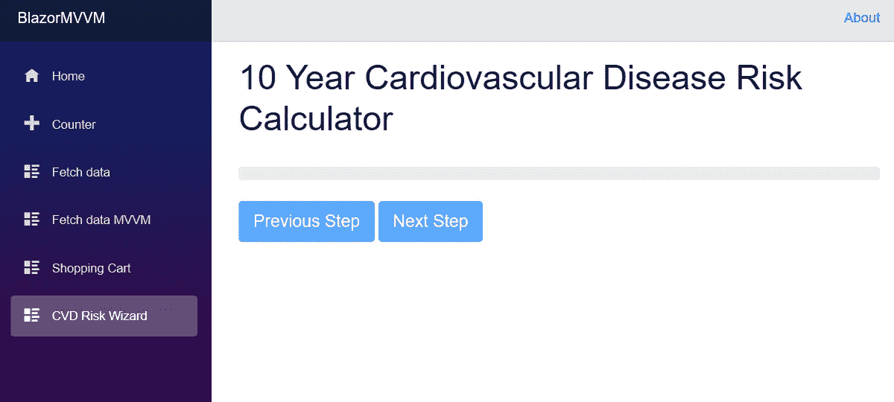
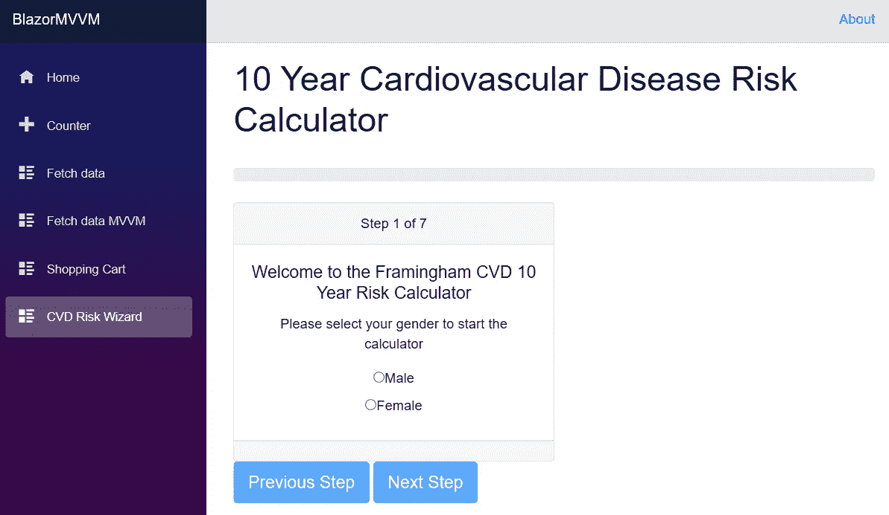

# 用 Razor 组件构建 Blazor 向导。

> 原文：<https://itnext.io/building-a-blazor-wizard-with-razor-components-23d652ff06e9?source=collection_archive---------0----------------------->

在本文中，我们将使用 Razor 组件为 Blazor 构建一个向导。我的文章的重点是客户端 Blazor 和 MVVM，但这篇文章是专门关于 Razor 组件和向导，我们应该可以在任何 Blazor 应用程序中使用。


本文的源代码是针对。网芯 3 预览版 4。预览版 5 于上周发布，但没有重大变化，如果需要，应该很容易更新到预览版 5。所有文章和源代码可能会再次更新。网芯 3 预览版 6 发布。本文起点的源代码位于我在 GitHub 上的 BlazorMVVM 存储库中。

[](https://github.com/lchendricks/BlazorMVVM) [## lchendrick s/blazormvm

### 一个客户端 Blazor MVVM 实现。通过在…上创建帐户，为 lchendricks/BlazorMVVM 的开发做出贡献

github.com](https://github.com/lchendricks/BlazorMVVM) 

本文的起点是 ArticleSeven 分支或 4.7 版本。本文的最终代码将作为 article 分支和 4.8 版本提交。

如果您想阅读我们构建模型和视图模型的前一篇文章，然后在视图中手动构建向导，可以通过以下链接阅读:

[](/building-a-wizard-in-blazor-with-components-and-mvvm-96219a7b221c) [## 用组件和 MVVM 在 Blazor 中构建向导。

### 这是关于在客户端 Blazor 中实现 MVVM 的一种方法的系列文章中的第七篇。如果你愿意…

itnext.io](/building-a-wizard-in-blazor-with-components-and-mvvm-96219a7b221c) 

今天，我们将使用一个由可重用的 Razor 组件构建的向导来替换视图中的大部分内容。除了重命名视图模型中的一个字段之外，不会对模型和视图模型进行任何更改。我们将重构视图，使我们的向导完全由 Razor 组件标签构建。

# 为什么要使用组件？

首先要问的问题是，我们为什么要这样做？为了了解我们将要做的事情，让我们看一下使用 Telerik datagrid 所需的标记:

这六行标记允许开发人员利用 Telerik 在他们的数据网格上所做的所有工作，而不需要任何关于网格如何在幕后工作的知识。它还可以很容易地看出数据源是什么，以及网格将显示两列以及这两列是什么。所以使用组件的好处是双重的:

1.  我们可以将代码封装成一个可重用的组件，通过标记可以很容易地访问它。
2.  通过有意义的嵌套标签和绑定，我们的标记变得更容易阅读。

如果我们回顾一下我们在上一篇文章中构建的向导，它大约有 143 行代码，包括进度条。这些行中有许多是重复了 8 次的完全相同的标记行；向导的每个步骤一次。如果我们能够正确地将向导封装到嵌套的组件中，我们将会有更少的代码行，我们的视图将会更具可读性。

# 启动向导

首先，我们需要决定如何将向导的各个部分组合在一起。在我们的起点，向导上方有一个进度条，向导本身是一个`switch()`语句，它封装了组成向导的 8 张卡片。每张卡片都包含一个控件，用于接收用户的输入。我们今天的目标是提出一个嵌套组件方案，它将复制所有这些，同时最大限度地减少重复标记，并仍然保持相同的功能。我们想出的组件的结构最终会是这样的:

```
<Wizard>
   <InputCard>
      <InputControl/>
   </InputCard>
<Wizard>
```

我们已经有了在上一篇文章中使用的输入控件、单选按钮列表和数字输入。这意味着我们应该能够构建一个向导组件和一个输入卡组件，并使一切正常工作。

在 Components 文件夹中创建一个新的 Razor 视图，并将其命名为 Wizard.Razor。我们将进度条放入该控件中，并将 previous 和 next 按钮从卡片中移出并放入该控件中。这两个元素的代码与我们现有视图中的几乎相同，只是我们需要删除对 ViewModel 的所有引用。我们希望能够在任何地方使用这个组件，所以我们不能指望有一个包含我们需要的所有字段的视图模型，每个需要的字段都将作为参数传入。我们的向导组件的开始看起来像这样:

这种标记很容易理解。我们有一个进度条和两个按钮，并绑定所需的属性和事件来处理控件。这就引出了一个问题。一旦我们创建了输入卡，如何让它在向导中显示出来呢？

# 子内容和 RenderFragment

如果我们希望一些标记或另一个组件作为我们正在构建的组件的一部分被嵌套，那么编写一些标记来做到这一点是很容易的。

```
<OurComponent>
   <SomeNestedComponent />
   This is plain text but it is nested content too!
</OurComponent>
```

我们需要的是在组件中为嵌套内容提供一个占位符，以及将该内容传递给组件的方法。Blazor 通过一个名为 ChildContent 的特殊组件参数为我们提供了这种能力。我们嵌套在标记组件中的所有内容都被传递给 ChildContent。为了使用这个参数，我们必须显式地声明它，并赋予它 RenderFragment 类型。如果我们将 ChildContent 添加到向导的进度条和按钮之间，我们的标记现在看起来像这样:

ChildContent 使用@ markup 就像传递给组件的任何其他参数一样。所有标记就绪后，向导的输入参数如下所示:

我们有 3 个变量，嵌套内容的 RenderFragment 和按钮点击的两个 EventCallback 委托。

# 构建输入卡组件

现在我们可以在向导中嵌套内容了，让我们构建输入卡来嵌套内容。我们将不再使用`switch`语句，所以我们将设计我们的输入卡，我们将它们都声明为向导的嵌套元素，但仅当它们是向导的活动步骤时才呈现。这意味着输入卡的整个标记将被包装在一个`@if()`语句中。卡片的内容将与我们在标记中重复 8 次的卡片相同，只是有一些小的变化。首先，我们将用参数替换标题、标题和文本，这样每一步都可以将显示的内容传递给它。其次，我们已经从卡片上删除了按钮，因为它们现在是向导父控件的一部分。最后，我们将在卡中有一个 ChildContent 占位符，这样我们就可以使用标记将用户输入嵌套在卡中。

考虑到所有这些，在我们的组件文件夹中创建一个新的 Razor 视图，并将其命名为 WizardInputCard.razor。

WizardStep 作为在我们的视图中声明的卡片的实际步骤号传入。CurrentStep 是从 ViewModel 传入的。当这两个值相等时，卡由客户端呈现。需要`switch`语句的功能现在被封装到卡中。我们的输入卡也有一个 RenderFragment 参数，这样它可以显示绑定到 ChildContent 的嵌套内容。

# 构建新向导

进入 CvdRisk.razor，删除或注释掉
(第 9 行)之后的所有内容。现在为向导添加标记，并将输入值绑定到 ViewModel 中的值。我们的视图现在看起来是这样的:

如果我们现在启动应用程序并导航到计算器，我们将会看到一个空的进度条和两个禁用的导航按钮。



现在，我们将在向导中嵌套一张卡片，然后在其中嵌套我们的用户输入。在我们的向导中添加以下嵌套标记:

这里，我们向输入卡传递了四个静态输入，以及一个来自 ViewModel 的字段。这个字段过去被称为`Step`，但是现在已经被重命名为`CurrentStep`，以使代码更加清晰。众所周知，命名事物是很难的，这也是为什么我们可以在 Visual Studio 中右键单击 rename。如果我们再次启动风险向导，我们现在可以看到我们的输入卡以及单选按钮列表。



我们可以选择性别，甚至点击下一步。这使得我们的输入卡消失了，因为我们还没有声明第二步。

因为我们已经有了一个完全正常工作的计算器，向导的其余部分只是重复添加 7 个 WizardInputCard 标签，只是改变我们传入的静态内容以及嵌套适当的控件。当我们拥有全部 8 张卡时，我们的视图现在看起来像这样:

视图的代码现在明显更短，可读性更好。我们还可以选择创建和切换不同的 WizardInput 组件，与我们的卡一起使用或代替我们的卡。

# 包扎

今天，我们使用可重复使用的剃须刀组件创建了一个 Blazor 向导。我们看到了这是如何消除冗余代码并使我们的标记更具可读性的。我们还看到了使用 ChildContent 和 RenderFragment 嵌套我们自己的组件是多么容易。如果你对这篇文章有任何问题或评论，你可以在 Twitter 上找到我。