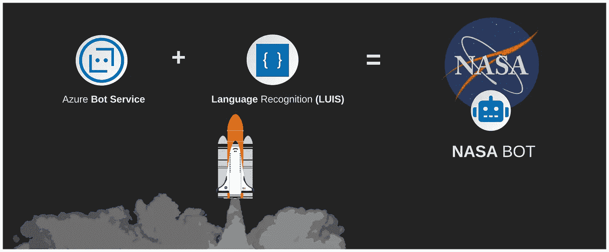
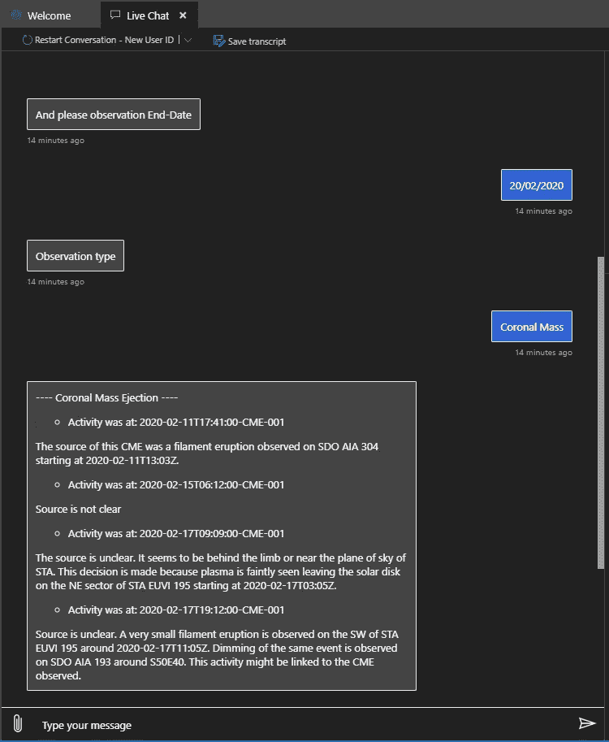
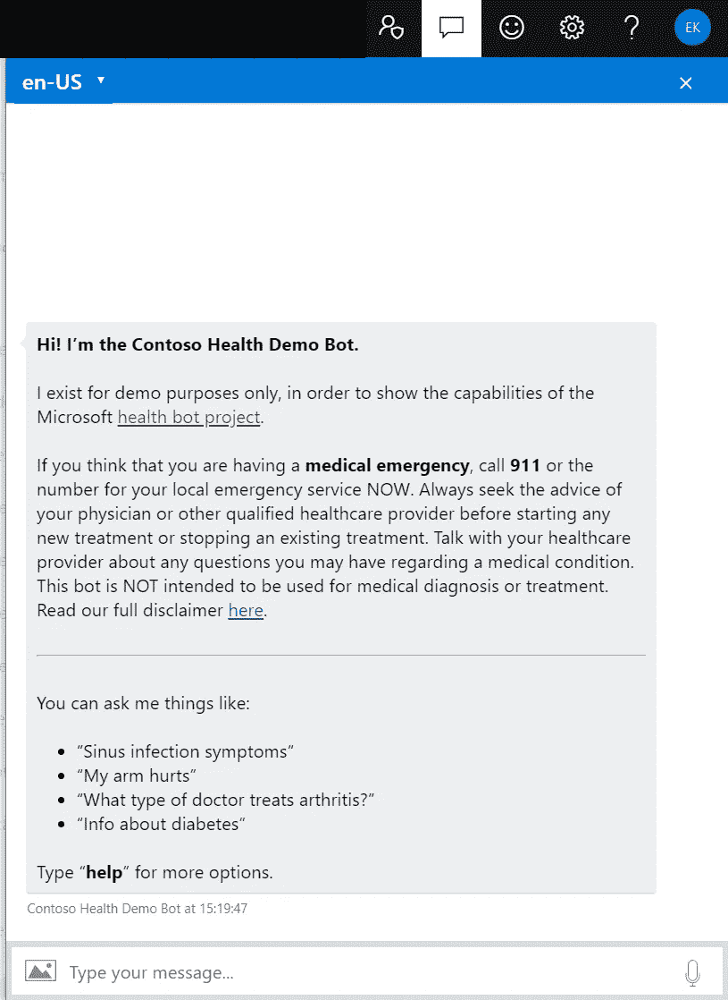
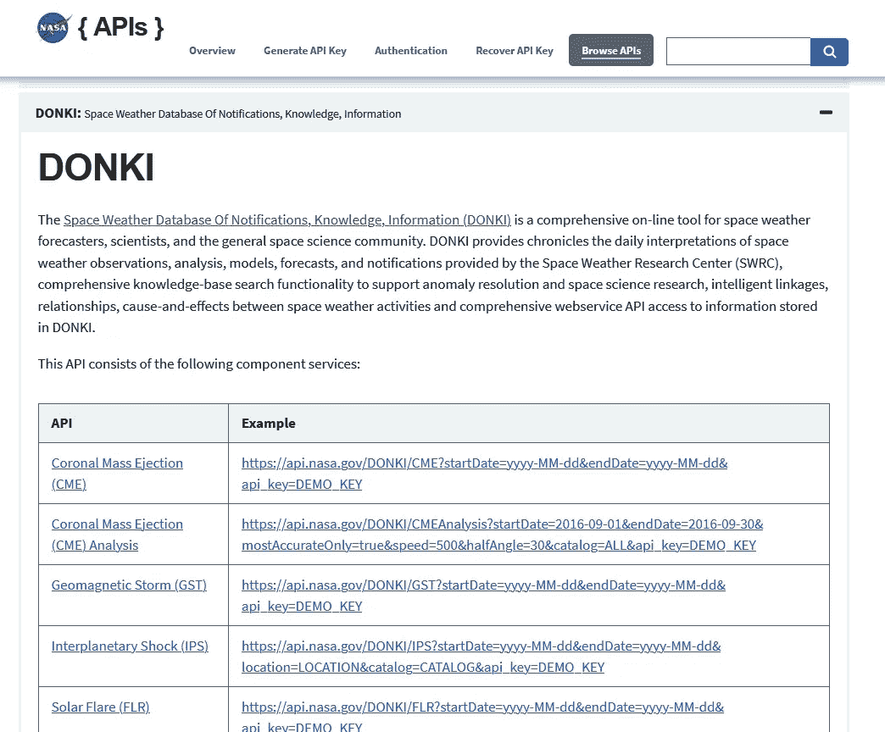
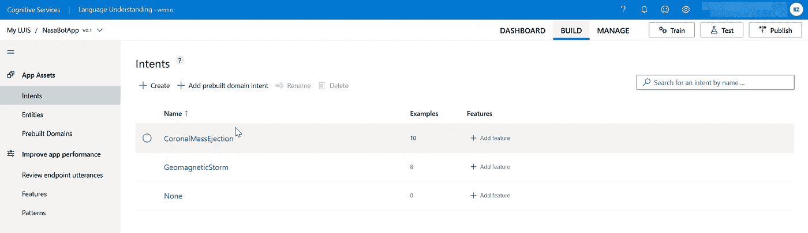
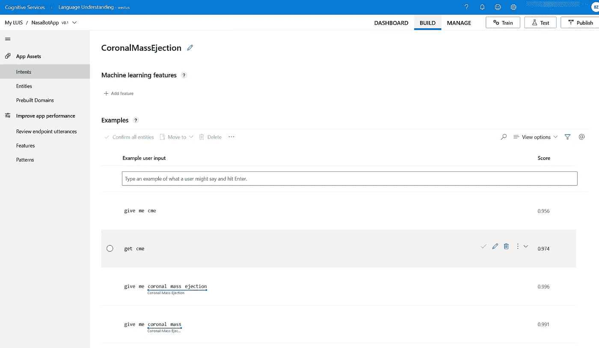
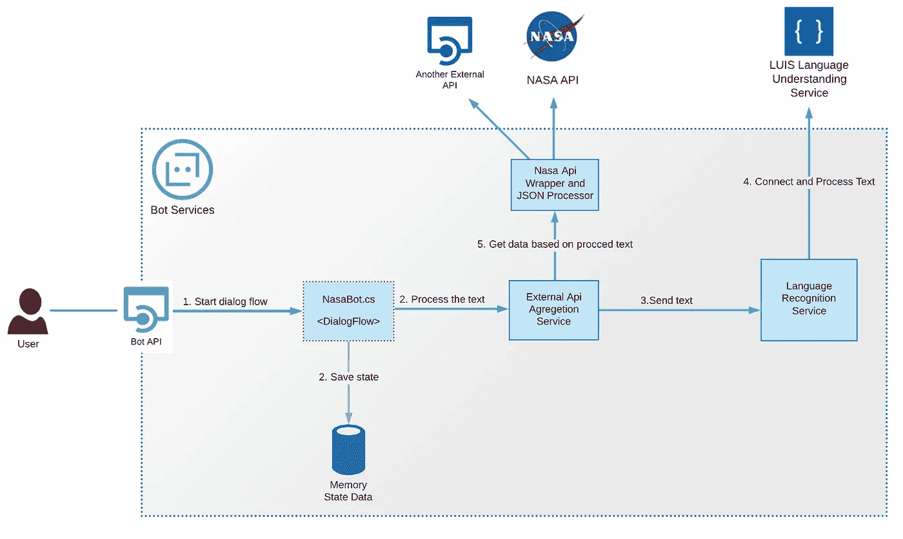
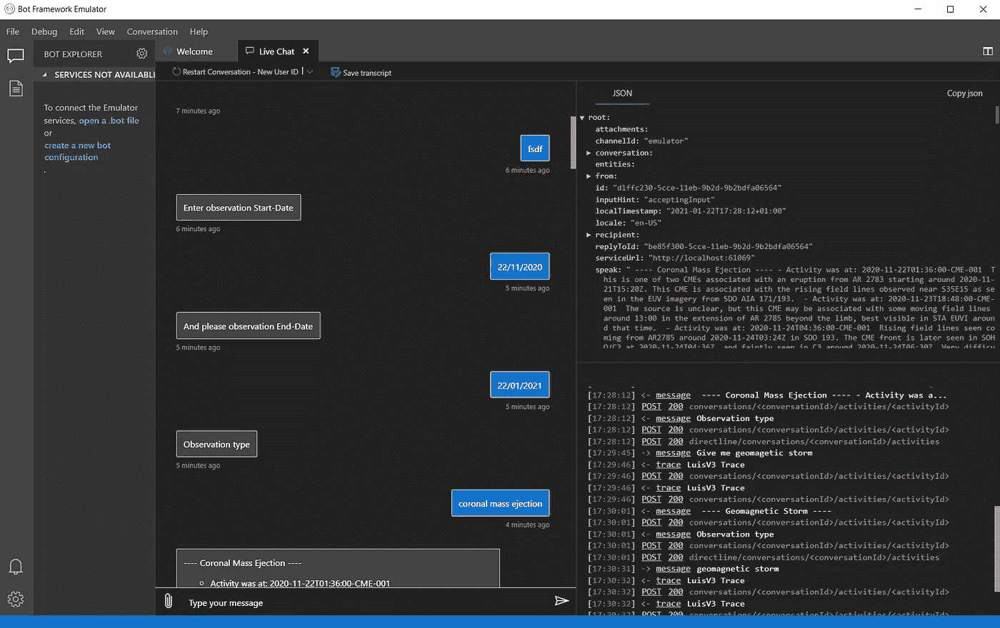
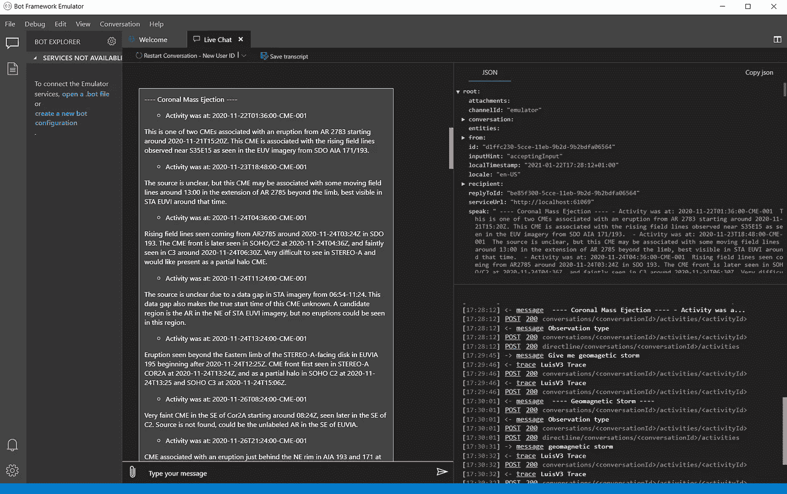

# 构建一个机器人作为传统用户界面的替代。为什么更好？

> 原文：<https://itnext.io/building-a-bot-as-an-alternative-to-classic-user-interface-why-is-it-better-6ce4fd6fdabb?source=collection_archive---------2----------------------->

## 使用 NASA API 和 Azure Bot 服务创建一个 Bot，包括语言识别。第一部分。

我和我的团队正在从事一个航空航天领域的开源客户项目，该项目为学生和大学数据科学家提供科学数据。在几次尝试构建经典的 Web UI 应用程序之后，我们转向了简化的 Bot 流程。这就是原因和方法。

NASA 机器人概述

该项目有一个简单明了的数据响应。它只包含基本数据，如:

*   坐标。
*   事件时间框架。
*   来源类型等。

然而，一些消息具有到详细报告的链接，这是典型的 Web UI。和机器人聊天更自然，因为你感觉你在和一个人交流。

# Azure 医疗保健机器人

这是另一个很好的例子，说明 bot 服务在我们的日常生活中是如何方便的。最近，微软推出了医疗机器人服务。

*   [医疗保健机器人服务概述。](https://www.microsoft.com/en-us/research/project/health-bot/)
*   [技术文档，包括架构概述、如何构建以及服务概念。](https://docs.microsoft.com/en-us/healthbot/)

Azure 医疗保健机器人概述

# 介绍

在本文中，我构建了一个简化版的 Bot，它从 NASA API 中聚合数据，并为用户提供简单的工作流和简短的数据反馈。此外，我使用 Azure 语言识别(LUIS)服务来改进和简化对话流程。

NASA 机器人包含以下功能:

*   从 NASA API 收集数据。
*   聚合并简化数据有效负载。
*   使用 Azure 语言识别(LUIS)识别用户输入。我们将在下面进入路易斯。

在我们深入研究细节之前，让我们来看看为什么这个机器人比传统的用户界面更好。

如果您具备以下条件，使用 bot 方式可以显著改善用户体验:

*   简化的短数据有效载荷。
*   看起来像问答对话框的直观用户交互流程。
*   没有复杂的 UI。
*   注重内容。

如果您具备以下条件，UI 比机器人更好:

*   复杂数据负载。
*   复杂的 UI 表单(管理门户、编辑器、地图、新闻门户、日历)。
*   复杂的数据可视化(仪表板、图表)。

最好的选择可能是将这两种方法结合起来，利用机器人和传统 UI 的所有优点。

# 为什么是 NASA API？

我选择 NASA API 是因为:

*   一个精细且非常简单的 API 设计。
*   记录良好的 API 调用。
*   简单快速的注册过程。
*   API 密钥请求。

美国宇航局 API 东基屏幕

NASA API 分为类别或子 API，例如:

*   通知、知识、信息空间气象数据库
*   火星气象服务 API
*   给定时间点地球轨道物体的双线元素数据(TLE API)
*   卫星情况中心

[NASA API 与其他调用。](https://api.nasa.gov/)

# 为什么选择 Azure Bot 服务？

Azure Bot 服务与 Bot 框架一起，为您提供了构建、测试和存储 Bot 的机会。机器人框架包括工具、SDK、人工智能服务和模板，让你可以非常快速地制作一个机器人。

在我的例子中，我使用模板用 Visual Studio 创建了一个项目，并安装了工具集、SDK 和模板。我用过。NET Core 和 C#。然而，这个框架也允许使用 JavaScript 和 Python。

**路易斯是什么？**

LUIS 是一个语言理解服务，允许你建立和训练你的机器人理解自然语言。我已经在我的机器人中包含了 LUIS，以使用不同的自然语言结构向人们提供来自 NASA API 的信息。

*   [更多关于路易斯的信息。](https://docs.microsoft.com/en-us/azure/bot-service/bot-builder-howto-v4-luis?view=azure-bot-service-4.0&tabs=csharp)

对于当前的项目，我已经使用 LUIS 门户手动训练 LUIS。下面你可以看到我添加了语言句子来训练 LUIS 识别用户反馈并设定分数。LUIS 门户还包含一个选项，允许您测试数据集并将其部署到不同的阶段。

路易斯·波特尔。意图屏幕

路易斯·波特尔。意向详细信息屏幕

当然，人工训练的模型适合中小型 bot 项目。您应该考虑使用预先训练好的模型，这些模型是以 JSON 格式快速找到的，或者是为生产应用程序设置的。

还可以通过添加 [QnA(问答)](https://docs.microsoft.com/en-us/azure/bot-service/bot-builder-howto-qna?view=azure-bot-service-4.0&tabs=cs)和[语言生成模板](https://docs.microsoft.com/en-us/azure/bot-service/language-generation/bot-builder-howto-use-lg-templates?view=azure-bot-service-4.0&tabs=cs)来提高语言理解能力。

# NASA 机器人体系结构概述

NASA Bot 架构代表了基于 MVC 模式的 N-tire 结构。该机器人包括 API 控制器、模型和服务。

NASA 机器人架构

NASA 机器人由以下主要部分组成。

1. **Nasa bot 类**是一个组件，包含对话流事件处理程序，如:MembersAdded 和 MessageActivity。它还可以作为开始对话流的入口点。

2.**外部 API 聚合服务**加入与语言识别相关的逻辑，并从 NASA API 获取数据。

**3。NasaApi 库子项目**是 Nasa API 调用的包装器。它包含从 API 获取、解析数据并为业务层构建适当响应的逻辑。

下面是其他 bot 组件的列表，带有到 GIT 存储库的链接:

*   **API** (以及 **BotController** )是 Bot 的一个端点，当你用 Visual Studio 或 VS 代码创建你的 Bot 时，它会创建一个看起来几乎像 Web API 项目的项目。Web API 是基于 MVC 模式的。
*   **LanguageRecognitionService**将机器人连接到 LUIS API 并触发语言识别过程。
*   **ObservationTypeModel** 包含与 LUIS 响应相关的所有字段，包括最大意向得分计算逻辑。

## 对话工作流程

下面，我添加了几个截图来演示与机器人的交互。如你所见，这里我使用了 [Bot 框架模拟器](https://github.com/microsoft/BotFramework-Emulator)。

NASA 机器人对话框和机器人框架模拟器

NASA 机器人。响应示例

# 结论

本文展示了与 UI 界面相比，bot 服务可以带来的主要优势。在下一篇文章中，我将通过添加更多高级特性来扩展这个机器人。

到 git 存储库的链接，您可以在这里克隆项目。

 [## 鲍里斯恩/纳萨博特

### NASABot 集成了 NASA API 和 LUIS(语言识别服务)。它提供了对最新的 NASA API 的访问…

github.com](https://github.com/Boriszn/NASAbot) 

# 下一步是什么

在下一篇文章中，我将通过添加以下内容来升级 Bot:

*   QnA 制造商和型号
*   单元测试
*   其他 API
*   改进的语言识别(包括语言生成)
*   跨多个渠道的 Bot 部署(电报、备用)

请随意提出你的想法，告诉我们还有什么应该添加到这个机器人或者在下一篇文章中涉及到。期待在评论中听到你的意见。