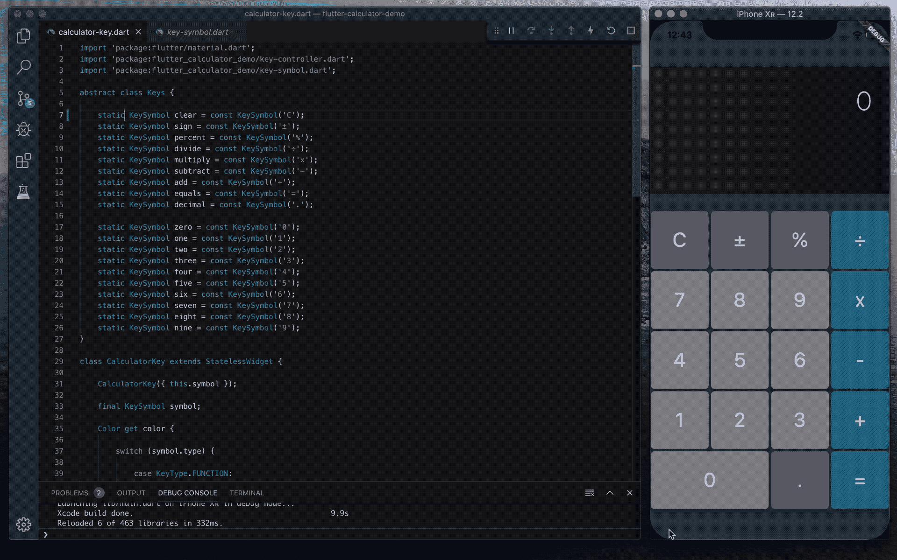
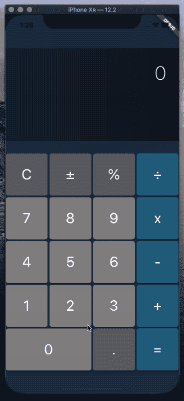

# 在 Flutter 中构建计算器应用程序

> 原文：<https://itnext.io/building-a-calculator-app-in-flutter-824254704fe6?source=collection_archive---------0----------------------->

## 如何用 Dart 和 Flutter 构建一个简单的计算器 app

运行中的计算器的屏幕记录

## 介绍

在这篇文章中，我们将看看如何用[镖](https://dart.dev)和[扑](https://flutter.dev)设计和构建一个简单的计算器应用程序。Dart 语言和 Flutter SDK 中可用的优秀特性为现代开发人员提供了一个快速尝试新想法和构建高性能应用程序的绝佳平台。

这个基本的计算器应用程序将结合一个简单的用户界面，一些标准的操作和功能，以及显示结果的输出。因此，它是一个很好的入门应用程序，或者是另一个基本应用程序的模板。

这个项目的源代码可以在 GitHub 的[这里找到。](https://github.com/kenreilly/flutter-calculator-demo)

## 入门指南

此应用程序的项目是使用`flutter create`初始化的，没有附加的包或依赖项。所有功能都是通过简单的省道和扑动以一种干净和健壮的方式实现的。

利用内置语言和 SDK 特性，可以使应用架构尽可能保持精简和高效。这意味着更快的项目周转、更快的应用程序二进制文件，以及更少的技术债务。

要构建或创建一个类似的项目，需要以下工具:

*   [省道](https://dart.dev/get-dart)
*   [颤振 SDK](https://flutter.dev/docs/get-started/install)

## 应用程序入口点

这个标准颤振项目的应用入口点是 **lib/main.dart** :

*main* 函数将设备锁定为纵向模式，然后运行主应用程序类 **CalculatorApp** ，它构建了一个 [MaterialApp](https://www.google.com/search?client=safari&rls=en&q=flutter+materialapp&ie=UTF-8&oe=UTF-8) ，其主页被设置为 **Calculator** 的一个实例，我们接下来将对此进行研究。

## **计算器类**

计算器的主 UX 在 **lib/calculator.dart:** 中定义

**计算器**类是一个 [StatefulWidget](https://api.flutter.dev/flutter/widgets/StatefulWidget-class.html) ，它为应用程序 UI 搭建了脚手架。它还将按键转发给**处理器**，同时接收要显示的返回数据。这是通过使用[流](https://api.flutter.dev/flutter/dart-async/Stream-class.html)在组件之间传递消息来实现的。

通过调用更新的 *setState* 来更新显示输出，其他一切都通过触发**键盘**、**按键控制器**、**计算器**和**处理器**类之间的异步事件数据来进行。这确保了预期的信息流，并有助于防止竞态条件和其他问题。

在*构建*方法中，按钮大小是通过将屏幕宽度除以按钮数量来计算的，而**显示屏的高度**是通过从设备屏幕高度中减去一个五按钮栏的高度(小键盘的高度)来计算的。

## 显示部件

我们要看的下一个文件是计算器显示， **lib/display.dart** :

Display 类是 StatelessWidget 的基本实现，在构造函数中设置了*值*和*高度*。背景设置为线性渐变，并且*值*在显示屏的右上角显示为文本。

## 键盘小工具

接下来是 **lib/key-pad.dart** 中的计算器键盘部件:

**小键盘**小部件构建了一个五行四项的列，最后一行只有三项，以允许`0`键占用两个空格。这些键在 keys 类中被明确定义[并在这里和整个应用程序中被引用。](https://medium.com/@kennethreilly/coding-with-intention-d1d61f5add20)

## KeySymbol 类

键盘逻辑背后的第一个概念可在 **lib/key-symbol.dart** 中找到:

**KeySymbol** 类充当按键符号的包装器，比如`+`和`-`符号，以及一位数(作为字符串)。在这个类中定义了一个列表，其中哪些键是*功能键*，哪些是*操作键*，不同之处在于功能键以某种方式改变计算的状态，而*操作键*执行数学运算(如除法和乘法)。get 访问器`*type*` 根据是否在 *_functions* 或 *_operators* 列表中找到自己，返回键的类型是*函数*、*运算符*还是*整数*(如果都不是，则为*整数*)。

## 计算器键小部件

现在让我们看看**lib/calculator-key . dart**中的定义:

该文件中的第一个类是 **Keys** ，它是整个应用程序中可用键的列表。键被定义为 **KeySymbol** 的实例，它在构造函数中接受键的字符，允许键符号及其对应的对象被定义为常量，这些常量可以在整个应用程序中以面向对象的方式重用。

这个文件中还有一个 **CalculatorKey** 类，它是一个无状态的小部件，只接受一个 **KeySymbol** 作为它的构造函数。**计算器按键**可以根据其按键类型确定自己的背景颜色和按键宽度。功能键、运算符和整数键有自己的颜色，而零键的宽度是普通键的两倍。

按键事件通过调用 *_fire* 来处理，它反过来在**按键控制器**上触发事件，按键控制器将事件转发给任何监听其[流](https://api.flutter.dev/flutter/dart-async/Stream-class.html)的对象。

## KeyController 类

下一个要检查的文件是 **key-controller.dart:** 中的键控制器

这个文件中有两个类:

*   **KeyEvent (** 包裹了为了方便而按下的**计算器键**
*   **按键控制器**(通过[流](https://api.flutter.dev/flutter/dart-async/Stream-class.html)和**按键事件**处理按键事件消息)

**KeyController** 设置了 [StreamController](https://api.flutter.dev/flutter/dart-async/StreamController-class.html) 的本地实例和对其内部流的引用，并公开了三个方法:

*   *监听*(允许一个对象订阅**按键事件**消息)
*   *fire* (允许一个对象向下游发送 **KeyEvent** 消息)
*   *dispose* (允许应用程序优雅地关闭 StreamController)

这说明了[发布-订阅模式](https://en.wikipedia.org/wiki/Publish–subscribe_pattern)的一个基本例子，其中对组件如何相互连接的关注对于单个组件本身来说是无关紧要的。通过利用流和控制器，只需添加一个额外的组件，让它简单地监听它需要的信息，然后只在必要时调用 setState，根据它所监听的事件流传递的新信息修改它自己的状态。同样，可以删除相同的组件，而不会对应用程序的其余部分产生影响，因为无论有没有额外的侦听器，数据都将正确地流过程序的其余部分。

有关 Dart 中流的异步事件驱动编程的更多信息，请参见[本文档页面](https://dart.dev/tutorials/language/streams)。

## 处理器类

最后但并非最不重要的是起重要作用的文件， **processor.dart** :

**处理器**类是处理键盘交互和执行实际计算的大部分逻辑所在。首先，我们在这个类上有四个用于存储输入和输出变量的基本属性:

*   *_ 运算符*(保存当前请求的数学运算符)
*   *_valA* (保存运算符左侧的操作数)
*   *_valB* (持有运算符右侧的操作数)
*   *_ 结果*(保存上次计算的结果)

在这个类中还有 Stream / StreamController 的另一个实现，**计算器**类用它来订阅包含更新显示值的消息。这里的主要区别是用下划线前缀声明了 *_fire* 方法，使其成为这个类的私有方法，这是我们所希望的，因为这是计算实际结果值的唯一地方。还有一个方便的方法 *refresh* ，它触发下游的当前输出值，以便监听组件设置状态和更新视图。该方法是公开的，以允许监听组件请求更新，例如当一些初始化过程完成时。

接下来是两个确定显示内容的访问器属性:

*   *_ 输出*(如果不是`null`，则返回*_ 结果*，否则返回*_ 等式*)
*   *_equation* (如果 _operator 就绪，则返回一个等式，否则返回 *_valA* )

这种链式访问器的组合提供了一种简单的方法来控制计算器的输出，方法是显示上一次计算的 *_result* ，排队等待求解的计算，或者最左边(也是唯一的)的值，这取决于计算器当前所处的状态。

这个类还有一个 *dispose* 方法，允许应用程序正常关闭。接下来是处理输入按键事件的四个方法:

*   过程(根据**按键符号**类型选择下一步行动)
*   handleFunction(准备在当前状态下执行一些函数)
*   handleOperator(将选择的数学运算符分配给*_ 运算符*
*   handleInteger(将键的数值加到适当的操作数上)

*进程*方法是来自**键控制器**的事件被**计算器**转发的地方。这个方法使用按键符号的类型来选择它是否应该调用一个函数、存储一个操作符或者处理数字输入。

*handleFunction* 方法首先检查左操作数(_valA)是否为‘0’，如果是，则丢弃事件。然后，它通过调用 *_condense* 来检查以确定是否应该将前一个等式的结果存储在最左边的操作数中，以允许输入下一个等式。接下来，基于输入的**按键事件的**按键符号**，**和**按键符号**被转发到适当的功能，随后是*刷新*，功能映射被用于选择所需的功能。这通常比一个巨大的 if-else 语句链更简洁，这种表达水平是 Dart 等现代语言的一个重要特征。

当左操作数为‘0’时， *handleOperator* 方法也会丢弃事件，并在必要时将先前计算的结果存储在左操作数中。然后将选择的操作符存储在*_ 操作符*中，并调用*刷新*。

*handleInteger* 方法接收数字输入，如果没有 _operator，则将其附加到左侧操作数值，如果 _operator 有值，则将其附加到右侧操作数值。当完成时，它还调用一个*刷新*。

该类中的下一组方法处理来自键盘的函数输入，以修改处理器的状态及其值:

*   *_ 清除*(重置计算器并调用*刷新*)
*   *_sign* (翻转当前正在接收输入的操作数的符号)
*   *_ percent*/*calc percent*(将当前操作数的值除以 100)
*   *_decimal* (在当前操作数的末尾追加一个小数点)
*   *_ 计算*(进行实际计算并将结果存储在 *_result* 中)
*   *_condense* (将 *_result* 存储在左操作数中，为更多输入做准备)

*_clear* 方法只是将计算器重置为零。 *_sign* 方法确定要修改哪个操作数，并在它前面添加或删除一个`-`字符。 *_percent* 和 *_decimal* 方法的工作方式基本相同，都是选择正确的操作数并在其上执行各自的任务。

*_calculate* 方法将在没有运算符或右侧值来执行计算时丢弃事件，否则它将利用函数映射来选择使用哪个公式，计算结果，删除任何不重要的尾随零，将值存储在 *_result* 中，并通过调用 *refresh* 来结束。

## 结论

这就结束了我们对这个计算器应用程序的源代码的检查，它可以在 GitHub 上作为模板库[获得。](https://github.com/kenreilly/flutter-calculator-demo)

运行中的应用程序的屏幕录制

这个简单的计算器只用了几百行代码就实现了，并展示了使用 Dart 和 Flutter 构建移动应用程序时可用的表达能力，这些应用程序鼓励干净的设计模式、高效的代码重用、显式类型安全和其他良好的开发习惯。

这些特性使 Flutter 成为构建高质量移动应用程序的绝佳选择，这些应用程序加载和运行速度快，只使用所需的 CPU 和 RAM，不会意外延迟或挂起，并且由于架构和代码简洁，将来可以轻松更新和维护。

感谢阅读这篇文章，祝你的下一个颤振项目好运！