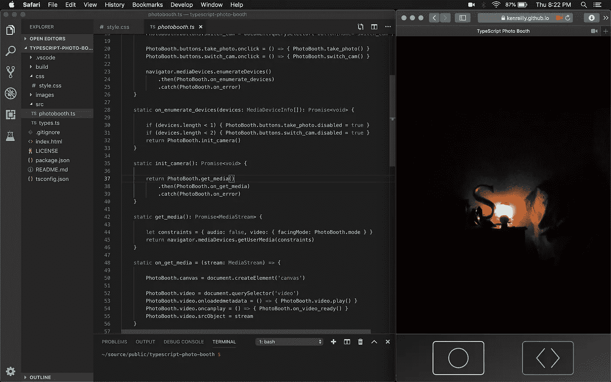
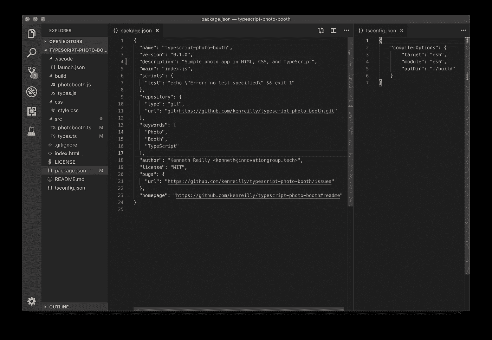
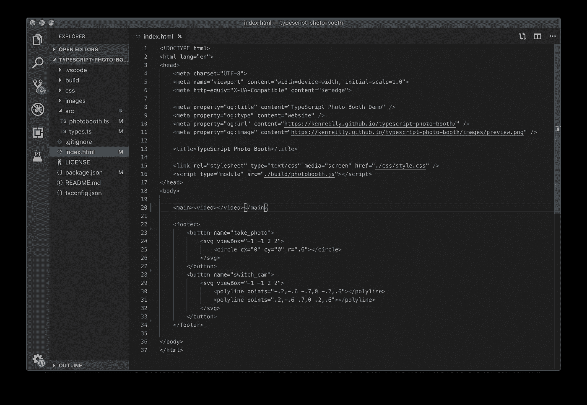
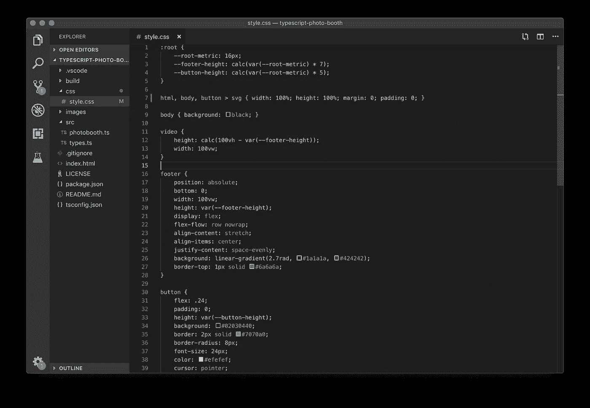
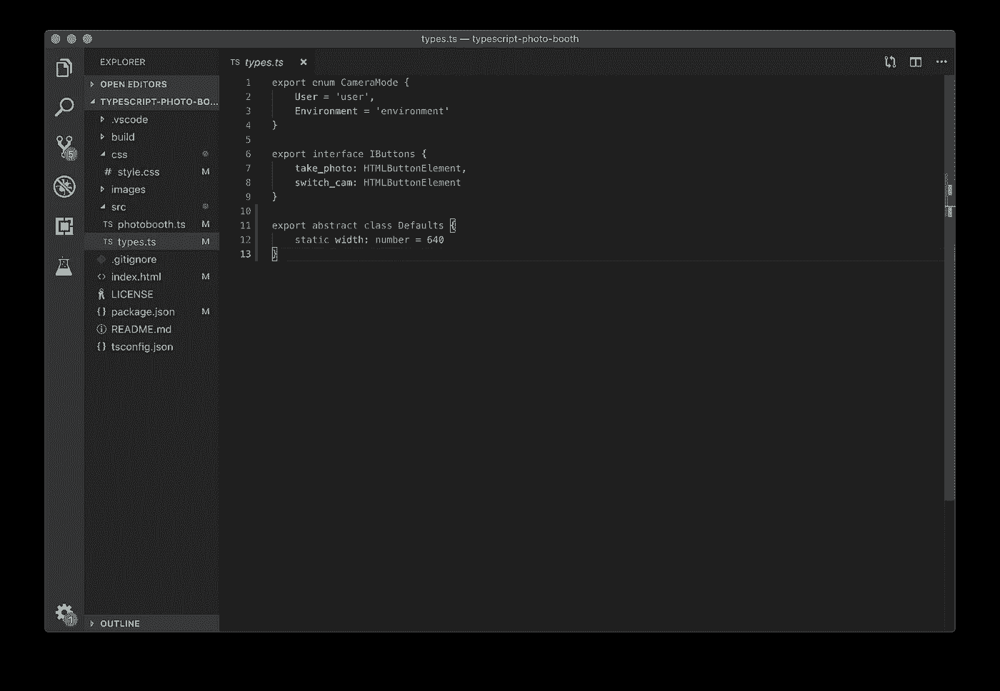
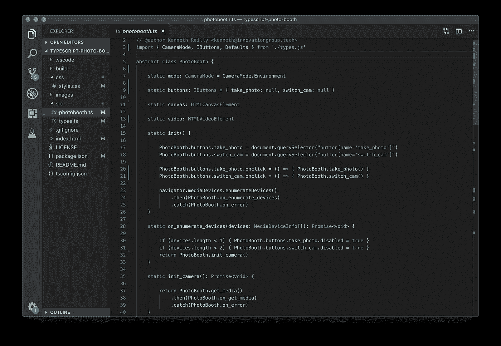
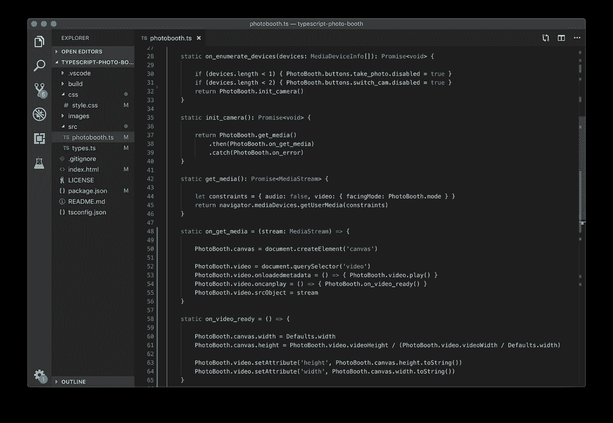
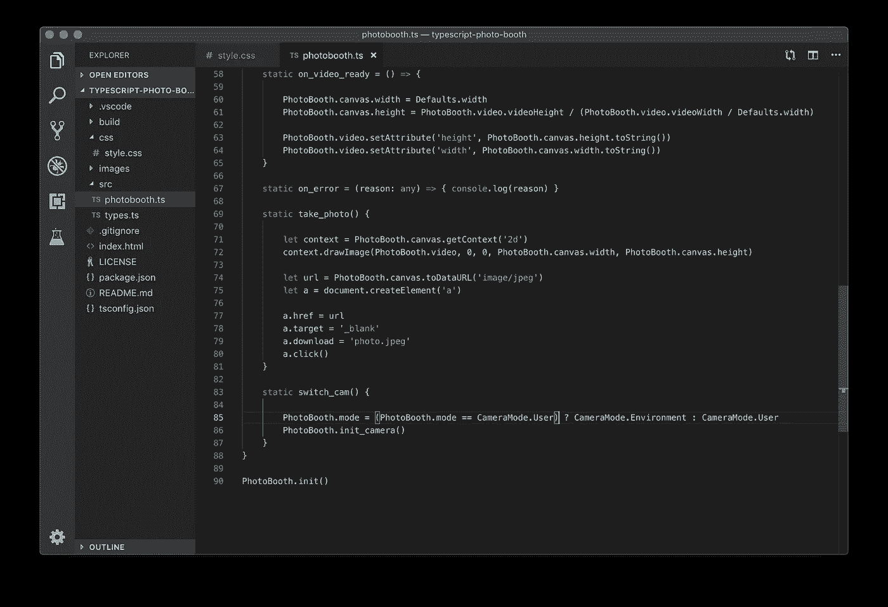

# 📷在 TypeScript 中构建相机应用程序

> 原文：<https://itnext.io/building-a-camera-app-in-typescript-f1981f5ce960?source=collection_archive---------2----------------------->

## 如何用 HTML5、CSS3 和 TypeScript 构建一个简单的照片应用程序

使用[简单的基于浏览器的相机应用](https://kenreilly.github.io/typescript-photo-booth/)的 [Visual Studio 代码](https://code.visualstudio.com)的截图

## 介绍

在本文中，我们将看看如何在 [HTML5](https://developer.mozilla.org/en-US/docs/Web/Guide/HTML/HTML5) 、 [CSS3](https://developer.mozilla.org/en/docs/Web/CSS/CSS3) 和 [TypeScript](https://www.typescriptlang.org) 中构建一个简单的相机 web 应用程序。该项目的完整源代码可在[这里](https://github.com/kenreilly/typescript-photo-booth)获得。

TypeScript 强大而丰富的特性集非常适合从头构建定制应用程序，因为开发人员可以从一个干净而稳定的环境开始，如 [node](https://nodejs.org) ，或者在我们的例子中，从一个[现代浏览器 API](https://caniuse.com/#feat=es5) (两者都包括 JavaScript 引擎的高性能实现)。

现代的、符合标准的浏览器提供了极其强大和灵活的 API，用于以各种方式使用浏览器引擎，包括访问各种硬件设备(如照相机)。

## 项目配置

让我们看看用 *npm init* 生成的 **package.json** 文件，以及一个干净的 **tsconfig.json** 来定义编译器选项:

包含 **package.json** 和 **tsconfig.json** 文件的项目结构

除了 node 和 TypeScript 编译器之外，该项目不使用任何外部依赖项。文件 **tsconfig.json** 指示 TypeScript 编译器生成 ES6 模块并输出到**。/build** 文件夹。这就完成了项目配置，意味着剩下的部分必须手工实现。虽然具有挑战性，但类型检查和其他语言功能，以及现代开发环境中可用的强大代码完成和重构工具，如 [Visual Studio Code](https://code.visualstudio.com) ，使这变得更加容易。

## 应用程序 HTML 结构

这个简单应用的页面结构在**index.html**中定义:

**index.html**用元数据和文件导入

这个短小精悍的 HTML 文件包含了一个像样的示例应用程序所需的最基本的东西:一些[打开图](http://ogp.me/)和其他元数据，以及 **css/style.css** 和模块**的导入。/build/photobooth.js** 和 app 结构，这是一个带有**视频的**主**容器、**和一个带有两个**按钮**的**页脚**—一个用于拍照，另一个用于在设备相机之间切换。

注意用于**按钮**图标的内嵌 [SVG](https://en.wikipedia.org/wiki/Scalable_Vector_Graphics) 。通过将 **svg** 元素上的 *viewBox* 属性设置为*-1-1 2 2】，*整个框的点坐标系在每个轴上居中于-1 和 1 之间。这使得像上面例子中那样画圆和人字形变得相当简单，使用像 *r=0.6* 这样的值来表示从中心到边缘总跨度的 *60%* 。

## 应用程序 CSS 定义

此应用程序的布局和样式在 **css/style.css** 中定义:

**style.css** 定义(减去**按钮:悬停**效果)

这个文件也很短，除了*按钮:悬停*选择器之外，它的大部分都适合这个截图。为了简单起见，已经为页脚度量定义了一个根单元 *16px* ，其中**页脚**高度为( *16px * 7)* ，而**按钮**高度为( *16px * 5)* ，这导致页脚与按钮高度的比例为 *7:5* 。

**html** 、 **body** 和 **svg** 图标被设置为 *100%* 宽度和高度，空白或填充。**视频**宽度设置为 *100vw，*高度设置为 *100vh* 减去页脚高度。使用 [CSS3 Flexbox 属性](https://css-tricks.com/snippets/css/a-guide-to-flexbox/)将按钮水平居中并均匀分布在页脚。

## TypeScript 实现

接下来是包含该应用程序主要功能的实际实现的 TypeScript 文件，它们是:

1.  预览实时摄像机输出
2.  在前置和后置摄像头之间切换
3.  拍照并保存到本地设备文件系统

首先我们来看看文件 **src/types.ts** ，为了方便和类型安全，其中导出了一些有用的类型:

**src/types.ts** 的内容，带有各种类型的定义

在文件 **src/types.ts，**中有一个用于 **CameraMode** 的 enum，它将用于选择前后摄像头，一个 **IButtons** 接口定义了 app 按钮，还有一个 **Defaults** 类定义了 *width=640* 。

接下来是主应用文件， **src/photobooth.ts** :

具有静态属性和初始化器的 **PhotoBooth** 抽象类

**PhotoBooth** 类包含静态属性，用于保存对应用程序中使用的这四个重要组件的引用:

1.  **模式**:当前选择的**相机模式**
2.  **按钮**:按钮 **HTMLButtonElement**
3.  **画布**:屏幕外的**画布**，用于从直播流中提取照片
4.  **video** :一个 **HTMLVideoElement** 显示现场摄像机流

还定义了一个静态的 **init()** 方法，该方法检索对按钮的 DOM 引用以将点击处理程序附加到按钮上，然后调用静态方法 **on_enumerate_devices()** ，该方法进而开始摄像机初始化。

具有初始化和特征方法的 **PhotoBooth** 类

方法 **init_camera()** 通过调用 **get_media()** 方法来初始化摄像机，以从浏览器中检索一个**Promise<media stream>**，该 Promise 与 **constraints、**中定义的标准相匹配，然后将该 Promise 传递给 **on_get_media()** 处理程序，该处理程序进而设置 **canvas** 和 **video** 对象并设置设置画布和视频的高度和宽度的最终初始化任务放在 **on_video_ready()** 处理程序中，一旦浏览器完成将其加载到 DOM 并呈现在屏幕上，该处理程序就会由 **video** 元素触发。

显示处理程序和特征方法的 **PhotoBooth** 类

在 **PhotoBooth** 类中定义的最后一个事件处理程序是 **on_error()** ，它被用作应用程序中 **Promise** 对象的通用错误处理程序，通过。 **catch()** 方法。此外，我们有照片应用程序的实际功能。第一个是 **take_photo()** ，它检索一个**。jpeg** 图像，通过屏幕外**画布**对象代理**视频**，然后通过锚点触发下载。 *click()* 事件。第二种是方法 **switch_cam()** ，交换 **CameraMode** 并重新初始化相机。

## 结论

这个示例项目演示了如何利用 HTML5、CSS3 和 TypeScript 的现代特性以及为支持它们而设计的环境，用几行 html 5、CSS3 和 TypeScript 构建一个简单应用程序的原型。TypeScript 的强大功能之一是能够以非常结构化的方式定义应用程序，在这种方式中，它类似于设计良好的服务器机架，而不是到处都是杂乱无章的电线。

该应用的完整源代码可在[此处](https://github.com/kenreilly/typescript-photo-booth)获得，现场演示可在此处[获得。](https://kenreilly.github.io/typescript-photo-booth)

我希望你喜欢这篇文章，并发现它很有用。如果你有任何更正或建议，或任何其他想法，请随时给我留言。

感谢阅读！

> 肯尼斯·雷利( [8_bit_hacker](https://twitter.com/8_bit_hacker) )是 [LevelUP](https://lvl-up.tech/) 的 CTO