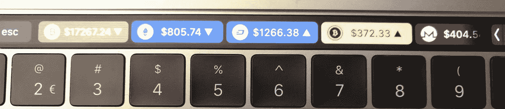

# 为 Touch Bar 构建加密价格跟踪器

> 原文：<https://itnext.io/building-a-crypto-price-tracker-for-touch-bar-317c490e613?source=collection_archive---------1----------------------->

BTC、瑞士联邦理工学院、DASH、BTG、XMR 对美元——使用[网络应用](https://chrislennon.github.io/Crypto-Touchbar-App/)生成

[*点击这里在 LinkedIn*](https://www.linkedin.com/cws/share?url=https%3A%2F%2Fitnext.io%2Fbuilding-a-crypto-price-tracker-for-touch-bar-317c490e613) 上分享这篇文章

自从 2013 年比特币价格飙升以来，我一直在关注加密技术，尽管很有趣，但我从未深入研究过这项技术。2016 年底，我看到围绕区块链、比特币和加密货币的炒作再次兴起。我认为比特币的价格上涨就像过山车一样，引发了很多兴趣，无论是在技术社区还是现在的普通大众中，这都要归功于媒体的炒作。

比特币的价格肯定是一路上涨——不管“这是泡沫吗？”你提出的问题——几乎没有一周不出现大幅上涨，不管是上涨还是下跌。

**问题**

每个月都有大量的硬币爆炸，每一个都有自己的名气，每一个都有相应的价格。ICOs 成为一种东西，硬叉子更加流行。这给我带来了一个问题:

**我如何跟踪所有这些价格，最好是以一种简单/无干扰的方式？我已经一天多次查看我的手机，在各种货币间切换。与此同时，我开始了一份新工作——虽然我自己并不相信这种宣传——我收到了一台带触控条的新 MacBook，这是我从未想过会用到的东西。**

随着我头脑中的齿轮转动，我发现有些人也有类似的想法——在 touch bar 上进行价格追踪！我找到的第一个项目是 Ryan Gordon 的，他最初是受这篇文章的启发。这是一个很好的开始！事实上，我用了几个月的时间来运行我自己定制版本的 Ryan 的脚本。

然后问题出现了，不是脚本的问题，更多的是人们开始在我的设备上看到它，当然，问题开始滚滚而来:

*   我能得到一份拷贝吗？
*   你能把它换成和这个交易所一起工作吗？
*   可以加 x，y，z 币吗？

由于这种情况一个月发生几次，我可以看出，首先，人们想要它——这起初让我感到惊讶。其次，我厌倦了构建 json 文件、复制和粘贴脚本、摆弄图标——所有这些都是非常手工的。

**解决方案**

我不得不把自己从大量的工作中拯救出来，所以对我来说很明显，我应该为此建立一个 web 应用程序，保持它的开源性，并借鉴人们已经完成的关于图标等事物的伟大工作。我也将自己描述为一个黑客(不是媒体意义上的)——更多的是我通过一个解决方案，随着想法的工作和失败而迭代——这意味着我可以快速交付一些东西，但通常带有一点代码味道。

https://chrislennon.github.io/Crypto-Touchbar-App/出生了。生活在 [GitHub](https://github.com/chrislennon/Crypto-Touchbar-App) 上，通过 GitHub 页面部署以避免主机开销。下面是我在创建这个应用程序时经历的一般步骤和阶段。

**为人口建立模板和逻辑**

前面的例子都使用了我已经喜欢上的 [BetterTouchTool](https://www.boastr.net/) 。第一步是创建一个基本模式，允许我导出/导入一个 JSON 文件，并根据用户想要的硬币填充它。

我已经有了我想要的风格的例子——一个在一个按钮下捕捉所有硬币的组(现在是可选的),每个硬币都有自己的符号，它们的价格，一个简单的指标，它是上涨还是下跌，最后是一个关闭组按钮，以退出硬币组。

这些组件中的每一个都是首先在 BetterTouchTool 中创建的，然后手动调整。

我最后使用的模式在[中可用。/data/BTTSchema.js](https://github.com/chrislennon/Crypto-Touchbar-App/blob/master/data/BTTSchema.js)

下一步是从硬币列表中填充。对于硬币本身，我识别了一些信息，比如它们的名称、交易所使用的股票代码以及它们的图标。对于传统货币——美元、欧元等，我也需要这个。。/data/coins.js &。/data/fiat.js

在之前的实验中，我已经构建了一个基本的 applescript(类似于灵感项目提供的那些程序)。我发现了一个通用的 API，它能够处理多种加密货币，也能够转换成多种传统货币——https://www.cryptocompare.com/api/#。

有了这些信息，遍历硬币列表并填充每个硬币所需的部分模式和脚本就变得相当容易了。您可以在[的“generateJSON”函数中看到这一点。/js/crypto.js](https://github.com/chrislennon/Crypto-Touchbar-App/blob/master/js/crypto.js) 。最初，这只是一个静态数组，没有用户选择—然而，这种情况即将改变。

**用户选择和用户界面**

因此，为了让用户能够创建自己的工具栏，需要一个 UI。一个问题是我通常没有时间研究 CSS 或者样式——但是我理解它的重要性。

我决定从“简单”开始，使用和以前一样的硬币列表迭代出一系列用户可以选择的复选框。在用户选择了他们想要的密码并点击“导出”之后，我选择了选中的复选框，并把这个静态 json 输入到我上面概述的 generateJSON 函数中。您可以在[的“加载数据”功能中看到复选框和输入的填充。/js/crypto.js](https://github.com/chrislennon/Crypto-Touchbar-App/blob/master/js/crypto.js) 。

在这样做的时候，我遇到了一些问题，主要是在我的迭代逻辑和缺乏专业知识 JS 中，我可以看到这个问题，但我没有 100%的选择来修复它——恳求一位同事(感谢 [Bart](https://github.com/BJJLangedijk) ！)他很快提出了一个解决方案。我在每次迭代中覆盖对象，而不是将它克隆到自己的独立版本。几个“let”语句和 Object.assign()语句之后，我又回到了正轨。

下一步是整理界面并向用户提供预览。touch bar 的预览和主页的布局都有点 CSS 的味道，但是在我的常驻 CSS monkey 和 GitHub 页面大师的指导下(感谢 [Thomas](https://github.com/ThomasShaped/) ！)我决定实现基本的 GitHub pages slate 风格(但手动实现，因为它只能通过 Jekyll 进行 markdown ),并为自己创建了一些漂亮的按钮和一个预览触摸栏。这种样式在[中可用。/style](https://github.com/chrislennon/Crypto-Touchbar-App/tree/master/style) 目录，具体来说就是[。自定义元素的/style/styles.css](https://github.com/chrislennon/Crypto-Touchbar-App/blob/master/style/styles.css) 。

下一步是什么？

老实说。谁知道呢……这是因为我为朋友和同事节省了一些工作，他们想要展示一些东西，我觉得也应该向世界开放。我正在通过我的 GitHub [问题页面](https://github.com/chrislennon/Crypto-Touchbar-App/issues)追踪想法和采纳建议，并且当我有时间和灵感的时候，我一直在努力实施它们。

一些已经浮出水面的想法(其中大部分在本文发布之前已经写入了代码):

*   为 API 价格检查提供用户定义的刷新间隔(完成)
*   提供用户定义的颜色选择器来改变工具栏按钮的颜色(完成)
*   提供切换以启用/禁用硬币分组(完成)
*   从 API 实现硬币的动态列表(TODO，[有一些问题](https://github.com/chrislennon/Crypto-Touchbar-App/issues/13)
*   整理一些已经发生的“代码进化”:
*   将 JS 重构为对其他开发人员来说更漂亮、更有用的东西
*   处理使用 SVG 图标和 base64 PNG(BTT)转换更好

我欢迎评论和建议——请通过 [GitHub](https://github.com/chrislennon/Crypto-Touchbar-App/issues) 、这篇文章或者 [twitter](https://twitter.com/CDLennon) 联系。

编辑:不敢相信我漏掉了一张最终结果的图！这是我做的一些硬币对美元的出口——现在移到了文章的顶部。