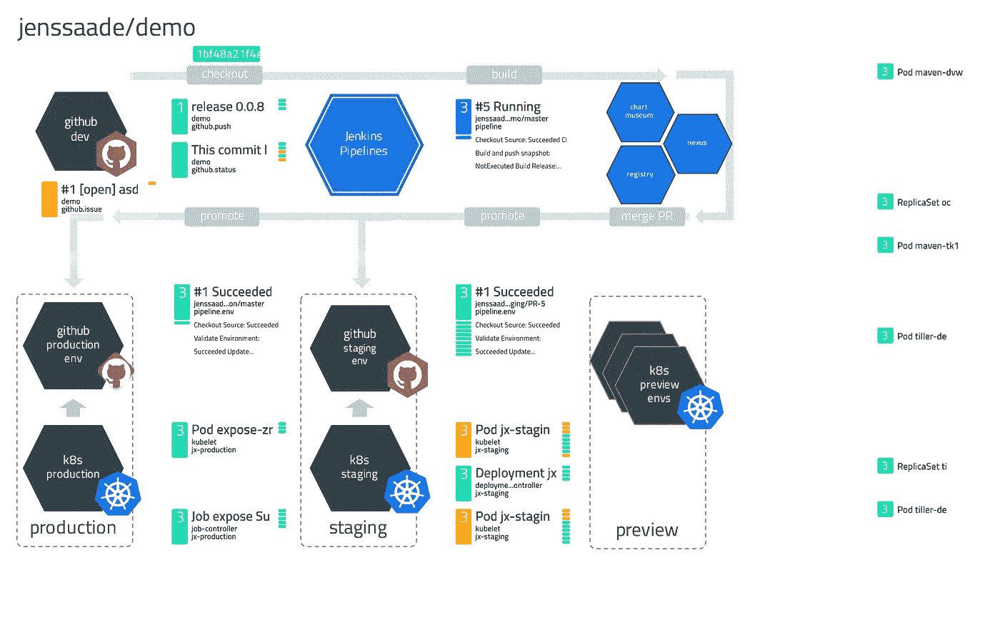
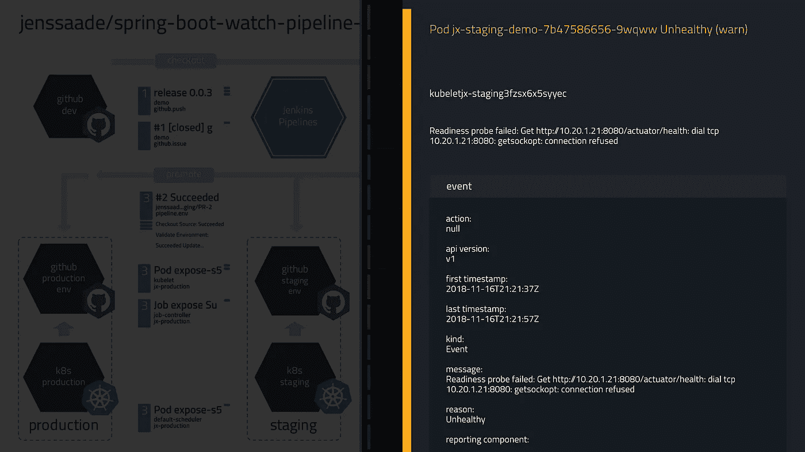
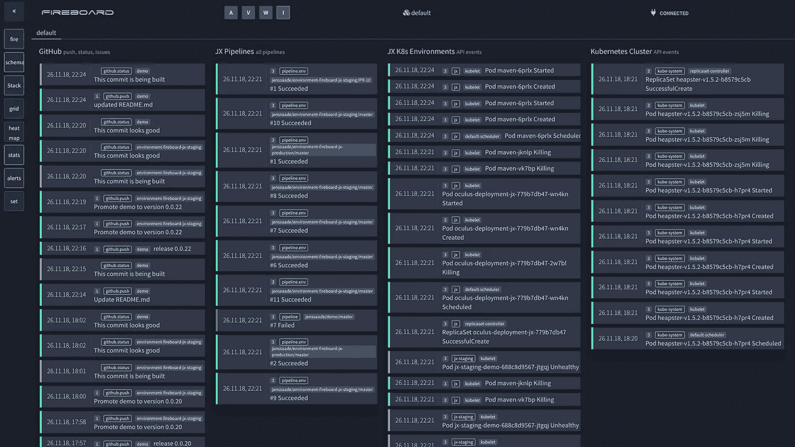

# 为 JenkinsX 构建自定义仪表板

> 原文：<https://itnext.io/building-a-custom-dashboard-for-jenkinsx-6d10bbd18b6?source=collection_archive---------7----------------------->

**如何在动态信息图中可视化复杂的技术流程。**



使用各种来源的 PPT 和事件的 Mashup

最近在苏黎世的一次聚会上，我第一次见到了 JenkinsX，这是基于 Kubernetes 的 Jenkins CI 的新版本。对目前正在建造的东西印象非常深刻，我很快意识到这个怪兽是多么强大和复杂。

JenkinsX 现在正在精心策划一个完整的生态系统，包括 git 源回购、掌舵图和工件回购、登台和生产环境，甚至基于 PR 的预览环境。相当酷。

我发现很难详细了解正在发生的事情。您实际上可以使用新的 cli 客户端:`jx get activities` *跟踪管道的状态。然而，我决定用我的事件监控工具 MetaControl 创建我自己的小仪表板。*

> 元控制聚合来自各种来源的元事件，并提供状态/严重性级别的聚合视图。它目前处于测试阶段，可以免费访问。看看这里。

其结果是整个过程的混搭，结合现场发生的事件，给我一个整体结构的鸟瞰图。它由构建为 SVG 的图形元素(用 Powerpoint 和 Inkscape 绘制)和一系列嵌入的显示当前状态的小部件组成。

这些小部件显示类似交通灯的状态指示器和严重级别。根据布局，它们还显示历史状态和事件的身份/类别。



*点击小部件将提供 2 级列表/详细视图，用于深入查看单个事件。*

*您还会发现事件附带的完整元信息，有助于更深入的调查。*

# 佐料

为了将事件从管道的各个部分带到仪表板上，需要与元控制进行一些集成:

## 来自各种名称空间的 Kubernetes API 事件

如前所述，JenkinsX 使用了相当多的 k8s 资源来提供构建容器、预览/登台/生产环境以及相关的实用服务。当操作管道时，在 API 级别上发生的任何事件也是有趣的。

我写了一个附加在 k8s API 上的小探针，它使用一个[https://github.com/verticle-io/oculus](https://github.com/verticle-io/oculus)的变体将事件转发给元控制。

## jx 管道活动

基本上，jx 管道事件是 Kubernetes 中的自定义资源定义(CRD)。您可以像关注 API 事件一样关注它们。它们包含关于 CI 阶段、它们的处理步骤的信息，以及关于构建和工件的详细信息。

## Github 事件

JX 也挂钩到 Github 回购。它甚至管理促销，并使用 gitops 来处理 k8s 环境的部署状态，因此它在各种回购中非常活跃。为了跟踪这些操作，我将 webhooks 应用于每个 repo，这些 repo 将所有操作发送到 MetaControl 上的特定 webhook 处理器。有效载荷被处理并转换成元控制兼容事件。

## 其他来源

我跳过了其他值得监控的资源，比如舵图和构建工件的存储库。尽管它们可能是即将到来的版本的候选者。

您还可以将事件从您部署的应用程序发送到仪表板(例如，健康状态或类似的内容)或发送机器统计数据，这只是几个潜在的扩展。

# 在元控件中观察事件

一旦附加了所有的源，它们就会在元控件 UI 中可见。启动 JX 演示应用程序并从 Github 启动 CI 流将会产生如下结果:



MetaControl Fireboard 视图，Github、JX 和 Kubernetes 有单独的通道

四个通道中的流显示所有接收到的事件以及运行时传入的事件，这对于探索非常有用。连同其他可视化，如 24 小时热图，最新状态网格或事件分布的一般统计，你会对正在发生的事情有一个好印象。

现在，我们希望为事件添加更多的上下文来定位和映射它们。这是通过元控制*原理图*完成的。

# 元控制示意图

*Schematics* 应用程序生成了本文开头的仪表盘。

总的来说，*示意图*是一种视觉方法的尝试，提供了比标准元控制事件流、热图或网格更可定制的体验。

从技术上来说，它是一个小角度的应用程序，从一个 yaml 文件配置呈现仪表板元素。它通过 websockets 从 MetaControl 获取事件流，并即时操纵 svg 小部件。

## 仪表板配置

yaml 配置提供了数据绑定(数据桶)和小部件配置部分，包括数据选择器、过滤器和布局选项。

可以从事件元数据呈现标签，并使用类别、标识符或元键/值选择器进行过滤。

```
github-demo-push-label:
 type: label
 title: github-demo-push-hash
 description: |
   Commit hash on the github repository for the project.
 origin: github webhook
 pos:
  x: 227
  y: 63
 matchCategory: github.push
 matchIdent: demo
 eventTextSelectorMetaSection: meta
 eventTextSelectorMetaProperty: hash
 backgroundOpacity: 0.0
 textColor: rgb(255, 255, 255)
 widgetBackgroundColor: rgb(255, 255, 255)
 mode: compact
```

这为设计仪表板留下了大量的选项，并使它看起来像你想要的那样，显示你认为重要的信息，并提供必要时更深入挖掘的方法。

## 事件流

与元控制(也显示过去 24 小时的历史事件)不同的是， *Schematics* 将只显示来自数据流的实时事件。然而，它有一个每个部件的选项，在一些 TTL 后清除事件，所以它显示了最近活动的清理视图，而不是显示过时的信息。

# 摘要

我喜欢创造这个小橱窗。它帮助我更好地理解了 JenkinsX 的整个过程和它的活动部分，希望你喜欢创建动态信息图的想法。当事情稍微复杂一点时，它确实有助于清楚地了解正在发生的事情。

如果 MetaControl 引起了您的兴趣，并且您想了解更多相关信息，请访问 [https://verticle.io](https://fireboard.verticle.io) 查看。

*示意图*正在大量开发中，但我会尽快在网上提供一个粗略的版本。