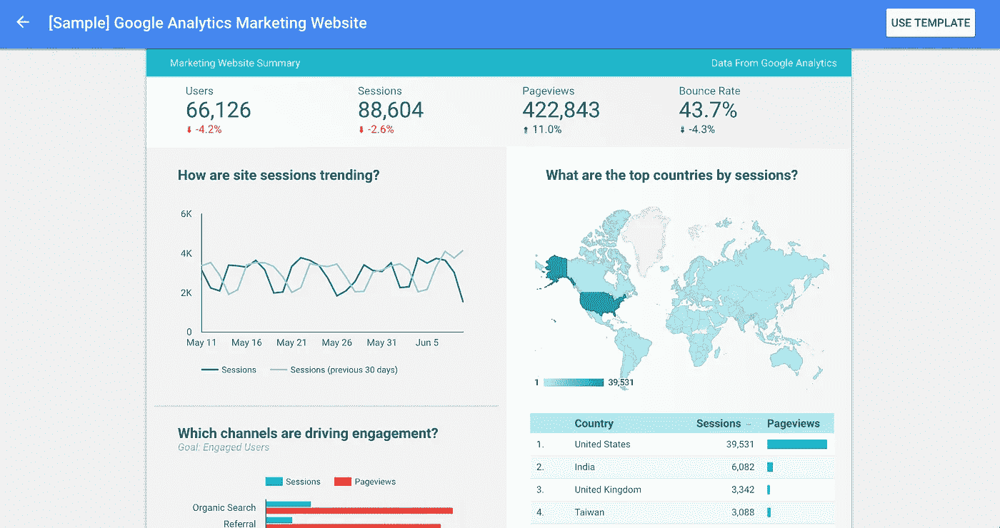
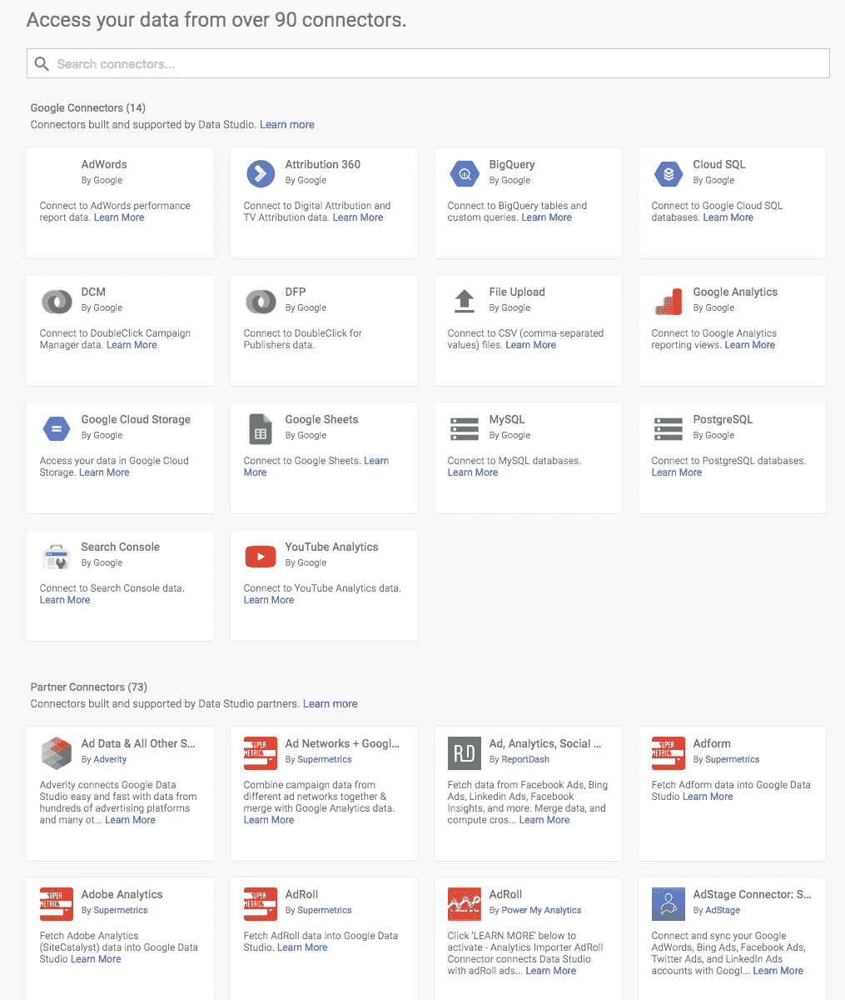

# 从 A-Z 构建定制的 Google Data Studio 连接器

> 原文：<https://itnext.io/building-a-custom-google-data-studio-connector-from-a-z-b4d711a5cf58?source=collection_archive---------5----------------------->

一段时间前，谷歌发布了一款名为谷歌数据工作室的新产品——其目的是利用各种来源的数据，轻松创建外观精美的交互式报告(主要用于商业目的)。它受到了热烈的欢迎，因为它大大简化了分析师的生活。他们唯一要做的就是打开 GDS，选择一个数据源，移动元素🎉他们完了。

谷歌营销报告示例

正如我已经提到的，GDS 很酷的一点是它可以处理各种数据源——例如，你可以从谷歌的[图库](https://datastudio.google.com/data)中选择一个数据源。
目前，图库中已经有 90 个来源:
- 14 个是谷歌自己的来源，用于整合他们的产品，如分析、AdWords 或 Sheets。
- 73 是第三方应用来源，如 Twitter、Tumblr 或 Supermetrics
- 6 [开源](https://github.com/googledatastudio/community-connectors#readme)数据源，用于连接 GitHub、NPM 或 StackOverflow

谷歌数据工作室连接器库

这个想法在 [Leadfeeder](http://leadfeeder.com/) 中确实吸引了我们，所以我们决定在我们的一次内部黑客马拉松中开始构建一个连接器来集成我们的公共 API。

我开始钻研谷歌的文档，发现了这本[指南](https://developers.google.com/datastudio/connector/get-started)。我绝对推荐这组文档作为起点，但是随着你开始更加熟悉这项技术，你会开始问一些在 Google 的教程中没有涉及到的问题，但是这些问题对于构建高质量的软件是至关重要的。例如:
-如何缓存大量的 API 响应？
-我可以在连接器代码中使用外部 JS 库吗？
-如何对连接器进行单元测试？
-如何设置 CI 系统以自动测试和部署我的连接器？
-我可以在我自己的开发环境中开发代码，而不是在谷歌脚本在线编辑器中吗？

谷歌的文档不断变得更好，所以有可能很快这些东西会在那里被描述，但现在有一堆不清楚的东西，我必须自己去了解。我想节省您的大量时间，所以我决定开始这一系列的文章，在这些文章中，您将学习如何从头至尾地开发一个连接器。

该系列由以下部分组成:
1。[基本设置](https://medium.com/@bajena3/building-a-custom-google-data-studio-connector-from-a-z-part-1-basic-setup-445a6d965d3f) —如何创建连接器并设置您的开发环境
2。 [OAuth，调用外部 API 并缓存](https://medium.com/@bajena3/building-a-custom-google-data-studio-connector-from-a-z-part-2-oauth-calling-apis-caching-edb3e25b18e7)
3。[设置单元测试，linter 和代码覆盖率](https://medium.com/@bajena3/building-a-custom-google-data-studio-connector-from-a-z-part-3-unit-tests-and-eslint-setup-16807675dc10)
4。[使用 CI 平台测试和部署连接器](https://medium.com/@bajena3/building-a-custom-google-data-studio-connector-from-a-z-part-4-continuous-integration-f2a9c1177bdb)