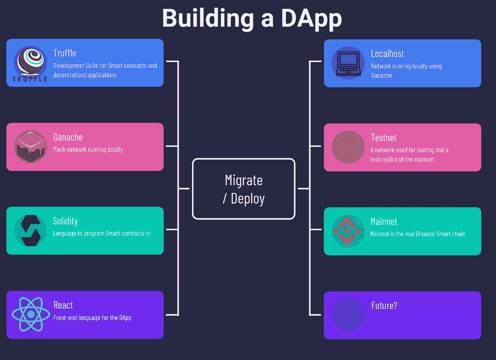
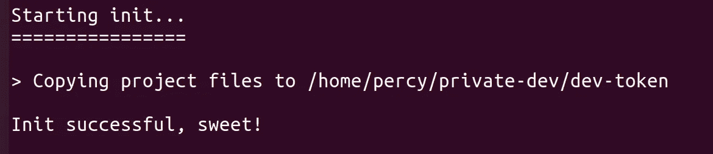
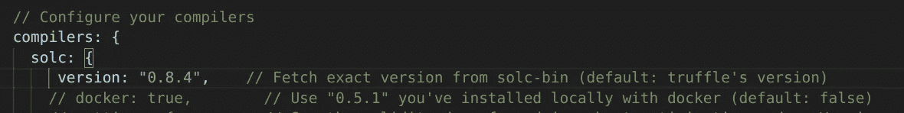
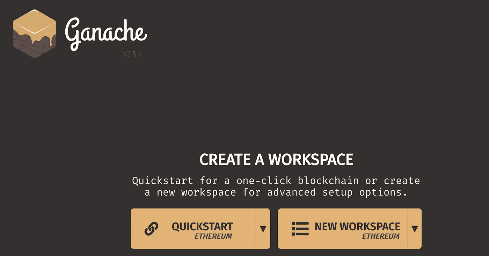
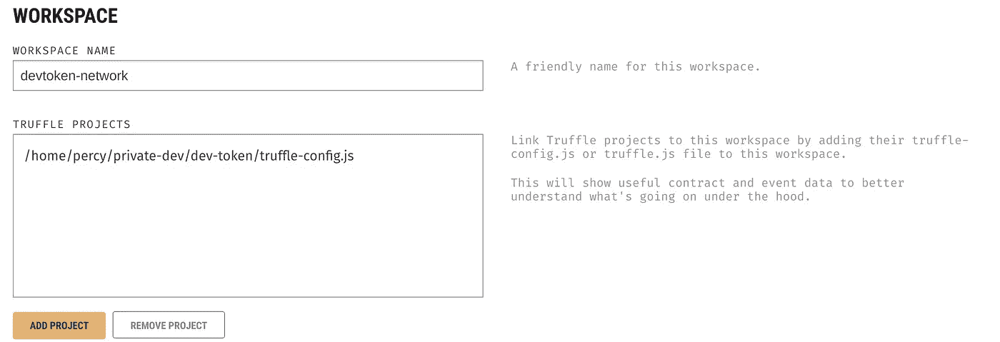
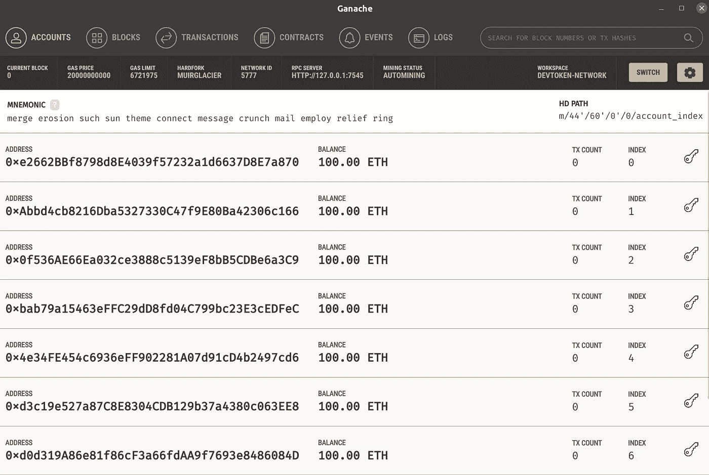
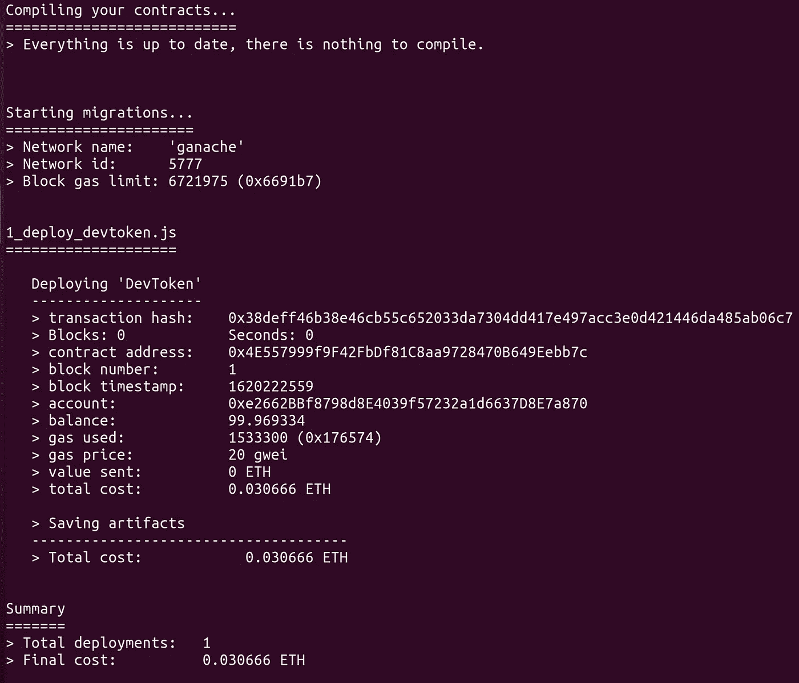
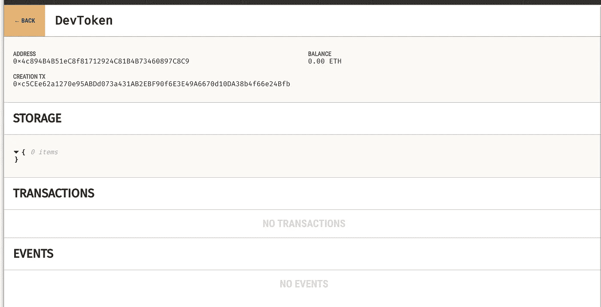
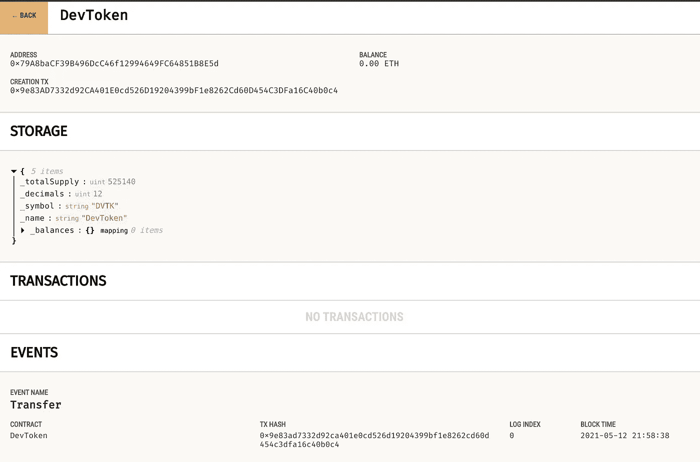

# 用 BEP-20 契约构建一个分散的应用程序

> 原文：<https://itnext.io/building-a-decentralized-application-with-bep-20-contract-in-solidity-d2c066447aa6?source=collection_archive---------1----------------------->



珀西·博尔默拍摄的图片

如果你已经找到了这篇文章，那么我猜你有兴趣了解更多关于如何使用区块链构建应用程序的知识。我们将介绍如何设置所使用的环境，构建一个可以使用 BEP-20 令牌的简单应用程序。令牌将有一个超级简单的赌注能力，奖励用户的赌注。本文将**假设在**之前很少或没有使用区块链和 solidity 的经验。

本系列是四篇文章的第一篇，每篇都有自己的主题。

1.  **【在 Solidity 中用 BEP-20 契约构建一个去中心化的应用】** —这篇文章将帮助你理解 Solidity 的基础知识
2.  [**【在实体中创建可继承的赌注契约】**](https://medium.com/@percybolmer1/creating-a-inheritable-staking-contract-in-solidity-7804ae2d7a32) —第二篇文章，我们将介绍更高级的实体物品，并实现赌注和奖励
3.  [**【在 Web 应用程序中使用智能合约】**](https://medium.com/@percybolmer1/using-a-smart-contract-in-an-web-application-78432ed68527) —本系列的第三篇文章，我们将学习如何使用元掩码通过 Web 应用程序连接到区块链
4.  [**【将智能合约部署到币安松露智能连锁店】**](https://medium.com/@percybolmer1/deploying-smart-contracts-to-binance-smart-chain-with-truffle-c57a7d1eb6ed) —第四篇也是最后一篇文章，我们将学习如何将智能合约部署到真实网络中

在我们开始深入研究代码之前，我想确保解释一些关于该技术的基本术语。

## BEP-20

BEP-20 是在币安智能链上创建令牌时使用的标准。币安学院对此有很好的解释。从开发人员的角度来看，该标准要求币安智能链上的所有令牌都必须满足特定的接口。

接口是需要在契约(令牌)中出现的一组功能。模板界面可以在[币安文档](https://docs.binance.org/smart-chain/developer/BEP20Token.template)中找到。

这些是 BEP20 接口中定义的功能。

```
function totalSupply() external view returns (uint256);
function decimals() external view returns (uint8);
function symbol() external view returns (string memory);
function name() external view returns (string memory);
function getOwner() external view returns (address);
function balanceOf(address account) external view returns (uint256);
function transfer(address recipient, uint256 amount) external returns (bool);
function allowance(address _owner, address spender) external view returns (uint256);
function approve(address spender, uint256 amount) external returns (bool);
function transferFrom(address sender, address recipient, uint256 amount) external returns (bool);
```

现在你可能还不明白函数声明中的所有项意味着什么，但是不要担心。这就是你在这里的原因。币安文档提供了一个完整的 BEP20 实现，它可以被我们的令牌继承，所以它是即插即用的。但是我们将自己实现这些方法，因为我们想了解它是如何实现的以及它做了什么。

## 与 BEP-20 相关的以太网

在研究 BEP-20 时，你们中的许多人可能会发现提到以太坊以及以太坊是如何工作的。这是因为币安智能链令牌是 ERC-20 接口(以太网标准令牌)的扩展。这使得币安智能链也可以在以太坊区块链上运行。你可以在币安学院了解更多。

## 智能合同

通常被称为在区块链上运行的代码。智能合同是我们使用 Solidity 来管理和执行应用程序的业务逻辑而编写的。

> 在区块链上运行的应用或程序— [币安学院](https://academy.binance.com/en/articles/what-are-smart-contracts)

## 挑战

DeFI 代表分散金融。与金融相关的应用程序运行在一个分散的区块链网络上。你可以阅读[拉克什·夏尔马](https://www.investopedia.com/decentralized-finance-defi-5113835)更深入的解释。就币安而言，它只是半分散的。

## DApp

分散应用程序(DApp)，意思是应用程序运行在分散的计算机系统上。例如币安智能合约。这里可以找到很棒的解释[。](https://www.investopedia.com/terms/d/decentralized-applications-dapps.asp)

## 固态

Solidity 是区块链和智能合约中最常用的编程语言。在 [Soliditylang](https://docs.soliditylang.org/en/v0.8.4/index.html) 可以获得 solidity 文档。

# 设置开发环境

让我们从创建一个开发环境开始。创建一个目录作为开发的根文件夹。我将我的项目命名为 dev-token。

```
mkdir dev-token && cd dev-token
```

我们将使用 Ganache 和 Truffle 来帮助我们开发智能合约。

**Truffle** 是一个在以太坊区块链上构建/测试/开发智能合约的框架。块菌可以帮助我们快速开始建造，也容易部署。块菌通过 npm 安装。如果你没有 npm，[在这里下载](https://nodejs.org/en/)。

```
npm install -g truffle
```

**Ganache** 用于本地模拟以太坊区块链。这可以用来在将智能合约部署到生产环境之前测试它们。它还创建了预填充钱包(100 以太)的区块链，以便我们可以模拟和测试智能合约，而无需投资任何资金。

Ganache 可以通过访问他们的网站下载

[](https://www.trufflesuite.com/ganache) [## 加纳切|松露套房

### 部署契约，开发您的分散式应用程序(dapps ),并对智能契约进行测试。可作为…

www.trufflesuite.com](https://www.trufflesuite.com/ganache) 

我们还需要一个额外的断言包来为第 2 篇文章中更高级的部分松露。

```
npm install truffle-assertions
npm install chai
```

## 建造你的第一个 BEP-20 令牌

让我们开始初始化一个新的 truffle 项目，这将为我们创建一个模板应用程序。

```
truffle init
```

Truffle init 会为我们创建一个模板应用程序，非常好看。您应该会看到一条消息，提示初始化成功。



成功创建后的松露初始化输出

现在，您应该会在项目文件夹中看到 4 个项目。

*   **合同** —包含我们项目的智能合同的文件夹
*   **迁移** —包含部署相关代码的文件夹
*   **测试** —包含用于测试智能合约的代码的文件夹。
*   **truffle-config.js** —项目的配置文件。我建议打开它，看看选项。有关于使用什么网络、编译和测试的配置。

让我们从命名和创建我们将使用的令牌开始。将文件 contracts/Migrations.sol 重命名为适合您的令牌名称的任何名称。另外，删除里面的示例文本。我们将从头开始创建令牌。

```
mv contracts/Migrations.sol contracts/DevToken.sol
```

我们将创建我们的第一个基本令牌，这将是一个简单的草案，我们将在以后添加更多的功能。让我们变得简单，创建一个超级简单的智能合同。

要点显示了我们的 DevToken 示例的代码

你可能会问，上面的代码发生了什么，我们将要学习。

该文件以智能合同的许可证开始，在我的例子中，我使用的是 MIT 许可证。
其次，我们需要指定 solidity 要使用的编译器版本，这是通过 **pragma** 关键字来完成的。在撰写本文时，0.8.4 是当前发布的版本。记得记下你使用的版本，因为这在我们编译时很重要。

然后，我们用关键字 **contract** 定义我们的契约。我们还有一个构造函数，它将在创建令牌时被触发。现在，它不会做任何事情，但是这里我们将为智能合约添加所需项目的初始化。

让我们试着编译代码，看看是否一切正常。为此，您需要进入 **truffle-config.js 并更新编译器版本。**

找到配置的编译器部分，取消注释并更改编译器中要使用的版本，以匹配我们的智能合约所使用的版本(0.8.4)。



这是我当前的编译器配置

确保您在项目的根目录下，并运行以下命令

```
truffle compile
```

您应该不会遇到任何错误，但是如果您遇到了，错误消息应该非常简单，并且可能与您的智能合同中的一个打字错误有关。

既然智能合同已经编译好了，让我们在 **migrations** 文件夹中创建一个部署脚本。将里面的文件重命名为适当的名称，尝试在名称中包含相关的智能合同，以便于导航。一旦这里有了很多迁移脚本，你会感谢我的。

我已经把我的**命名为 1_deploy_devtoken.js** 。我们现在只使用一个超级简单的部署脚本。

迁移—超级简单的迁移脚本

我们将继续开发智能合同，让我们确保一切工作之前。Truffle migrate 用于部署编译后的智能合同。

```
truffle migrate
```

什么，没用吗？这是正确的，因为 truffle 将默认使用本地以太网。您应该会看到类似图像的错误。


显示我们无法连接到区块链网络的错误消息。

## 设置本地测试网络(Ganache 小型简介)

我们的下一步是部署它来创建区块链网络。我们将通过使用 Ganache 来使用本地网络。通过运行安装章节中下载的应用程序来启动 Ganache。

您应该会看到一个漂亮的闪屏，要求您创建一个工作区。选择新工作区。



Ganache 启动闪屏。

给你的工作区取一个好听的名字，你也可以通过按“添加项目”来上传 truffle-config.js，让 Ganache 更好地了解正在发生的事情。



ganache——用我们的 truffle-config 创建一个新的工作空间。

保存工作区，您现在应该看到使用默认 ETH 余额集创建的新地址。您可以更改网络 ID 和 IP 等，但为了避免麻烦，跳过这一步。如果你决定改变它，不要忘记更新你的 truffle-config.js 来匹配网络。



Ganache —网络帐户概述

Ganache 包含许多关于网络的信息，还在 contracts 选项卡中列出了所有可用的合同。

## 测试令牌

让我们继续并重试块菌迁移。

```
truffle migrate
```

这一次，迁移应该成功了，您应该看到令牌已经部署，并且使用了一些 ETH。记住这是以太坊网络的工作方式。



部署在本地以太网上的 DevToken

您现在可以访问 Ganache 并转到 Contracts 选项卡，您应该在那里看到您的合同，并能够进入它以查看更多详细信息。



Ganache —智能合同详细概述

## 实现 BEP20 接口

我们将从实现 BEP20 所需的所有功能开始，在此过程中，我将尝试解释每一件事及其含义。

我们需要在合同中记录一些项目，我们不会一开始就添加所有内容，而是从一些值开始。很抱歉文字墙，但我不希望我们错过任何细节。我保证，一旦我们完成了基础部分，我们就会加快速度。这就是我们将要创建的，现在，请务必阅读代码，以便理解我下面的解释。

DevToken.sol —开始，我们现在可以创建一个带有一些值的简单契约

我们将需要能够提供一个 **totalSupply** ，这意味着我们需要跟踪我们的合同总共包含多少令牌。

我们还需要提供**小数**，这是我们合同的小数精度。

**符号**是我们合同的简称，以及**名称**是合同的名称。

我们希望跟踪合同中的所有账户余额也是有意义的。因此我们将创建一个**映射**，它使用一个**地址**作为查找键，并将账户余额作为值存储为 uint256。

**Solidity 中的映射是键值映射**。可以把它想象成其他语言的散列图。

注意所有东西都有私有的**修饰符**？在 solidity 中，我们可以分配修饰符，给我们的变量一些访问限制。 **Private** 意味着这些变量只能从契约内部访问。

我们将更新构造函数来接受这些值，这样就可以在创建令牌时定义它们。如果使用字符串数据类型，将变量作为输入参数添加到构造函数中会触发错误。是时候学习一些存储数据的方法了。

## Solidity 中的内存使用

有三种方式告诉契约如何存储数据**，存储、内存、回调。**某些数据类型会要求您指定这一点。

**存储**表示数据在合同有效期内存储在区块链上，**内存**在函数有效期内存储。**回调**是一个更复杂的数据位置，我们还不会讨论它。使用数据位置的成本也是按这个顺序来的，存储最贵，内存、回调较便宜。如果你想深入了解数据位置的内部工作方式，请阅读文档。

在构造函数中，我们还会将 totalSupply 添加到 **msg.sender.** 您可能想知道那是谁，我第一次也是这样想的。Msg 是一个变量，在你的所有函数中都可以访问，根据调用函数的人，这个值会发生变化。在可靠性中，有几个变量是所谓的**特殊变量**，它们在函数中总是可访问的。这些变量与请求的上下文密切相关。所以我们可以找到时间戳，油费，等等。我认为最常用的是 **msg.sender** ，它是调用函数的地址。

## 固体和以太坊区块链的事件

我们添加的最后一个新东西是**事件**。事件是记录区块链(或 EVM，真的)正在发生的事情的一种方式。因此，如果我们想要记录正在发生的事务，我们就必须**发出**(发送)事件。这与执行操作不同，这只是日志记录！但是事件还有一个非常有用的特性。我们的应用程序可以监听事件，因此这对于我们将在本系列的第 3 部分中构建的 web UI 非常重要。

通过调用 **Emit** 关键字来发送事件。我们将在代码的后面阶段查看这一点。

事件真的很简单，你指定名称，它将包含的值。然后，您发出一个事件并设置所需的值。仅此而已。

由于我们更新了构造函数，我们还需要更改迁移脚本，以便赋值。

1_initial_migration.js —用我们在构造函数中的值更新了要部署的迁移。

之后，让我们尝试在测试网络上重新部署智能契约。小注意，重新部署到一个真实的网络并不容易，我们不会在这里涵盖，所以请确保您测试您的合同正确！

```
truffle migrate
```

重新部署后，打开 Ganache 并进入 Contracts 选项卡，找到您的令牌。您现在应该会看到更多的值，如供应量和最终余额。您还可以看到传输的事件。



Ganache —在我们的活动中展示新部署的智能合同

## 实现 BEP20 功能的时间到了

现在我们可以部署我们的简单令牌，让我们开始实现接口，这不会是很多工作，因为我们刚刚掌握了基础。

让我们从最简单的部分开始，我们希望允许用户检索我们设置的变量。它们目前是私有的，所以让我们确保为它们创建一些 Getters。getter 是一个公共函数，可以从契约外部调用。

这里没有太多新的，我们可以看一下函数的修饰符(是的，solidity 中的函数可以有多个修饰符)。

**外部**是一个修饰符，告诉编译器可以从其他契约和事务中调用该函数。外部函数不能从它们所在的契约内部调用！

**视图**修饰符告诉编译器，函数承诺不以任何方式修改契约的状态，视图函数不能改变任何东西的值！这景色对我们的吸气剂有好处。

DevToken.sol —实现我们的 getter 函数。

在我们为我们的令牌创建更多高级特性之前，我认为是时候开始**编写单元测试**了。测试对于确保智能合约按照我们想要的方式运行非常重要。有多种方法可以进行测试，例如，truffle 附带了一个控制台，您可以通过键入来进入(您需要位于代码所在的目录中)。

```
truffle migrate // Redploy first to update with our new functions
truffle console
```

在那里你可以使用 javascript 来测试。我将展示一个超级简单的控制台示例，如何调用已部署契约的函数。

```
// Wait until the token is deployed
devToken = await DevToken.deployed()
// Grab the total supply, use await to make sure we get the response
let totalSupply = await devToken.totalSupply()
// totalsupply will unusable amount, convert to number
totalSupply.toNumber()
```

我们可以使用 truffle 编写一个单元测试，就像我们刚刚测试控制台一样，这比试图测试控制台中的所有功能要友好得多。

在**测试**文件夹中创建一个名为 **DevToken.js** 的文件。Truffle 允许我们用 javascript 和 Solidity 编写测试，我更喜欢用 javascript，因为我发现它更容易。javascript 测试必须遵循 Mocha 或 Chai 测试框架，你可以在 [truffles 网站](https://www.trufflesuite.com/docs/truffle/testing/writing-tests-in-javascript)上阅读更多关于测试的内容。

语法很简单，我们从签订合同开始。每个测试都被语法识别

```
it(“name of test”, async accounts => { our test logic})
```

我们使用与 truffle 控制台相同的语法，即 javascript。
第一个测试非常简单，获取总供应量并查看它是否与我们在迁移脚本中使用的相符。

然后我们使用 **assert.equal(actual，expected，errormessage)**

DevToken.js —初始电源测试

转到您的控制台，使用以下命令运行 truffle 来执行测试。你必须位于你的项目的根。

```
truffle test
```

太好了，修复任何最终的错误，它应该工作。
让我们继续，我们现在将研究修改区块链状态的函数。

我们将从增加**燃烧**和**铸造**代币的能力开始。造币厂是一个用于可靠性的术语，意思是创造新的代币。Burn 是相反的术语，它从合同中删除令牌。这非常像我们在创建令牌时在构造函数中所做的。

**Mint** 将获取一个地址，并在该地址余额上创建代币，并增加总供应量。

**燃烧**会做相反的事情，摧毁代币，减少总供应量。

我们将创建的第一个版本将可以从智能合约外部访问，这很容易通过添加 **public** 修饰符来实现。我们将会在稍后创建更多**安全的公共可用版本**。因为它需要一些更高级的特性来保证它们的安全，这样任何人都不能创建令牌。

我们在这里介绍的新项目不多。

需要最重要的一个**。Require 有点像我们之前测试中的 assert。 **Require 将确保我们的条件在继续**之前得到满足。如果给定的条件为假，Require 将取消带有错误消息集的功能。重要的是要知道 require 会在函数被触发时将函数中的任何改变恢复到状态。因此，您刻录令牌的图像，然后在函数的后面有另一个需要检查哪些触发器，刻录操作将被还原。**

另外，请注意我们如何使用 _balances 映射提取用户的帐户余额。映射使用起来非常简单，因为我们可以使用地址键来访问值，而且也很便宜。

我还添加了一个 BEP20 接口需要的函数，它是的**balance，用于查询一个账户的余额。到目前为止，您应该不难理解这个函数是如何工作的。**

DevToken —铸造和燃烧，以便我们可以膨胀/收缩令牌

让我们添加一些测试，这样我们就知道这些函数如我们所期望的那样工作。

我们的测试现在将只引入一个新东西，try-catch。这就是我们如何能够捕捉到任何由可靠性需求引发的错误。因此，每个因需求而退出的函数都应该包装在一个 try-catch 中。catch 将把返回值存储在变量 error 中(您可以在 catch(name)中给它取任何名字)。Error 是一个包含几个值的变量，试着打印出来看看所有的值，我们要断言的值就是**原因。**这将是您在智能合约功能的**需求**中设置的错误信息。

DevToken —燃烧和铸造测试

让我们添加同样需要的**传输**功能。这一次我们将只添加两个函数，它们将是同一个函数，但具有不同的修饰符。我想是时候把注意力放在修饰词上了。这些函数将从一个帐户获取令牌，并将它们插入另一个帐户。

我们已经看到了**公开**和**内部**修改器。

像我们在测试中一样，公共函数可以从契约的外部和内部调用。内部函数不能从外部调用。我认为这很容易理解。不过我来对外介绍一下**。**

**External 是一个修饰语，意思是这个函数只能从契约外部调用**。如果您认为函数永远不需要从契约内部调用，请使用此修饰符。现在你会问我，为什么，为什么把事情复杂化而不使用 public？

我们很快就会明白一切，我们将创建两个**转移**方法，一个叫做**转移**，第二个叫做**_ 转移**。转让将是外部的，可从外部调用，_ 转让将是内部的，只能从合同内部获得。这样做的原因是因为我们可以假设 transfer 会从外部调用很多，因为人们会四处移动他们的令牌。**外部花费比公共职能更少的汽油。**所以有两个功能，一个是给用户发垃圾邮件，一个是内部通话。这种设置使得我们的契约比两个动作都使用公共函数要便宜得多。如果你想了解为什么它更便宜，这都与 solidity 在函数调用期间如何访问和存储数据有关。你可以阅读 Solidity [参考类型](https://docs.soliditylang.org/en/v0.7.4/types.html#reference-types)来了解更多。

DevToken —转移和内部转移功能到位。

除了使用两个不同的函数节省汽油之外，这些函数没有任何新的东西。是时候为这些功能添加测试了，我们将尝试将令牌从帐户 0 转移到帐户 1。

我想澄清的一件事是，我们的转移令牌本身没有必需的检查，但这是因为它们需要由 _transfer 触发的条件。

让我们建立一个测试，以确保传输工作正常，我还想看看你是否注意到一些重要的事情。在我们以前的测试中，**我们从来没有真正设置过转移过程中使用的账户**。这是因为 Truffle 帮助了我们，但这次让我们确保它是测试期间使用的正确帐户。

这可以通过在我们的函数中设置 **from** 参数来实现，这将把 **msg.sender** 的值设置到 from 参数中的 account 集合中。

dev token——转移测试以确保它按预期工作

继续运行测试以确保一切正常。

```
truffle test
```

在我们开始研究 BEP20 的最终功能之前，这些功能都与**津贴**有关。津贴意味着帐户所有者可以允许其他用户从所有者的帐户购买或使用 X 数量的令牌。

首先，我希望我们确保更改 mint 和 burn 函数，以应用与 transfer 和 _transfer 相同的模式，这意味着我们将添加一个 **_burn** 和 **_mint** ，并更改一些逻辑。不要恨我改东西，我要你学！

我们现在这样做的原因是，我们现在也将在 Solidity 中研究**继承**。我们不希望任何人能够调用 mint 和 burn 函数，但是我们希望它们是公共的。我们现在将添加一些通常被称为仅拥有者修改器的东西。这意味着即使该函数是公共的，也只有智能合约的所有者才被允许使用它。

找到 burn 和 mint 功能，将**修改器从 public 改为 internal** 。同样，将它们重命名为 **_burn 和 _mint**

然后，我们将添加两个新的函数，burn 和 mint，这两个函数是公共的，只需将函数调用转发给它的 _ 对应物。这是我应用的变化

增加了一个内部+公共铸造和燃烧

尝试重新运行测试，一切都应该像以前一样工作，因为我们没有改变任何打破。剩下的就是实现一个所有者检查，这样这些函数就不会被其他人利用。

## 智能协定中的继承

为此，我们将创建一个新的智能契约，并将该契约作为 DevToken 的一部分进行继承。这很简单，所以不要害怕。

在 contracts 文件夹中创建一个名为 **Ownable.sol** 的文件

正如 DevToken.sol 一样，我们应该用编译器版本和许可证来启动该文件。

```
// SPDX-License-Identifier: MIT
pragma solidity ^0.8.4;
```

我们将创建一个名为 **_owner 的私有变量，**私有意味着这个变量只能从声明它的契约中访问。所以只有 Ownable 契约能够修改 _owner 变量。

在这个契约中，我们唯一要做的新事情就是创建我们的修改器。修饰符将被称为 **onlyOwner** ，它将执行一个标准的要求来检查 **msg.sender == _owner。**这意味着如果我们将 **onlyOwner 应用于我们的函数，那么这个检查将在函数被触发之前发生。**这是一种设置函数需求的简单方法，无需重复代码来检查许多函数中的相同内容。

构造函数将把 _owner 赋给 msg.sender。这将起作用，因为我们的构造函数在部署契约时被调用，所以它是所有者。

请注意，在修饰符函数中，_；不是一个错别字，它必须在那里编译器让你通过。

own able——限制用户访问的简单而有效的方法

让我们再添加三个函数，因为令牌的所有者可能想要继续生活中的其他事情，或者让其他人拥有它。

我们将添加功能放弃所有权，并转移到另一个地址。在这种情况下，没有什么新的东西需要你学习，它只是额外的代码，你应该能够自己遵循它。请注意这些函数是如何使用 onlyOwner 修饰符的！

Ownable —允许所有权转移

我们想要测试这个契约，所以在 test 文件夹中创建一个 Ownable.js。

还要确保**更新 migrations/1 _ initial _ migration . js**以部署我们新的 Ownable 合同(我们很快会再次删除它，稍后会解释)

1 _ initial _ migrations.js 还部署可拥有的合同

我们自己的合同的测试功能。

运行测试，一切都应该检查出来，如果你按照我的名单。

```
truffle test
```

是时候将 Ownable 继承到 DevToken 中了。实际上，继承意味着两个契约(或者将来更多)将合并成一个契约。这意味着在继承之后，我们将只有一个契约，即 DevToken。**这也是我们将再次从迁移中删除 Ownable 部署的原因。**

再次打开 DevToken.sol，为了继承另一个契约，我们使用关键字 **is。**因此，我们将把 DevToken 契约更新为 is Ownable。

DevToken —现在可拥有

经过这次更改后，DevToken 现在拥有了我们添加到 Ownable 智能契约中的所有功能。让我们在 **1_initial_migrations.js** 中移除 own able 的部署，并更新 **Ownable.js** 中的测试，改为在 DevToken 契约上运行。

测试中唯一需要更改的是 artifacts.require 行。
与其让常量 Ownable 成为一个 Ownable 工件，不如让它要求 DevToken。仅此而已！

```
// Replace this row 
const Ownable = artifacts.require("Ownable");
// With this 
const Ownable = artifacts.require("DevToken");
```

重新运行测试，并确保它的工作！

干得好，我们现在知道了如何创建自定义修饰符以及如何继承其他契约。

让我们应用 onlyOwner 来保护 mint 和 burn 功能。如果我以前没有提到这一点，是的，一个函数可以有许多乘数。

DevToken —仅可从所有者处调用 Burn & Mint

## 添加余量 BEP20 的最后部分

是时候添加 BEP20 需要的最终函数了。津贴意味着帐户 1 可以说“嘿，帐户 2 可以从我的帐户中访问 X 个令牌”。

这里没有需要理解的新项目，只是有更多和以前一样的代码。所以我不会像到目前为止那样详细解释。你现在看到的每一段代码都应该与我们以前做过的事情相关。

代码中唯一困难的部分是变量，我们将使用它来存储允许的津贴，这是一个像余额一样的映射，但返回的值是另一个映射。所以一个以地址为键的映射，值也是另一个以地址为键的映射，但是金额是值。

其思想是，外部映射将是所有者的地址，而存储为值的子映射将是支出者的映射。

[OwnerAccount][Spender]将是从映射中提取 Spender 的语法。

dev token—_ allowments，映射中的映射。

让我们首先添加一个可以用来记录批准的事件。

DevToken —在新批准时发出的批准事件

我们将增加一些 BEP20 需要的功能。

*   津贴——从拥有者处返回消费者的代币数量
*   批准—允许帐户在所有者帐户上花费 X 个代币
*   转移自—使用允许将 X 个令牌从发件人转移到收件人
*   getOwner —只需包装当前所有者()，需要 BEP20

dev token——津贴和与其相关的功能

这些函数没有什么新的东西，所以我不会涉及细节，它们应该非常简单。

唯一棘手的部分是从。请记住，第一个参数(spender)是持有令牌的帐户。因此，我们需要输入 3 个地址，消费方(代币所有者)、接收方和允许代表消费方消费的消息发送方。

最后，让我们添加一些测试来确保功能按预期工作。

DevToken —容差测试

## 第一条的结论

第一篇文章到此结束。本系列还有两篇文章，你可以在我的[库](https://github.com/percybolmer/DevToken/tree/BEP20)的 BEP-20 分支中找到完整的代码。

*   开发环境的设置
*   开始使用基本的可靠性语法
*   为我们的代码编写单元测试
*   实现 BEP20 接口的智能合约

下一篇[文章](https://medium.com/@percybolmer1/creating-a-inheritable-staking-contract-in-solidity-7804ae2d7a32)将涵盖更高级的坚固性主题，我们将考虑添加第三个合同用于**赌注和基于时间的奖励**等等。

我希望你喜欢它，如果有任何问题，请随时联系我们。