# 使用 React 构建动态的受控表单

> 原文：<https://itnext.io/building-a-dynamic-controlled-form-in-react-together-794a44ee552c?source=collection_archive---------0----------------------->


***注意:现在有一个*** [***这篇文章的更新版本，使用 React 钩子***](https://medium.com/@mikecronin92/how-to-build-a-dynamic-controlled-form-with-react-hooks-2019-b39840f75c4f) ***。***

[React](https://reactjs.org/) 使得用 JavaScript 构建 UI 变得容易，但是有些事情仍然有点棘手，比如动态表单。**动态表单**是用户能够决定应该有多少输入的表单。对于这段代码，我们将有一个猫主人姓名和简短描述的标准输入，然后动态添加猫输入。每只新的猫都会有一个名字和年龄，只是为了好玩。

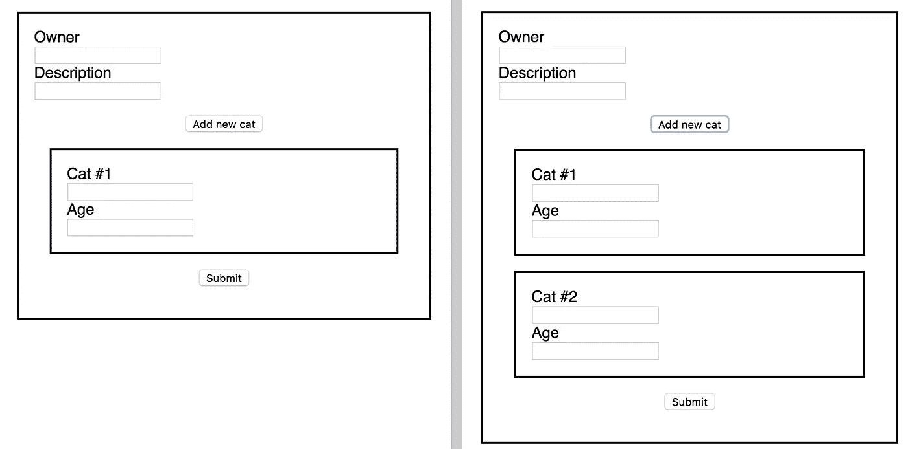

这是我们今天设计的最低限度

您可以和我一起编写代码，或者直接跳到最后查看完整的代码，并参考任何让您困惑的部分。

# 决定我们想要什么

规划对于 React 来说至关重要，如果在开始编码之前画出你想要的东西，它可以节省你很多时间。我们知道它将会是什么样子，但是它将如何被制造出来呢？我喜欢有一个小小的反应清单:

1.  我需要什么组件？
2.  他们中的哪一个会有状态？
3.  有我们需要处理的事件吗？

在这种情况下，我觉得应该有一个主表单组件，然后 CatInputs 组件，我们可以随时呈现这些组件。至于状态，我们的表单组件将需要它，因为我们将控制每个输入。但是我们的 CatInputs 组件不需要状态，因为我们可以将所有内容作为道具传入。

最后，有 3 个事件:我们需要处理提交的表单，我们需要处理每个输入的更改，我们需要处理添加新输入的按钮。

# 攻击顺序

一般来说，我喜欢先渲染我需要的任何东西，然后开始处理交互性。在这种情况下，我们将呈现静态基础表单，然后弄清楚如何呈现新的输入，最后我们将处理对它们的控制。出于本教程的考虑，我将在表单组件中构建所有内容，然后一旦一切正常，我将把适当的部分重构为一个 CatInputs 组件。

# 入门:渲染()

让我们首先构建表单的非交互部分:

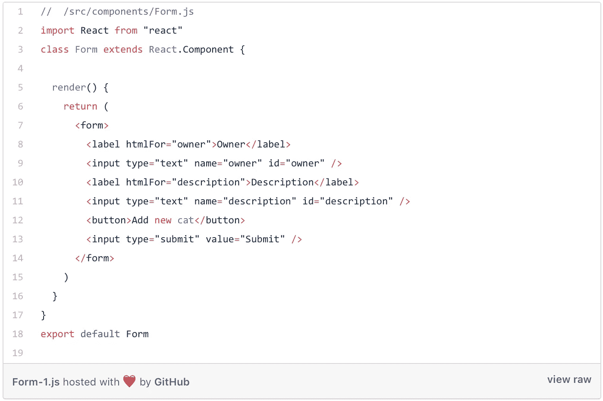

[https://gist . github . com/mostlyfocused Mike/34 ECB 9484 f 818 a 52 c 80 cf 064709078 ea](https://gist.github.com/MostlyFocusedMike/34ecb9484f818a52c80cf064709078ea)

如果你正在跟随，这基本上是我们做的(你的会看起来不同，我增加了一些样式):

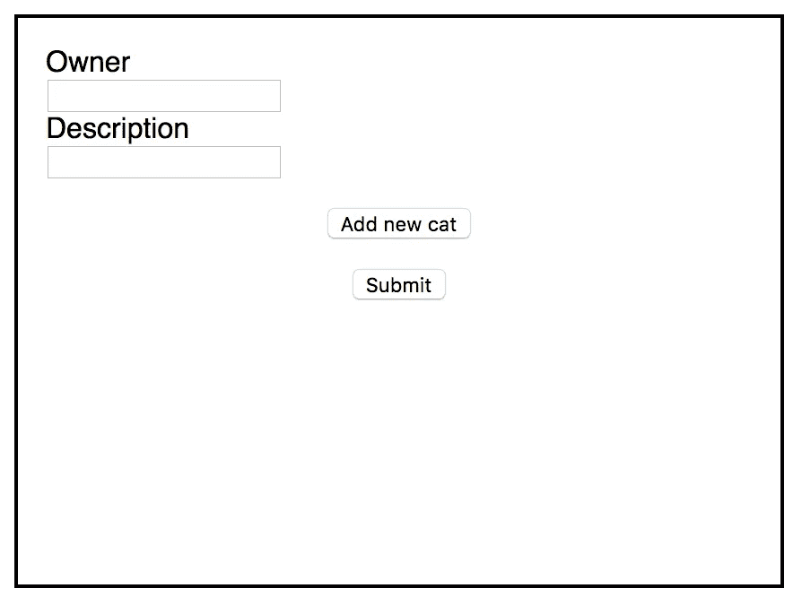

太美了。

# 将数组用于动态输入

在我们编码之前，我们应该谈谈我们将如何做这件事。基本上，我们的状态中会有一个 cat 对象数组。每个对象都有一个`name`和`age`值。我们的表单将遍历这个列表，并为`name`和`age`创建两个新的输入。当我们单击“添加新猫”按钮时，我们将向数组中添加一个新对象。因为这将改变我们的状态，它将触发重新渲染。然后，我们的表单将迭代这个*新的*猫列表，它将添加另一对输入。

首先，让我们只考虑将第一个空白的 cat 对象放入我们的状态，然后呈现它:

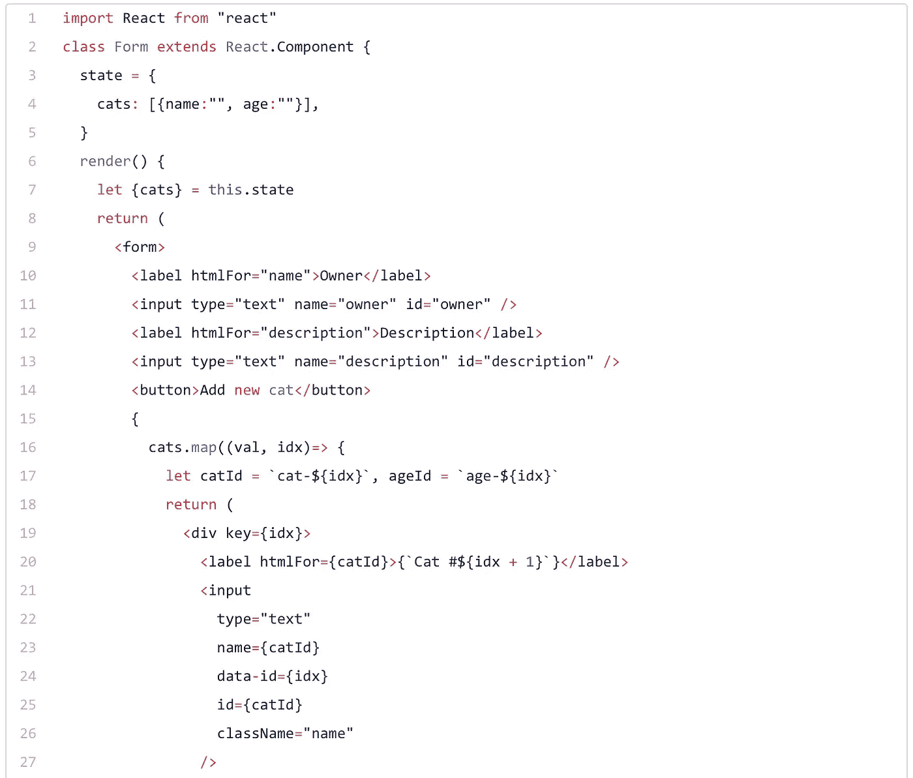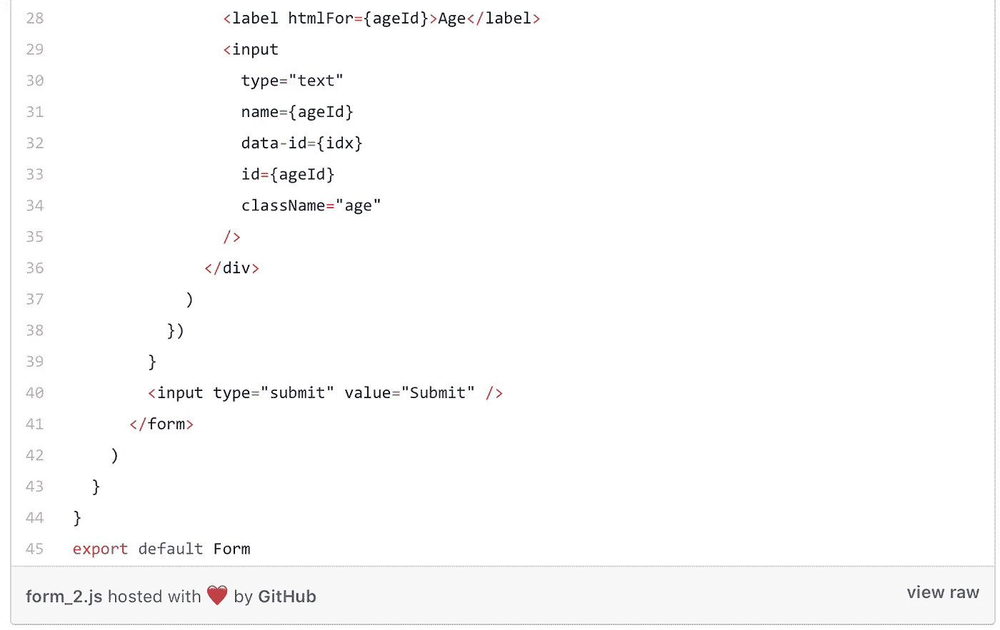

[https://gist . github . com/mostlyfocused Mike/115 e6f D8 e 02957 e 67 ab 3c 8288 e 506 c 95](https://gist.github.com/MostlyFocusedMike/115e6fd8e02957e67ab3c8288e506c95)

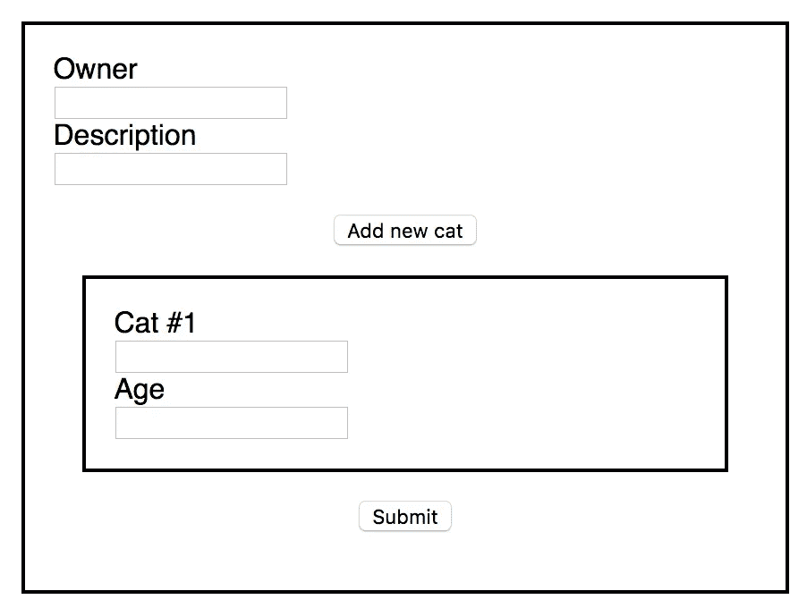

看起来不错，但实际上还没有动态

这是一个新的大块，但如果你分解它，它并不复杂。我正在映射我的猫数组(我已经对它进行了析构，[如果您不知道那是什么，请查看本文](/how-to-use-object-destructuring-in-modern-javascript-59758ebfb778))，并使用映射的索引值为每对输入分配唯一的 id、名称和标签(也为保存它们的每个 div 分配唯一的键，以便 React 不会给我们关于键的警告)。

你应该始终包括标签，以确保您的网站是可访问的和屏幕阅读器友好的。这个数据集对于以后控制我们的输入至关重要，因为它将输入与 cats 数组中对应的 cat 对象的索引相匹配。

# 添加输入

由于我们的表单正在创建两个新的输入，我们知道迭代方面正在工作。但是为了让它真正动态，我们必须能够让用户添加输入。React 的状态特性使这变得非常容易。我们只需要给我们的组件一个方法，向我们的数组添加一个新的空白猫。因为我们现在点击了表单中的一个按钮，我们还需要添加一个`handleSubmit`方法来阻止表单自动重新加载页面:


[https://gist . github . com/mostlyfocused Mike/f 581908 EB 28 e 8716 da 615 c 001426 b49 e](https://gist.github.com/MostlyFocusedMike/f581908eb28e8716da615c001426b49e)

所有的`addCat`做的就是用前一个状态的`cats`数组的扩展来设置状态，并在末尾标记一个新的空白`cat`对象。这将使我们的组件重新呈现，当它这样做时，表单将迭代数组的新长度，给我们另一对输入。

# 控制表单

现在我们已经有了动态输入，让我们实际控制它们。这是控制所有输入(静态和动态)和最终状态变化的方法:

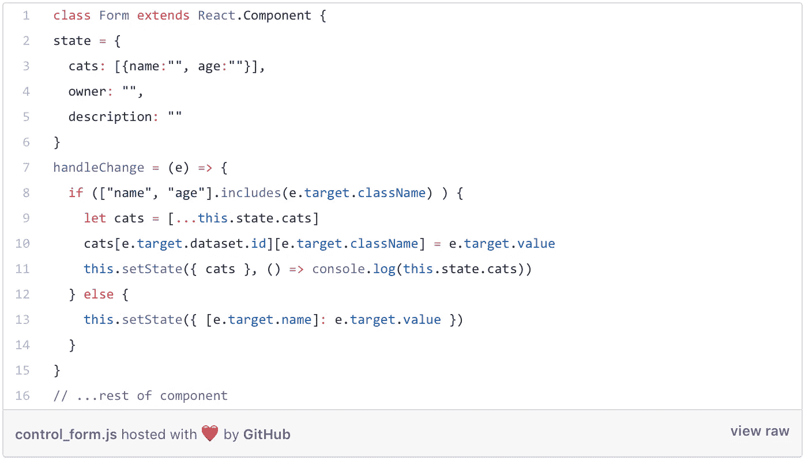

[https://gist . github . com/mostlyfocused Mike/cc5e 8241d 25830 D1 EEO c 6430 f 86968 cf](https://gist.github.com/MostlyFocusedMike/cc5e8241d25830d1ee0c6430f86968cf)

让我们先来看看`else`条件，因为它指的是我们的静态元素。我们使用传统的`e.target.value`来获取用户输入的值，没有什么令人震惊的。但是我们使用了`[]`,这样我们就可以使用每个输入的 name 属性动态匹配我们的状态。这些被称为[计算属性名](https://developer.mozilla.org/en-US/docs/Web/JavaScript/Reference/Operators/Object_initializer#Computed_property_names)，检查一下。所以我们的`owner`输入有一个名字`owner`，这意味着我们的`setState`翻译成`owner: whatever-was-typed`。

现在是精彩的部分；处理我们的动态输入。首先，我们检查事件的类是否匹配我们的动态输入。如果是，我们使用[扩展操作符](https://developer.mozilla.org/en-US/docs/Web/JavaScript/Reference/Operators/Spread_syntax)复制我们的`cats`对象数组。现在它变得*真实*花哨了。我们使用`e.target`的数据集将输入匹配到其对应的对象，然后我们使用`e.target`的类名获取 cat 对象的`name`或`age`值。因此，如果用户输入第一个猫名，它会翻译成:

```
**cats**[**e**.*target*.dataset.id][**e**.*target*.className] = **e**.*target*.value
// cats[0][name] = whatever-was-typed
```

我们只是使用括号来动态访问数组的元素和对象的属性。现在我们复制的列表已经发生了变化，以反映新的输入，我们使用`setState`保存对状态的更改，并触发表单的重新呈现。

这可能需要一点时间来适应，但是通过使我们的更改处理程序动态化，我们可以将它放在整个表单上，而不是每个输入上:

```
<form onSubmit={this.handleSubmit} onChange={this.handleChange} >
```

# 把所有的放在一起

这是我们在一个组件中完成的代码。它控制了所有的输入，为了证明这一点，它大写了所有的内容:

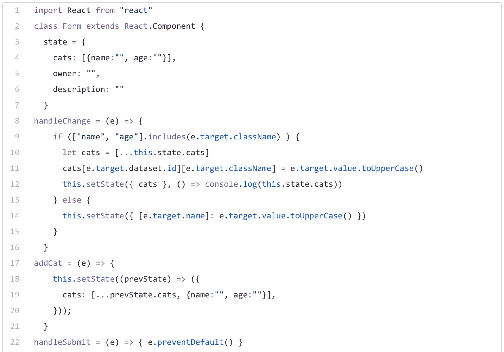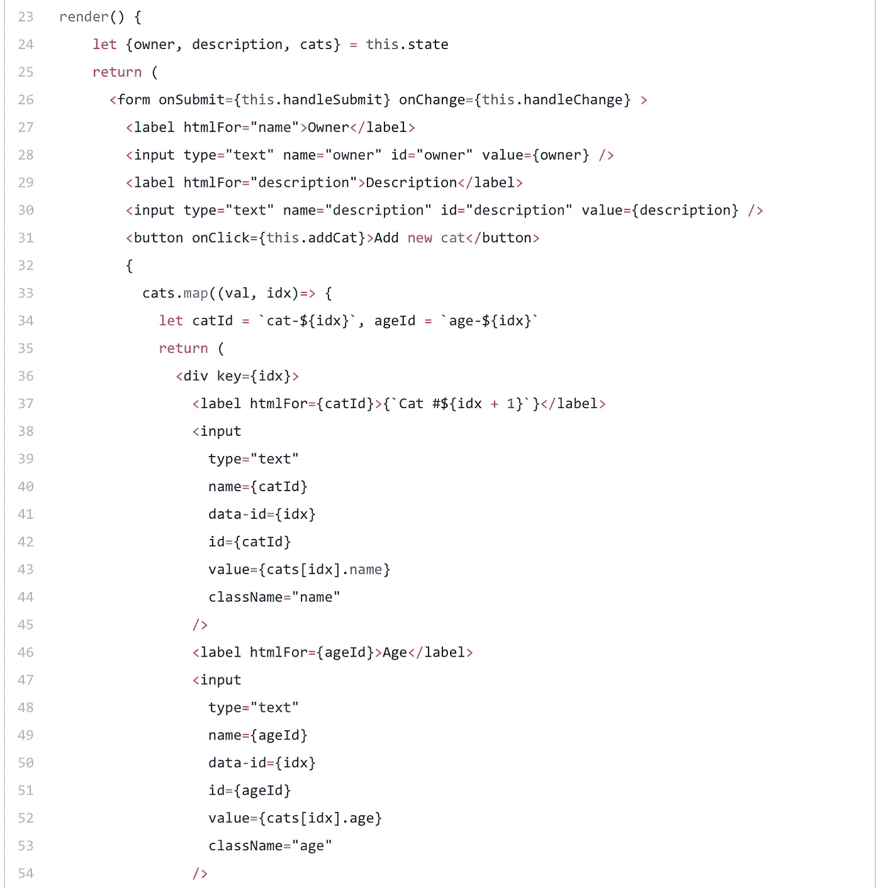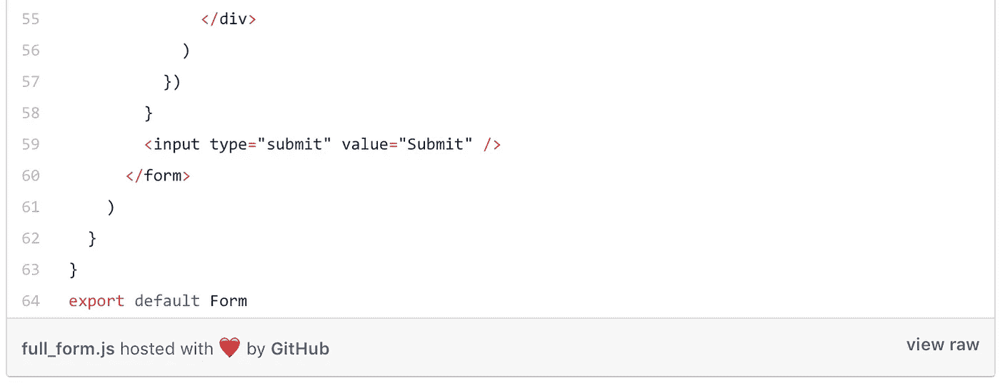

[https://gist . github . com/mostlyfocused Mike/17916 C5 c 04430 be 26 d5c 041 af 1930 bb 1](https://gist.github.com/MostlyFocusedMike/17916c5c04430be26d5c041af1930bb1)

我们现在有了一个完整的、动态的、受控的表单。但是，它有点长，所以让我们尝试将一些动态功能放入 CatInputs 组件:

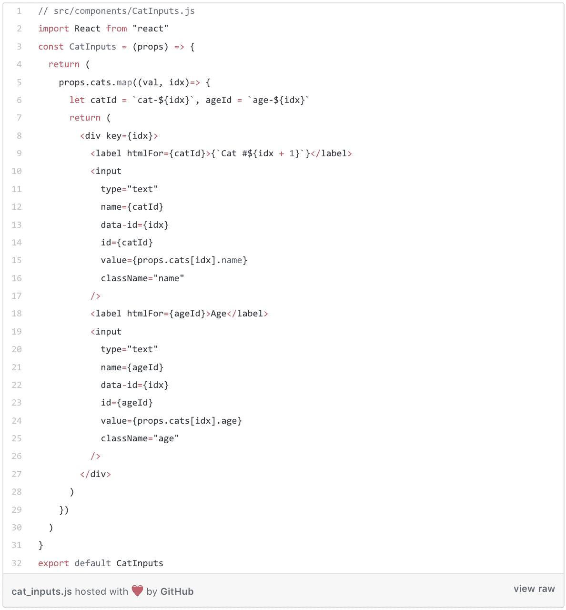

[https://gist . github . com/mostlyfocused Mike/e 57 f 9 F4 b 54d 306 da 704 f 4857 e 85 D2 B1 b](https://gist.github.com/MostlyFocusedMike/e57f9f4b54d306da704f4857e85d2b1b)

现在我们的表单看起来像这样:

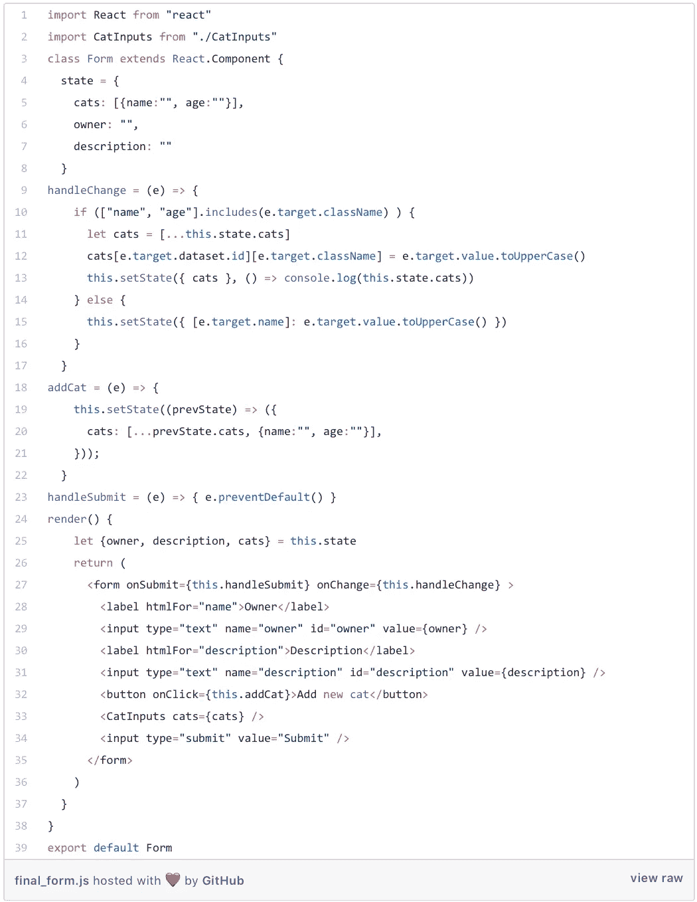

[https://gist . github . com/mostlyfocused Mike/3b 222d 34148 c 1535 BF 4594056 a0e 8719](https://gist.github.com/MostlyFocusedMike/3b222d34148c1535bf4594056a0e8719)

这当然是可选的，我个人喜欢一堆更小的文件，但是在一个小的 app 上，把它留为一个组件也没什么不好。

你有它！react 中制作动态表单的基本步骤。遵循这个基本模式作为你下一个项目的起点，一旦你理解了这个过程，试着找到一些可以简化的部分。

大家编码快乐，

麦克风

*最新文章:* [如何用 React 钩子构建一个动态的、可控的表单](https://medium.com/@mikecronin92/how-to-build-a-dynamic-controlled-form-with-react-hooks-2019-b39840f75c4f)