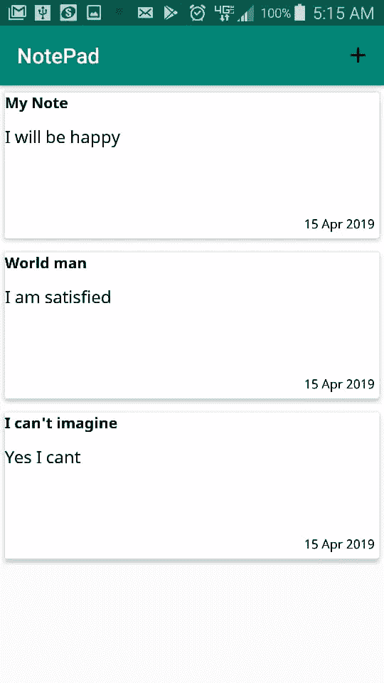
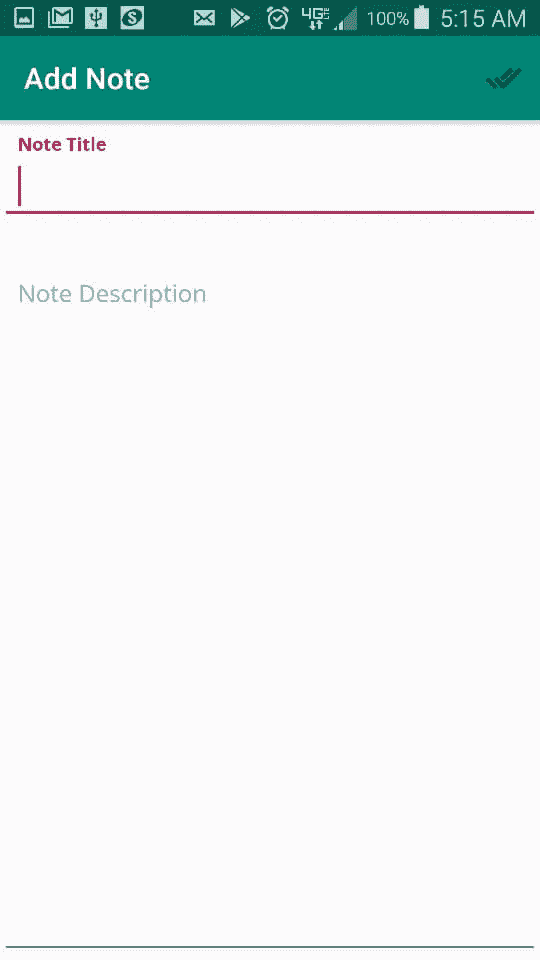
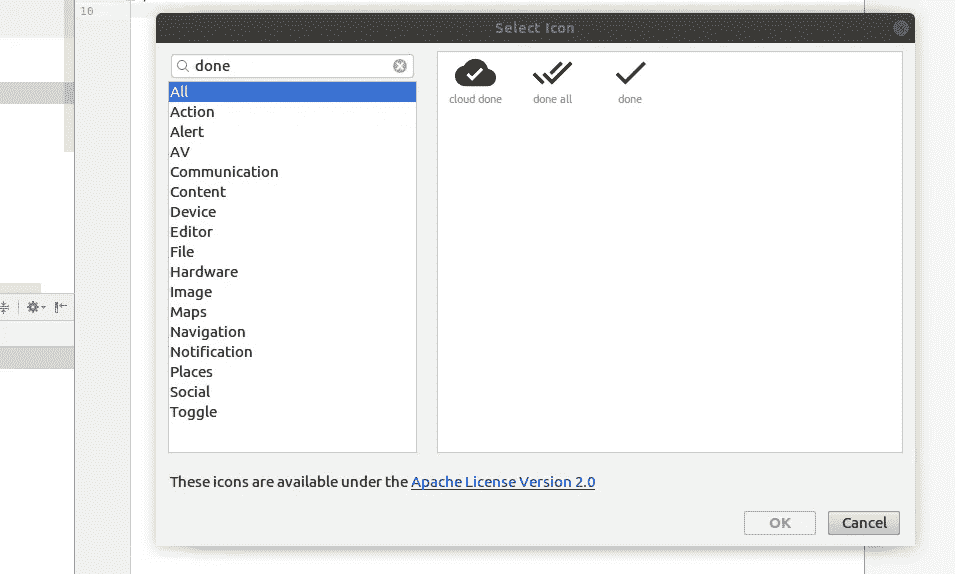

# 用 ObjectBox 和 Kotlin 构建一个实用的笔记应用程序

> 原文：<https://itnext.io/building-a-functional-note-taking-application-with-objectbox-and-kotlin-d6cc491f3965?source=collection_archive---------6----------------------->


马库斯·斯皮斯克在 [Unsplash](https://unsplash.com?utm_source=medium&utm_medium=referral) 上的照片

几乎任何你想要构建的应用都需要存储和检索数据，这甚至适用于你想要构建的最简单的应用。在 Android 上，存储数据的传统方式是使用 SQLite 数据库。由于 Android jetpack 的到来，包括架构组件和房间库，SQLite 操作已经变得更好了。几周前，我在研究一个名为 ObjectBox 的新数据库，正如他们网站上所描述的，ObjectBox 是一个用于物联网和移动设备的超高速数据库。它有 Java、Kotlin、Go、Swift 和 c 的绑定，我亲自操作过，理解和入门都很简单。

## 员额的目的

这篇文章的目的是让你知道如何使用这个叫做 ObjectBox 的很酷的数据库，以及如何使用它来构建一个全功能的应用程序。虽然这是一个简单的笔记应用程序，但是从中可以学到很多东西。说得够多了，下面是我们将构建的由两个屏幕组成的应用程序。



笔记应用程序的屏幕

每个便笺由标题、描述、标题和日期组成，默认为当前时间。

首先创建一个 Android Studio 应用程序并启用 Kotlin 支持。在 build.gradle 文件的 dependencies 部分添加 object box、recyclerview 和 cardview 依赖项

```
implementation **'com.android.support:recyclerview-v7:28.0.0'** implementation **"io.objectbox:objectbox-kotlin:2.3.4"** implementation **'com.android.support:cardview-v7:28.0.0'**
```

在文件的顶部，按以下顺序应用 kotlin-kapt 和 io.objectbox

```
apply **plugin**: **'kotlin-kapt'** apply **plugin**: **'io.objectbox'**
```

我们首先创建我们的实体类，在本例中称为 Note，它是一个 Kotlin 数据类

```
**import** io.objectbox.annotation.Entity
**import** io.objectbox.annotation.Id
**import** java.util.*

@Entity
**data class** Note(
    @Id **var id**:Long = 0,
    **var title**:String?,
    **var longDescription**:String?,
    **var updatedAt**:Date = Calendar.getInstance().*time* )
```

注意@Id 注释，它是一个长的。其他 Id 类型也是可能的，但现在让我们保持简单。

此时，您必须在 Android Studio 中点击 Build>Make Project 来生成必要的文件。将在 app/object box-models/default . JSON 中生成一个文件

我们准备好了。

上面的构建基于我们的实体生成了一个 MyObjectBox 类，并帮助我们为项目设置 BoxSore

接下来，创建一个名为 ObjectBox 的 kotlin Singleton

Boxstore 是数据库的接口，因此管理盒子。盒子持久化并查询实体。

接下来，创建一个 app 类并初始化 ObjectBox，不要忘记将 android: name 值作为 App 添加到您的清单文件中。

好，我们继续添加一个新的活动，名为 AddNoteActivity。相关的布局文件将由标题和描述两个文本字段组成。在这种情况下，我们使用通常由 TextInputLayout 包围 TextInputField 组成的材质文本字段。TextInputLayout 有助于浮动提示文本。下面是 xml 代码。

add_note_layoute.xml

这个概念是，当用户完成添加笔记标题和描述时，他们点击顶部的菜单图标(双勾)。

在 Android studio 中添加一个新的矢量资产，然后搜索 done。



完成图标

为了创建一个新的注释，我们在 AddnoteActivity.kt onCreate 方法中初始化一个 Note 类型的盒子。接下来，我们创建一个 addNote 方法，它使用我们的 noteBox 向数据库添加一个新的注释。

```
**private lateinit var notesBox**:Box<Note>
**override fun** onCreate(savedInstanceState: Bundle?) {
    **super**.onCreate(savedInstanceState)
    setContentView(R.layout.*add_notes_layout*)
    **notesBox** = ObjectBox.**boxStore**.boxFor(Note::**class**.*java*)
}
```

addNote 方法从 title 和 description 文本字段中获取文本，创建一个新的注释，并使用 notesBox 对象保存到 db 中。

注意，box 的 put 方法向数据库添加了一个新的注释。

你的 AddNoteActivity.kt 最后应该是这样的。

## 显示列表

我假设您应该能够创建一个 recycle view 适配器，并且能够在 recycle view 中显示项目。你可以查看我以前的帖子，点击监听器，它会告诉你如何使用一个 recycle view。也就是说，我们的主活动有一个 recyclerview 来显示我们的笔记列表。

创建一个在 onCreate 和 onResume 中调用的方法 update notes，该方法从 object box 中检索所有注释，并在 recyclerview 中显示它们。

但首先，这是我们的 note_list_item.xml

列表项是一个 Material CardView，包含一个相对布局，有三个 TextViews，分别用于标题、描述和日期。

和我们之前做的一样，我们在 MainActivity 中创建一个 note 类型的框，检索所有的 notes 并添加到我们的适配器中。

```
**private lateinit var notesBox**:Box<Note>
**override fun** onCreate(savedInstanceState: Bundle?) {
    **super**.onCreate(savedInstanceState)
    setContentView(R.layout.*add_notes_layout*)
    **notesBox** = ObjectBox.**boxStore**.boxFor(Note::**class**.*java*)
    updateNotes()**private fun** updateNotes() {
    **val** notes = **notesBox**.*all* **noteListAdapter**?.updateItems(notes)

}
```

就这样，我们完成了这里，我们有一个笔记应用程序。

## 摘要

创建新项目，

```
1\. Create a box,
2\. Call box put method passing your model class
```

若要从数据库中检索所有对象，请调用 box all 方法

请注意，这并不是您使用 object box 所能做的全部，因为它为您提供了像任何数据库一样的高级查询和表关系的机会。你可以查看他们的网站，你会了解更多。感谢您的阅读和快乐编码。