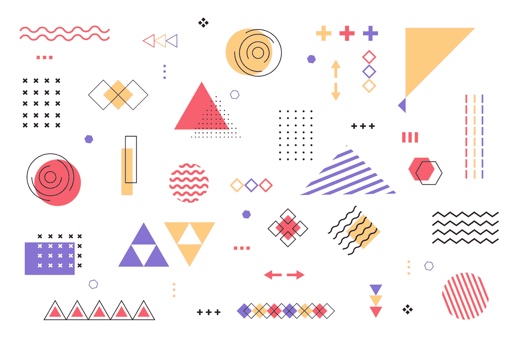
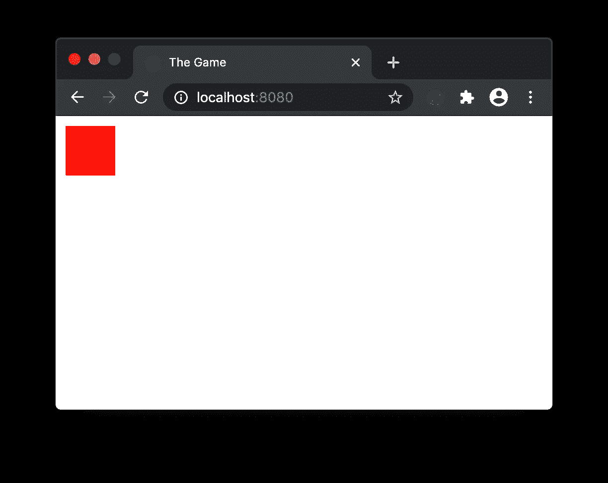
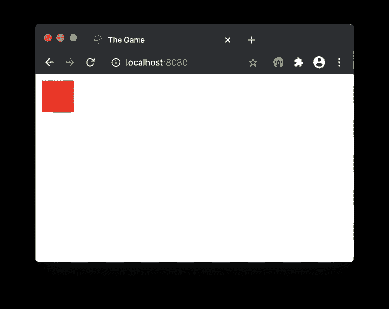
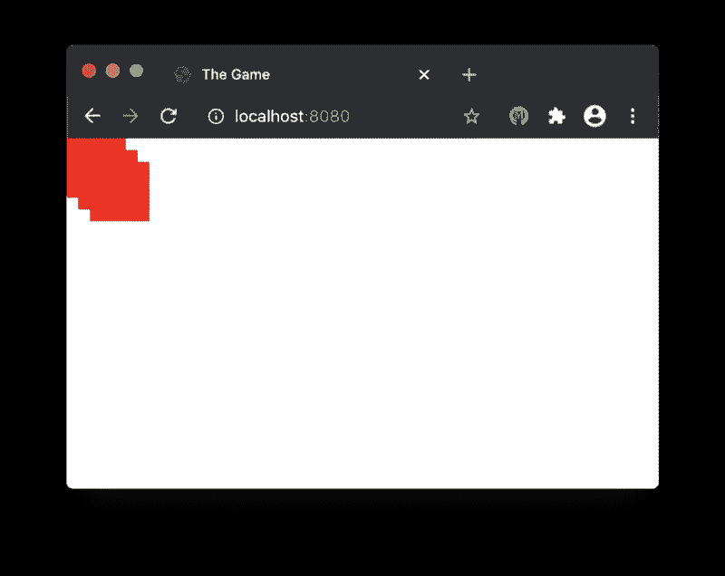
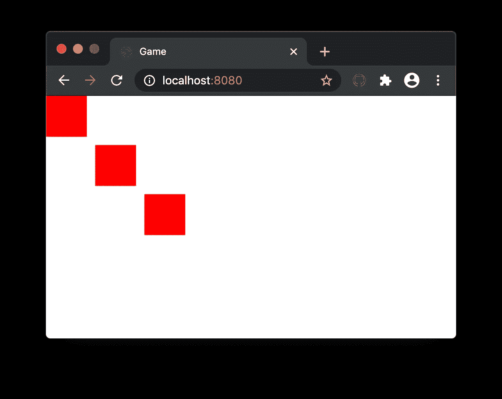
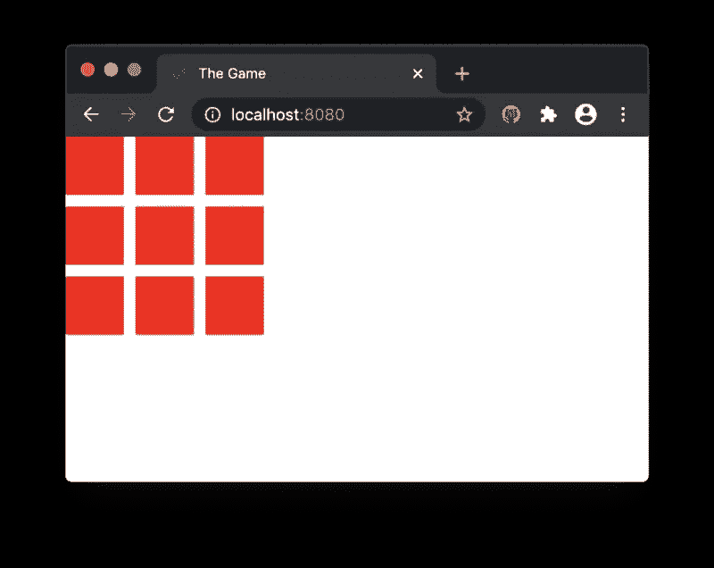
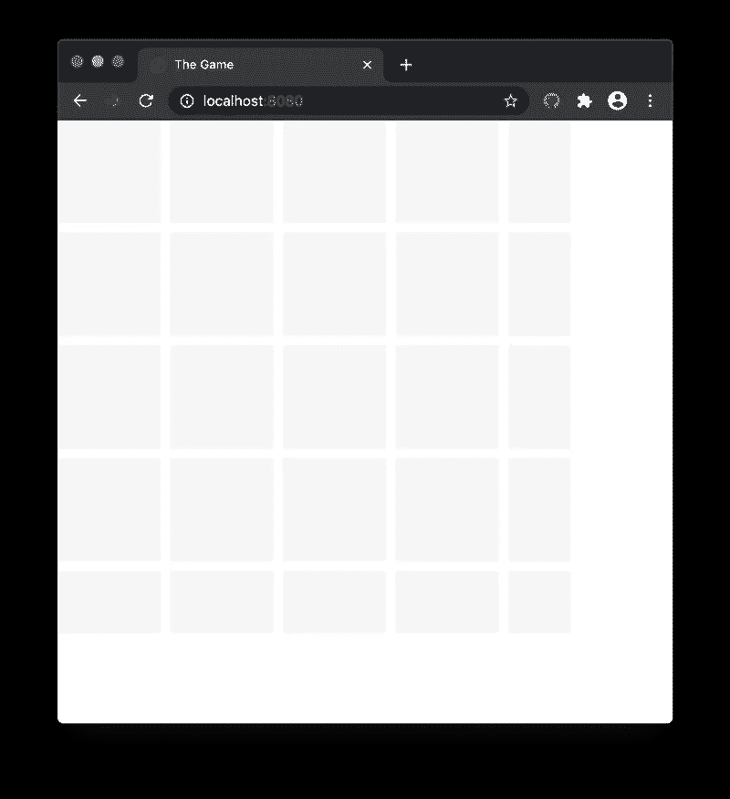
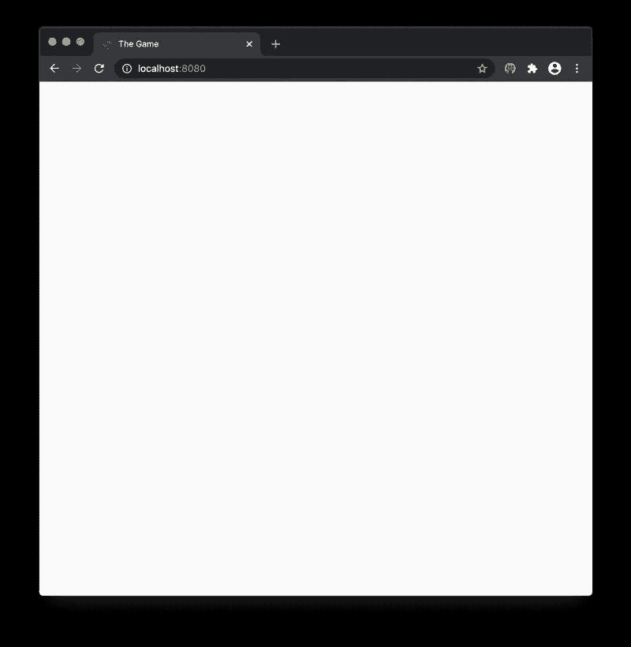
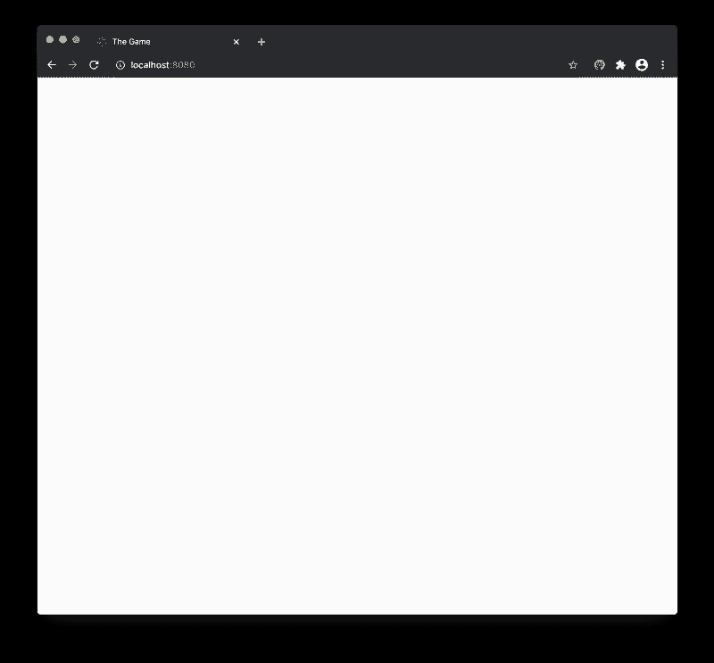

# 用 TypeScript 构建游戏。绘制网格 1/5

> 原文：<https://itnext.io/building-a-game-with-typescript-drawing-grid-1-5-aaf68797a0bb?source=collection_archive---------0----------------------->

教程[系列](https://medium.com/@gregsolo/gamedev-patterns-and-algorithms-in-action-with-typescript-d29b913858e)中的第三章讲述了如何用 TypeScript 和本地浏览器 API 从头开始构建游戏

【www.freepik.com】创建的背景向量

欢迎回来，读者！这是系列文章第三章的第一部分，我们将讨论如何用 TypeScript 和原生浏览器 API 构建一个简单的回合制游戏。其他章节可在此处获得:

*   [简介](https://medium.com/@gregsolo/gamedev-patterns-and-algorithms-in-action-with-typescript-d29b913858e)
*   [第一章实体组件系统](https://medium.com/@gregsolo/entity-component-system-in-action-with-typescript-f498ca82a08e)
*   第二章。游戏循环([第一部分](https://medium.com/@gregsolo/gamedev-patterns-and-algorithms-with-typescript-game-loop-part-1-2-699919bb9b71)，[第二部分](https://medium.com/@gregsolo/gamedev-patterns-and-algorithms-in-action-with-typescript-game-loop-2-2-c0d57a8e5ec2))
*   第三章。图纸网格(第 1 部分，[第 2 部分](https://medium.com/javascript-in-plain-english/building-a-game-with-typescript-drawing-grid-2-5-206555719490)，[第 3 部分](https://medium.com/@gregsolo/building-a-game-with-typescript-drawing-grid-3-5-1fb94211c4aa)，[第 4 部分](https://medium.com/@gregsolo/building-a-game-with-typescript-iii-drawing-grid-4-5-398af1dd638d)，[第 5 部分](https://medium.com/@gregsolo/building-a-game-with-typescript-drawing-grid-5-5-49454917b3af))
*   第四章。舰船([第一部分](https://medium.com/@gregsolo/building-a-game-with-typescript-colors-and-layers-337b0e4d71f)、[第二部分](https://medium.com/@gregsolo/building-a-game-with-typescript-team-and-fleet-f223d39e9248)、[第三部分](https://medium.com/@gregsolo/building-a-game-with-typescript-drawing-ship-14e6c19caa38)、[第四部分](https://gregsolo.medium.com/building-a-game-with-typescript-ship-and-locomotion-4f5969675993))
*   第五章输入系统([第一部分](https://gregsolo.medium.com/building-a-game-with-typescript-input-system-1-3-46d0b3dd7662)、[第二部分](https://gregsolo.medium.com/building-a-game-with-typescript-input-system-2-3-cd419e36027c)、[第三部分](https://gregsolo.medium.com/building-a-game-with-typescript-input-system-3-3-8492552579f1))
*   第六章。寻路和移动([部分 1](https://blog.gregsolo.me/articles/building-a-game-with-typescript-pathfinding-and-movement-17-introduction) 、[部分 2](https://blog.gregsolo.me/articles/building-a-game-with-typescript-pathfinding-and-movement-27-highlighting-locomotion-range) 、[部分 3](https://blog.gregsolo.me/articles/building-a-game-with-typescript-pathfinding-and-movement-37-graph-and-priority-queue) 、[部分 4](https://blog.gregsolo.me/articles/building-a-game-with-typescript-pathfinding-and-movement-47-pathfinder) 、[部分 5](https://blog.gregsolo.me/articles/building-a-game-with-typescript-pathfinding-and-movement-57-finding-the-path) 、[部分 6](https://blog.gregsolo.me/articles/building-a-game-with-typescript-pathfinding-and-movement-6-instant-locomotion) 、[部分 7](https://blog.gregsolo.me/articles/pathfinding-and-movement-7-animated-locomotion) )
*   第七章。玛奇纳州
*   第八章。攻击系统:生命和伤害
*   第九章。比赛的输赢
*   第十章敌人 AI

上次我们制作了一个游戏循环:这是一个有用的工具，不管玩家如何互动，它都可以帮助游戏继续运行。

这是我们希望实现的游戏演示

这一章是关于绘画的。我们的游戏是在这些灰色方块的“棋盘”或“格子”上进行的。我们必须想象它们，这样玩家就知道在哪里放置他们的“船”。

我们将使用浏览器的[画布 API](https://developer.mozilla.org/en-US/docs/Web/API/Canvas_API) 来绘制那些灰色方块。但这只是等式的一部分。我们必须让这些元素足够智能，这样玩家才能与它们互动。为了做到这一点，我们将使用我们在前面章节中获得的知识的全部力量:实体组件系统和游戏循环。

> 随意切换到[库](https://github.com/soloschenko-grigoriy/gamedev-patterns-ts)的`game-loop-2`分支。它包含了前几篇文章的工作成果，是这篇文章的一个很好的起点。

# 目录

1.  介绍
2.  我们怎么画？
3.  第一次“肮脏”抽签
4.  全局设置
5.  结论

# 我们怎么画？

[由 freepik 创建的背景矢量](https://www.freepik.com/free-photos-vectors/background)

有几种方法可以让我们在屏幕上画出任意的东西。使用 JavaScript 和浏览器的 API，您可能已经习惯了 DOM、CSS、div 和 spans 以及其他标签/元素。虽然这些是可以呈现非常复杂的视觉效果的强大工具，但我们的工具箱中还有另一个工具: **Canvas API** 。

当涉及到布局时，大多数前端应用程序遵循相同的基本方法。在大多数情况下，我们渲染的一切都可以归结为文本框和文本串。当然，它们可以用多种方式表示，并组合起来创建独特而不可思议的用户界面。

想象任何一个典型的网站。您可能会看到一个页眉、一个页脚、一个表格、大量的输入:文本框、复选框、单选按钮、长文本段落、短文字行等等。但所有这些变化都要归功于两个简单的元素:积木和绳子。

[由故事创建的符号向量](https://www.freepik.com/free-photos-vectors/sign)

有一个明显的例外:导入的资产:徽标、照片、自定义图像、用于不同目的的图片。您通常可以很快将它们与屏幕上的其他视觉效果区分开来。原因是他们视觉复杂性的独特性(我指的是好的方面)。

这些图像不仅仅是由方框和文本组成的。如果你仔细看，你会发现直线、圆、曲线、三角形、多边形。HTML/CSS 在历史上很难处理除块之外的形状(即使现在，有许多方法可以突破这些界限)。然而，即使在今天，由于任何外部应用程序，绘制复杂的图像并将其作为静态资产导入也要容易得多。

那么，为什么要用 Canvas API 呢？如果我们总是可以简单地在页面上添加一个静态图像，为什么它还是一个东西呢？这个问题包含了答案:图像应该是静态的。

有时，我们需要对图像进行编程控制。经典的例子是一部动画。考虑一下，当网站加载时，你必须缓慢渐进地渲染你公司的 logo。做好准备后，“烘焙”(我在这里有意抛出一个 gamedev 术语)图像是不够的。在每一帧，你必须渲染一个新的图像，这只是结果的一小部分。您还必须在这些分数之间进行转换。以编程方式绘制图片而不是使用静态资产可以处理这一点。Canvas 的存在正是为了帮助你进行编程绘图。天啊，我们在开发游戏的时候确实需要这种能力！

> 写这篇文章的时候，在 2D 有两种方式可以画画:Canvas API 和 SVG。最新的有许多吸引人的好处，但我们今天将重点放在画布上。原因是这通常是游戏中的一种方式。
> 
> *“Canvas vs . SVG”对于浏览器游戏来说，无疑是一个令人兴奋的话题，大概值得单独讨论。现在，请允许我站在画布上。*

[画布 API](https://developer.mozilla.org/en-US/docs/Web/API/Canvas_API) 的解剖超级简单，这里就不赘述了。外面有很多优秀的教程和例子。接下来，我假设您已经对 Canvas 的工作原理有了基本的了解。

# 第一次“肮脏”抽签

让我们从简单的开始。我将首先做“脏”画，这将使我们看到画布“在行动”。然后，我们将慢慢地重构和改进我们的代码，使它适合我们巨大的需求。

[brgfx 创建的子向量](https://www.freepik.com/free-photos-vectors/children)

我们可以把一个网格想象成一组“节点”，每个节点本质上是画布上的一个正方形。呈现它的最简单方法是遵循以下步骤:

1.  定义画布元素
2.  将其添加到页面中
3.  画一堆长方形

让我们在游戏实体中进行一轮肮脏的游戏:

如果您通过运行`npm start`来启动代码，并在浏览器中导航到`http://localhost:8080`，您应该会在浏览器的左上角看到一个红色的小方块:

> *端口可能不同，如果 8080 不工作，检查 webpack 控制台输出*

注意，正方形的大小是`50px`，它也从左上角移动了`10px`。这一切都是通过简单的画布命令完成的:`ctx.rect(10, 10, 50, 50)`

太棒了，我们有了第一个图像！这不是一张非常吸引人的照片，但是我们正在迈出第一步！

为了实现网格，我们重复几次 box draw 调用:

我首先为盒子的*大小*和它的*偏移量*(边距，如果你愿意的话)定义常数。我在一个循环中重复绘制，有效地呈现了三个矩形。但是在浏览器中，我们仍然只能看到一个方块:

这是因为我们一直在相同的*位置*渲染:从点`(10, 10)`开始。我们一遍又一遍地重画同样的形状。我们可以通过使起始位置成为迭代的函数来检验我们的理论:

这确实证明了我们的小理论:

但还是不太对。矩形的一部分绘制在另一部分之上。发生这种情况是因为“保证金”的数额不够。每次我们调用`ctx.rect`时，它的起始位置从*点零*开始计数，零点零就是左上角。但是每一个*新的*方块*开始于*前一个的地方*结束于*。我们应该增加每个新方块的起点坐标，使其成为前一个方块的右下角的坐标。然后加上偏移量:

这表现得很好:

> *注意，第一个矩形没有偏移量，因为它在乘以零* `*i*` *时丢失了。这很好，因为我们希望矩形之间的偏移量为*。**

为了画一个网格而不是这个漂亮的“梯子”，我们必须循环两次:第一次是垂直轴，第二次是水平轴:

节点的起始位置将由各自的`x`或`y`乘数决定:

这是我们劳动的成果:

厉害！现在，当我们有了基本的理解，我们就可以开始改进代码了。首先，我不喜欢硬编码值的想法:网格的大小、节点的大小、节点之间的偏移量等等。如果有外部配置就更好了。它将允许我们在不钻研代码的情况下改变值。这一点至关重要，因为许多游戏都是由非技术专业人士(游戏设计师和艺术家)共同开发的。拥有一个无需深入代码就能改变游戏行为的工具可以节省大量时间。

# 全局设置

[studio stock 创建的业务向量](https://www.freepik.com/free-photos-vectors/business)

想法很简单:我将定义一个全局不可变静态对象，它将保存所有可调整的值。我称之为`Settings`:

并为其定义一个桶文件:

现在，我将网格的所有设置放在这个对象中:

其中*维*保存网格的任意行/列中有多少节点的信息，*节点大小*是以像素为单位的节点宽度/高度，*节点偏移量*是以像素为单位的节点之间的边距，最后，*颜色*是节点的填充颜色:

我们有了结果:

有些不对劲。前四行和前四列渲染正常，但第五行被裁剪，甚至没有看到第六个！这是因为我们的画布太小，无法处理那么多节点:

让我们根据设置来计算这些值，而不是硬编码这些值。注意，Canvas API 需要一个字符串，而不是一个数字:

现在我们在画布上有了足够的空间:

在我们结束这个故事之前有一个小小的改进。您可能会注意到网格贴在屏幕的左侧。这很公平，因为画布是从左上角开始绘画的。但是在屏幕中间看到网格会稍微好一点。

我们可以通过移动第一行和第一列节点来实现。然而，更简单的方法是假设我们总是从*画布*的左上角开始绘制，并简单地移动画布*本身*:

这里我们使用好的旧 CSS 将`canvas` DOM 元素放在页面的中间。我们对节点的计算仍然有效，因为我们总是从画布的左上角开始绘制所有内容:

请注意这个简单但强大的概念:全球与本地职位。我们将节点放置在画布*局部*坐标系中，该坐标系相对于画布元素*移动画布会改变节点的*全局*位置，但不会改变*局部*位置。*

> *注意，这个项目中的 webpack devServer/hotReload 设置忽略了* `*public*` *文件夹中的更改。要查看更新的 CSS，您必须手动重新加载页面。*
> 
> *你可以在* [*资源库*](https://github.com/soloschenko-grigoriy/gamedev-patterns-ts) *的* `*drawing-grid-1*` *分支中找到本帖的完整源代码。*

# 结论

厉害！我们已经在屏幕上画出了我们的整个网格，并使它看起来很好。我们还让它可以通过全局设置进行调整，与代码无关。在 [*第二部分*](https://medium.com/javascript-in-plain-english/building-a-game-with-typescript-drawing-grid-2-5-206555719490) 中，我们将修改这段代码，使其更加健壮和可扩展。

如果您有任何意见、建议、问题或任何其他反馈，请不要犹豫，给我发私信或在下面留下评论！感谢您的阅读，我们下次再见！

*这是系列教程第三章“* ***用打字稿*** *”构建游戏。其他章节可点击此处:*

*   [简介](https://medium.com/@gregsolo/gamedev-patterns-and-algorithms-in-action-with-typescript-d29b913858e)
*   [第一章实体组件系统](https://medium.com/@gregsolo/entity-component-system-in-action-with-typescript-f498ca82a08e)
*   第二章。游戏循环([第一部分](https://medium.com/@gregsolo/gamedev-patterns-and-algorithms-with-typescript-game-loop-part-1-2-699919bb9b71)，[第二部分](https://medium.com/@gregsolo/gamedev-patterns-and-algorithms-in-action-with-typescript-game-loop-2-2-c0d57a8e5ec2))
*   第三章。绘制网格(第 1 部分，[第 2 部分](https://medium.com/javascript-in-plain-english/building-a-game-with-typescript-drawing-grid-2-5-206555719490)，[第 3 部分](https://medium.com/@gregsolo/building-a-game-with-typescript-drawing-grid-3-5-1fb94211c4aa)，[第 4 部分](https://medium.com/@gregsolo/building-a-game-with-typescript-iii-drawing-grid-4-5-398af1dd638d)，[第 5 部分](https://medium.com/@gregsolo/building-a-game-with-typescript-drawing-grid-5-5-49454917b3af))
*   第四章。舰船([第一部分](https://medium.com/@gregsolo/building-a-game-with-typescript-colors-and-layers-337b0e4d71f)、[第二部分](https://medium.com/@gregsolo/building-a-game-with-typescript-team-and-fleet-f223d39e9248)、[第三部分](https://medium.com/@gregsolo/building-a-game-with-typescript-drawing-ship-14e6c19caa38)、[第四部分](https://gregsolo.medium.com/building-a-game-with-typescript-ship-and-locomotion-4f5969675993))
*   第五章输入系统([第一部分](https://gregsolo.medium.com/building-a-game-with-typescript-input-system-1-3-46d0b3dd7662)、[第二部分](https://gregsolo.medium.com/building-a-game-with-typescript-input-system-2-3-cd419e36027c)、[第三部分](https://gregsolo.medium.com/building-a-game-with-typescript-input-system-3-3-8492552579f1))
*   第六章。寻路与移动([第一部分](https://blog.gregsolo.me/articles/building-a-game-with-typescript-pathfinding-and-movement-17-introduction)、[第二部分](https://blog.gregsolo.me/articles/building-a-game-with-typescript-pathfinding-and-movement-27-highlighting-locomotion-range)、[第三部分](https://blog.gregsolo.me/articles/building-a-game-with-typescript-pathfinding-and-movement-37-graph-and-priority-queue)、[第四部分](https://blog.gregsolo.me/articles/building-a-game-with-typescript-pathfinding-and-movement-47-pathfinder)、[第五部分](https://blog.gregsolo.me/articles/building-a-game-with-typescript-pathfinding-and-movement-57-finding-the-path)、[第六部分](https://blog.gregsolo.me/articles/building-a-game-with-typescript-pathfinding-and-movement-6-instant-locomotion)、[第七部分](https://blog.gregsolo.me/articles/pathfinding-and-movement-7-animated-locomotion))
*   第七章。玛奇纳州
*   第八章。攻击系统:生命和伤害
*   第九章。比赛的输赢
*   第十章敌人 AI