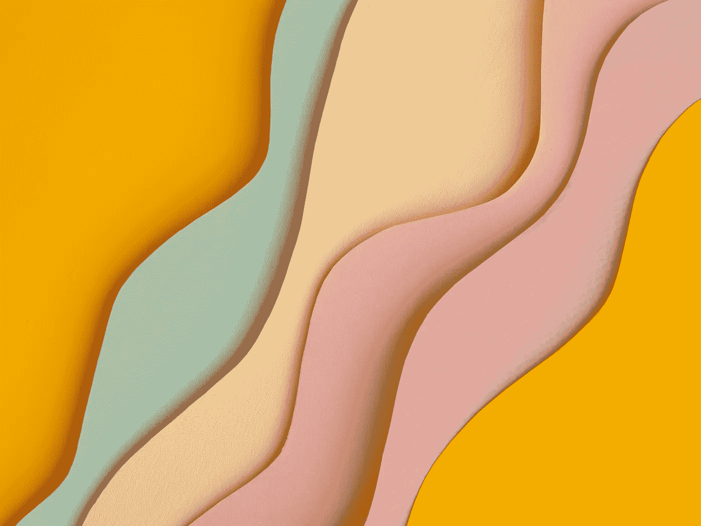
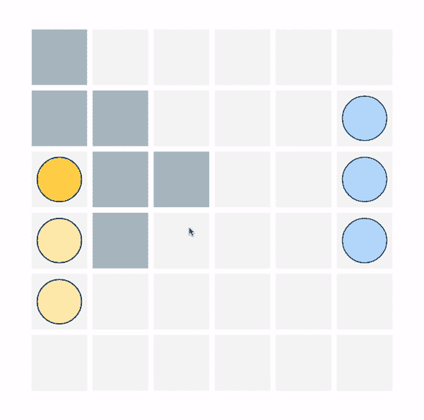
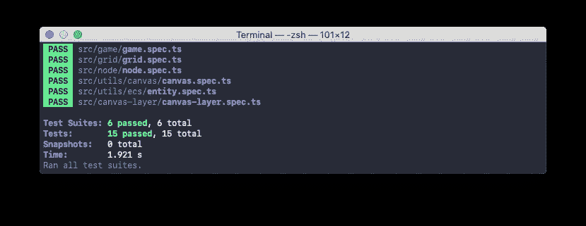
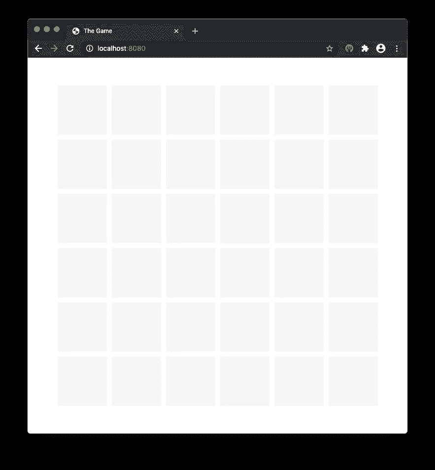
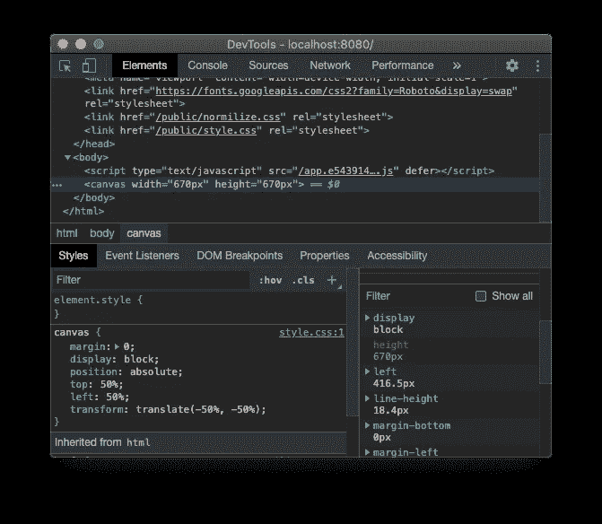
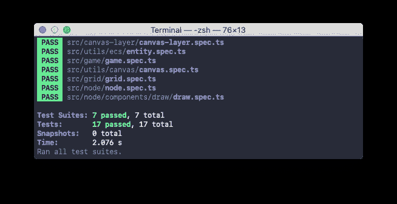

# 用 TypeScript 构建游戏。绘制网格 5/5

> 原文：<https://itnext.io/building-a-game-with-typescript-drawing-grid-5-5-49454917b3af?source=collection_archive---------0----------------------->

教程[系列](https://medium.com/@gregsolo/gamedev-patterns-and-algorithms-in-action-with-typescript-d29b913858e)的第三章讲述了如何用 TypeScript 和原生浏览器 API 从头开始构建游戏

[free pik 创建的人员向量](https://www.freepik.com/free-photos-vectors/people)

欢迎来到第三章的最后部分“画格子”！前一篇文章是关于实现和测试一个简单而强大的渲染系统*。在这一章的最后一篇文章中，我们将整理所有的细节。*

拥有渲染系统固然很棒，但是`NodeDrawComponent`如何访问呢？我们必须将`Canvas`的实例传递给`Node`吗？如果是这样，那么我们就有了和以前一样的问题:我们将`Node`和一个绘图上下文联系起来。唯一的区别是我们必须传递对`Canvas`的引用，而不是本地上下文，这并没有减少问题。有些不对劲。

在第三章“绘制网格”中，我们正在实现回合制游戏的一个基础部分:我们正在绘制节点网格。其他章节可在此处获得:

*   [简介](/@gregsolo/gamedev-patterns-and-algorithms-in-action-with-typescript-d29b913858e)
*   [第一章实体组件系统](/@gregsolo/entity-component-system-in-action-with-typescript-f498ca82a08e)
*   第二章。游戏循环([第一部分](/@gregsolo/gamedev-patterns-and-algorithms-with-typescript-game-loop-part-1-2-699919bb9b71)，[第二部分](/@gregsolo/gamedev-patterns-and-algorithms-in-action-with-typescript-game-loop-2-2-c0d57a8e5ec2))
*   第三章。绘制网格([第一部分](/@gregsolo/building-a-game-with-typescript-drawing-grid-1-5-aaf68797a0bb)、[第二部分](/javascript-in-plain-english/building-a-game-with-typescript-drawing-grid-2-5-206555719490)、[第三部分](https://medium.com/@gregsolo/building-a-game-with-typescript-drawing-grid-3-5-1fb94211c4aa)、[第四部分](https://medium.com/@gregsolo/building-a-game-with-typescript-iii-drawing-grid-4-5-398af1dd638d)、第五部分)
*   第四章。舰船([第一部分](https://medium.com/@gregsolo/building-a-game-with-typescript-colors-and-layers-337b0e4d71f)、[第二部分](https://medium.com/@gregsolo/building-a-game-with-typescript-team-and-fleet-f223d39e9248)、[第三部分](https://medium.com/@gregsolo/building-a-game-with-typescript-drawing-ship-14e6c19caa38)、[第四部分](https://gregsolo.medium.com/building-a-game-with-typescript-ship-and-locomotion-4f5969675993))
*   第五章输入系统([第一部分](https://gregsolo.medium.com/building-a-game-with-typescript-input-system-1-3-46d0b3dd7662)、[第二部分](https://gregsolo.medium.com/building-a-game-with-typescript-input-system-2-3-cd419e36027c)、[第三部分](https://gregsolo.medium.com/building-a-game-with-typescript-input-system-3-3-8492552579f1))
*   第六章。寻路和移动([第一部分](https://blog.gregsolo.me/articles/building-a-game-with-typescript-pathfinding-and-movement-17-introduction)、[第二部分](https://blog.gregsolo.me/articles/building-a-game-with-typescript-pathfinding-and-movement-27-highlighting-locomotion-range)、[第三部分](https://blog.gregsolo.me/articles/building-a-game-with-typescript-pathfinding-and-movement-37-graph-and-priority-queue)、[第四部分](https://blog.gregsolo.me/articles/building-a-game-with-typescript-pathfinding-and-movement-47-pathfinder)、[第五部分](https://blog.gregsolo.me/articles/building-a-game-with-typescript-pathfinding-and-movement-57-finding-the-path)、[第六部分](https://blog.gregsolo.me/articles/building-a-game-with-typescript-pathfinding-and-movement-6-instant-locomotion)、[第七部分](https://blog.gregsolo.me/articles/pathfinding-and-movement-7-animated-locomotion))
*   第七章。玛奇纳州
*   第八章。攻击系统:生命和伤害
*   第九章。比赛的输赢
*   第十章敌人 AI

> 随意切换到[库](https://github.com/soloschenko-grigoriy/gamedev-patterns-ts)的`drawing-grid-4`分支。它包含了前几篇文章的工作成果，是这篇文章的一个很好的起点。

# 目录

1.  介绍
2.  画布层
3.  测试 CanvasLayer
4.  用图层绘图
5.  重新绘制
6.  结论

# 画布层

[free pik 制作的背景照片](https://www.freepik.com/free-photos-vectors/background)

还有一个问题我们必须回答。我们同意在同一块画布上绘制所有节点。但是其他元素呢，比如船？看看这张 gif:

这是我们希望实现的游戏演示

这是我们试图实现的游戏。这些圈是“船”，我们将在下一章谈到它们。但现在，我们应该记住，这些“船”必须在网格的顶部。一直都是。

为了解决这个问题，我们可以引入画布的**层的概念，类似于你在 Gimp 等图像编辑器中看到的层系统。有了层，我们可以把一块画布放在另一块之上。例如，我们可以将`Grid`和任何装饰品放在一个层上，即“底部”(“背景”)层。然后将船只放在另一个“顶部”(“前景”)层。这种方法可以保证船只总是被绘制在网格的顶部。**

> *此时此刻，原生 Canvas API 还没有简单的方法来管理“层”。当然还有* `*globalCompositeOperation*` *，但顾名思义，那是一个***的全局设置。使用它有太多的限制。为了给自己留有回旋的余地，我们将定义我们的分层系统。**

*我从定义`CanvasLayer`类开始。它将管理对我们决定添加到游戏中的每一层的访问:*

*让我们不要忘记桶文件:*

*这个类将确保游戏总是只有一个特定类型的画布。虽然`Canvas`和`CanvasLayer`都不是**单例**，但是静态`CanvasLayer`确保`Canvas`只被实例化:*

*首先，我为*背景* `Canvas`定义了一个静态字段和一个标准的公共 getter，但有一点需要注意。这个 getter 首先检查字段是否为空。如果是，说明后台 canvas 还没有实例化，getter 要先构造。*

*我们将只在静态上下文中使用`CanvasLayer`，所以我将`constructor`设为私有，以防止任何人意外实例化。*

# *测试 CanvasLayer*

**

*[freepik 创建的背景矢量](https://www.freepik.com/free-photos-vectors/background)*

*在我们继续之前，让我们花点时间来介绍一下测试`CanvasLayer`。*

*我们应该验证`Background`总是相同的，不管我们访问它多少次:*

*我从导入和嘲讽`Canvas`开始。我还确保它以前从未被调用过:*

*然后我几次请求`Background`层，并检查`Canvas`被实例化了多少次:*

*太好了！此时，您的代码应该可以通过`npm start,`成功编译，并且所有的测试应该可以通过`npm t`:*

**

# *用图层绘图*

**

*[由宏矢量创建的水彩矢量](https://www.freepik.com/free-photos-vectors/watercolor)*

*现在，最后，我们可以清理`NodeDrawComponent`并利用我们的真棒层系统:*

*您的代码应该用`npm start`编译并呈现:*

**

*此外，如果您检查开发工具，您现在应该只看到一个画布:*

**

*太好了，这正是我们想要的！然而，还有一件事要讲。此时，我们只画一次节点:当`NodeDrawComponent`醒来时。这很有效，而且非常高效，但不幸的是，不是很灵活。*

*很容易掉入陷阱，并假设网格是静态的，并且一生只绘制一次。毕竟只是游戏的一个*背景*对吧？嗯，是也不是。*

*就*在屏幕上定位*而言，它确实是一个背景。但这并不意味着它是静态的*。我们要*与这一层*进行交互；点击这个节点应该是信号；玩家的船要移动到这个节点；**

****

**这是我们希望实现的游戏演示**

**这就是为什么我们要创建`Grid`和`Node`实体，而不是简单地在画布上绘制它们。但是如果你仔细看看上面的 gif，你可能会注意到其他有趣的事情。`Node`的颜色应该能够改变，以帮助玩家了解他们*可以*点击的位置。**

**如何才能实现这种行为？浏览器画布的工作方式是，在绘制形状后，您将失去对它的所有控制。没有参考*颜色*属性什么的。要改变一个矩形的颜色，`NodeDrawComponent`必须*重绘*:清理并重新绘制，但使用新的颜色。**

# **重新绘制**

****

**[rawpixel.com 创建的图标向量](https://www.freepik.com/free-photos-vectors/icon)**

**有几种方法可以做到这一点。其中之一是利用`Update`方法。如果你回忆一下，每个`Component`都有`Update`，这个`Component`属于`Entity`所调用的一个方法。**

**`NodeDrawComponent`也不例外，有它自己的`Update`方法，我们暂时空着:**

**我们将在每一次`Update`醒来时绘制，而不是在一次`NodeDrawComponent`醒来时绘制。这样我们就可以确定，如果有什么变化，`Node`会有最相关的表示。**

**为此，我们可以将`Draw`方法调用从`Awake`移到`Update`:**

**当然，我们应该首先清理各自的区域。幸运的是，我们已经在我们的小渲染引擎中准备了适当的 API，即`ClearRect`方法:**

**首先，我们设置一个私有的`Clear`方法。它的职责是清理在画布特定区域上绘制的任何东西，准确地说就是我们曾经绘制矩形的地方。然后，在每一帧上，我们清理并重新绘制。**

> ***“我们再画一遍* ***每一个*** *帧？？？这算表演吗？!"，你可能会问。我们确实可以实现一些智能系统来检查是否有任何变化。并且，如果是，则仅触发重绘。当然，这将更具表演性。***
> 
> **但是，正如你可能已经注意到的，我在本教程中一直使用增量方法。我们从简单开始，逐渐增加复杂性。目前的解决方案对我们来说已经足够好了:节点的数量是有限的，而且每个节点的绘图都很便宜。我们的架构允许我们在将来遇到性能瓶颈时重新审视和改进。**

**同样，您的代码应该通过`npm start`成功编译，并且所有测试应该通过`npm t`:**

****

**在我们告别这一章之前，让我们在这个美丽的蛋糕上加一颗樱桃。让我们用一些测试来覆盖`NodeDrawComponent`！**

# **测试 NodeDrawComponent**

****

**[freepik 创建的学校向量](https://www.freepik.com/free-photos-vectors/school)**

**初始设置看起来应该很熟悉:**

**然而，我们会有很多其他的`Node`组件。对于其中的每一个，我们都必须进行相同的设置。让我们节省一些时间和精力，为`Node`创建一个**模拟工厂**，我们可以反复使用它。**

**模拟工厂只是一个用指定的参数为我们构建一个`Node`的函数:**

**为了稍微方便一点，我们可以设置一个默认参数:**

**不要忘记更新桶文件:**

**现在，回到`NodeDrawComponent`测试中，我将使用模拟工厂，而不是直接调用 Node 的构造函数:**

**不错！剩下的就是检查`NodeDrawComponent`是否执行了`CanvasLayer`的正确方法。例如，一旦`NodeDrawComponent`醒来，它应该清理画布:**

**类似地，`NodeDrawComponent`应该在每次更新时清理和重绘:**

**同样，您的代码应该可以用`npm start`成功编译，所有的测试应该可以用`npm t`通过:**

****

> **你可以在[库](https://github.com/soloschenko-grigoriy/gamedev-patterns-ts)的`drawing-grid-5`分支中找到这篇文章的完整源代码。**

# **结论**

**厉害！第三章“绘制网格”到此结束。我们在这一章的最后部分完成了很多！我们讨论了游戏中画布的`layers`概念，并设置了`Background`层的提供者。我们在`NodeDrawComponent,`中使用了它，它现在不断地重画每一帧的`Node`，准备对任何变化做出反应。**

**这一章致力于绘制`Grid`:我们游戏的基础部分。让我们停下来，欣赏一下我们走过的路。**

**我们开始了第一个不确定的步骤，直接用浏览器的 canvas API 绘制网格。然后我们通过定义`Grid`和`Node`实体建立了游戏的结构层次。我们发现将绘图逻辑作为`Node` : `NodeDrawComponent`的特定组件是合理的。多亏了`Vector2d`结构，我们可以轻松传递元组数据，比如坐标和大小。最后，我们创建了一个小的渲染引擎和图层系统。这的确是一次漫长的旅行，但我希望你能安排好！**

**下次我们开始新的篇章。我们将看看核心的*游戏机制*并引入更多的实体和组件。我迫不及待地想在那里见到你！**

**如果你有任何**的评论**、**的建议**、**的问题**，或者任何其他**的反馈**，不要犹豫给我发私信**留言**或者在下面留下**评论**！如果你喜欢这个系列，**请与他人分享**。它真的帮助我继续努力。感谢您的阅读，我们下次再见！**

**这是“使用 TypeScript 的 Gamedev 模式和算法”系列教程的第三章。其他章节可在这里:**

*   **[简介](/@gregsolo/gamedev-patterns-and-algorithms-in-action-with-typescript-d29b913858e)**
*   **[第一章实体组件系统](/@gregsolo/entity-component-system-in-action-with-typescript-f498ca82a08e)**
*   **第二章。游戏循环([第一部分](/@gregsolo/gamedev-patterns-and-algorithms-with-typescript-game-loop-part-1-2-699919bb9b71)，[第二部分](/@gregsolo/gamedev-patterns-and-algorithms-in-action-with-typescript-game-loop-2-2-c0d57a8e5ec2))**
*   **第三章。绘制网格([第 1 部分](/@gregsolo/building-a-game-with-typescript-drawing-grid-1-5-aaf68797a0bb)、[第 2 部分](/javascript-in-plain-english/building-a-game-with-typescript-drawing-grid-2-5-206555719490)、[第 3 部分](https://medium.com/@gregsolo/building-a-game-with-typescript-drawing-grid-3-5-1fb94211c4aa)、[第 4 部分](https://medium.com/@gregsolo/building-a-game-with-typescript-iii-drawing-grid-4-5-398af1dd638d)，第 5 部分)**
*   **第四章。舰船([第一部分](https://medium.com/@gregsolo/building-a-game-with-typescript-colors-and-layers-337b0e4d71f)、[第二部分](https://medium.com/@gregsolo/building-a-game-with-typescript-team-and-fleet-f223d39e9248)、[第三部分](https://medium.com/@gregsolo/building-a-game-with-typescript-drawing-ship-14e6c19caa38)、[第四部分](https://gregsolo.medium.com/building-a-game-with-typescript-ship-and-locomotion-4f5969675993))**
*   **第五章输入系统([第一部分](https://gregsolo.medium.com/building-a-game-with-typescript-input-system-1-3-46d0b3dd7662)、[第二部分](https://gregsolo.medium.com/building-a-game-with-typescript-input-system-2-3-cd419e36027c)、[第三部分](https://gregsolo.medium.com/building-a-game-with-typescript-input-system-3-3-8492552579f1))**
*   **第六章。寻路和移动([部分 1](https://blog.gregsolo.me/articles/building-a-game-with-typescript-pathfinding-and-movement-17-introduction) 、[部分 2](https://blog.gregsolo.me/articles/building-a-game-with-typescript-pathfinding-and-movement-27-highlighting-locomotion-range) 、[部分 3](https://blog.gregsolo.me/articles/building-a-game-with-typescript-pathfinding-and-movement-37-graph-and-priority-queue) 、[部分 4](https://blog.gregsolo.me/articles/building-a-game-with-typescript-pathfinding-and-movement-47-pathfinder) 、[部分 5](https://blog.gregsolo.me/articles/building-a-game-with-typescript-pathfinding-and-movement-57-finding-the-path) 、[部分 6](https://blog.gregsolo.me/articles/building-a-game-with-typescript-pathfinding-and-movement-6-instant-locomotion) 、[部分 7](https://blog.gregsolo.me/articles/pathfinding-and-movement-7-animated-locomotion) )**
*   **第七章。玛奇纳州**
*   **第八章。攻击系统:生命和伤害**
*   **第九章。比赛的输赢**
*   **第十章敌人 AI**