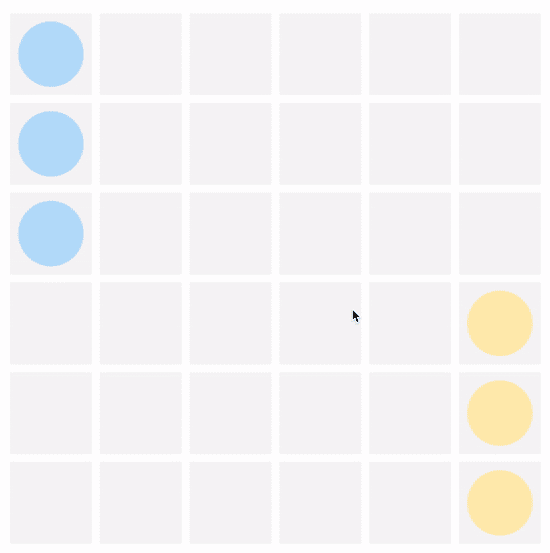
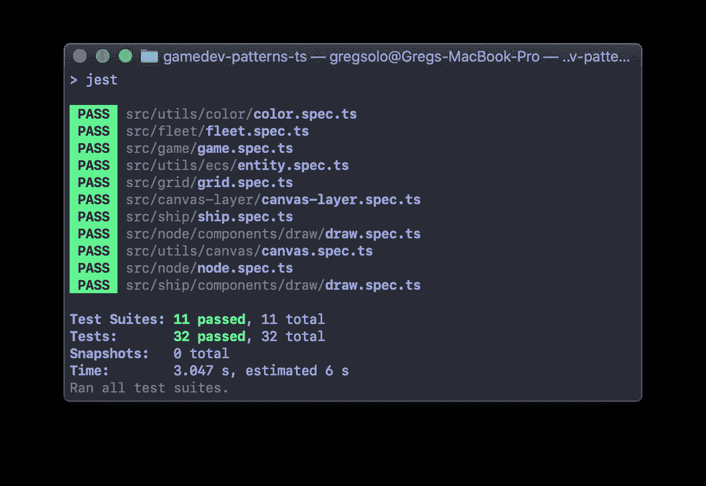
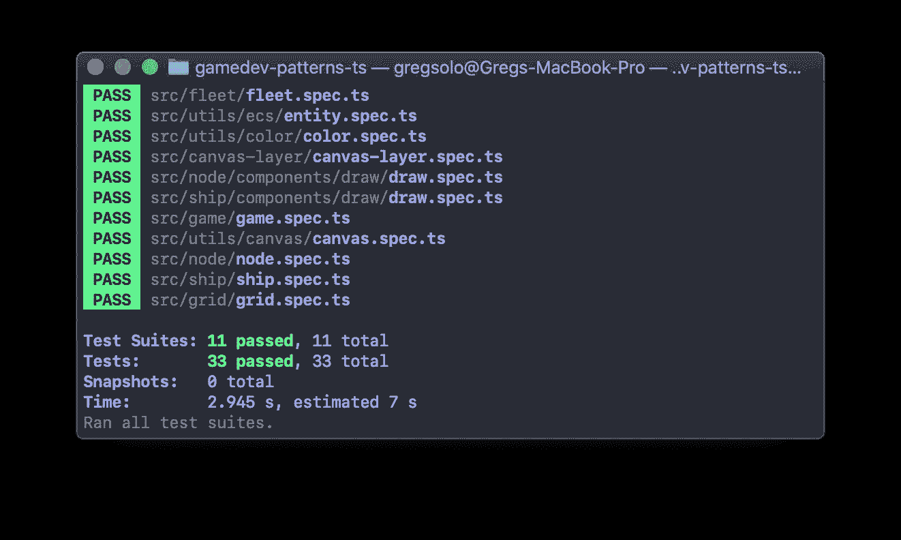
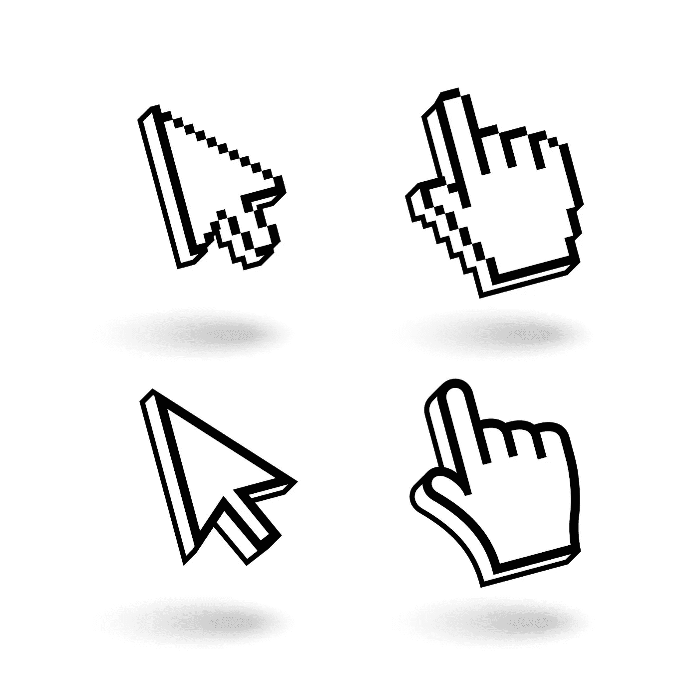
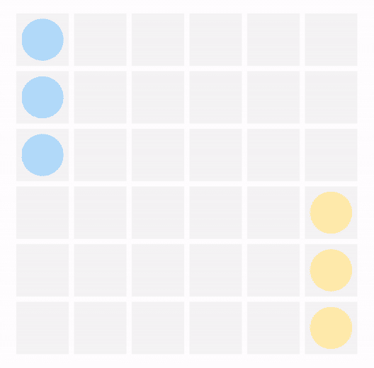
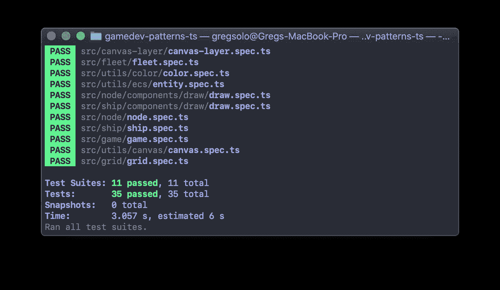
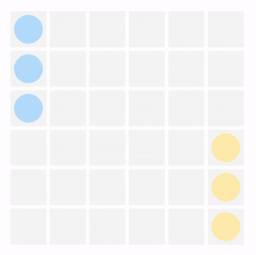

# 用 TypeScript 构建游戏。输入系统 1/3

> 原文：<https://itnext.io/building-a-game-with-typescript-input-system-1-3-46d0b3dd7662?source=collection_archive---------6----------------------->

《T4》系列教程的第五章讲述了如何用类型脚本和本地浏览器 API 从头开始构建游戏

[由 www.freepik.com 自由派创作的设计向量](https://www.freepik.com/vectors/design)

你好。欢迎来到“用 TypeScript 构建游戏”系列教程的第五章！在这里，我们学习如何使用原生浏览器 API、普通类型脚本、测试驱动开发和可靠的设计模式来构建一个简单的回合制游戏。

我们花了[最后一章](https://levelup.gitconnected.com/building-a-game-with-typescript-colors-and-layers-337b0e4d71f?sk=45ea8fe1af4d87bbd4b1b12b43c4557b)来讨论`Ships`:我们学习了如何利用我们的小`Render system`来绘制它们，讨论了冲突和团队，介绍了几个助手，比如`Color`和`Fleet`。

但到目前为止，这个游戏相当…死气沉沉。当然，我们渲染了相当多的元素，但是我们的玩家没有办法与游戏互动。是时候修复这个不幸的疏忽了！在第五章“输入系统”中，我们将建立一个简单的系统，让玩家有机会与游戏交流。您可以在这里找到本系列的其他章节:

*   [简介](https://medium.com/@gregsolo/gamedev-patterns-and-algorithms-in-action-with-typescript-d29b913858e)
*   [第一章实体和部件](https://medium.com/@gregsolo/entity-component-system-in-action-with-typescript-f498ca82a08e)
*   第二章。游戏循环([第一部分](https://medium.com/@gregsolo/gamedev-patterns-and-algorithms-with-typescript-game-loop-part-1-2-699919bb9b71)，[第二部分](https://medium.com/@gregsolo/gamedev-patterns-and-algorithms-in-action-with-typescript-game-loop-2-2-c0d57a8e5ec2))
*   第三章。绘制网格([第一部分](https://medium.com/@gregsolo/building-a-game-with-typescript-drawing-grid-1-5-aaf68797a0bb)、[第二部分](https://medium.com/javascript-in-plain-english/building-a-game-with-typescript-drawing-grid-2-5-206555719490)、[第三部分](https://medium.com/@gregsolo/building-a-game-with-typescript-drawing-grid-3-5-1fb94211c4aa)、[第四部分](https://medium.com/@gregsolo/building-a-game-with-typescript-iii-drawing-grid-4-5-398af1dd638d)、[第五部分](https://medium.com/@gregsolo/building-a-game-with-typescript-drawing-grid-5-5-49454917b3af))
*   第四章。船舶([第一部分](https://medium.com/@gregsolo/building-a-game-with-typescript-colors-and-layers-337b0e4d71f)、[第二部分](https://medium.com/@gregsolo/building-a-game-with-typescript-team-and-fleet-f223d39e9248)、[第三部分](https://medium.com/@gregsolo/building-a-game-with-typescript-drawing-ship-14e6c19caa38)、[第四部分](https://gregsolo.medium.com/building-a-game-with-typescript-ship-and-locomotion-4f5969675993))
*   第五章输入系统(第一部分，[第二部分](https://gregsolo.medium.com/building-a-game-with-typescript-input-system-2-3-cd419e36027c)，[第三部分](https://gregsolo.medium.com/building-a-game-with-typescript-input-system-3-3-8492552579f1)
*   第六章。寻路和移动([第一部分](https://blog.gregsolo.me/articles/building-a-game-with-typescript-pathfinding-and-movement-17-introduction)、[第二部分](https://blog.gregsolo.me/articles/building-a-game-with-typescript-pathfinding-and-movement-27-highlighting-locomotion-range)、[第三部分](https://blog.gregsolo.me/articles/building-a-game-with-typescript-pathfinding-and-movement-37-graph-and-priority-queue)、[第四部分](https://blog.gregsolo.me/articles/building-a-game-with-typescript-pathfinding-and-movement-47-pathfinder)、[第五部分](https://blog.gregsolo.me/articles/building-a-game-with-typescript-pathfinding-and-movement-57-finding-the-path)、[第六部分](https://blog.gregsolo.me/articles/building-a-game-with-typescript-pathfinding-and-movement-6-instant-locomotion)、[第七部分](https://blog.gregsolo.me/articles/pathfinding-and-movement-7-animated-locomotion))
*   第七章。玛奇纳州
*   第八章。攻击系统:生命和伤害
*   第九章。比赛的输赢
*   第十章敌人 AI

> 随意切换到[库](https://github.com/soloschenko-grigoriy/gamedev-patterns-ts)的`ship-4`分支。它包含了前几篇文章的工作成果，是这篇文章的一个很好的起点。

# 目录

1.  “活动”节点
2.  收听事件
3.  节点，居住者
4.  点击点
5.  全球和本地
6.  结论

# “活动”节点

当然，玩家可能有各种各样的方式与游戏互动。但是首先，玩家应该能够通过点击这个节点将当前活动的`Ship`移动到一个特定的`Node`。这是我们游戏的核心玩法:

现在，这个功能背后的大量逻辑已经超出了本章的范围，比如哪个`Ship`被认为是*活动的*，哪个`Node`可以根据`Ship`运动的*范围*来点击，`Ships`的渐进动画运动等等。我们将在以后的文章中讨论这些主题，现在，我们的重点是交互的实际情况。换句话说，我们将构建一个系统，它可以通知游戏的不同部分玩家点击了什么。我们不关心击键或手势或几乎任何其他类型的输入，因为这里的核心游戏是关于点击东西。

为了确认我们的*输入系统*工作正常，让我们使用游戏的一个过于简化的部分版本。让我们假设点击`Node`就可以激活它。根据不同的状态，`Node`会有不同的颜色:

再次对于这一章，我们忽略了很多事情:*玩家*是否真的点击了`Node`，*到底`Node`应该如何反应*等等。我们只要一点击`Node`就高亮显示它。

为了实现这一点，我们可以从引入`Node`实体的`IsActive`属性开始。这是一个临时的解决方案，我们将在以后的章节中去掉它:

接下来，让我们为`Node`的活动和非活动状态设置专用颜色:

最后，我们来教`NodeDrawComponent`尊重这种状态:

当然，我们应该更新测试来反映这些变化:

此时，我们的代码应该通过`npm start`成功编译，并且所有测试应该通过`npm t`:

现在，游戏必须有一种方法来识别哪个特定的`Node`被点击了。还有什么更简单的？让我们给`Node`添加一个好的旧事件监听器，然后就完事了！

# 收听事件

不幸的是，这并不容易。`addEventListener`处理 DOM 节点。但是，如果您还记得的话，在`canvas`中没有 DOM 元素。在绘制完元素后，它会立即失去对绘制元素的跟踪。这很好，因为它允许浏览器不在内存中保存所有这些圆形和矩形的信息。但对我们来说不幸的是，这意味着我们必须找到一种手动跟踪事件的方法。

[rawpixel.com——www.freepik.com](https://www.freepik.com/vectors/music)创造的音乐向量

希望我们不必重建整个事件系统。正如我提到的，游戏只关注“点击”事件，我们可以忽略其他的输入。然而，没有 DOM 我们怎么能听点击呢？

让我们把这个问题分成两部分。首先，我们必须*跟踪*对游戏特定元素的点击:例如`Ship`或`Node`。其次，我们需要一种方法来*通知*这些点击发生的元素。我们不关心元素如何对事件做出反应，那是元素本身的责任。

要跟踪玩家点击特定元素的事实，我们需要知道:

a)点击点:点击时鼠标的“位置”

b)任何元件的位置。

如果点击点在某个元素所占据的区域之内，那么可以安全地假设点击是在这个元素上进行的。z-space 也有一个复杂之处(一些元素可能在另一个元素的后面，这意味着用户不可能点击它们)，但是为了游戏的目的，我们可以忽略这个细微差别。

# 节点，居住者

我们的`Node`实体有`Start`和`End`属性，存储关于`Node`位置的信息。如果点击点出现在`Start`和`End`之间的矩形内，这意味着玩家点击了这个`Node`。我们可以定义一个助手方法来稍微缓解一下:

方法`Occupies`简单地检查所提供的点是否确实在这个特定`Node`的区域内。让我们用测试快速覆盖它:

还记得我们定义这个测试`Node`从点`(1, 2)`开始到`(5, 6)`结束吗？因此，自然地，点`(6, 2)`和`(3, 7)`应该在`Node`区域之外，而`(3, 2)`应该在内部。

此时，我们的代码应该通过`npm start`成功编译，并且所有测试应该通过`npm t`:

# 点击点

但是我们如何识别实际的点击点呢？嗯，即使`canvas`没有 DOM 节点的概念，我们仍然可以利用一个漂亮的 DOM 事件系统。我们可以监听顶层 DOM 元素的事件: *body* ，而不是等待游戏中每个元素的事件。

[宏向量 www.freepik.com 创建的箭头向量](https://www.freepik.com/vectors/arrow)

这将有效地给我们一个机制，当*任何*点击发生时，我们将得到通知。然后，我们可以通过比较点击时鼠标的位置与`Nodes`、`Ships`或任何其他元素占据的区域，来定位玩家点击的确切位置。幸运的是，浏览器很好地为我们提供了在`MouseEvent`中访问这个点的方法，这是鼠标事件的`addEventListener`回调的一个参数。

例如，我们可以从在`Node`实体中添加一个事件监听器开始:

一旦`Node`醒来，它就开始监听页面上的所有点击。但是它只关心那些发生在被`Node`占据的区域内的事件:

这里我们从`MouseEvent`获得一个点击点，并检查它是否确实在`Node`边界内。如果是这样，我们就激活这个`Node`。

做得好！然而，当您在浏览器中启动游戏并尝试点击任何`Node`时，您可能会注意到有些东西不对劲:

出于某种原因，游戏突出显示了任意的`Node`而不是我们点击的那个。点击点是这种不可靠行为的罪魁祸首。

如果您还记得，我们将元素`Nodes`和`Ships`的位置设置为相对于`canvas`的的*。换句话说，它是一个*局部*坐标，而`MouseEvent`给我们一个*全局*坐标。*全局坐标系*从浏览器的左上角开始。我们的*局部坐标系*从`canvas`开始的地方开始。`canvas`和浏览器边缘之间的偏移越大，`e.clientX`和`e.clientY`就变得越不相关。*

# 全球和本地

我们需要的是一种方法来*转换*一个全局的点击点，使其与我们的局部坐标系对齐:

计算是琐碎的:我们仅仅考虑*这个* `canvas`从浏览器左上角的偏移量，考虑滚动。如果提供的全局点远离`canvas`，我们返回`null`。

> 注意，由于我们有多个画布层，这些计算对特定的画布有效。但是因为我们所有的层都从同一点开始，所以我们是安全的。

当然，我们应该用测试来覆盖这个功能。我们可以模仿`getBoundingClientRect`来伪造`canvas`的位置，有效地假装它在全球坐标系中从`(20,20)`开始到`(500,500)`结束:

我们有两个案例要测试。首先，如果提供的`point`不在`canvas`边界内，我们必须确保我们的方法返回`null`:

其次，我们可以检查*全局*点是否成功转换为*局部*系统:

此时，我们的代码应该成功地用`npm start`编译，并且所有的测试应该通过`npm t`:

最后，我们可以应用`CalcLocalPointFrom`来变换点击点:

现在`Nodes`应该被正确突出显示，不管`canvas`的偏移量有多大:

# 结论

干得好！我们为我们的小“输入系统”做了第一轮“脏”代码。大量的问题仍然没有答案。我们正在收听每一个`Node`的事件。这意味着，我们对同一事件反应 36 次(这是我们现在拥有的`Nodes`的数量)？有没有更好的办法？

此外，如果我们有其他可点击的东西，而不仅仅是可点击的东西呢？我们必须为每个我们想要点击的元素重复我们刚刚在`Awake`中写的代码吗？我们将在下次开始回答所有这些问题[。到时候见！](https://gregsolo.medium.com/building-a-game-with-typescript-input-system-2-3-cd419e36027c)

我真的很想听听你的想法！如果你有任何**的评论**、**的建议**、**的问题**，或者任何其他**的反馈**，不要犹豫给我发私信或者在下面留下评论！如果你喜欢这个系列，**请与他人分享**。它真的帮助我继续努力。感谢您的阅读，我们下次再见！

*这是系列教程* ***用 TypeScript*** *构建游戏中的第五章“输入系统”。其他章节可在这里:*

*   [简介](https://medium.com/@gregsolo/gamedev-patterns-and-algorithms-in-action-with-typescript-d29b913858e)
*   [第一章实体和组件](https://medium.com/@gregsolo/entity-component-system-in-action-with-typescript-f498ca82a08e)
*   第二章。游戏循环([第一部分](https://medium.com/@gregsolo/gamedev-patterns-and-algorithms-with-typescript-game-loop-part-1-2-699919bb9b71)，[第二部分](https://medium.com/@gregsolo/gamedev-patterns-and-algorithms-in-action-with-typescript-game-loop-2-2-c0d57a8e5ec2))
*   第三章。绘制网格([第 1 部分](https://medium.com/@gregsolo/building-a-game-with-typescript-drawing-grid-1-5-aaf68797a0bb)、[第 2 部分](https://medium.com/javascript-in-plain-english/building-a-game-with-typescript-drawing-grid-2-5-206555719490)、[第 3 部分](https://medium.com/@gregsolo/building-a-game-with-typescript-drawing-grid-3-5-1fb94211c4aa)、[第 4 部分](https://medium.com/@gregsolo/building-a-game-with-typescript-iii-drawing-grid-4-5-398af1dd638d)、[第 5 部分](https://medium.com/@gregsolo/building-a-game-with-typescript-drawing-grid-5-5-49454917b3af))
*   第四章。舰船([第一部分](https://medium.com/@gregsolo/building-a-game-with-typescript-colors-and-layers-337b0e4d71f)、[第二部分](https://medium.com/@gregsolo/building-a-game-with-typescript-team-and-fleet-f223d39e9248)、[第三部分](https://medium.com/@gregsolo/building-a-game-with-typescript-drawing-ship-14e6c19caa38)、[第四部分](https://gregsolo.medium.com/building-a-game-with-typescript-ship-and-locomotion-4f5969675993))
*   第五章输入系统(第一部分，[第二部分](https://gregsolo.medium.com/building-a-game-with-typescript-input-system-2-3-cd419e36027c)，[第三部分](https://gregsolo.medium.com/building-a-game-with-typescript-input-system-3-3-8492552579f1)
*   第六章。寻路和移动([第一部分](https://blog.gregsolo.me/articles/building-a-game-with-typescript-pathfinding-and-movement-17-introduction)、[第二部分](https://blog.gregsolo.me/articles/building-a-game-with-typescript-pathfinding-and-movement-27-highlighting-locomotion-range)、[第三部分](https://blog.gregsolo.me/articles/building-a-game-with-typescript-pathfinding-and-movement-37-graph-and-priority-queue)、[第四部分](https://blog.gregsolo.me/articles/building-a-game-with-typescript-pathfinding-and-movement-47-pathfinder)、[第五部分](https://blog.gregsolo.me/articles/building-a-game-with-typescript-pathfinding-and-movement-57-finding-the-path)、[第六部分](https://blog.gregsolo.me/articles/building-a-game-with-typescript-pathfinding-and-movement-6-instant-locomotion)、[第七部分](https://blog.gregsolo.me/articles/pathfinding-and-movement-7-animated-locomotion))
*   第七章。玛奇纳州
*   第八章。攻击系统:生命和伤害
*   第九章。比赛的输赢
*   第十章敌人 AI