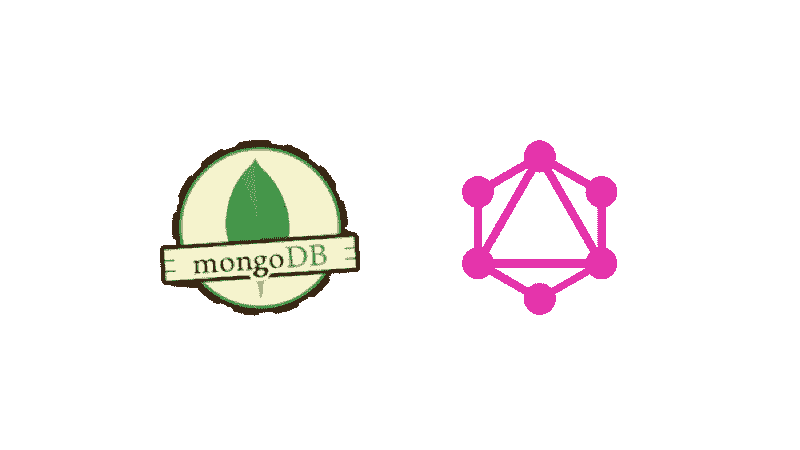

# 使用 GraphQL-yoga、Lambda 和 MongoDB 构建 GraphQL API

> 原文：<https://itnext.io/building-a-graphql-api-using-graphql-yoga-lambda-and-mongodb-c0c195621f47?source=collection_archive---------3----------------------->



大多数 GraphQL 文档倾向于通过一些关于部署 API 的额外博客文章来解决查询和变异的基础问题。我最近遇到的问题是试图在 AWS Lambda 上实现 GraphQL-yoga，而不是由 DynamoDB 支持。这个项目将专注于实现一个 mongo 数据库托管在 MLab 上，并与 Mongoose 连接。

# 开始

如果你想看看这个项目的完成代码，请查看 https://github.com/resputin/yoga-serverless-mongo 的。要在本地运行项目:

*   克隆 https://github.com/resputin/yoga-serverless-mongo
*   `yarn install`
*   为`MONGO_DB_URL`和`SESSION_SECRET`配置环境变量
*   `yarn start`
*   转到`localhost:3000`，这个项目将启动到 graphql-playground 来玩。schema 选项卡将包含构建查询和变异的相关信息。

## 该模式

这将是一个待办事项应用程序的简单实现。我们的模式将如下所示

```
type User { _id: ID! email: String! todos: [Todo!]!}type Todo { _id: ID! content: String!}type AuthPayload { token: String! user: User}
```

这将建立我们的数据模型。我们有一个*用户*，我们可以在上面查询 *id、*和*待办事项*。我们有一个*待办事项*，可以查询 *id* 和*内容。*最后，我们有一个 *AuthPayload* ，我们可以查询一个 JWT 和一个*用户*。

```
type Query { todos: [Todo!]! todo(_id: ID!): Todo!}type Mutation { signup(email: String!, password: String!): AuthPayload login(email: String!, password: String!): AuthPayload createTodo(content: String!): Todo!}
```

对于我们的根级查询，我们可以查询 *allTodos* ，它将返回一个待办事项列表，或者查询 *todo* ，它将从其 id 返回一个特定的待办事项。

这个模式将被导入到 yoga 的 GraphQLServerLambda 类的`handler`文件中。这个类将把我们的模式和解析器转换成一个与 Lambda 接口的 graphQL 服务器。

```
const lambda = new GraphQLServerLambda({ typeDefs: './schema.graphql'
  // more here later});
```

## 下决心者

我们的解决方案也相对简单。Yoga 将自动处理我们简单的查询解析器，所以我们需要担心的只是我们的 Todo 和用户认证。

我们的 Todo 查询很简单

```
const todos = async (parent, args, context) => {
  const userId = authenticate(context); try {
    const user = await User.findOne({ _id: userId }).lean()   
    return user.todos;
  } catch (err) {
    throw new Error(err);
  }
};const todo = async (parent, { _id }, context) => {
  const userId = authenticate(context);
  try {
    const user = await User.findOne({ _id: userId }).lean();
    const todo = await user.todos.find(
      todo => todo._id.toString() === _id
    );    
    return todo;
  } catch (err) {
    throw new Error(err);
  }
};
```

这些查询已经过验证，我们可以在`utils`中看到。

```
const authenticate = context => {
  const Authorization = context.event.headers.Authorization;if (Authorization) {
    const token = Authorization.replace('Bearer ', '');
    const { userId } = jwt.verify(token, config.SESSION_SECRET);
    return userId;
  }throw new Error('Not authorized');
};
```

这里需要注意的一点是，我们将把我们的请求附加到我们的上下文对象中，以便从我们的头中获取不记名令牌，所以现在让我们在`handler`中完成这项工作

```
const lambda = new GraphQLServerLambda({
  typeDefs: './schema.graphql',
  context: req => ({ ...req })
});
```

我们的突变也很简单

```
const createTodo = async (_, { content }, context) => {
  const userId = authenticate(context);
  try {
    const user = await User.findOne({ _id: userId });
    const newTodo = { _id: new ObjectId(), content };
    user.todos.push(newTodo);
    await user.save();
    return newTodo;
  } catch (err) {
    throw new Error(err);
  }
};const signup = async (_, { email, password }) => {
  try {
    let user = await User.findOne({ email }).lean(); if (user) {
      throw new Error('Email is already taken');
    } const _password = await bcrypt.hash(password, 10);
    user = await new User({ email, password: _password }).save(); const token = jwt.sign({ userId: user._id }, config.SESSION_SECRET); return { token, user };
  } catch (err) {
    throw new Error(err);
  }
};const login = async (_, { email, password }) => {
  try {
    const user = await User.findOne({ email }).lean();
    if (!user) {
      throw new Error('No such user found');
    } const valid = await bcrypt.compare(password, user.password);
    if (!valid) {
      throw new Error('Invalid password');
    } user.password = undefined; return {
      token: jwt.sign({ userId: user._id }, config.SESSION_SECRET),
      user
    };
  } catch (err) {
    throw new Error(err);
  }
};
```

解析器完成后，我们可以将它们添加到我们的`handler`中，并拥有一个完整的 GraphQL 服务器(尽管没有功能)

```
const resolvers = {
  Query,
  Mutation
};const lambda = new GraphQLServerLambda({
  typeDefs: './schema.graphql',
  resolvers,
  context: req => ({ ...req })
});
```

## 猫鼬

对于 mongoose，我们只需要定义一个与我们的 GraphQL 模式匹配的用户模型，只需添加密码

```
const userSchema = new mongoose.Schema({
  email: { type: String, unique: true },
  password: { type: String, select: false },
  todos: [
    {
      content: { type: String, required: true }
    }
  ]
});const User = mongoose.model('User', userSchema);
```

# 无服务器乐趣

设置完成后，让我们开始构建我们的 Mongo 连接并部署到 Lambda。在`handler`中，我们需要连接到我们的数据库，该数据库将为我们向端点发出的所有后续请求保持“预热”。

```
async function start() {
  const mongoClient = await mongoose.connect(config.MONGO_DB_URL);
  mongoose.connection.on('error', function(err) {
    console.log('Mongoose default connection error: ' + err);
  });
  return true;
}
```

现在是我们的λ函数。Yoga 已经提供了这里的大部分逻辑，我们只需要添加一些东西来确保连接到我们的数据库，因为我们将有一个到我们的数据库的持续连接，我们还需要告诉 Lambda 不要在返回值之前等待我们的事件循环为空。

```
exports.playground = async (event, context, callback) => {
  context.callbackWaitsForEmptyEventLoop = false;
  await start();
  return lambda.playgroundHandler(event, context, callback);
};exports.server = async (event, context, callback) => {
  context.callbackWaitsForEmptyEventLoop = false;
  await start();
  return lambda.graphqlHandler(event, context, callback);
};
```

如果您已经用 AWS Lambda 设置了无服务器，那么您可以运行`yarn deploy`并在您的 AWS 端点上探索 graphQL-playground！

设置无服务器 CLI: `yarn global add serverless`

然后你可以用这个教程设置你的无服务器凭证:[https://server less . com/framework/docs/providers/AWS/guide/credentials/](https://serverless.com/framework/docs/providers/aws/guide/credentials/)