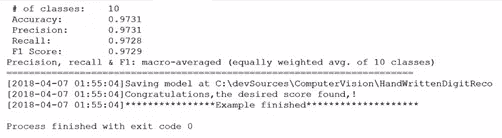
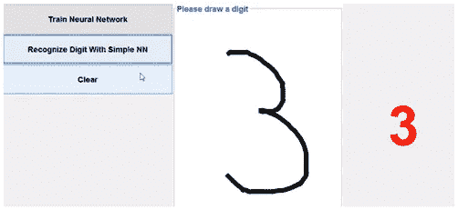

# 用 Java 构建手写数字识别器

> 原文：<https://itnext.io/building-a-handwritten-digit-recognizer-in-java-4eca4014eb2f?source=collection_archive---------1----------------------->

在本文中，我们将在 Java 应用程序中构建一个手写数字识别器。该应用程序将使用开源 Java 框架 Deeplearning4j 构建。使用的数据集是手写数字的经典 MNIST 数据库([http://yann.lecun.com/exdb/mnist/](http://yann.lecun.com/exdb/mnist/))。训练数据集过大，有 60，000 幅图像，而测试数据集包含 10，000 幅图像。这些图像的大小和灰度为 28 x 28。

作为我们将在本文中创建的应用程序的一部分，我们将实现一个图形用户界面，您可以在其中绘制数字，并让神经网络识别数字。

直接进入代码，让我们观察如何用 Java 实现一个神经网络。我们从参数开始；第一个是输出。因为我们有 0 到 9 个数字，所以我们有 10 个类:

```
/*** Number prediction classes.* We have 0–9 digits so 10 classes in total.*/private static final int OUTPUT = 10;
```

我们有小批量大小，这是我们在更新权重之前看到的图像数量，或者我们将并行处理的图像数量:

```
/*** Mini batch gradient descent size or number of matrices processed in parallel.* For CORE-I7 16 is good for GPU please change to 128 and up*/private static final int MINI_BATCH_SIZE = 16;// Number of training epochs/*** Number of total traverses through data.* with 5 epochs we will have 5/@MINI_BATCH_SIZE iterations or weights updates*/private static final int EPOCHS = 5;
```

当我们为 CPU 考虑这一点时，16 的批量大小是没问题的，但是对于 GPU，这需要根据 GPU 的能力而改变。当我们遍历所有数据时，就完成了一个时期。

学习率非常重要，因为具有非常低的值会减慢学习，而具有较大的学习率值会导致神经网络实际上发散:

```
/*** The alpha learning rate defining the size of step towards the minimum*/private static final double LEARNING_RATE = 0.01;
```

为了详细理解这一点，在本节的后半部分，我们将通过改变学习率来模拟一个发散的情况。幸运的是，作为该示例的一部分，我们不需要处理 MNIST 数据集中像素的读取、传输或归一化。我们不需要关心将数据转换成一维向量以适合神经网络。这是因为一切都是由 Deeplearning4j 封装和提供的。

在对象**数据集迭代器下，**我们需要指定批量大小，以及我们是否要将其用于训练或测试，这将有助于分类我们是需要从训练数据集加载 60，000 幅图像，还是从测试数据集加载 10，000 幅图像:

```
public void train() throws Exception {/*Create an iterator using the batch size for one iteration*/log.info(“Load data….”);DataSetIterator mnistTrain = new MnistDataSetIterator(MINI_BATCH_SIZE, true, SEED);/*Construct the neural neural*/log.info(“Build model….”);MultiLayerConfiguration conf = new NeuralNetConfiguration.Builder().seed(SEED).learningRate(LEARNING_RATE).weightInit(WeightInit.XAVIER)//NESTEROVS is referring to gradient descent with momentum.updater(Updater.NESTEROVS).list()
```

让我们开始建立一个神经网络。我们已经指定了学习率，并根据 Xavier 初始化了权重，这是我们在前面几节中已经学过的。代码中的更新器实际上只是用梯度下降来更新权重的优化算法。NESTEROVS 基本上是我们已经熟悉的带动量的梯度下降。

让我们看看代码，以更好地理解更新程序。我们看这两个公式，实际上和我们已经研究过的没有什么不同。

我们配置输入层、隐藏层和输出。输入层的配置相当容易；我们只需要把宽度和重量相乘，我们就有了这个一维向量的大小。代码的下一步是定义隐藏层。实际上，我们有两个隐藏层:一个有 128 个神经元，另一个有 64 个神经元，由于效率高，两者都具有激活功能。

为了稍微改变一下，我们可以尝试不同的值，尤其是那些由 MNIST 数据集网页定义的值。尽管如此，这里选择的值是相当有效的，具有较少的训练时间和良好的准确性。

输出层使用 softmax，因为我们需要 10 个类而不是 2 个，所以我们也有成本函数。细节可能与我们之前看到的有所不同。该函数根据真实值衡量假设值的表现。

然后，我们初始化并定义函数，因为我们希望看到每 100 次迭代的成本函数。model.fit (minstTrain)非常重要，因为它实际上是一次又一次地工作，正如许多人所定义的那样，它遍历所有数据。在这之后，我们已经执行了一个时期，并且神经网络已经学会使用好的权重。

# 测试神经网络的性能

为了测试网络的准确性，我们构建了另一个数据集进行测试。我们用目前为止学到的知识评估这个模型，并打印统计数据。如果网络的准确率超过 97%，我们就此打住，保存模型，用于我们稍后将研究的图形用户界面。执行以下代码:

```
if (mnistTest == null) {mnistTest = new MnistDataSetIterator(MINI_BATCH_SIZE, false, SEED);}
```

成本函数被打印出来，如果你仔细观察，它会在迭代中逐渐减少。有时，我们在成本函数值上有一个峰值。这是小批量梯度下降的一个特征。第一个历元的最终输出向我们显示，该模型仅在一个历元内就具有 96%的准确性，这是非常棒的。这意味着神经网络学习速度很快。

在大多数情况下，它不像这样工作，我们需要调整我们的网络很长一段时间才能获得我们想要的输出。让我们看看第二个纪元的输出:



我们在两个时期内获得了超过 97%的准确率。

我们需要注意的另一个方面是，一个简单的模型是如何实现真正伟大的结果的。这是深度学习正在腾飞的一部分原因。很容易获得好的结果，也很容易合作。

如前所述，让我们看看将学习率提高到 0.6 的发散情况:

```
private static final double LEARNING_RATE = 0.01;/*** [https://en.wikipedia.org/wiki/Random_seed](https://en.wikipedia.org/wiki/Random_seed)*/private static final int SEED = 123;private static final int IMAGE_WIDTH = 28;private static final int IMAGE_HEIGHT = 28;
```

如果我们现在运行网络，我们将观察到成本函数将继续增加，没有减少的迹象。精度也大受影响。一个时期的成本函数几乎保持不变，尽管有 3000 次迭代。模型的最终精度约为 10%，这清楚地表明这不是最好的方法。

让我们针对不同的数字运行应用程序，看看它是如何工作的。让我们从数字 **3** 开始:



输出是准确的。对 0 到 9 之间的任何一个数字运行这个程序，检查你的模型是否工作准确。

同时，记住这个模型还不完善——我们将在下一章用 CNN 架构来改进它。他们提供最先进的技术和高精确度，我们应该能够达到 99%的精确度。

希望你觉得这篇文章有趣。如果你想用 Java 实现更多这样的深度学习项目，你必须看看[的计算机视觉 Java 深度学习实践](https://www.amazon.com/Hands-Java-Learning-Computer-Vision/dp/1789613965?utm_source=https://itnext.io/&utm_medium=referral&utm_campaign=ThirdPartyPromotions)。由 Klevis Ramo，[撰写，面向计算机视觉的实用 Java 深度学习](https://www.packtpub.com/big-data-and-business-intelligence/hands-java-deep-learning-computer-vision?utm_source=https://itnext.io/&utm_medium=referral&utm_campaign=ThirdPartyPromotions)将带您完成用 Java 高效训练深度神经网络以完成计算机视觉相关任务的过程。