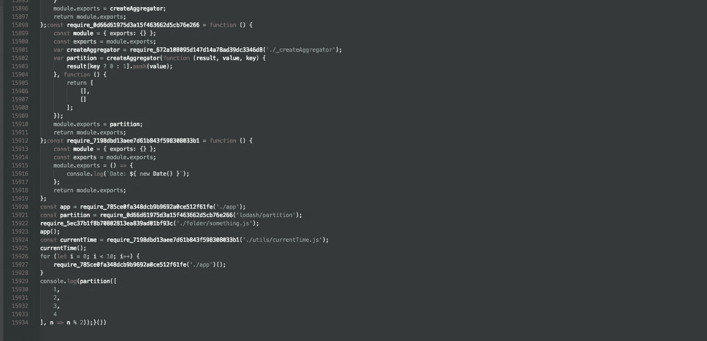

# 构建 Javascript 模块捆绑器

> 原文：<https://itnext.io/building-a-javascript-module-bundler-152233571824?source=collection_archive---------3----------------------->

Javascript 模块捆绑器是一个工具，允许您将多个 Javascript 模块捆绑到一个或多个输出文件中。将您的 JS 代码分成多个模块，并需要来自包管理存储库的共享模块，这是现代 web 开发中的常见做法。浏览器中的 Javascript 本身并不支持模块(尽管一些浏览器开始支持)，因此需要模块捆绑来将所有模块粘合在一起。有几种不同的方式可以捆绑模块，包括 AMD、Common JS 和 Import 方法，Javascript 运行时节点普及了 Common JS，我们将构建自己的捆绑器来支持这一点。有几个流行的 Javascript 捆绑器已经存在一段时间了，webpack 是最常见的一个，其他的包括 Rollup、Browserify 和 package。

捆绑器获取 Javascript 源代码，对其进行处理，以某种方式进行转换，然后输出不同形式的源代码。在我们的例子中，我们将各个 Javascript 源文件捆绑在一起，同时重写特定的代码片段，例如常见 JS 模块格式使用的 require 函数调用。大多数捆绑器将使用图形数据结构([https://en.wikipedia.org/wiki/Dependency_graph](https://en.wikipedia.org/wiki/Dependency_graph))来构建依赖图，这可以用于生成 JS 包、可视化和代码分割。在这个 bundler 中，我们将简化一些事情，例如放弃一个完全定向的依赖图，只使用一个对象来存储我们的包，我们还将同步解析模块，这将会更慢，但允许更简单的代码。

# TL；速度三角形定位法(dead reckoning)

*来源*:【https://github.com/jackpopp/bundler/blob/master/src】T4

捆绑模块的基本步骤如下:

*   使用 acorn 将初始源代码转换为抽象语法树
*   遍历抽象语法树并检测所需的函数调用
*   通过处理具有名为 require 的被调用方的调用表达式来解析模块
*   在公共 JS helper 函数中包装解析的模块
*   对于每个已解析的模块，生成抽象语法树并递归地遍历该抽象语法树
*   将每个修改后的抽象语法树添加到模块对象中
*   迭代抽象语法树集合，使用 escodegen 将每个树转换为代码
*   包装在立即调用的函数表达式中
*   将包写入文件

捆绑器首先读取入口点 JS 文件 file，并将其转换为遵循 ecmascript 2018 规范的抽象语法树(AST)([https://www . ECMA-international . org/ECMA-262/9.0/index . html # Title](https://www.ecma-international.org/ecma-262/9.0/index.html#Title))。AST 是源代码的树形表示，每个节点代表语言中的一个结构。为了将初始源文件解析为 AST，我们可以使用 acorn 模块，生成的 AST 遵循 2018 Ecmascript 规范的 estree 实现，可以在这里找到([https://github.com/estree/estree](https://github.com/estree/estree))。使用规范，我们可以找出我们想要查找和修改的节点，以便将我们所有的代码捆绑在一起。我们将使用 AST，并使用 estraverse 模块来遍历节点，访问每个节点，检查类型，然后修改、替换或删除。对于我们找到的所有常见的 JS require 函数调用，这将需要递归地发生。

# 初始设置

为我们所有的源代码创建一个名为 bundler 的目录，在这里为 bundler 源代码添加一个 src 目录，为我们的演示项目添加演示目录。在根目录和演示目录中初始化 package.json，我们需要演示目录中的 package.json 来测试我们已经安装在演示项目中的捆绑节点模块。

在我们的演示目录中，我们将添加一些代码，要求对 src 目录中的模块和已经从 npm 安装到 node_modules 目录中的模块进行函数调用。

# 创建初始 AST

在 src 目录下安装 **acorn** 并在索引文件中需要它以及 path 和 fs 模块，并创建一个名为`sourceToAST`的函数，这将把源文件转换成 AST。该函数将有一个源参数，并将调用 acorn 的`parse`函数，它将接受源作为一个参数以及一个选项对象，我们可以在其中指定 emca 版本。我们还将初始化一个名为`MODULES`的对象变量，它将存储所有已解析模块的集合。

接下来创建一个 bundler 函数，它有入口点和输出文件的参数，我们需要为根路径、初始模块和输出文件创建变量。我们将使用全局流程对象基于当前工作目录创建这些路径。我们还将运行捆绑器初始化，并注销捆绑器中的路径，以确保一切正常。

我们应该看到一个格式良好的对象，包含所有路径，变量作为关键字，如下所示:

接下来，我们需要将初始模块的源代码传递给生成 AST 的函数，然后我们就有了可以开始工作的初始 AST。因此，让我们删除之前添加的`console.log`调用，取而代之的是读入文件并将源代码传递给函数。

现在我们已经有了初始的 AST，我们可以遍历它来找到所有的`require`函数调用，我们将处理这些以便捆绑所有的模块，并且我们将需要对所有被解析的模块递归地这样做。

# 访问节点

让我们看一下 AST，以便更好地理解它的结构以及我们将如何遍历它。我们可以使用 https://astexplorer.net/的 T2 来查看作为 AST 的源的可视化，我们可以打开和关闭不同的节点，并查看不同节点包含的所有不同属性。

为了支持常见的 JS require 调用，我们需要访问 **CallExpression** 节点，因为这个表达式表示函数何时被调用。这方面的一个例子是:

我们将采用上面的简单示例，并使用 AST Explorer 将其转换为 AST:

在上面的源代码中，我们可以看到一些节点类型，从 acorn 生成的树将以一个类型为 *Program* 的根节点和一个节点数组 body 属性开始。在 body 属性中，我们将看到所有顶级节点，每个节点都有基于类型的属性，这些属性是所有节点类型中常见的其他节点或属性的混合。例如，所有节点都有属性 **type** (节点类型)、 **start** (源代码中的起始字符位置)和 **end** (源代码的结束字符位置)。任何带有块的节点都将有一个新的节点体，例如 if 语句或 for 循环，这些都在一个新的范围内，但是如果需要的话，您需要手动跟踪它。

在上面的例子中，我们可以看到我们从一个*变量声明*开始，它包含一个名为 declarations 的属性，该属性包含一个声明节点数组。每个声明节点包括多个属性，包括引用标识符的 *id* 和变量声明的初始化器 *init* 属性，这是变量将初始化的内容。例如:

id 是*值*，初始化器是文字值 *1* ，为了弄清楚所有的节点类型，我们可以看看 acorn 创建 AST 所遵循的规范。Acorn 遵循 estree 规范，该规范可在 github 上查看:[https://github.com/estree/estree](https://github.com/estree/estree)。有一个规范与 Ecmascript 规范的每个版本相匹配，如 es5、es2015 等，我们可以用它来识别不同的语言结构。

现在，我们将开始通过遍历树来访问节点，我们将使用*estr object*模块来遍历 AST 并访问我们需要转换的节点，以便开始安装和要求 estr object。

接下来让我们创建一个名为 *walkAndParse* 的新函数，它将遍历 AST 中的所有节点，并允许您有条件地检查每个节点，对每个节点进行操作。estr hore 模块为此使用了访问者模式([https://en.wikipedia.org/wiki/Visitor_pattern](https://en.wikipedia.org/wiki/Visitor_pattern))，我们可以访问每个节点，并在进入或离开节点时有条件地执行操作。我们将使用 estr object*replace*函数，因为当我们修改一个节点时，我们希望替换它，并且我们必须在函数结束时返回该节点，如果需要的话，replace 还允许我们删除节点。在遍历每个节点时，我们将执行的基本操作是寻找所需的函数调用，然后我们需要解析模块，解析该模块，并将其添加到我们的已解析模块集合中。对于从源文件中解析出来的每个模块，我们需要再次调用 *walkAndParse* ，利用递归，到结束过程时，我们应该将所有模块捆绑到我们的模块集合中。

当我们访问一个节点时，我们将得到一个节点对象，并可以访问节点属性，这些属性可以通过查看 estree 规范找到。我们调用`estraverse.replace`并传递 AST 作为第一个参数和一个带有 enter 属性的对象，该属性的值是一个函数。enter 属性是一个回调函数，在每次进入一个节点时执行，然后节点对象将作为第一个参数传递，我们可以添加一个 if 语句来检查类型是否为`CallExpression`。[https://github . com/estree/estree/blob/master/es5 . MD # call expression](https://github.com/estree/estree/blob/master/es5.md#callexpression)

然后，让我们更新捆绑器以运行 walkAndParse 函数:

一旦我们输入了一个节点，它是一个调用表达式，我们想要检查这个调用表达式被调用方类型是否是一个标识符，这告诉我们一个命名的函数正在被调用。我们需要检查这是一个命名函数，因为您也可以有一个匿名函数的调用表达式节点，该节点没有作为被调用者的标识符，而是有一个 FunctionExpression 或 ArrowFunctionExpression。如果它是一个函数表达式，那么它不可能调用 *require* ，因为没有标识符来引用一个已定义的函数。[https://github . com/estree/estree/blob/master/es5 . MD #标识符](https://github.com/estree/estree/blob/master/es5.md#identifier)

如果被调用者没有这个节点的标识符，那么我们就不尝试解析它，walker 仍然会递归地访问它的子节点，因为在树的那个分支的更下面可能需要调用表达式。

如果我们发现被调用者类型是标识符，那么我们可以检查标识符名称，如果这是 *require* ，那么我们现在知道我们已经访问了 require 函数调用。最后一步是检查 require 调用是否有任何参数，我们需要一个参数，我们希望它是一个字符串。文字是源代码中的静态表达式，它们是代码中定义的静态值，并且是不可变的，它需要是一个文字，因为我们需要一个静态值作为模块路径。有关文字的更多信息，请访问:[https://developer . Mozilla . org/en-US/docs/Web/JavaScript/Guide/Grammar _ and _ Types # Literals](https://developer.mozilla.org/en-US/docs/Web/JavaScript/Guide/Grammar_and_Types#Literals)[https://developer . Mozilla . org/en-US/docs/Web/JavaScript/Guide/Grammar _ and _ Types # String _ Literals](https://developer.mozilla.org/en-US/docs/Web/JavaScript/Guide/Grammar_and_Types#String_literals)

按如下方式更新`walkAndParse`功能:

我们很可能还想在上面的测试中检查文字值是否也是字符串，因为整数和布尔值也是文字，但我们现在跳过这一步。现在，如果我们在终端中使用`node src/index.js`再次运行代码，我们应该会看到以下内容:

# 解析模块

既然已经确定了带有文字表达式参数的 require call 表达式，就需要进行模块解析，以便找到该模块的正确完整路径。当需要一个模块时，有许多路径可以使用，并且每种路径有不同的使用情况，下面是我们将支持的三种主要路径类型。

## 绝对模块路径

绝对模块路径允许 require 函数调用引用文件系统上的任何模块，这是最简单的处理路径，因为完整路径已经为我们定义了。但这也可能是脆弱的，因为这意味着您的代码不再是可移植的，如果它引用了特定用户文件系统上的一个模块，那么对于想要捆绑该项目的其他用户来说，它可能不在那里。

## 相对模块路径

相对模块路径允许 require 调用查找与当前模块相关的模块，您可以在当前目录中 require，或者使用`..`上移您想要上移的每个目录。对于需要模块的常见 JS 模式，不需要文件扩展名，因此对于相对和绝对路径，我们可能需要在模块解析期间添加扩展名。

## 节点模块路径

节点模块路径允许 require 解析通过 npm/yarn 等安装的模块，所有这些模块都位于 node_modules 目录中。这是一种极其常见的模式，在所有不同的解析路径中，这是最复杂的。

当解析一个模块时，比如上面的 *react* 例子，模块解析将需要不同的工作方式。首先，我们需要查看 node_modules 目录，如果您现在安装了 react 并查看 node_modules 目录，您将看到 react 目录，而不是名为 react 的文件。另一个例子是在哪里解析一个文件呢这不是节点模块的情况，那么在这个例子中解析器到底在寻找什么呢？

当安装 node_module 时，也安装了 modules package.json，在这个文件中可以有一个对主文件的可选引用，它告诉我们模块的初始文件应该是什么，我们可以解决这个问题。因为这是可选的，所以如果 package.json 中没有主属性，这种方法的后备方法是寻找一个 *index.js* 文件，index.js 名称是对 web 服务器如何使用默认的*index.html*文件来满足 web 请求的引用。

接下来，可以从已安装的节点模块的目录中请求一个文件，例如，如果我们使用 lodash，我们可以只请求我们需要的方法。

我们在另一个文件中创建解析器，并导出类供捆绑器使用，因此在 src 目录中创建一个名为 *resolver.js* 的文件。

在代码中，我们导出了一个需要根路径的解析器类，每当我们想要解析一个模块时，我们都需要根路径。我们使用 path 模块来帮助进行路径格式化，使用 fs 模块来检索关于正在被解析的模块的信息。

该类有一个名为 resolvePath 的函数，它有两个参数`modulePath`和`currentPath`。`modulePath`参数是现在正在被解析的模块的路径，而 as `currentPath`参数是调用 require 函数的模块的路径。

然后我们想返回一个具有两个属性`fullPath`和`newResolutionPath`的对象。fullPath 属性是我们已经解析的路径，newResolutionPath 属性是不带模块名的完整路径。如果 bundler 在我们刚刚解析的模块中发现任何 require 调用，那么 newResolutionPath 属性将被用作 currentPath 参数。

所以让我们补充一下:

接下来，我们将为所有不同的可能模块路径添加逻辑，我们将使用 if 语句来测试不同的路径类型。在我们这样做之前，您可能记得之前您不必在 require 函数调用中包含文件扩展名，所以我们将创建一个名为`modulePathWithExtension`的变量，并使用三元运算符有条件地附加一个`.js`扩展名(如果它丢失的话)。

现在，我们检查路径模块是否以`./`或`../`开头，如果是，那么我们期望它是一个相对路径，将`fullPath`设置为当前路径，并附加 require 参数中的模块路径。接下来，我们将测试它是否以`/`开头，如果是，那么我们期望它是一个绝对路径，我们只需将`fullPath`赋值给`modulePathWithExtension`。

节点模块解析稍微复杂一点，require 函数调用可能以目录或目录中的文件为目标。因为 require 函数调用可能没有文件扩展名，所以我们需要检查它是一个目录还是一个包含所需目录的文件。如果它是一个目录，那么我们还必须尝试加载 package.json，以便检查是否定义了一个主入口点，如果定义了，我们就使用它，如果没有，我们默认使用`index.js`。接下来与上面类似，我们将把一个`.js`附加到`nodeModulePath`上，作为一个名为`nodeModulePathWithExtension`的变量，如果它没有，检查它是否是一个有效的文件，如果它被赋值`fullPath`到`nodeModulePathWithExtension`。

最后，`newResolutionPath`与完整路径相同，但是没有路径的目录名，我们可以通过调用`path.dirname`函数来实现。

现在我们已经创建了解析器，我们需要创建一个解析器的新实例，并将它传递给`walkAndParse`函数。按照解析器顶部的要求更新代码:

接下来，向`walkAndParse`函数定义添加额外的解析器参数:

然后更新捆绑器:

更新`walkAndParse`功能，删除我们添加的控制台日志，替换为以下内容:

接下来，我们想尝试读取解析后的文件路径，这样就可以将它捆绑到生成的文件中，这样我们就可以解析这个解析后的模块的常见 JS require 调用。我们可以通过使用 fs 模块读取文件来实现这一点，为了简洁起见，我们将同步进行，但也可以将这些调用链接起来，然后异步进行以提高性能。

在 resolvePath 调用后更新代码以添加:

现在，我们已经加载了一个新的模块源文件，我们需要能够确保源文件中导出的任何代码都被返回，并由 require 调用或 require 调用所分配的任何内容使用。

//也许我们会删除该位。我们在这里可能会看到的一种情况是，如果返回的解析路径未定义，原因可能是需要一个本机节点模块，如`stream`。在这些情况下，你可以使用基于浏览器的实现，比如[https://github.com/webpack/node-libs-browser](https://github.com/webpack/node-libs-browser)。

# 包装和递归解析

如果我们查看我们的`index.js`文件，我们可以看到第一个 require 调用引用了`app.js`，`app.js`文件导出了一个名为`helloWorld`的函数，在`index.js`文件中，这个函数被赋给了`index.js`中的常量变量`app`。

因此，我们希望一旦这些文件被捆绑成一个单独的生成文件，我们将能够执行`app`变量，这将执行对`helloWorld`函数的引用。通用 JS 规范提到我们应该能够引用用`module.exports`和`exports`导出的任何值，并且这两者应该能够导出任何原始数据类型。最后，我们希望确保每个模块范围内的所有内容都保持在其范围内，不会泄漏到文件的全局范围内。

为了实现这一点，我们可以借鉴要求模块的 NodeJS 实现，当一个模块被要求时，它就被包装在一个带有多个参数的函数中，比如 exports、module 和 __dirname。想了解更多信息，你可以去 https://nodejs.org/api/modules.html[看看。](https://nodejs.org/api/modules.html)

在我们的实现中，我们将把我们的每个源文件包装在一个函数中，该函数被赋予 require_HASH_ID 的值，其中 HASH_ID 是源文件的 md5 散列。在此基础上，我们需要创建一个初始的`module`变量，该变量引用一个具有`exports`对象属性和引用`module.exports`值的`exports`属性的对象，我们还需要返回`module.exports`。最后，我们可以用 require_HASH_ID 值替换原始调用表达式的节点名，这样就完成了对所需文件源的引用。

这个包装源代码的模板可以作为一个函数添加到我们的 index.js 文件中，带有如下的`source`参数:

现在我们有了通用的 JS 包装器模板，我们可以返回到 CallExpression 访问者来包装源代码，并继续递归搜索更多需要解析、包装和绑定的 require call 表达式。让我们更新访问者，以便创建散列 id，创建引用当前 AST 节点、路径、id 和已解析模块源的模块对象。我们还将添加对名为 exports 的属性的引用，这将调用名为`wrapSourceAndParse`的函数。`wrapSourceAndParse`函数将解析的模块包装在公共 JS 包装器中，将源代码转换成 AST，然后在这个 AST 上调用`walkAndParse`。`walkAndParse`函数将返回 AST 作为函数的结束，因此它将被分配给我们已经创建的`module`对象的`exports`属性。

接下来，我们将把 CallExpression 从`require`重命名为 require_HASH_ID，如前所述，我们将把我们已经创建的`module`对象推送到一个全局`MODULES`对象中，我们将在 bundler 的顶部定义该对象。稍后我们将迭代`MODULES`对象来生成我们的最终包。首先，我们需要安装 md5 库来创建我们的散列，并要求它位于我们的 bundler 的顶部:

接下来更新 if 语句中的`walkAndParse`函数，如下所示:

接下来添加新功能`wrapSourceAndParse`。

既然我们能够从初始文件中解析所有模块，并创建一组解析的 AST，我们希望能够生成新的捆绑代码，这将在下一节中进行。

# 代码生成

我们已经做了相当多的处理，让我们实际上从我们所有的硬字中生成一些东西，生成的代码实际上将无法执行，我们很快就会看到，很抱歉。但是我们会有*生成的东西*，我们可以插入一个小的 hack 来查看我们的劳动成果，然后立即修复它。

生成最终的代码输出非常容易，我们将使用一个名为 escodegen 的模块，它代表 ECMAscript 代码生成器，该模块允许您传入一个 estree 兼容的 AST，并将从 AST 输出源代码。我们将迭代`MODULE`对象中已解析的模块来生成它们的输出代码，然后我们将生成初始模块代码。最后，我们将把整个事情包装在一个立即调用的函数执行(IIFE)中，这样我们就可以把包中的所有东西都放在全局范围之外，不会意外地污染全局范围内的任何其他代码，也不会污染我们的代码。

首先在根目录中安装 escodegen，并要求它位于 index.js 文件的顶部:

接下来我们将更新我们的 bundler 函数，我们将添加一个对名为`generateCode`的函数的调用，该函数接受我们的`parsedIntialAST`和`MODULES`对象。然后一个`iifeTemplate`函数获取`parsedIntialAST`调用的结果代码，最后我们用`fs`模块将结果写到`OUT_PATH`定义的路径。

接下来我们将创建`generateCode`函数，如前所述，它将迭代 ASTs 以生成我们的输出文件。我们将使用`Object.values`遍历模块以生成一个值数组，然后使用 map 创建一个包含模块导出值的生成的源代码数组。然后我们将使用 join 创建一个字符串，最后我们需要将`init`文件转换回源代码，我们将使用多行字符串连接所有代码，init 文件放在最后。

既然我们已经创建了生成的输出文件，我们希望将它包装在我们前面提到的 life 中，我们将创建一个模板函数，就像我们对公共 JS 包装器所做的那样。

现在，我们应该能够从终端使用以下命令运行捆绑器:

如果一切按计划进行，我们应该在我们的根目录下看到一个生成的 JS 文件。让我们创建一个小的演示 html 页面来测试我们的包，在根目录下创建一个新文件并添加以下内容。

现在，如果我们尝试访问该页面，我们将看到实际上没有呈现任何 react 元素，如果我们检查控制台，我们应该会看到以下堆栈跟踪错误。

这有点奇怪，原因是许多模块有一个开发和生产版本，将使用当前的过程来尝试只捆绑正确的版本。webpack 和 rollup 等不同的捆绑器支持基于当前的`NODE_ENV`有条件地要求模块，当前的`NODE_ENV`在捆绑时被定义为环境变量。以 react 为例，如果我们查看索引文件，可以看到以下内容:

在捆绑时，捆绑器将根据定义的环境变量中的`NODE_ENV`值，寻找 react 的预编译版本，该版本可以是开发版本，也可以是生产版本。

让我们添加一个快速的 hack 来运行我们生成的代码，然后我们可以实现条件捆绑。更新`iifeTemplate`，在生成文件的最顶层添加一个流程对象，该文件包含一个`env`对象，其`NODE_ENV`属性设置为`development`。

现在，如果我们重新加载我们创建的测试页面，我们应该看到 react 代码已经运行并呈现了一个链接，我们应该看到一堆控制台日志，其中包含我们在开发人员控制台中导出的模块和函数执行的输出。我们的捆扎机工作了！让我们恢复更改，并考虑实现条件捆绑功能。

# 使用 NODE_ENV 的条件捆绑

为了支持条件捆绑，我们需要遍历每个 AST 并处理任何 if 语句，寻找对`process.env.NODE_ENV`的引用，并静态地确定 if 语句中的测试结果是真还是假。为了弄清楚我们需要处理哪种节点属性，我们可以再次查看 estree 节点的规范[https://github . com/estree/estree/blob/master/es5 . MD # if statement](https://github.com/estree/estree/blob/master/es5.md#ifstatement)。由此，我们可以确定存在 if 语句测试的测试节点、包含一些要执行的代码的后续块语句节点以及可选的替代语句，该替代语句可以是块语句或另一个 if 语句。对于我们的实现，我们将检查替代语句，但只支持 block 语句，而不会继续尝试处理任何`else if ()`语句。

从测试节点开始，我们需要检查它是否是一个**二进制表达式**，例如`1 == 1`是一个二进制表达式，如果是这样，它应该有一个左、右和运算符节点，我们可以对其求值。

接下来，我们希望在二进制表达式测试的左侧或右侧找到一个 **MemberExpression** ，一个成员表达式意味着我们试图访问一个对象的属性(成员)。访问对象属性有不同的方式，例如使用点符号，如`object.property`或方括号访问，如`object['property']`。查看 estree 规范[https://github . com/estree/estree/blob/master/es5 . MD # member expression](https://github.com/estree/estree/blob/master/es5.md#memberexpression)我们可以看到有`object`和`property`值，我们可以使用它们来确定测试是否在检查`process.env.NODE_ENV`。`object`值指的是被访问的对象，而`property`指的是该对象中的属性，这在表面上很简单。这些值的计算顺序有点混乱，当访问两层深度的属性时，会有嵌套的成员表达式。嵌套从右到左工作，因此顶级成员表达式实际上会将`property`引用到所引用的最终属性，并且递归`object`值将向后工作到起始对象。例如，使用`process.env.NODE_ENV`，节点看起来像:

从节点的 JSON 表示中可以看出，第一个属性值是`NODE_ENV`而不是`process`,`process`引用实际上位于对象值中的下一个 MemberExpression 节点中。让我们将所有这些检查放在一起作为代码，这样我们最终会得到一些功能，这些功能可以确定我们是否在 if 语句中有一个测试，该测试根据文字值评估`NODE_ENV`环境变量，并将其添加到`walkAndParse`函数中。在`if (node.type === 'CallExpression') {...}`块后添加以下内容:

在上面的代码中，每个代码注释都有一些注释，因为它有点复杂，我们检查它是否是 BinaryExpression，然后检查测试值是 MemberExpression 和 Literal。然后我们检查 MemberExpression 是否引用了当前进程的环境变量，并查看了环境变量`NODE_ENV`。如果我们进行到这一步而没有返回，那么我们想要运行 If 语句测试，假设我们在这一点上实际上没有源代码，我们需要重建 if 语句测试并调用它。我们可以使用函数类[https://developer . Mozilla . org/en-US/docs/Web/JavaScript/Reference/Global _ Objects/Function](https://developer.mozilla.org/en-US/docs/Web/JavaScript/Reference/Global_Objects/Function)来实现这一点，在运行时创建一个函数，该函数构造一个将评估并返回测试值的函数，然后我们可以运行它并将其分配给一个变量进行检查。在 NODE_ENV 检查之后，添加以下内容:

现在我们有了一个结果，我们希望用应该在那里的代码块替换整个 if 语句，例如，假设 NODE_ENV 是 development，我们会得到如下结果:

我们还希望在代码单元周围保留花括号(BlockStatement ),以便维护范围，因为花括号中的每个代码块都有自己的词法范围。因此，为了完成我们正在寻找的功能，我们希望检查测试的结果，如果它评估为真，我们希望保留随之而来的 check 语句。如果测试为假，并且有一个替换的 block 语句，那么我们希望保留这个 block 语句，如果没有替换的，那么我们删除整个节点。

我们现在准备再次运行我们的 bundler，我们需要设置一个`NODE_ENV`环境变量，因为现在我们不回退到默认值。所以运行下面的代码:

现在，如果您打开我们之前创建的 html 文件，您应该看到 react 组件与多个控制台日志一起呈现。如果你有 react 开发工具扩展，你也应该看到*这个页面使用 React 的开发版本。*点击图标时。

现在，让我们尝试使用以下命令捆绑生产版本:

我们仍然会看到与之前相同的功能，但单击 react dev tools 图标会显示出*该页面正在使用 react 的生产版本。*，您还应该看到包大小减少了几百千字节。对于奖励积分，您还可以在生产模式下缩小，以进一步减少您的包大小。

这就是我们的 bundler 工作，有很多改进可以做，所以请随意尝试和实施，其中包括:

*   将捆绑器封装到类中
*   使用图形数据结构来跟踪依赖性
*   代码分割
*   esmodule 支持
*   替换同步调用模块可以并行解析

一些参考资料:

[https://www.ecma-international.org/ecma-262/](https://www.ecma-international.org/ecma-262/)[https://nodejs . org/docs/latest/API/modules . html # modules _ the _ module _ object](https://nodejs.org/docs/latest/api/modules.html#modules_the_module_object)[https://github.com/webpack/docs/wiki/commonjs](https://github.com/webpack/docs/wiki/commonjs)[https://stack overflow . com/questions/16383795/difference-between-module-exports-and-exports-in-the-the-common js-module-system](https://stackoverflow.com/questions/16383795/difference-between-module-exports-and-exports-in-the-commonjs-module-system)

*最初发表于*[*gist.github.com*](https://gist.github.com/jackpopp/054d4d64b3281feb3e31570e9e6dda5f)*。*