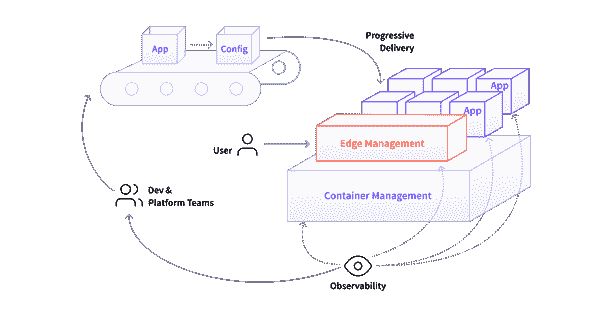
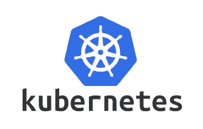
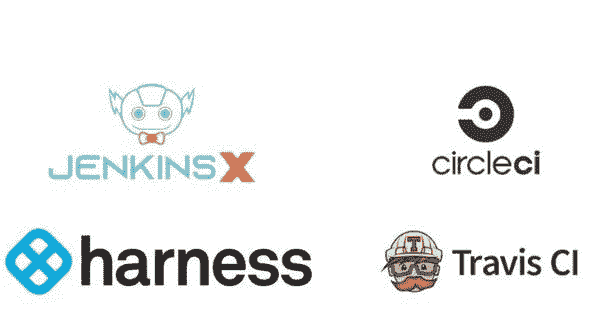
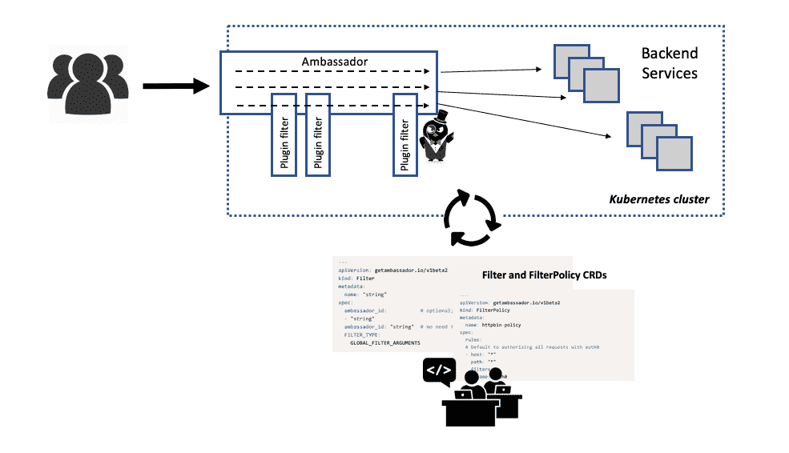
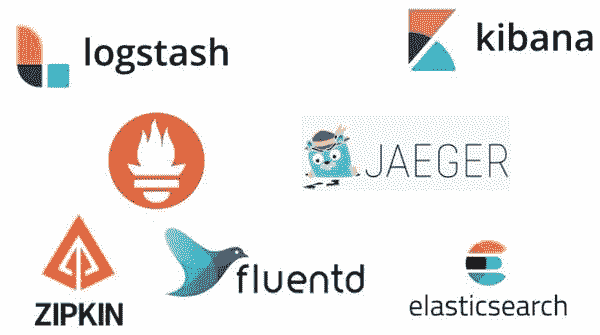

# 构建基于 Kubernetes 的平台:关注渐进式交付、边缘和可观察性

> 原文：<https://itnext.io/building-a-kubernetes-based-platform-focus-on-progressive-delivery-the-edge-and-observability-3a702e0c19a7?source=collection_archive---------3----------------------->

## 平台组件、技术和反模式

Kubernetes 作为一个容器管理器已经被广泛采用，并且已经在各种组织的生产中运行了几年。因此，它为支持云原生平台的其他[三种功能提供了坚实的基础:渐进式交付、边缘管理和可观察性。这些功能可以分别由以下技术提供:连续交付管道、边缘堆栈和可观察性堆栈。](/enabling-full-cycle-development-four-core-cloud-platform-capabilities-8670e5a4cd04)

几乎每个云供应商或私有云解决方案都支持 Kubernetes 容器编排框架的部署和操作。自 2014 年谷歌首次发布 Kubernetes 以来，一个围绕该框架的大型社区已经形成，通常由现在是该项目的管理者的组织[云本地计算基金会(CNCF)](https://www.cncf.io/) 推动。

从 Kubernetes 开始，让我们探索一下这些技术是如何集成起来提供云平台的核心功能的。

# 库伯内特斯

继 [Docker](https://www.docker.com/) 的早期成功之后，容器已经成为云部署的标准单元(“工件”)。用任何语言编写的应用程序都可以构建、打包并“密封”在容器映像中。然后可以在支持容器映像格式的任何地方部署和运行这些容器。这是流行的软件开发概念“编写一次，在任何地方运行”的云原生实现，只是现在代码的编写已经被代码的构建和打包所取代。

容器的流行可以用三个因素来解释:容器比虚拟机需要更少的资源来运行(以共享底层操作系统内核为代价)；Dockerfile 清单格式为开发人员定义“刚好够用”的构建和部署配置提供了很好的抽象；Docker 为开发人员开创了一种以自助方式组装应用程序的简单方法( [docker build](https://docs.docker.com/engine/reference/commandline/build/) )，并通过共享注册表和公共 [Docker Hub](https://hub.docker.com/) 实现了对容器化应用程序的轻松共享和搜索。

尽管容器本身是一个强大的抽象，但它并不管理操作问题，比如当底层硬件出现故障时重新启动和重新调度。为此，需要一个容器编排框架。类似于 Kubernetes。

# 控制循环和共享抽象

Kubernetes 使开发团队能够以一种自助式的方式工作，与运行容器的操作方面相关。例如，定义应用程序的活跃度和就绪性探测，以及指定运行时资源需求，如 CPU 和内存。这个配置然后由 Kubernetes 框架内的控制循环解析，它尽一切努力确保开发人员的规范与集群的实际状态相匹配。运营团队还可以定义全局访问和部署策略，使用[基于角色的访问控制(RBAC)](https://kubernetes.io/docs/reference/access-authn-authz/rbac/) 和[准入 webhooks](https://kubernetes.io/docs/reference/access-authn-authz/extensible-admission-controllers/) 。这有助于限制访问，并指导开发团队在部署应用程序时采用最佳实践。

除了提供容器运行时和编排框架，Kubernetes 还允许开发人员和平台团队使用标准化的工作流和工具集进行交互、共享和协作。它通过几个核心抽象来做到这一点:作为部署单元的*容器*，作为运行时配置组件的*容器*(组合容器，并定义部署、重启和重试策略)，以及作为应用程序高级的、以业务为中心的组件的*服务*。

# Kubernetes 即服务或自托管

Kubernetes 本身在部署、操作和维护上有点复杂。因此，采用该框架时的一个核心决策是，是否使用托管产品，如[谷歌 GKE](https://cloud.google.com/kubernetes-engine) 、[亚马逊 EKS](https://aws.amazon.com/eks/) 或 [Azure AKS](https://azure.microsoft.com/en-us/services/kubernetes-service/) ，或者是否使用 kops 和 kubeadm 等管理工具自行管理。

第二个重要的决定是使用 Kubernetes 的哪个发行版。默认的开源 Kubernetes upstream 发行版提供了所有的核心功能。毫不奇怪，云供应商经常扩充他们的发行版，以便更容易与他们周围的生态系统集成。其他平台供应商，如 [Red Hat](https://www.openshift.com/) 、 [Rancher](https://rancher.com/) 或 [Pivotal](https://pivotal.io/platform/pivotal-container-service) 提供跨许多云平台有效运行的发行版，它们也包括各种增强功能。通常，额外的功能集中于支持企业用例，关注安全性、同质化工作流，并提供全面的用户界面(ui)和管理员仪表盘。

Kubernetes 文档提供了额外的信息来帮助这些选择。

# 避免平台反模式

Kubernetes 提供的核心开发抽象——容器、pod 和服务——促进了开发和运营团队之间的协作，并有助于防止所有权孤岛。这些抽象还减少了开发人员需要自己动手并开始在系统本身内部构建“微平台”的可能性。

Kubernetes 也可以在本地部署，这在采用的早期阶段可以帮助解决开发人员反馈慢或有限的挑战。随着组织对 Kubernetes 使用的增加，他们可以利用大量工具来解决本地到远程开发的挑战。像 [Telepresence](https://www.telepresence.io/) 、 [Skaffold](https://skaffold.dev/) 、 [Tilt](https://tilt.dev/) 和 [Garden](https://garden.io/) 这样的工具都为开发人员提供了从编码(可能针对远程依赖)、构建到验证的反馈回路。

# 连续输送管道

[持续交付](https://continuousdelivery.com/)的主要动机是按照组织的要求，快速、安全地将任何和所有应用程序变更(包括实验、新功能、配置和错误修复)交付到生产中。这种方法基于这样一种想法，即能够快速迭代提供了竞争优势。应用程序部署应该是常规的、无戏剧性的事件，由以产品为中心的开发团队按需安全地启动，组织应该能够以可持续的方式不断创新和做出改变。

# 改善反馈回路

[渐进交付](https://redmonk.com/jgovernor/2018/08/06/towards-progressive-delivery/)扩展了持续交付的方法，旨在改善开发人员的反馈循环。利用云原生流量控制机制和改进的可观察性工具，开发人员可以更轻松地在生产中运行受控实验，通过仪表板近乎实时地查看结果，并在需要时采取纠正措施。

连续交付和渐进交付的成功实现依赖于开发人员能够定义、修改和维护编码所有构建、质量和安全断言的管道。采用云原生方法时要做出的核心决策主要基于两个因素:组织拥有多少现有的连续交付基础架构；和应用程序工件所需的验证级别。

# 发展组织的持续交付方法

对现有的连续交付工具进行大量投资的组织通常不愿意放弃这一点。Jenkins 可以在许多企业环境中找到，运营团队通常投入大量时间和精力来理解这个工具。不管是好是坏，Jenkins 的可扩展性使得许多插件的创建成为可能。有用于执行代码质量分析、安全扫描和自动化测试执行的插件。还有与质量分析工具的广泛集成，如 [SonarQube](https://www.sonarqube.org/) 、 [Veracode](https://www.veracode.com/) 和 [Fortify](https://www.microfocus.com/en-us/solutions/application-security) 。

作为云构建前的工具，最初的 Jenkins 项目在与 Kubernetes 等框架集成时，通常可以进行调整以满足新的需求。然而，还有一个[全新的](https://gitpitch.com/sharepointoscar/presentations/master#/11)项目，[詹金斯 X](https://jenkins-x.io/) ，那是云原生世界的精神对应物。Jenkins X 是使用新的代码库和不同于原始 Jenkins 的架构构建的，目标是原生支持 Kubernetes。[渐进式交付](https://jenkins-x.io/docs/managing-jx/tutorials/progressive-delivery/)的核心概念也内置在 Jenkins X 中

在持续交付管道工具方面现有投资有限的组织通常选择使用云原生托管选项，如 [Harness](https://harness.io/) 、 [CircleCI](https://circleci.com/) 或 [Travis](https://travis-ci.org/) 。这些工具侧重于为开发人员提供简单的自助式配置和执行。然而，有些工具不像在内部部署和管理的工具那样具有可扩展性，并且所提供的功能通常侧重于构建工件，而不是部署它们。运营团队通常对管道的了解也较少。出于这个原因，许多团队将构建和部署自动化分开，并使用持续交付平台，如 [Spinnaker](https://www.spinnaker.io/) 来编排这些操作。

# 避免平台反模式

连续交付管道基础设施通常是开发和运营之间的桥梁。这可以用来解决代码和运行时所有权的传统问题。例如，平台团队可以与开发团队合作，提供代码构建包和模板，这可以减轻“一刀切”方法的影响，也可以消除开发人员构建自己的解决方案的诱惑。

持续的交付渠道对于改善开发者的反馈也是至关重要的。在类似生产的环境中部署准备好测试的应用程序的快速管道将减少对上下文切换的需求。部署模板和基础配置也可以添加到管道中，以便对所有应用程序(例如，日志收集或公制发射器)提出共同的可观察性要求。这可以极大地帮助开发人员获得和理解生产系统，并帮助解决调试问题，而不需要依赖运营团队来提供访问。

# 边缘堆栈

运行有效的数据中心边缘(在现代云平台配置中通常是 Kubernetes 集群边缘)的主要目标有三个:

*   支持应用程序和新功能的受控发布；
*   支持跨功能边缘需求的配置，例如安全性(认证、传输层安全性和 DDoS 保护)和可靠性(速率限制、电路中断和超时)；
*   支持开发人员入职和相关 API 的使用。

# 将发布与部署分开

云原生软件交付的当前最佳实践是[将部署与发布](https://www.thoughtworks.com/radar/techniques/decoupling-deployment-from-release)分开。连续交付管道处理应用程序的构建、验证和部署。当具有预期业务影响的功能更改对最终用户可用时，就发生了“发布”。使用诸如黑暗启动和金丝雀发布之类的技术，可以更频繁地将变更部署到生产环境中，而没有大规模负面用户影响的风险。

更频繁、迭代的部署降低了与变更相关的风险，同时开发人员和业务涉众保留了对何时向最终用户发布特性的控制。

# 通过自助服务扩展边缘运营

在采用微服务构建的云原生系统中，必须有效应对扩展边缘操作和支持多种架构的[挑战](https://www.getambassador.io/resources/challenges-api-gateway-kubernetes)。对于在单个服务或 API 领域内快速迭代的开发人员以及在全球系统范围内工作的平台团队来说，配置 edge 必须是自助服务。edge 技术堆栈必须为一系列协议、架构风格和交互模型提供全面的支持，这些在多语言堆栈中很常见。

# 避免平台反模式

系统中公开的每个 API 都是基于 SOAP 或 REST 的日子已经一去不复返了。有了像 [WebSockets](https://developer.mozilla.org/en-US/docs/Web/API/WebSockets_API) 、 [gRPC](https://grpc.io/) 和 [CloudEvents](https://cloudevents.io/) 这样的一系列协议和标准，不可能再有一种“一刀切”的方法来实现边缘。现在，边缘堆栈的所有部分都支持多种本地协议。

Kubernetes 系统的边缘是开发人员和平台团队的另一个关键协作点。平台团队希望通过集中认证和授权等核心功能来减少碎片化。开发人员希望避免在正常工作流程中提出配置和发布服务的请求，因为这只会增加摩擦，减少向最终用户交付功能的周期时间。

# 可观测性堆栈

“[可观测性](https://en.wikipedia.org/wiki/Observability)的概念源于数学[控制理论](https://en.wikipedia.org/wiki/Control_theory)，是对系统内部状态从其外部输出的知识中推断出来的程度的度量。软件可观测性的现代解释几乎与云原生系统的兴起同步发展；在这种情况下，可观察性关注于使用诸如监控、记录和跟踪等方法来推断软件系统中正在发生什么的能力。

正如在谷歌 SRE 的书中流行的，假定[服务水平指标(SLI)](https://cloud.google.com/blog/products/gcp/sre-fundamentals-slis-slas-and-slos) 是系统消费者关心的“健康”的某个方面的指标(通常通过 SLO 指定)，有两个可观察性的基本目标:

*   逐渐改进 SLI(可能在几天、几周、几个月内进行优化)
*   快速恢复 SLI(对事件立即做出反应)

从这一点出发，可观测性栈必须提供两个基本活动:检测，这是精确测量 sli 的能力；和细化，这是一种减少对一个问题的合理解释的搜索空间的能力。

# 可理解性、可审核性和可调试性

与改进或恢复 sli 的目标密切相关的是支持软件系统中可观察性的额外动机:可理解性、可审计性和可调试性。随着软件系统在整个社会中变得无处不在和任务关键，理解和审计它们的需求急剧增加。人们不会轻易相信他们无法理解的东西。如果一个系统被认为有不正确的行为，或者有人声称它有，那么回顾审计声明并证明或否定这一点的能力是非常宝贵的。

不幸的是，云原生技术和架构的采用使得实现可观测性变得更加困难。当大规模运行时，理解分布式系统本身就更加困难。并且现有工具不支持通过不可靠网络通信的高度模块化系统的有效调试。需要一种新的方法来创建云本地可观测性栈。

# 可观察性的三大支柱:一个解决方案

现代可观测性领域的思想领袖，如[辛迪·斯里达哈兰](https://medium.com/@copyconstruct/monitoring-in-the-time-of-cloud-native-c87c7a5bfa3e)、[慈善专业](https://thenewstack.io/observability-a-3-year-retrospective/)和[本·西格曼](https://lightstep.com/blog/three-pillars-zero-answers-towards-new-scorecard-observability/)，已经写了几篇很棒的文章，介绍了云原生可观测性的“三大支柱”，即监控、日志记录和分布式跟踪。然而，他们也告诫说，不应孤立地看待这些支柱。相反，应该寻求一个整体的解决方案。

云原生空间中的监控通常通过 CNCF 托管的 [Prometheus](https://prometheus.io/) 应用或类似的商业产品来实现。指标通常是通过使用 statsd 协议的容器化应用程序或本地语言 Prometheus 库发出的。使用指标可以很好地洞察应用和平台的即时快照，还可以用来触发警报。像 [Honeycomb](https://www.honeycomb.io/) 这样的创新工具可用于提供对指标和事件的更多洞察。

日志通常作为事件从容器化的应用程序中发出，通过一个公共接口，比如 STDOUT，或者通过应用程序中包含的日志 SDK。流行的工装有 [Elasticsearch](https://www.elastic.co/) 、 [Logstash](https://www.elastic.co/logstash) 和 [Kibana](https://www.elastic.co/kibana) 、[(麋鹿)stack](https://www.elastic.co/what-is/elk-stack) 。Fluentd ，一个 CNCF 主持的项目，经常被用来代替 Logstash。当追溯性地试图理解应用程序中发生的事情时，日志记录是有价值的，并且还可以用于审计目的。

分布式跟踪通常使用 [OpenZipkin](https://zipkin.io/) 或 CNCF 托管的 [Jaegar](https://www.jaegertracing.io/) 工具，或类似的商业工具如 [LightStep](https://lightstep.com/) 来实现。跟踪实际上是一种基于事件的日志记录形式，它包含某种形式的关联标识符，可用于将来自与单个最终用户请求相关的多个服务的事件缝合在一起。这为请求提供了端到端的洞察力，并可用于识别系统中有问题的服务(例如，潜在的服务)或理解请求如何通过系统以满足相关的用户需求。

来自[数据网格范例](https://martinfowler.com/articles/data-monolith-to-mesh.html)的许多原则适用于可观察性的主题。平台工程师必须提供一系列可观测性数据访问工具和 API，供开发人员以自助方式消费。

# 避免平台反模式

对于云的原生可观察性，没有“一刀切”的方法。虽然可观察性数据的发出和收集应该标准化以避免平台碎片化，但是在定义和分析特定于应用和服务的指标时的自助服务能力对于开发人员来说是至关重要的，以便在不可避免的故障发生时能够跟踪健康状况或修复某些东西。组织中常见的一种反模式是，为了跟踪特定的指标或者将这些指标合并到仪表板中，需要提交票据。这完全违背了启用快速开发循环的原则，这在新功能发布或生产事故发生时尤为重要。

# 总结和结论

Kubernetes 已被广泛采用，并在各种组织的生产中运行了几年。因此，它为支持支持全周期开发的云原生平台的其他三种功能提供了坚实的基础。这些功能可以分别由以下技术提供:连续交付管道、边缘堆栈和可观察性堆栈。

投资于这些技术和相关的最佳实践工作流将加速组织的旅程，以看到采用云原生和全周期开发原则的好处。

要了解有关在您的组织中采用这些技术的更多信息，请单击此处下载我们的白皮书[“Kubernetes 平台的 4 个基本要素”](https://www.getambassador.io/downloads/whitepaper-4-essential-elements-kubernetes-platform.pdf)。