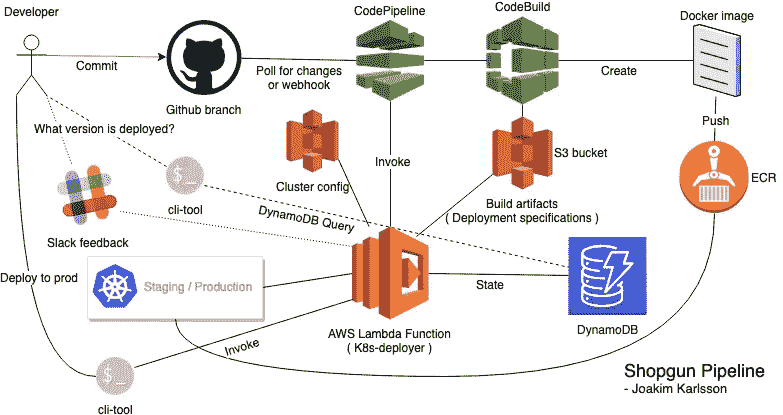
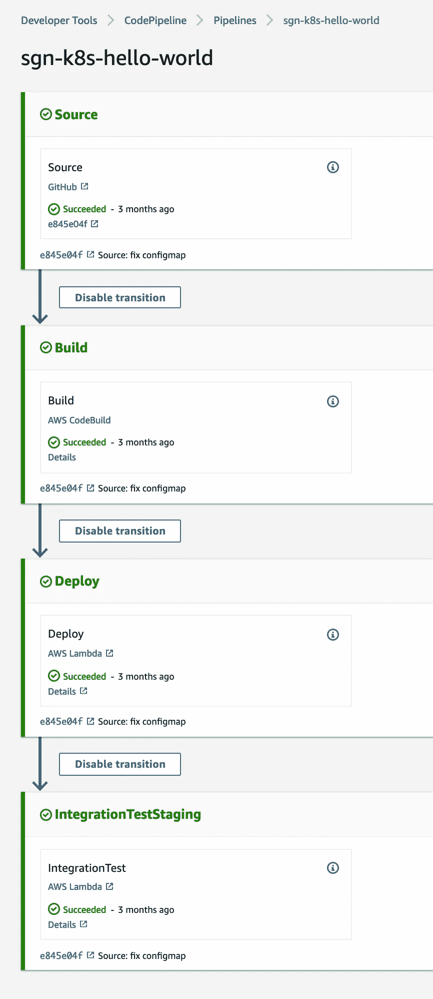
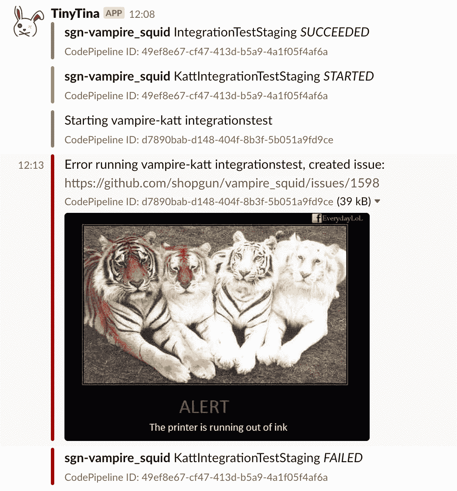
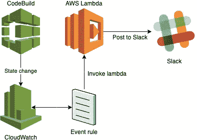
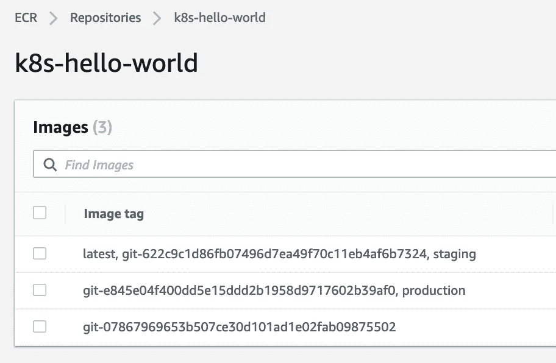
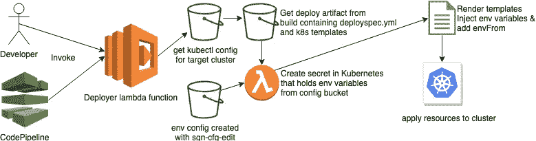
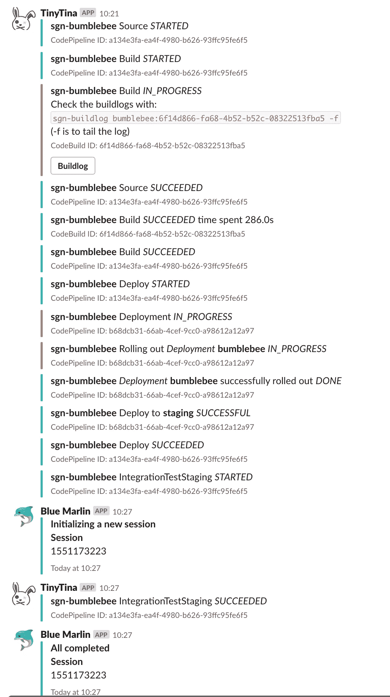
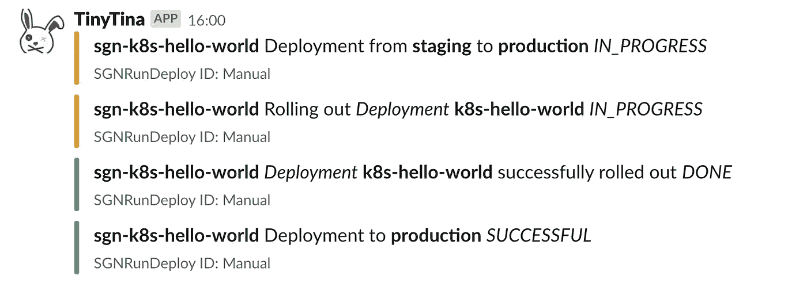
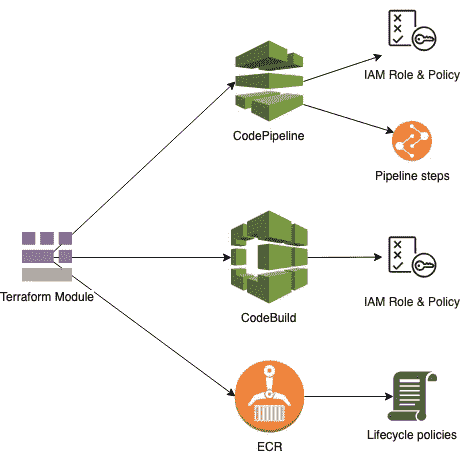

# 使用 CodePipeline & CodeBuild @ Shopgun 在 AWS 上构建 Kubernetes CI/CD 管道

> 原文：<https://itnext.io/building-a-kubernetes-ci-cd-pipeline-on-aws-with-codepipeline-codebuild-shopgun-43ccf76277b5?source=collection_archive---------1----------------------->

手动构建容器并部署到集群可能非常繁琐。

在这篇文章中，我将展示我是如何在 [AWS](https://aws.amazon.com/f) 上使用 [CodePipeline](https://docs.aws.amazon.com/codepipeline/latest/userguide/welcome.html) 、 [CodeBuild](https://aws.amazon.com/codebuild/) 、 [CloudWatch](https://aws.amazon.com/cloudwatch/) 、 [ECR](https://aws.amazon.com/ecr/) 、 [DynamoDB](https://aws.amazon.com/dynamodb/) 、[Lambda](https://aws.amazon.com/lambda/)some[Python](https://www.python.org/)和 [Terrafor](https://www.terraform.io/) m 为 [Shopgun】构建一个管道的](https://shopgun.com)

它不需要运行构建服务器，并自动构建和部署到登台环境。

定价模式是构建运行时按分钟付费。你还可以从亚马逊❤️每月获得一堆免费的构建时间👍

从这里开始，我将把这些不同部分的编排称为“管道”。

Staging & Production 是在 AWS 中运行的 Kubernetes 集群。

你可以在我之前的文章[Kubernetes in production @ shop gun](https://medium.com/@roffe/kubernetes-in-production-shopgun-2c280f0c0923)中读到它们。

# 介绍

管道的目的是构建我们的软件项目，在 docker 映像中组装工件，存储这些映像并将它们部署到登台环境中。

每当一个项目版本被构建并部署到试运行环境中时，开发人员可以通过一两次调用 CLI 脚本轻松地将该构建部署到生产环境中。

试着说明一下，它看起来是这样的。

事不宜迟，我们开始吧！

# 代码管道

在 AWS 中，这是将它们连接在一起的粘合剂。

> AWS CodePipeline 是一种持续的交付服务，您可以使用它来对发布软件所需的步骤进行建模、可视化和自动化。您可以快速地对软件发布过程的不同阶段进行建模和配置。CodePipeline 自动执行连续发布软件变更所需的步骤。

我们创建一个代码管道项目，分几个步骤构建、测试和部署代码。

软件项目管道由一个[地形模块](https://www.terraform.io/docs/modules/usage.html)创建，该模块已包含在下文中。

它创建的 CodePipeline 项目具有以下项目步骤:

## 来源

这一步从 Github repo 获取源代码，并准备在管道中使用。

## 建设

源代码被发送到 CodeBuild 进行构建，然后被推送到 ECR。

## 部署

这一步从构建步骤中提取工件，并调用一个定制的 lambda 函数来处理 Kubernetes 集群的部署。

## 集成测试

这一步调用 lambda 函数，该函数向内部软件发送一个触发器，以在登台环境中运行集成测试。

对于他们中的大多数人，我们使用一个名为“Blue Marlin”或“katt”的内部工具，如果它失败了，可以通过 Slack & Github 进行报告，如下所示:

包含卡特彼勒税

为了调用这些软件，我们使用 Lambda 函数作为代码管道和测试套件之间的“代理”。

它唯一的目的是将事件转发给运行 web 服务器监听“开始”信号的测试套件。

以及附带的 terraform 代码:

# 代码构建

> AWS CodeBuild 是云中完全托管的构建服务。CodeBuild 编译您的源代码，运行单元测试，并生成准备部署的工件。CodeBuild 消除了供应、管理和扩展您自己的构建服务器的需要。它为最流行的编程语言和构建工具(如 Apache Maven、Gradle 等)提供了预打包的构建环境。您还可以在 CodeBuild 中自定义构建环境，以使用您自己的构建工具。CodeBuild 自动扩展以满足高峰构建请求。

在这条管道中，我们只使用 CodeBuild 来构建 Docker 映像，但是它附带了一组不同的[构建映像](https://docs.aws.amazon.com/codebuild/latest/userguide/build-env-ref-available.html)供您使用。

每个项目都有一个[build spec . yml](https://docs.aws.amazon.com/codebuild/latest/userguide/build-spec-ref.html)&deploy spec . yml，它位于包含项目构建设置和部署设置的项目源文件夹的根目录下。

## 安装阶段

安装阶段获得一个 [ECR](https://aws.amazon.com/ecr/) 登录，这样我们的构建项目一旦构建好就可以推送它的 [Docker 映像](https://www.docker.com/resources/what-container)。

## 构建阶段

在这里，我们构建 docker 映像，并将其标记为**最新**和 **git- < commitref >。**

在构建映像之后，使用在安装阶段获得的凭证将它推送到 ECR repo。

## 史前古器物

*   **deployspec.yml** ，它保存部署 lambda 函数的模板值&设置。
*   **deploy/*** 是项目的 jinja2 模板化 Kubernetes yaml 文件，它们与 [Dockerfile](https://docs.docker.com/engine/reference/builder/) 和项目源代码一起保存在 Github repo 中。

## 构建日志

来自 CodeBuild 的日志被推送到 [CloudTrail](https://aws.amazon.com/cloudtrail/) 。

开发人员可以使用一个小脚本在他们的终端上直接获取日志。它甚至有一个漂亮的尾巴功能😃

我们还使用在 [CloudWatch 事件](https://docs.aws.amazon.com/AmazonCloudWatch/latest/events/WhatIsCloudWatchEvents.html)上触发的 Lambda 函数向 Slack 输出 CodeBuild & CodePipeline 状态。

用于创建 Lambda 函数的 terraform 代码:

创建一个名为 terraform.tfvars 的文件来保存你的 Slack hook url 和 KMS id。

> slack _ hook _ URL = " hooks . slack . com/services/123/456/789 "
> kms _ id = "<您的 kms id >"

## Deployspec.yml

该文件包含关于[部署者](https://github.com/roffe/k8s-deployer)应该使用什么文件和名称空间的规范，以及您想要传递给模板呈现器的任何定制模板值。

## 环境秘密

如果设置为 true，则在包含应用程序环境配置的目标集群中创建一个名为 <projectname>- <env>的 K8S 中的秘密。</env></projectname>

部署人员从 S3 存储桶**S3://<my-config-bucket/<project name>/config**中获取这些内容

## 投机

这一部分指定当部署者执行时要创建什么资源。

目前支持的是

*   配置图
*   服务
*   部署—这用于部署
*   有状态—有状态集
*   进入
*   克朗—克朗乔布
*   pdb — pod 中断预算
*   服务监视器

## 模板

名称**staging.domain.com**&**production.domain.com**指的是 Lambda 函数使用的 kubectl 配置中的上下文名称，以了解它正在对哪个集群执行操作。

任何列在“spec”下的清单都将在部署之前通过 jinja2 模板渲染器进行解析。

通过将渲染器可用的值添加到 Deployspec 来映射这些值。

trim_blocks 和 lstrip_blocks 都使能，[参见文档](http://jinja.pocoo.org/docs/2.10/templates/)。

## 模板值

以下是内置模板值:

*   **集群名称** —集群的名称
*   **deploy_env** —当前部署环境
*   **名称空间** —在 deployspec.yml 中定义的名称空间
*   **deploy_image** —从上次构建到 docker 映像的完整 URI
*   **docker_tag** —图像的 docker 标签，例如“git-asd123”
*   **项目** —项目名称

您可以在模板中使用它们，比如: **{{cluster_name}}。**

# ECR——弹性容器注册

> Amazon Elastic Container Registry(ECR)是一个完全托管的 Docker 容器注册表，它使开发人员可以轻松地存储、管理和部署 Docker 容器映像。

它用于存储由 CodeBuild 在管道中生成的图像。

所有 Kubernetes 节点也被授权从那里创建的私有 repos 中提取图像。

用于创建管道的 terraform 模块还设置了一些生命周期策略规则来清除旧的未使用的图像。

当 CodeBuild 构建并推送图像时，我们将它们标记为 git- <commitref>和 latest。</commitref>

将映像部署到环境中时，lambda 函数还会将环境名称作为标签添加到映像中。

如果它已经存在，标签只是简单地移动到新的图像。

# DynamoDB

> Amazon DynamoDB 是一个完全托管的 NoSQL 数据库服务，提供快速、可预测的性能和无缝的可伸缩性。DynamoDB 让您可以减轻操作和扩展分布式数据库的管理负担，因此您不必担心硬件供应、设置和配置、复制、软件修补或集群扩展。

我将此作为 deployer 和 cli 工具在何时何地部署了哪个版本的“事实点”。

## 列出部署的内容

我编写了一个小的 bash 脚本，列出了我们钟爱的终端❤中部署了什么

酱汁:

# Python Lambda 函数

这是管道的核心，这个 lambda 函数通过 sgn-deploy 脚本接受来自代码管道和用户的调用。

> AWS Lambda 允许您在不提供或管理服务器的情况下运行代码。您只需为您消耗的计算时间付费，当您的代码不运行时，则不收费。有了 Lambda，你可以为几乎任何类型的应用程序或后端服务运行代码——所有这些都无需管理。只需上传你的代码，Lambda 就会为你的代码提供高可用性的运行和扩展。您可以将代码设置为从其他 AWS 服务自动触发，或者直接从任何 web 或移动应用程序调用它

lambda 函数的源代码可以在这里找到[https://github.com/roffe/k8s-deployer](https://github.com/roffe/k8s-deployer)。

构建和部署到 staging 是由 Github 的提交触发的。

在试运行阶段完成自动构建后部署到生产环境非常简单:

然后在松弛部分我们可以看到:

和一些酱用于上面的脚本:

## 将（行星）地球化（以适合人类居住）

为了创建管道，我写了一个小的 terraform 模块，我称之为“机器人先生”。

*   创建必要的 IAM 权限和角色
*   创建代码管道项目和步骤
*   创建代码构建项目
*   创建 ECR 报告并设置映像生命周期

要使用带有必要参数的模块调用:

模块代码如下:

# 奖金的东西

## 镜像图像

我发现有时将公共图像镜像到私有 ECR repo 很方便，这样可以确保您对图像的控制。

此外，它还可以防止 Docker Hub 出现故障，没有人能够提取图像的罕见情况😅

## 来源

## 从 CLI 管理环境配置文件

几个漂亮的 shell 脚本来管理存储在 S3 存储桶上的 env 配置文件。

## sgn-cfg-cat

这个脚本将打印出您的配置文件。

## SGN-CFG-编辑<project></project>

在您的首选编辑器中打开配置，并在保存和退出时询问您是否要上传(任何)更改。

## sgn-cfg-ls

列出您的配置桶中有哪些应用程序。

# 临终遗言

本文中的例子可能并不适合所有人，但它应该是一个足够的基础，能够适应任何人可能有的需求。

我希望你觉得这本书值得一读，并且我已经启发你用新的创造性的方法来使用 AWS 中的不同组件！

[Shopgun](https://shopgun.com/about) 正在寻找对基础设施感兴趣的新人才& Docker/Kubernetes。如果你觉得这是你的兴趣所在，也许你有软件开发的背景，并且想采取下一步行动，从前端&后端一直到基础设施，你应该在 joakim (a) roffe.nu 上联系我。

下次见！👋 👋 👋