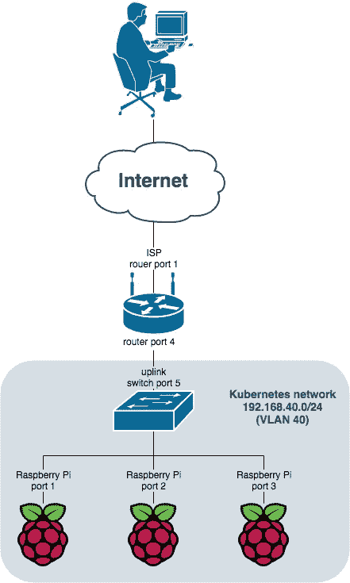
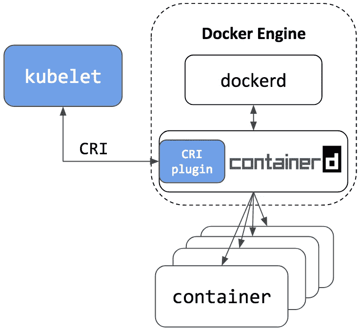
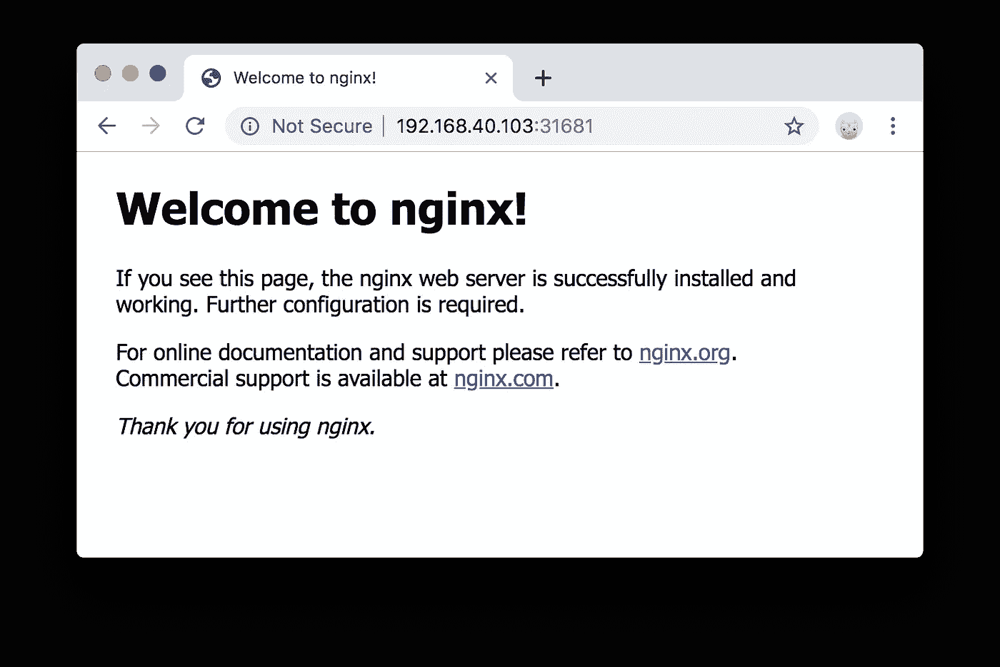

# 在 Raspberry Pi 和低端设备上构建 kubernetes 集群。第一部分

> 原文：<https://itnext.io/building-a-kubernetes-cluster-on-raspberry-pi-and-low-end-equipment-part-1-a768359fbba3?source=collection_archive---------0----------------------->

在这一系列文章中，我将使用 Raspberry Pi 设备构建一个 kubernetes 集群作为计算平台的基础。Kubernetes 是一个流行的系统，用于部署自动化、容器编排；它包含了如此多的特性(伸缩性、负载平衡、卷管理、安全性等等)，以至于我更愿意称 kubernetes 为一个生态系统。

在硬件层面——我只会使用在任何计算机硬件商店都能买到的廉价设备:路由器、交换机和存储服务器。

由于 kubernetes 覆盖了 90%的软件需求，我仍然可以使用一些 ansible 来实现自动化；现代的路由器、交换机和存储服务器运行在类似 UNIX 的操作系统之上，所以我也要用一点。

最终，kubernetes 集群应该作为云基础设施工作，我可以在类似云的环境中运行应用程序，从互联网访问它们，有状态的应用程序将能够使用数据存储层。

第 1 部分将关注基本的东西:Raspberry Pi 设备需求、kubernetes 节点供应、集群设置。

# 硬件设置概述

我将使用由路由器 *Microtik hEX S(RB760iGS)* 组成的家用设备。售价 69.00 美元，它提供了通常只有思科、Juniper 等厂商的高端路由器才有的各种功能。一个路由器端口用于连接互联网服务提供商。另一个端口连接路由器和交换机。

这种交换机*的 D-Link DGS-1005 P* 售价不到 50 美元，它有五个千兆以太网端口。四个端口 [*以太网供电*](https://en.wikipedia.org/wiki/Power_over_Ethernet) *(PoE)* 使能。端口 5 用于连接路由器。那种链路叫做*上行*。其他四个端口可用于连接*树莓 Pi* 设备。由于端口上的 *PoE* ， *Raspberry Pi* 设备不需要通过 USB 供电。

由于 Kubernetes 集群与我的家用设备共享网络，我决定将其隔离在 VLAN 中。对我来说，这不是必需的，只是为了方便。



图一。网络安装程序

谈论细节。我们有以下组件:

*   mikro tik Rb 760 IGS——路由器。该设备为 Kubernetes 集群提供互联网连接、VLAN 交换、DHCP 服务器、NAT、动态 DNS 等功能
*   [D-Link DGS-1005P](https://www.dlink.com/en/products/des-1005p-5-port-10100-switch-with-4-poe-ports) —带有 4 个 PoE 启用端口的非托管交换机。交换机为 Raspberry Pi 提供电源，并与路由器和 Kubernetes 节点进行数据链路层交换
*   [Raspberry Pi 3 型号 B+](https://www.raspberrypi.org/products/raspberry-pi-3-model-b-plus/) —一台配备 1.4GHz 64 位四核处理器、1GB RAM、千兆以太网的迷你电脑
*   [Raspberry Pi PoE HAT](https://www.raspberrypi.org/products/poe-hat/)—Raspberry Pi 扩展，允许通过以太网为设备供电
*   microSDHC 灭蚁灵(class10) 8GB — SD 卡，带 Raspberry Pi 操作系统


图二。运行中的网络设置

在图 2 中，路由器是白盒，交换机是黑盒。黄色电缆是上行链路(交换机到路由器的连接)。灰色电缆连接 Raspberry Pi 设备和交换机。

# 软件概述

让我们从列出我们将使用的所有软件组件开始。

1.  Ubuntu 18.04:一个操作系统
2.  [Docker 引擎](https://www.docker.com/products/container-runtime):容器运行时
3.  [](https://kubernetes.io/docs/reference/command-line-tools-reference/kubelet/)*:运行在每个节点上的“节点代理”*
4.  *[*kubeadm*](https://kubernetes.io/docs/reference/setup-tools/kubeadm/kubeadm/) :创建 Kubernetes 集群的工具*
5.  *[*kubectl*](https://kubernetes.io/docs/reference/kubectl/overview/) :针对 Kubernetes 集群运行命令的命令行接口*

*列表不完整。Kubernetes 的组件更多: *kube-apiserver* 、 *kube-scheduler* 、*kube-controller-manager*、 *etcd* 、 *kubelet* 、 *kube-proxy* 以及不可数的 addons。详细情况最好参考官方文档 [**Kubernetes 组件**](https://kubernetes.io/docs/concepts/overview/components/) 。*

*在这种情况下，kubeadm 将在 Kubernetes 集群初始化时安装这些组件。*

## *操作系统*

*我在另一篇文章中写过关于操作选择的内容: [**Golang 为 Raspberry Pi 3 开发。**入门](https://medium.com/@eduard.iskandarov/golang-development-for-raspberry-pi-3-getting-started-c6d5a97850d1)。*

*TL；博士；医生*

*Ubuntu 18.04 有 ARM 64 版本，甚至为 Raspberry Pi 准备了操作系统映像。Google 用 Kubernetes 为 ARM 64 构建 deb 包。*

*此外，请参考该文章，了解如何将操作系统映像刷新到 SD 卡并确定设备的 IP 地址。*

## *容器运行时和 Kubernetes 组件*

*毫不奇怪，我们将使用 *Docker 引擎*来运行容器。尽管有[*rkt*](https://coreos.com/rkt/)[*CRI-o*](https://cri-o.io/)等替代。然而，仔细观察，我们可以看到 Kubernetes 使用了 [*containerd*](https://containerd.io/) 。对容器运行时的深入讨论超出了本文的范围。*

**kubelet* 是一个节点代理。它与主节点上的 *kube-apiserver* 通信，另一方面与本地容器运行时通信，以便按照主命令 so 运行 Docker 容器。*

**

*图 3。Kubernetes 节点组件*

*kubectl 是一个命令行界面，用于针对 Kubernetes 集群运行命令。它可以创建/读取/更新/删除 kubernetes 中的资源。例如:*

```
*$ kubectl create -f deployment.yaml
$ kubectl create secret generic db-pass --from-file=./password.txt$ kubectl get pods
$ kubectl --namespace=kube-system edit deployment coredns
$ kubectl delete node node1.kube.local*
```

*kubeadm 是一个 Kubernetes 集群创建工具。在简单的情况下— `kubeadm init`命令创建一个 kubernetes 主节点；`kubeadm join`命令通过将节点与主节点相关联来将节点加入集群。*

# *创建 Kubernetes 集群*

*假设 SD 卡是用 Ubuntu 18.04 操作系统闪存的，SD 卡被插入设备，所有需要的布线都完成了，我们就有了如图 2 所示的东西。*

*现在我们可以开始本文最激动人心的部分了——在 Raspberry Pi 上创建并运行 Kubernetes 集群。*

*首先，从资源调配开始。为了自动化供应，我使用了 [ansible](https://www.ansible.com/) 。自动化脚本和文档可以在 GitHub 库[https://github.com/toidi/home-kubernetes/](https://github.com/toidi/home-kubernetes/)获得。此外，在这篇文章中，我将尽量保持一个可翻译的小部分，它应该可以手动重现所有的步骤。*

## *Kubernetes 主节点和节点供应*

*Kubernetes 乍一看是一个复杂的系统。幸运的是，所有的复杂性都隐藏在几个可靠且优化良好的组件后面；比如 kubelet 和容器运行时。*

*另一方面，应特别注意网络规划。*

*在主服务器上注册后，kubernetes 节点提供其名称。该名称应该是唯一的，并且可被解析器(域名系统)发现。在云基础设施中，如亚马逊网络服务、谷歌云平台、微软 Azure 和其他——这是一种原生功能。任何虚拟机都有唯一且可解析的主机名；例如，`ip-12-34-56-78.us-west-2.compute.internal`被解析为`12.34.56.78` IP 地址。
在我们的例子中，Raspberry Pi 设备默认有相似的主机名，这需要修正。有几种方法可以做到这一点。
最先进的将是 DHCP(动态主机配置协议)服务器与 DNS(域名系统)服务器的集成，但对于我们力求简单的设置来说，这可能太复杂了。*

*因此，为了解决这个问题，我们做了以下工作:
使用 [*hostnamectl*](https://www.freedesktop.org/software/systemd/man/hostnamectl.html) 命令行工具(例如`hostnamectl set-hostname node1.kube.local`)更新每台主机上的主机名，并在 */etc/hosts* 文件中为每台主机添加一条记录。*

```
*192.168.40.102 master1.kube.local
192.168.40.103 node1.kube.local
192.168.40.104 node2.kube.local*
```

*因为我使用 ansible automation。任务看起来如下:*

```
*- name: Update hosts file
  lineinfile:
    dest: /etc/hosts
    line: "{{ hostvars[item].ansible_host }} {{ item }}"
    regexp: '.*{{ item }}$'
  with_items: "{{ groups.all }}"

- name: Update host name
  hostname:
    name: "{{ inventory_hostname }}"*
```

*Linux 控制组( [*cgroups*](http://man7.org/linux/man-pages/man7/cgroups.7.html) )是容器和 kubernetes 生态系统的关键部分。没有适当的配置，事情不会像预期的那样工作。*

*出于某种原因，Ubuntu 18.04 的 Raspberry Pi build 默认禁用内存控制组子系统。*

*为了解决这个问题，我们需要添加下面一行*

```
*cgroup_enable=cpuset cgroup_memory=1 cgroup_enable=memory*
```

*到每个设备上的 Linux 内核 cmd 行。在 Ubuntu 18.04 中，`/boot/firmware/cmdline.txt`文件为 Raspberry Pi 设置了必需的参数。*

*我为自动化创建了以下可完成的任务:*

```
*- name: Enable memory control group subsystem
  replace:
    # [https://wiki.ubuntu.com/ARM/RaspberryPi#Raspberry_Pi_packages](https://wiki.ubuntu.com/ARM/RaspberryPi#Raspberry_Pi_packages)
    path: /boot/firmware/cmdline.txt
    regexp: '(rootwait)$'
    replace: '\1 cgroup_enable=cpuset cgroup_memory=1 cgroup_enable=memory'*
```

*设备重启后，kubernetes 拥有了所有需要的 cgroups 配置。*

*Kuberntes 没有太多的软件依赖。基本上，您所需要的就是启用一个官方的 kubernetes apt 存储库(https://apt.kubernetes.io/)。然后安装软件包: *kubelet* ， *kubeadm* ， *docker* ， *kubectl* (仅主节点需要)。*

*就是这样。我们已经准备好设置 kubernetes 集群。*

## *建立 kubernetes 集群*

*现在，一切准备就绪——我们使用安全 shell( *ssh* )登录到主节点，并执行以下命令:*

```
*kubeadm init --pod-network-cidr=10.244.0.0/16*
```

*这可能需要一段时间。大概 15 分钟左右。在此期间，kubeadm 为 kubernetes 主组件提取 docker 映像，生成 [PKI 证书](https://kubernetes.io/docs/setup/certificates/)并启动服务。*

*如果命令成功完成，将 kubernetes 管理配置复制到一个*Kubernetes*配置文件中，以便对 Kubernetes 集群运行命令。*

```
*mkdir ~/.kube
sudo cp /etc/kubernetes/admin.conf ~/.kube/config
sudo chown $(id -u):$(id -g) ~/.kube/config*
```

*如果一切顺利，kubernetes 将回复命令:*

```
*$ kubectl get node
NAME                 STATUS     ROLES    AGE   VERSION
master1.kube.local   NotReady   master   1h    v1.14.2*
```

*一旦我们启动并运行了 master，将 dumb Raspberry Pi 机器转换成 kubernetes 节点就是一个简单的操作。第一步，我们使用以下命令在主节点上获得一个 join 命令:*

```
*$ kubeadm token create --print-join-command*
```

*`kubeadm token create`命令的输出示例:*

```
*kubeadm join 192.168.40.102:6443 --token xh0b2k.56yrq79emc79ad7n     --discovery-token-ca-cert-hash sha256:d4868076fbf3aa8dec5faa7add744350c9c0b3d9ba10a6ef09c08b42d5702870*
```

*最后一部分是在每个节点上执行命令。完成后，我们可以通过在主节点上运行`kubectl get node`命令来检查节点状态。*

```
*$ kubectl get node
NAME                 STATUS      ROLES    AGE   VERSION
master1.kube.local   NotReady    master   11h   v1.14.2
node1.kube.local     NotReady    <none>   10h   v1.14.2
node2.kube.local     NotReady    <none>   10h   v1.14.2*
```

*所有节点都已连接，但状态为*未就绪*，因为未设置容器网络。我们会马上解决这个问题！*

*容器网络是 kubernetes 集群设置中最重要的主题之一。基于您选择的网络模式—您可以有网络策略，也可以没有，可以扩展到数千个节点，可以启用加密。在正在运行的集群上切换容器网络是不可能的，因此应该考虑仔细的规划。*

*最初，我尝试使用 [Calico CNI 插件](https://www.projectcalico.org/)。与其他网络插件相比，Calico 有几个优势。特别是，它有 ARM 64 版本，它支持 kubernetes 中的[网络策略](https://kubernetes.io/docs/concepts/services-networking/network-policies/)，它是资源高效的。出于某种原因，它没有工作；幸运的是，有一个简单而强大的解决方案——[法兰绒](https://github.com/coreos/flannel)，它确实有效。法兰绒是 kubernetes 集装箱网络的先驱。许多集群使用它；我们也是。*

```
*$ kubectl apply -f [https://raw.githubusercontent.com/coreos/flannel/v0.11.0/Documentation/kube-flannel.yml](https://raw.githubusercontent.com/coreos/flannel/v0.11.0/Documentation/kube-flannel.yml)*
```

*细节超出了这个故事的范围。*

*现在，通过检查 kubernetes 节点和法兰绒 pod 状态，我们看到 kubernetes 已经启动并运行。*

```
*$ kubectl --namespace="kube-system" get pod --selector="app=flannel"
NAME                          READY   STATUS    RESTARTS   AGE
kube-flannel-ds-arm64-6lnd4   1/1     Running   0         10h
kube-flannel-ds-arm64-g8ltj   1/1     Running   0         10h
kube-flannel-ds-arm64-ntr2j   1/1     Running   0         10h$ kubectl get node
NAME                 STATUS   ROLES    AGE   VERSION
master1.kube.local   Ready    master   11h   v1.14.2
node1.kube.local     Ready    <none>   10h   v1.14.2
node2.kube.local     Ready    <none>   10h   v1.14.2*
```

*法兰绒 CNI 豆荚已就位，kubernetes 节点处于*就绪*状态。Kubernetes 集群已经准备好进行第一次部署。*

# *在 Kubernetes 集群上部署测试应用*

*有许多方法可以将应用程序部署到 kubernetes。*

*在下面的代码片段中，我展示了一个示例终端会话，该会话在集群中创建一个 nginx web 服务器，并将其端口暴露给本地网络。*

*简而言之，`kubectl create deployment nginx`命令在集群中创建一个[部署控制器](https://kubernetes.io/docs/concepts/workloads/controllers/deployment/)。Kubernetes scheduler 根据部署定义创建一个 [pod](https://kubernetes.io/docs/concepts/workloads/pods/pod/) 。一旦 nginx pod 处于*运行*状态，nginx 网络服务器就准备好服务 HTTP 请求。*

*`kubectl create service nginx`命令创建[kubernets 服务](https://kubernetes.io/docs/concepts/services-networking/service/)。该服务将 nginx pods 公开为网络服务。*

*我不会深入讨论指挥细节和他们的旗帜。请参阅互联网上的官方文档和教程；幸运的是，现在有大量的信息可用。*

```
*$ kubectl create deployment nginx --image=nginx
deployment.apps/nginx created$ kubectl get deployments
NAME    READY   UP-TO-DATE   AVAILABLE   AGE
nginx   0/1     1            0           16s$ kubectl create service nodeport nginx --tcp=80:80
service/nginx created$ kubectl get pod
NAME                     READY   STATUS    RESTARTS   AGE
nginx-65f88748fd-7hb6x   1/1     Running   0          41s$ kubectl describe service nginx
Name:                     nginx
Namespace:                default
Labels:                   app=nginx
Annotations:              <none>
Selector:                 app=nginx
Type:                     NodePort
IP:                       10.102.102.220
Port:                     80-80  80/TCP
TargetPort:               80/TCP
**NodePort:                 80-80  31681/TCP** Endpoints:                10.244.2.8:80
Session Affinity:         None
External Traffic Policy:  Cluster
Events:                   <none>*
```

*但需要注意的是，我们创建了 *NodePort* 类型的服务，这意味着 kubernetes 将在节点机器级别公开该服务。要从本地网络访问服务，我们应连接 kube **任何**节点的 IP 地址，并使用服务的 NodePort TCP 端口(由 kubernetes 从 30000–32767 范围内随机分配)。*

*在这种情况下，我将打开节点 1 的 IP 地址 **192.168.40.103** 和 nginx 的服务节点端口 **31681** 。*

**

*图 4。库本内特斯试验中的 nginx*

*图 4 显示了我们可以访问 kubernetes 集群中的 nginx web 服务器。这证实了 kubernetes 集群、容器联网以及在 kubernetes 上的应用对 rubber Pi 的工作如预期。*

# *今后的步骤*

***在覆盆子 Pi 和低端设备**系列上构建一个 kubernets 集群，在接下来的部分中，我将解释如何正确地将 kubernets 资源公开给互联网([链接](https://medium.com/@eduard.iskandarov/building-a-kubernetes-cluster-on-raspberry-pi-and-low-end-equipment-part-2-33f21695251c)，为 pod 启用持久存储层，并寻找设备资源优化的方法。*