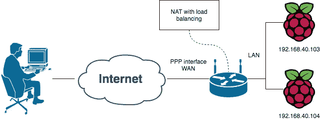
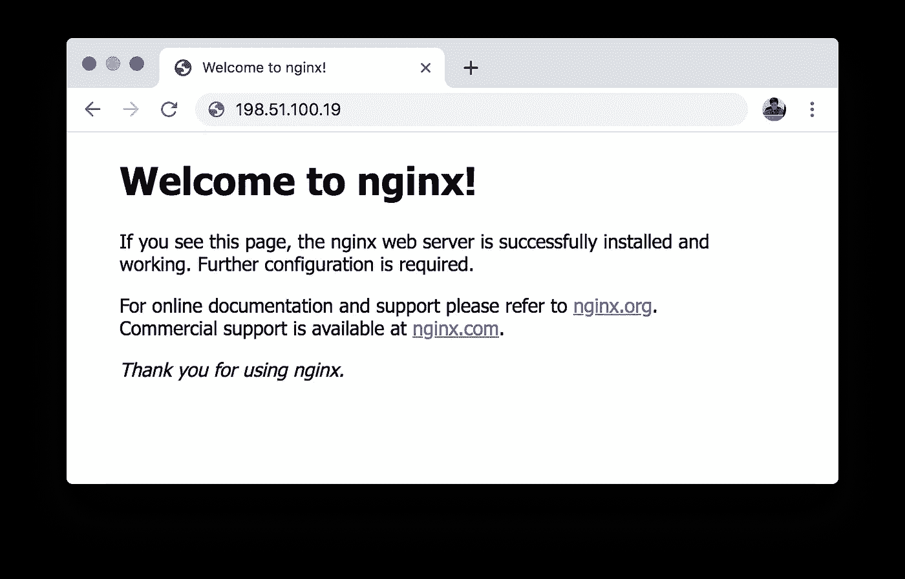
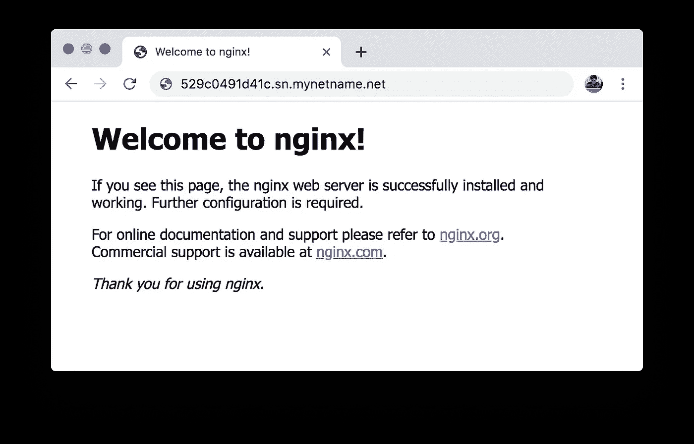
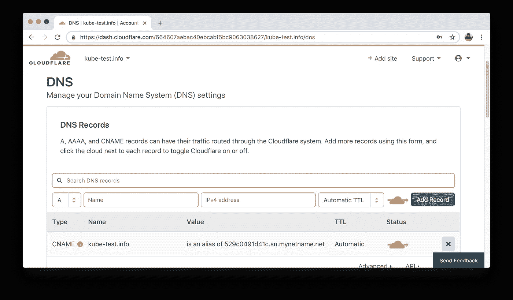
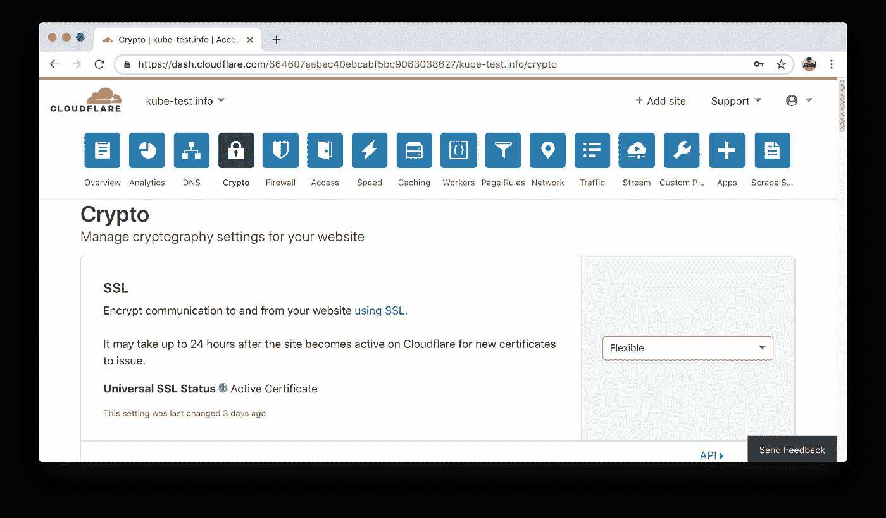
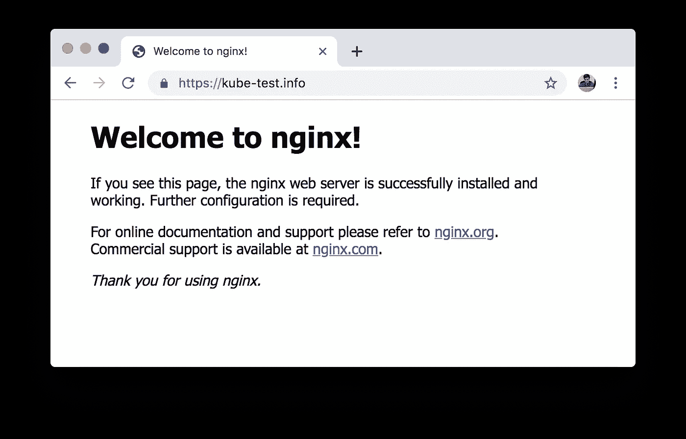

# 在 Raspberry Pi 和低端设备上构建 kubernetes 集群。第二部分

> 原文：<https://itnext.io/building-a-kubernetes-cluster-on-raspberry-pi-and-low-end-equipment-part-2-33f21695251c?source=collection_archive---------2----------------------->

这是**在 Raspberry Pi 和低端设备上构建 kubernetes 集群**文章的第二部分。在这一部分中，我将为 kubernetes 集群创建一个面向互联网的网络。

在 [**第 1 部分**](https://medium.com/@eduard.iskandarov/building-a-kubernetes-cluster-on-raspberry-pi-and-low-end-equipment-part-1-a768359fbba3) 中，我提供了 kubernetes 节点，建立了集群，并运行了测试应用程序。

主要目标是创建一个基础设施，允许使用互联网访问 kubernetes 中的应用程序。

最终，它将与 [AWS 弹性负载平衡器](https://aws.amazon.com/elasticloadbalancing/?nc1=h_ls)、 [GCP 负载平衡器](https://cloud.google.com/load-balancing/)、 [Azure 负载平衡器](https://azure.microsoft.com/en-us/services/load-balancer/)以及云基础设施中的任何负载平衡器具有相同的用途。

仅靠一个组件是不可能解决这个问题的，所以要用到几个东西:互联网网关、动态 DNS、内容交付网络。

# 介绍互联网网关

一个互联网网关术语可能意味着任何事情。为了让事情更清楚，我需要给它一个完全适合这篇文章的定义。

*互联网网关* —旨在传输层( [OSI 模型第 4 层](https://en.wikipedia.org/wiki/OSI_model#Layer_4:_Transport_Layer))提供从公共互联网段到私有网络的网络连接的硬件和软件系统。

有几种方法可以做到这一点:[网络地址转换(NAT)](https://en.wikipedia.org/wiki/Network_address_translation) ，不同的代理服务器(如 [HAProxy](http://www.haproxy.org/) ， [nginx](https://www.nginx.com/) ， [envoy](https://www.envoyproxy.io/) 等等)。

使用代理服务器需要专用的网络设备，该设备接受来自互联网的连接并代理到 kubernetes 节点。文章的精神是只使用低端设备，尽可能利用现有组件。因此使用 NAT 是我的选择。

幸运的是，我使用了一个功能丰富的 Mikrotik 路由器，即使在复杂的情况下设置它也相对容易。

下一节将使用 Mikrotik 路由器配置。在许多其它路由器上实现这一点是可能的。我有意跳过 NAT 和 Mikrotik 的具体细节，只提供一般信息。读者可以随时了解主题并在不同的硬件上复制。

如果你对学习 Mikrotik 感兴趣——这里有一个官方文档的链接:[手册:IP/防火墙/NAT](https://wiki.mikrotik.com/wiki/Manual:IP/Firewall/NAT) 。

让我们从天真的方法开始。回想一下，在第 1 部分，我们有如下设置:kubernetes 节点的 IP 地址是:`192.168.40.103`和`192.168.40.104`；nginx 在`31681`节点端口**公开服务。我很快就会需要那些东西。**

在图 1 中，有一个用户、互联网、一个路由器和一个 kubernetes 节点。
用户通过互联网发送 HTTP 请求；一个[点对点协议(PPP)](https://en.wikipedia.org/wiki/Point-to-Point_Protocol) 接口通过[广域网(WAN)](https://en.wikipedia.org/wiki/Wide_area_network) 将路由器与互联网相连；路由器在[局域网](https://en.wikipedia.org/wiki/Local_area_network)与 kubernetes 节点连接。


图一。互联网网关组件

因此，我们需要做的是告诉路由器以某种方式处理网络流量。我会用 Mikrotik 控制台(更多细节是官方文档[手册:控制台](https://wiki.mikrotik.com/wiki/Manual:Console))。

```
/ip firewall nat
add chain=dstnat action=dst-nat \
 in-interface=all-ppp protocol=tcp dst-port=80 to-addresses=192.168.40.103 to-ports=31681
```

上述命令指示路由器对到达 *PPP 接口*的目的端口为 80 的 TCP 数据包执行网络地址转换，以便数据包进一步转发到 31681 端口的 192.168.40.103 IP 地址。

换句话说，如果一个 HTTP 请求(默认端口 80)将到达路由器的公共 IP 地址—路由器将把请求转发到 nginx 服务的 kubernetes 节点 1(通过节点端口)。

有一个明显的缺点。流量只被转发到 kubernetes 节点之一，因此负载平衡不起作用。我有两个，可能还有更多。幸运的是，还有改进的空间。我将使用路由器的一些高级功能。

## 具有负载平衡的互联网网关

负载平衡假设流量被分成几个流，每个流被转发到相应的目标后端。

在 Mikrotik 术语中，该技术被称为每个连接分类器的*。*

> [每连接分类器(PCC)](https://wiki.mikrotik.com/wiki/Manual:PCC) matcher 将允许您将流量分成相等的流，并能够将具有特定选项集的数据包保存在一个特定的流中。



图二。具有负载平衡组件的互联网网关

以下路由器配置由两部分组成:
1。流量分类。该步骤设置交通标志
2。基于标记的网络地址翻译

```
/ip firewall mangle
add chain=prerouting action=mark-connection \
  in-interface=all-ppp protocol=tcp dst-port=80 \
  new-connection-mark=kube_node_1 per-connection-classifier=src-address-and-port:2/0 \
  comment="Load balancer. Service nginx. Mark connections to kube node 1"
add chain=prerouting action=mark-connection \
  in-interface=all-ppp protocol=tcp dst-port=80 \
  new-connection-mark=kube_node_2 per-connection-classifier=src-address-and-port:2/1 \
  comment="Load balancer. Service nginx. Mark connections to kube node 2"

/ip firewall nat
add chain=dstnat action=dst-nat \
 connection-mark=kube_node_1 to-addresses=192.168.40.103 protocol=tcp to-ports=31681 \
 comment="Load balancer. Service nginx. DST NAT to kube node 1"
add chain=dstnat action=dst-nat \
  connection-mark=kube_node_2 to-addresses=192.168.40.104 protocol=tcp to-ports=31681 \
  comment="Load balancer. Service nginx. DST NAT to kube node 2"
```

我指示路由器用`kube_node_1`和`kube_node_2`标记一段流量。
此外，带有标记`kube_node_1`的流量去往 kubernetes 节点 1(IP 地址`192.168.40.103`)；带有标记`kube_node_2`的流量去往 kubernetes 节点 2(IP 地址`192.168.40.104`)。

这看起来像魔术，但仔细一看并不复杂。分类器采用 TCP 数据包源地址和端口的数字表示，然后

> 然后将该值除以指定的*分母*，然后将余数与指定的*余数*进行比较，如果相等，则将捕获数据包。

例如，让我们假设一个样本 TCP 包来自 IP 地址`192.0.2.87`并且操作系统选择了`59831`(通常是一个[临时端口](https://en.wikipedia.org/wiki/Ephemeral_port))。

那么`192.0.2.87`的数值表示等于 3221226071 **。** 最后，IP 地址值和端口号之和(我不知道每个连接的分类器算法的实现细节——出于演示目的，使用 sum 运算作为最简单的)。

```
3221226071 + 59831 = 3221285902
```

如文档所述，该值除以指定的分母，然后将余数与指定的*余数*进行比较。在我的例子中分母是`2`。

```
3221285902 % 2 = 0
```

划分提醒是`0`，因此在本实验中，分类器会将该数据包标记为`kube_node_1`。唷！

图 3 证实了我的配置是正确的。浏览器使用公共 IP 地址在 kubernetes 中打开 nginx。



图 3。kubernetes 中的 nginx 使用公共 IP 地址

出于安全和隐私的目的，我不会暴露我的真实公共 IP 地址。`198.51.100.19`用于演示。

最后，我有一个具有所需属性的互联网网关。它接受来自互联网的流量，并对 kubernetes 节点进行负载平衡。

# 动态 DNS

我的互联网服务提供商有一个公共 IP 地址池，每个 VPN 会话([*【PPPoE】*](https://en.wikipedia.org/wiki/Point-to-Point_Protocol_over_Ethernet))路由器都会收到其中一个 IP 地址。这意味着由于公共 IP 地址的动态特性，不可能预测下一次 VPN 会话中的 IP 地址。假设 VPN 重新连接可能随时发生—我有麻烦了。

简单地说——网站有一个名字。我已经购买了一个域名`kube-test.info`,想用它来访问我的 kubernetes 上的网络资源。但是，如果 IP 地址是动态的，我该如何创建 DNS 记录呢？

幸运的是，有一个解决方案。[动态 DNS](https://en.wikipedia.org/wiki/Dynamic_DNS) 技术允许创建指向路由器当前公共 IP 地址的 DNS 记录。

我的 Mikrotik 路由器动态 DNS 具有内置功能。一旦启用—我的路由器的公共 IP 地址就有了一个静态 DNS 名称。

```
/ip cloud set ddns-enabled=yes
/ip cloud print
          ddns-enabled: yes
  ddns-update-interval: none
           update-time: yes
        public-address: 198.51.100.19
              **dns-name:** **529c0491d41c.sn.mynetname.net**
                status: updated
```

其中，DNS 名称的前 12 个字节(`529c0491d41c`)是路由器的序列号。出于安全和隐私的目的，DNS 名称是不真实的。

让我们测试一下是否可以使用 Mikrotik 提供的 DNS 名称在 kubernetes 中打开 nginx。



图 4。kubernetes 中的 nginx 使用动态 DNS 名称

有用！现在我有了可以进一步依赖的稳定的东西。

# 内容交付网络

[内容交付网络(CDN)](https://en.wikipedia.org/wiki/Content_delivery_network) 给出了几个优势。对于这个练习来说，最重要的是:现成的 HTTPS 支持和安全性增强。通过安全性增强，我的意思是 Cloudflare 将我的后端隐藏在它的公共 IP 地址之后。所以，没有一个简单的方法来说明什么样的后端隐藏在域后面，服务器在哪里。如果您确实关心您的站点安全，我强烈推荐使用这种技术。

Cloudflare 提供免费计划，因此不会造成任何预算损失。

*CDN 有替代方案。对于 HTTPS，您可以使用类似*[*letencrypt*](https://letsencrypt.org/)*的东西，并将 DNS 记录直接指向动态 DNS CNAME，但我会将此选项留给您练习。对这种组合的讨论超出了主题范围。*

将域添加到 Cloudflare 并完成初始设置后，我为动态 DNS 域`529c0491d41c.sn.mynetname.net`创建了一个 DNS 记录。代理模式已启用，因此我拥有 Cloudflare 的所有安全优势。



图 5。Cloudflare 中的 DNS 配置

由于我们的后端只能以普通的 HTTP 进行通信，我需要指示 Cloudflare 将来自客户端的 HTTPS 请求代理到后端的 HTTP 端口。那就是所谓的**灵活的** SSL 模式。



图 6。在 Cloudflare 中启用灵活的 SSL 模式

面向 Internet 的网络设置已准备好。我现在可以用一个普通的网址【https://kube-test.info/ 打开托管在 kubernetes 的 nginx。



图 7。云闪背后的库贝内特斯 nginx

图 7 显示我可以从互联网访问 kubernetes 集群中的 nginx web 服务器。

# 后续步骤

在**接下来的部分，在 Raspberry Pi 和低端设备**系列上构建 kubernetes 集群，为 pods 启用持久存储层，寻找设备资源优化的方法。