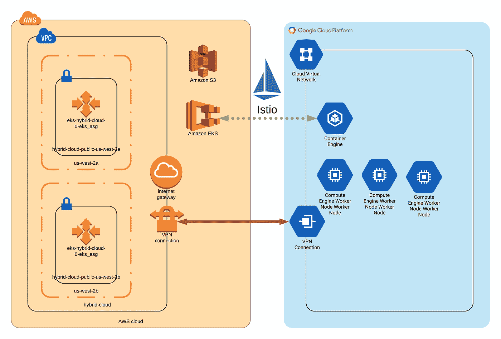
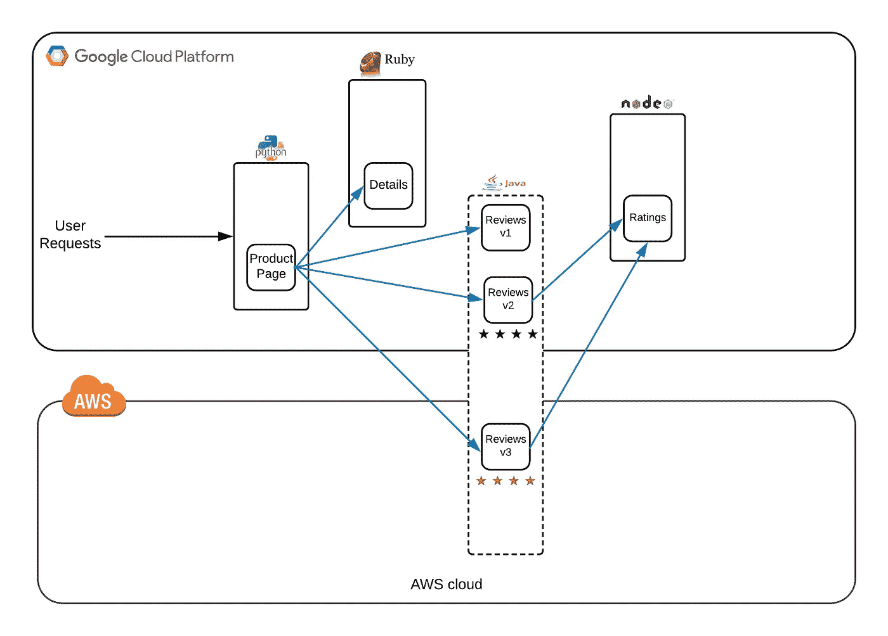

# 使用 Terraform 构建 Kubernetes 混合云

> 原文：<https://itnext.io/building-a-kubernetes-hybrid-cloud-with-terraform-fe15164b35fb?source=collection_archive---------5----------------------->

我正在接受新的挑战；如何构建混合云？市场上对“混合云”有大量的讨论，但它真正意味着什么呢？对我来说，这意味着将多个云解决方案作为单一资源池加以利用。就像俗话说的“[马换课程](https://dictionary.cambridge.org/us/dictionary/english/horses-for-courses)”，不同的云有不同的优势。本文并不打算给出哪种云比其他任何云更好或更便宜的意见，但可能一个云提供商有更偏好的地理位置，可能他们对特定的实例大小有更便宜的费率，可能他们有其他提供商没有的服务(即大数据或机器学习)。我还包括提供“[云服务](https://nvlpubs.nist.gov/nistpubs/Legacy/SP/nistspecialpublication800-145.pdf)的**私人数据中心**，因为它们也有独特的功能。

我的目标是构建一个基于 kubernetes 的混合云。为什么？对我来说，这是最开放、最灵活的方式。有许多技术可以帮助您构建混合云；他们中的大多数人都非常固执己见。例如: [VMware 有带 AWS 的混合产品](https://aws.amazon.com/vmware/)， [Nutanix 有 Xi](https://www.nutanix.com/products/xi-cloud-services/) ，[微软有 Azure 和 AzureStack](https://azure.microsoft.com/en-us/overview/azure-stack/) 。我不太喜欢这些解决方案，因为它们将你锁定在一个特定的超级用户中，并将你限制在他们选择的云提供商中。Kubernetes 正迅速成为容器编排的首选(容器的超级管理器，以过度简化 it)。[每个主要的云提供商和基础设施提供商](https://landscape.cncf.io/cncf=member&grouping=landscape&landscape=cloud,platform,kubernetes-certified-service-provider)都在跳上 Kubernetes 的列车。这将为您的混合云提供一个单一的通用框架，以及一种一致的方式来部署和管理应用程序，而不管云是什么。

**我在建造什么？**

使用 AWS 和 Google 云平台，使用他们的本地托管 Kubernetes 服务(EKS 和 GKE)创建一个混合云。使用 VPN 进行基本的 IP 连接，并使用 [Istio](http://istio.io) 创建“[服务网格](https://istio.io/docs/concepts/what-is-istio/#what-is-a-service-mesh)”。

我如何构建它？

使用 terraform，我可以按需设置整个环境。这意味着我要在每个云中创建一个新的 VPC，在两者之间创建一个 VPN，部署 Kubernetes master (EKS & GKE)，并在每个云中启动 worker 节点。然后我安装 Istio 作为“服务网格”。这基本上允许您的两个 kubernetes 集群充当单个资源池(也称为混合云)，同时具有遥测和可见性。



逻辑基础结构图

**我在跑什么？**

我正在使用一个名为 [Bookinfo](https://istio.io/docs/examples/bookinfo/) 的示例应用程序，它是一个基于容器的多层应用程序。reviews 层运行在两个云上，并在“Reviews 层”的每个版本之间进行负载均衡。



`Disclaimer: This is not a production grade system. There are limitations and lack of proper redundancy.`

`Warning: This will cost you money on each cloud.`

如果你想亲自尝试，请查看我的 [github repo](https://github.com/magic7s/k8s-hybrid-cloud) 。

```
git clone [https://github.com/magic7s/k8s-hybrid-cloud.git](https://github.com/magic7s/k8s-hybrid-cloud.git)# Checkout the README.md file for prerequisites needed to run.
# You need kubectl, helm, aws-iam-authenticator, and gcloud 
# installed locally. Plus a customer terraform provider.terraform init
terraform apply
#-- An error will be thrown. See bug https://github.com/magic7s/k8s-hybrid-cloud/issues/3
terrafom apply
cd sample_app
./install_bookinfo.sh
```