# 在 SwiftUI 中构建轻量级相机应用程序

> 原文：<https://itnext.io/building-a-lightweight-camera-app-in-swiftui-66db47b3537f?source=collection_archive---------1----------------------->

## 适合所有初学者的教程

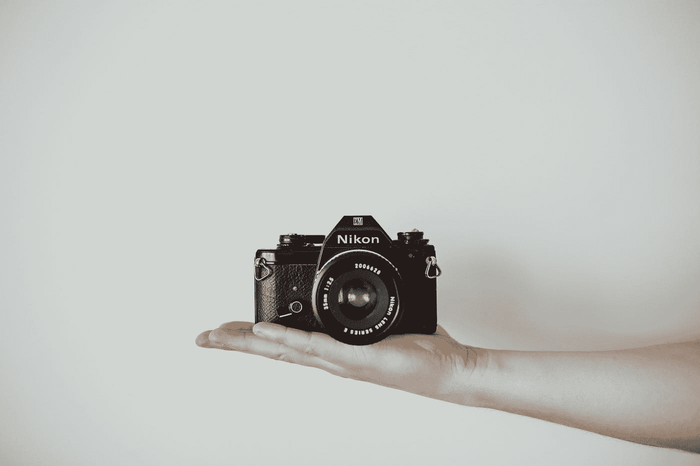

由 [Lilly Rum](https://unsplash.com/@rumandraisin?utm_source=medium&utm_medium=referral) 在 [Unsplash](https://unsplash.com?utm_source=medium&utm_medium=referral) 上拍摄的照片

开发一个相机应用程序是 iOS 开发者的典型任务，也许有一天你会遇到它。有大量的教程向你展示这一点。我还在参考资料部分链接了我特别喜欢的一个。

我能找到的几乎都是使用`UIKit`和`AVFoundation`。当然，我想要 SwiftUI 中的一些东西，尽可能简单或极简。

在苹果网站的[相机和媒体捕捉](https://developer.apple.com/documentation/avfoundation/cameras_and_media_capture)上，它这样描述`AVFoundation`:

> 构建自定义相机 UI，将拍摄照片或视频集成到您的应用程序的用户体验中。

我想要的不是一个定制的相机应用程序，而是一个非常简单的、开箱即用的应用程序。该网站还指出:

> 要让用户在您的应用程序中使用系统摄像头 UI 捕捉媒体，请参见 UIImagePickerController。

好了，我们有了。让我们进一步探讨这个问题。

使用`UIImagePicker`选择图像有两种方式:

1.  通过从照片库中选择照片
2.  或者用手机内置摄像头拍照。

第一个因`UIImagePicker`而被弃用，已被`PHPicker`取代。

本教程解释了第二种方法，并会引导你用尽可能少的代码为你的 iOS 设备创建一个轻量级相机应用程序所需的所有步骤。

根据您的使用情况，使用`UIImagePicker`可能就足够了。不需要使用更复杂的解决方案。

`UIImagePicker`的一个缺点是，它只能在人像模式下拍摄。希望有一天能支持风景模式。

不管怎样，如果你的需求符合这个限制，这就是应用程序的样子:

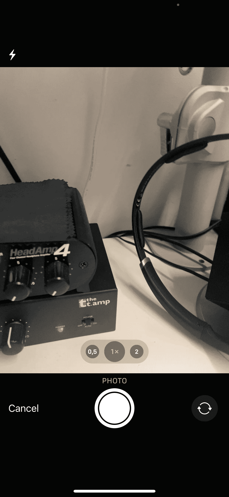

看着眼熟？确实如此！

## 项目设置

让我们首先创建一个新的 iOS 项目。

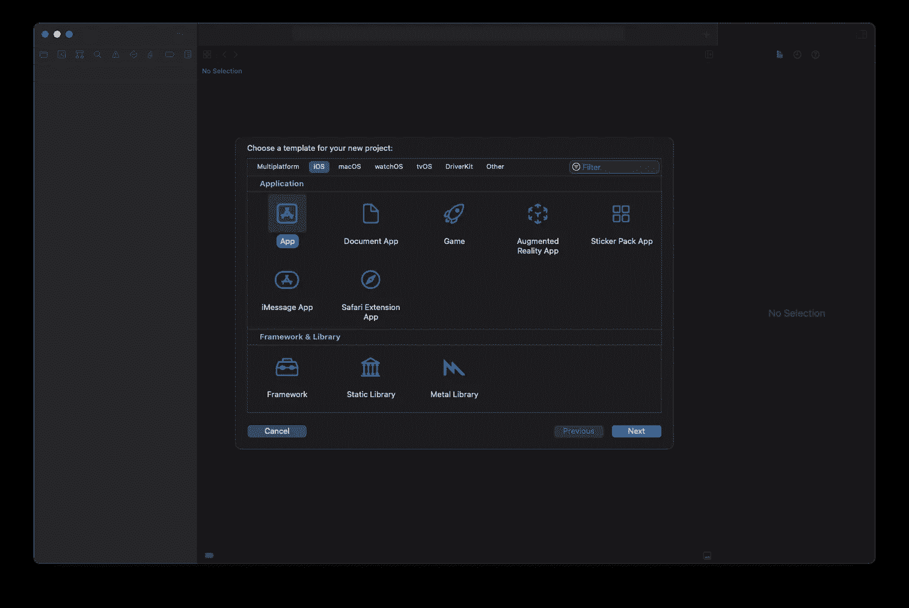

然后我们选择所有的选项。嗯，这里没什么特别的。我们将编写一个 SwiftUI 应用程序，其中我们不需要任何核心数据或测试。

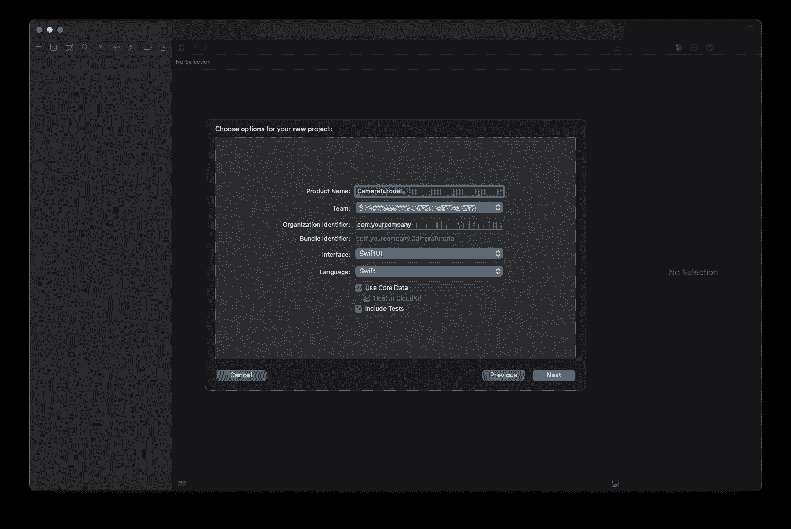

检查提供的信息并创建项目文件。

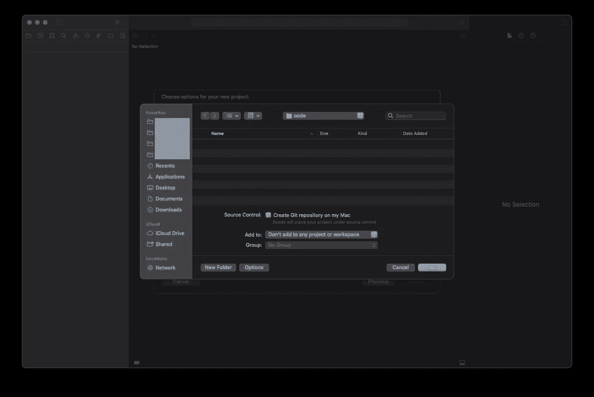

第一次编译启动吧。我们最终得到了标准的“Hello World”应用程序。

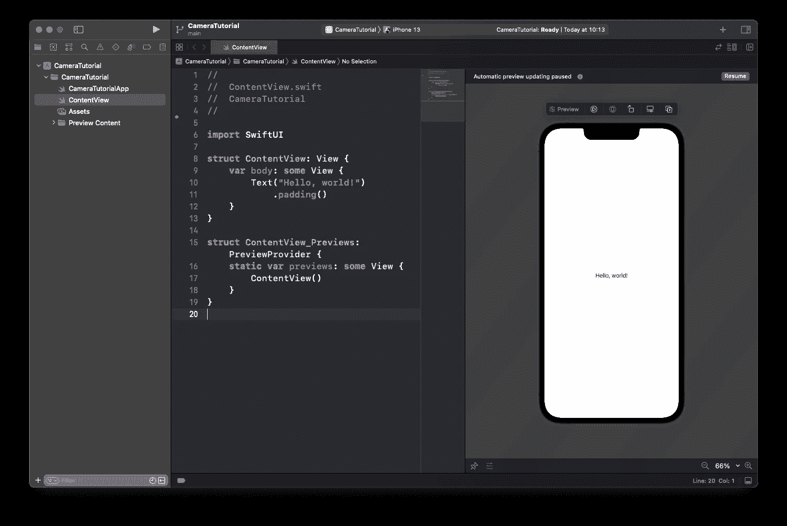

一切就绪！准备开发！

## 发展

如开头所述，我们将使用`UIImagePickerController`。不幸的是，我们不能直接将其用作 SwiftUI 视图。

幸运的是，有`UIViewControllerRepresentable`可以帮助我们。我在本文中解释了如何在 SwiftUI 中使用 UIKit-views 的原理:

[](/using-uiview-in-swiftui-ec4e2b39451b) [## 在 SwiftUI 中使用 UIView 和 UIViewController

### 编辑描述

itnext.io](/using-uiview-in-swiftui-ec4e2b39451b) 

首先，我们需要一个新文件来保存我们的`CameraView`:

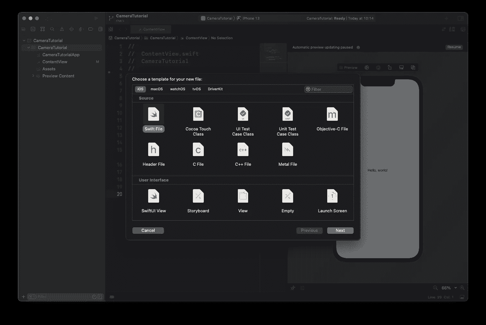

当然，我们会相应地保存它:

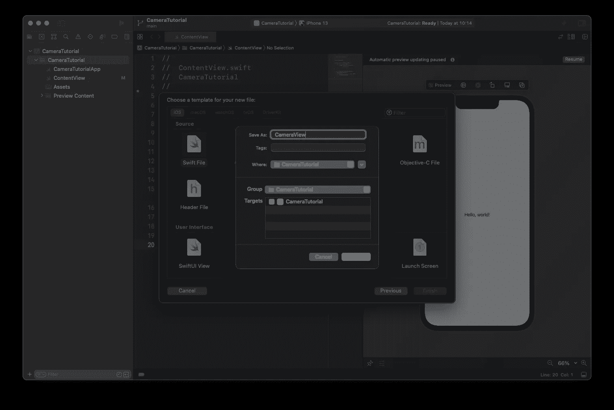

最后，我们以此结束，并准备添加我们的代码:

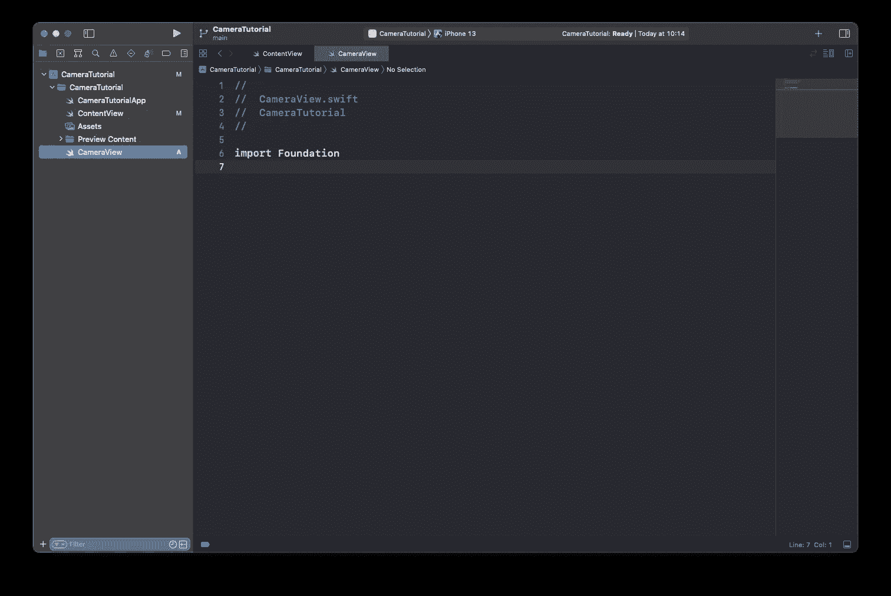

在我们的`CameraView`中，我们只需要下面的代码:

```
import Foundation
import UIKit
import SwiftUI

struct CameraView: UIViewControllerRepresentable {

    typealias UIViewControllerType = UIImagePickerController

    func makeUIViewController(context: Context) -> UIViewControllerType {
        let viewController = UIViewControllerType()
        viewController.delegate = context.coordinator
        viewController.sourceType = .camera
        return viewController
    }

    func updateUIViewController(_ uiViewController: UIViewControllerType, context: Context) {

    }

    func makeCoordinator() -> CameraView.Coordinator {
        return Coordinator(self)
    }
}

extension CameraView {
    class Coordinator : NSObject, UIImagePickerControllerDelegate, UINavigationControllerDelegate {
        var parent: CameraView

        init(_ parent: CameraView) {
            self.parent = parent
        }

        func imagePickerControllerDidCancel(_ picker: UIImagePickerController) {
            print("Cancel pressed")
        }

        func imagePickerController(_ picker: UIImagePickerController, didFinishPickingMediaWithInfo info: [UIImagePickerController.InfoKey : Any]) {
            if let image = info[UIImagePickerController.InfoKey.originalImage] as? UIImage {
                UIImageWriteToSavedPhotosAlbum(image, nil, nil, nil)
            }
        }
    }
}
```

差不多了，我们只需要将`CameraView`添加到我们的`ContentView`中:

```
struct ContentView: View {
    var body: some View {
        CameraView()
    }
}
```

就是这样。没什么要补充的了。哦，等一下…

当我们第一次运行该应用程序时，收到以下错误消息:

```
2021-12-20 09:41:07.629751+0100 CameraTutorial[17091:5169429] [access] This app has crashed because it attempted to access privacy-sensitive data without a usage description.  The app's Info.plist must contain an NSCameraUsageDescription key with a string value explaining to the user how the app uses this data.
```

让我们来设置用法说明:

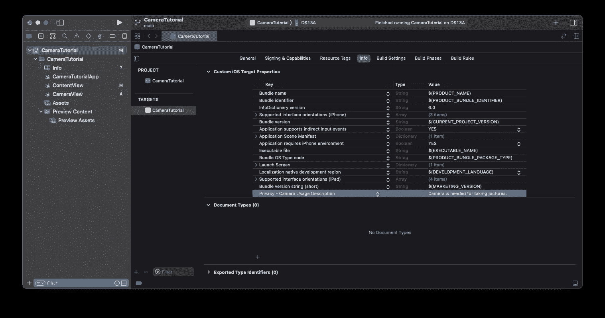

让我们再试一次。看起来不错。

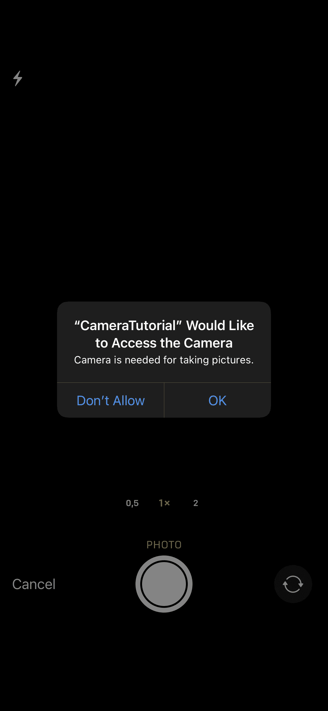

我们需要按“确定”,然后就可以使用摄像头了:


我们现在可以执行以下操作

*   启用闪光灯
*   切换到广角、普通、变焦(如果你的设备支持)和自拍镜头
*   按下“取消”按钮
*   按下快门拍照

仅供参考，当我们将相机放到风景中时，一切都乱了套:

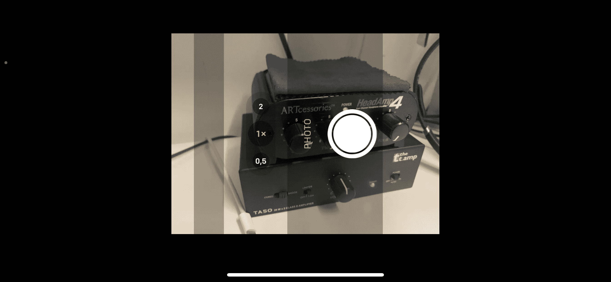

没有我们不知道的。希望，苹果将增加景观模式或为我们提供另一个现成的解决方案。

无论如何，当按下快门按钮时，我们得到以下:

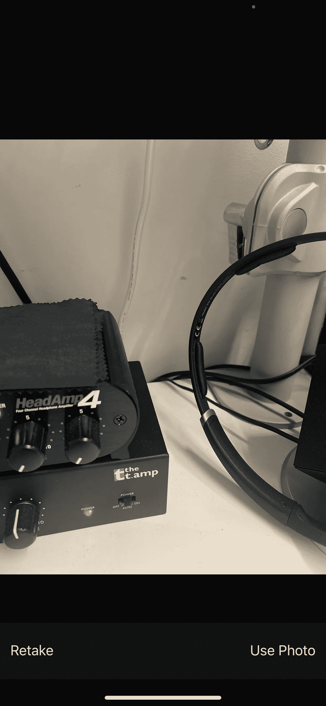

我们现在可以按“重拍”回到相机视图，或者按“使用照片”保存它。

`Coordinator`负责对按下“取消”和“使用照片”做出反应。

对于`Cancel`,我们已经实现了下面的委托，它除了打印“Cancel pressed”之外什么也不做

```
func imagePickerControllerDidCancel(_ picker: UIImagePickerController)
```

对于`Use Photo`我们已经实现了

```
func imagePickerController(_ picker: UIImagePickerController, didFinishPickingMediaWithInfo info: [UIImagePickerController.InfoKey : Any])
```

在那里，我们将图像保存到我们的相册中

```
UIImageWriteToSavedPhotosAlbum(image, nil, nil, nil)
```

第一次使用时，我们会得到另一个错误

```
This app has crashed because it attempted to access privacy-sensitive data without a usage description.  The app's Info.plist must contain an NSPhotoLibraryAddUsageDescription key with a string value explaining to the user how the app uses this data.
```

因此，我们需要设置另一个用法描述

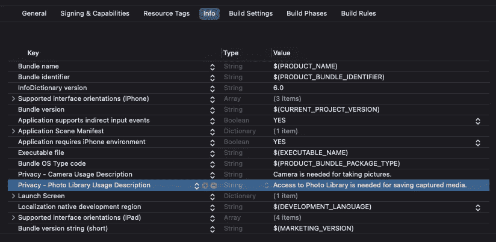

然后我们得到下面的对话框

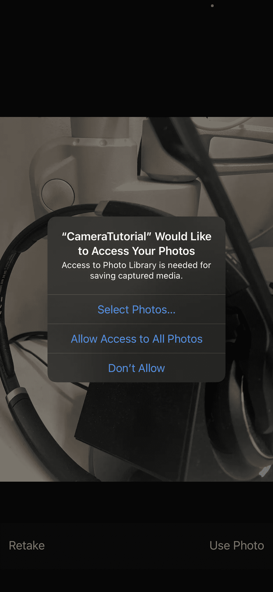

我们通过允许进入来确认。

现在，你可以用你的照片应用程序检查图片是否存在。

希望一切都解决了，你可以在你的照片应用程序中找到新拍摄的照片。

## 结论

大概就是这样。我们今天完成了我能想到的最简约的相机应用程序。

让我知道这是否可以做得更简约。

感谢您的阅读！

*   如果你喜欢这个，请[跟随我在 Medium](https://twissmueller.medium.com/)
*   给我买杯咖啡让我继续前进
*   支持我和其他媒体作者[在这里注册](https://twissmueller.medium.com/membership)

[](https://twissmueller.medium.com/membership) [## 通过我的推荐链接加入媒体

### 作为一个媒体会员，你的会员费的一部分会给你阅读的作家，你可以完全接触到每一个故事…

twissmueller.medium.com](https://twissmueller.medium.com/membership) 

## 资源

*   [UIImagePickerController](https://developer.apple.com/documentation/uikit/uiimagepickercontroller)
*   [在 iOS 中制作定制相机](https://medium.com/@barbulescualex/making-a-custom-camera-in-ios-ea44e3087563)