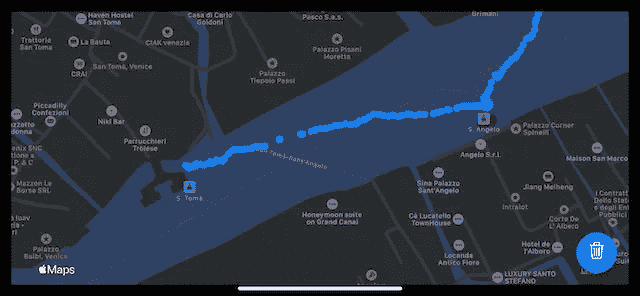
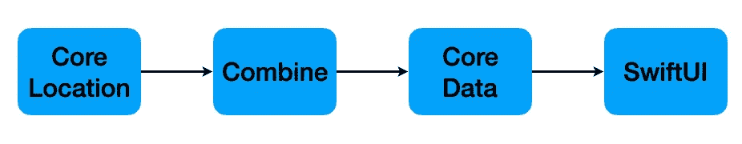
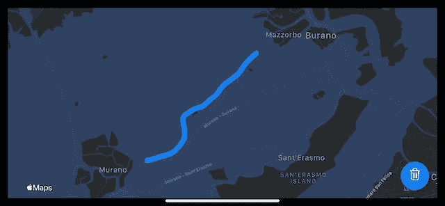
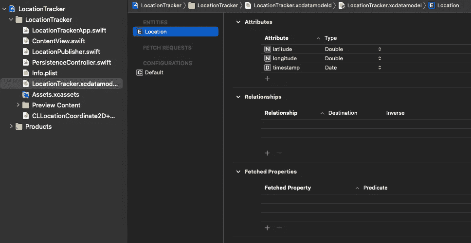

# 在 Swift 中构建位置跟踪器

> 原文：<https://itnext.io/building-a-location-tracker-in-swift-aab99b6267db?source=collection_archive---------1----------------------->

## 使用 SwiftUI、核心位置、联合收割机和核心数据的实践教程



示例应用程序的屏幕截图

这篇文章是在我之前的文章[“我的 iPhone 在哪里”](https://twissmueller.medium.com/where-is-my-iphone-fb75e5bd380)的基础上，通过使用更多的苹果框架来构建一个适用于 iPhone 和 iPad 的应用程序。

除了“仅仅”确定设备的位置，我还将设计一个完整的数据流管道，从数据源开始，经过持久化到可视化。

本文将涵盖四个 Apple 框架:

*   核心位置
*   结合
*   核心数据
*   斯威夫特伊

我浏览框架的顺序类似于数据流的顺序。



数据流

位置坐标源自核心位置框架，并将存储在核心数据数据库中。

这两者之间的链接是一个联合发布器，它将从核心位置接收坐标，并将它们发送到核心数据。

最后，连接到核心数据的 SwiftUI-view 将把数据库中的所有坐标显示为地图上的蓝点。



示例应用程序的屏幕截图

**可以从这里** **下载带有全功能应用的完整 Xcode-Workspace。**

## 核心位置

一切都从在类`LocationPublisher`中被实例化的`CLLocationManager`的实例开始。

```
private let locationManager = CLLocationManager()
```

它需要一个指派给它的代表，这个代表就是`LocationPublisher`。

```
self.locationManager.delegate = self
```

为了获得位置更新，需要实现一个委托方法:

```
extension LocationPublisher: CLLocationManagerDelegate {
    func locationManager(_ manager: CLLocationManager, didUpdateLocations locations: [CLLocation]) {
        guard let location = locations.last else { return }

        wrapped.send((longitude: location.coordinate.longitude, latitude: location.coordinate.latitude))
    }
}
```

位置坐标将被发送给我们的联合收割机发布者，这将在下一节中描述。

在我们启动应用程序之前，需要在`Info.plist`中设置几个键，否则无法跟踪。


在应用程序第一次启动时，你会被要求确认是否允许`Location Tracker`确定用户的位置。


是时候将坐标“推入”数据库了。我们通过使用一个组合器`Publisher`来做到这一点，它将“自动地”链接`CLLocationManager`和`CoreData`。

## 结合

`LocationPublisher`有一个接受元组的`PassthroughSubject`。元组的第一个值是经度，第二个值是接收到的坐标的纬度。

```
typealias Output = (longitude: Double, latitude: Double)
typealias Failure = Never

private let wrapped = PassthroughSubject<(Output), Failure>()
```

正如我们在“核心位置”一节中看到的，每当在委托方法`locationManager(_ manager: CLLocationManager, didUpdateLocations locations: [CLLocation])`中接收到一个坐标时，它将被发送到`PassthroughSubject`。

```
wrapped.send((longitude: location.coordinate.longitude, latitude: location.coordinate.latitude))
```

是时候让`LocationPublisher`行动起来，真正成为一家联合出版商了。这是需要的，以便其他类作为数据接收器(核心数据，有人吗？)订阅我们的出版商。

```
extension LocationPublisher: Publisher {
    func receive<Downstream: Subscriber>(subscriber: Downstream) where Failure == Downstream.Failure, Output == Downstream.Input {
        wrapped.subscribe(subscriber)
    }
}
```

这段代码是提供一个接收已经发送给`PassthroughSubject`的坐标的方法所需要的一切。

```
locationPublisher.sink(receiveValue:)
```

这在下一步中很重要，当我们将`LocationPublisher`的输出与我们的 CoreData-database 连接起来时。

## 核心数据

为了将位置数据“推入”数据库，需要连接`LocataionPublisher`和 CoreData。

`PersistenceController`是处理所有数据库相关代码的类。

它有一个名为`add`的方法，该方法获取经度和纬度的元组并将其保存到数据库中。

这个元组将被转换成一个名为`Location`的实体，该实体已经在`LocationTracker.xcdatamodel`中定义



多亏了 Combine，将两者、`LocationPublisher`和`PersistenceController`连接起来只需要一行代码。

```
locationPublisher.sink(receiveValue: PersistenceController.shared.add)
```

这发生在应用程序在`LocationTrackerApp.init`中初始化的开始。

现在，位置数据被放入我们的数据库，它是如何在地图上可视化的呢？

进入下一章…

## 斯威夫特伊

用户界面由地图和按钮组成。

该地图应显示已存储在 CoreData 中的所有坐标。

按下按钮后，数据库中的所有数据都将被删除，地图自动从标记中清除。

在`ContentView`中，位置将通过使用`@FetchRequest`自动更新。

```
@FetchRequest(
        sortDescriptors: [NSSortDescriptor(keyPath: \Location.timestamp, ascending: true)],
        animation: .default)
private var locations: FetchedResults<Location>
```

唯一剩下的，就是告诉地图使用`locations`。

```
Map(coordinateRegion: $region,
    interactionModes: .all,
    showsUserLocation: false,
    userTrackingMode: .constant(.follow),
    annotationItems: locations) { location in

    MapAnnotation(coordinate: CLLocationCoordinate2D(latitude: location.latitude, longitude: location.longitude)) {
        Circle().fill(Color.blue).frame(width: 10, height: 10)
    }
}
```

因此，每个位置都显示为一个蓝点，并且地图始终与数据库保持同步。不需要更多代码。说真的。

## 结论

这就是关于如何用苹果的最新框架建立一个位置跟踪器。

我希望你喜欢这个教程，并得到一些对你的项目有帮助的想法。

**如果您喜欢现成的解决方案，可以从这里** **下载带有全功能应用程序的完整 Xcode-Workspace**[**。**](https://www.buymeacoffee.com/twissmueller/e/41970)

感谢您的阅读！

*   如果你喜欢这个，请跟随我
*   给我买杯咖啡让我继续前进
*   支持我和其他媒体作者[在这里注册](https://twissmueller.medium.com/membership)

[https://twissmueller.medium.com/membership](https://twissmueller.medium.com/membership)

## 资源

*   [核心位置](https://developer.apple.com/documentation/corelocation)
*   [联合收割机](https://developer.apple.com/documentation/combine)
*   [核心数据](https://developer.apple.com/documentation/coredata)
*   [SwiftUI](https://developer.apple.com/documentation/swiftui/)