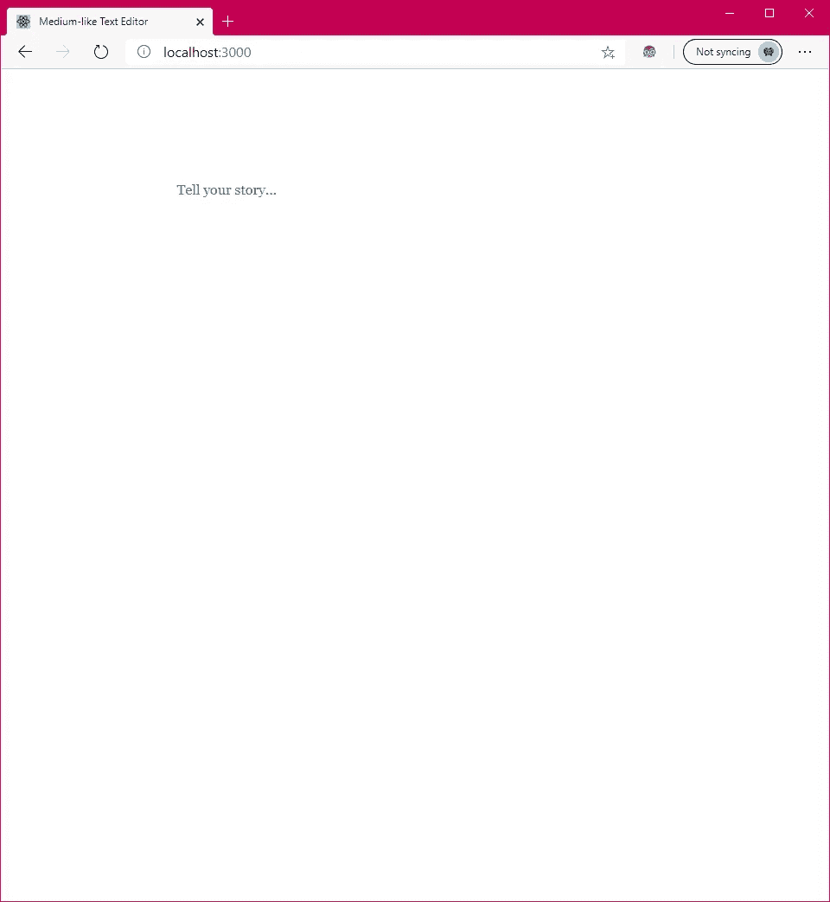
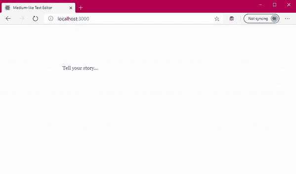

# 使用 Draftail 在 ReactJS 中构建一个类似媒体的文本编辑器

> 原文：<https://itnext.io/building-a-medium-like-text-editor-in-reactjs-using-draftail-ce47ffcbe240?source=collection_archive---------2----------------------->


科琳·库兹在 [Unsplash](https://unsplash.com?utm_source=medium&utm_medium=referral) 上的照片

作为一名软件开发人员，你可能需要为你的 ReactJS 应用程序构建一个文本编辑组件，而你只是不想在其中加入那些花哨的老式*文本区*或*输入*标签。他们只是不符合你的要求。

从零开始建立？从时间角度来看，这可能也不是一个好的选择。

你开始在你的浏览器里打开一个新的标签页，然后在谷歌里搜索，结果并不好。有太多的选择，它们会让你陷入更深的困惑。既然如此，这就是我写这个故事的原因。

# 你的第一步:起草文件

在这个故事中，我们将使用 Draftail 作为富文本编辑器的主要组件。我很喜欢使用它，我想现在是我回报它的时候了。

请注意，这个故事的目标不是构建一个全功能的中等富文本编辑器，而是我们正在构建一个看起来很像的工作编辑器，所以代码很少。您可以根据自己的需要对其进行定制。

根据他们的网站，Draftail 是一个用 Draft.js 构建的可配置富文本编辑器。它易于使用，无论技能水平如何，它是可扩展的(这意味着你可以为特定的用例构建自己的自定义扩展)，它的 API 由 [Draft.js 和 React](https://www.draftail.org/blog/2018/03/05/why-wagtail-new-editor-is-built-with-draft-js) 支持。如果你想了解更多关于 Draftail 的信息，你可以查看他们的网站:[Draftail.org](https://draftail.org)。

# 弄脏我们的手

现在，让我们跳到代码中，在那里我们将实际构建我们的类似媒体的文本编辑器。我尽可能让它简单明了，所以你可以很容易地遵循每一个步骤。

1.  打开您的终端，创建您的工作目录，并切换到它。

```
$ mkdir medium-like-text-editor && cd medium-like-text-editor
```

2.在工作目录中创建 ReactJS 应用程序(命令中的点/句点表示 ReactJS 应用程序将安装在当前目录中)。

```
$ npx create-react-app .
```

3.安装所需的依赖项。

```
$ npm install --save draftail draft-js@0.10.5 draft-js-inline-toolbar-plugin draft-js-side-toolbar-plugin
```

您将看到上面的命令指定了一个 DraftJS 版本(0.10.5)。这是因为，当我写这篇文章时，最新支持的版本是 DraftJS v0.10.5。我试图使用较新版本的 DraftJS，但它目前无法与最新版本的 Draftail 兼容。

基于生成的 ReactJS 应用程序，我们将只需要处理 2 个文件:`App.js`和`App.css`。让我们开始吧。

4.编辑你的`App.js`,让它看起来像这样:

```
import React from *"react"*;
import { DraftailEditor } from *"draftail"*;
import { EditorState } from *"draft-js"*;
import createInlineToolbarPlugin from *"draft-js-inline-toolbar-plugin"*;
import createSideToolbarPlugin from *"draft-js-side-toolbar-plugin"*;import *"./App.css"*;
import *"draft-js/dist/Draft.css"*;
import *"draftail/dist/draftail.css"*;
import *"draft-js-inline-toolbar-plugin/lib/plugin.css"*;
import *"draft-js-side-toolbar-plugin/lib/plugin.css"*;const inlineToolbarPlugin = createInlineToolbarPlugin();
const { InlineToolbar } = inlineToolbarPlugin;const sideToolbarPlugin = createSideToolbarPlugin();
const { SideToolbar } = sideToolbarPlugin;const plugins = [inlineToolbarPlugin, sideToolbarPlugin];class App extends React.*Component* {
    constructor(*props*) {
        super(props);
        this.state = {
            editorState: EditorState.createEmpty()
        };
        this.changeState = this.changeState.bind(this);
    } changeState(*state*) {
        this.setState({
            editorState: state
        });
    } render() {
        return (
            <div className=*"App"*>
                <DraftailEditor
                    editorState={this.state.editorState}
                    onChange={this.changeState}
                    placeholder=*"Tell your story..."* plugins={plugins}
                />
                <InlineToolbar />
                <SideToolbar />
            </div>
        );
    }
}export default App;
```

5.编辑您的`App.css`,使其看起来像这样:

```
.App {
    font-family: sans-serif;
    text-align: center;
    display: block;
}*/* Override default */* .Draftail-Toolbar {
    background: transparent !important;
    border: none !important;
}*/* Override default */* .Draftail-Editor {
    border: none !important;
    width: 60% !important;
    margin-top: 100px !important;
    margin-left: auto !important;
    margin-right: auto !important;
}*/* Override default */* .public-DraftEditor-content {
    font-family: Georgia, *"Times New Roman"*, Times, serif !important;
}*/* Override default */* .public-DraftEditorPlaceholder-inner {
    font-family: Georgia, *"Times New Roman"*, Times, serif !important;
}
```

有些人可能不喜欢在 CSS 中使用`!important`，但这是目前我们能做的最快的一步。

6.运行它

```
$ npm start
```

您的终端应该会自动打开浏览器，并打开刚刚运行的 ReactJS 应用程序。如果没有，在浏览器中打开`[http://localhost:3000](http://localhost:3000)`。

在你的浏览器中，它看起来只不过是“*讲述你的故事……*”，但仅此而已。试着点一下，想写什么就写什么。



默认视图

在左侧会有一个浮动图标，你可以悬停和点击。如果你想格式化一个特定的单词/字符，阻止它，一个浮动工具栏就会出现。



它是如何工作的

如果你不想按部就班地做，我已经把这个项目放在我的 [Github](https://github.com/dkhd/medium-like-text-editor) 中，你可以克隆它并在你的机器上运行。此外，您可能还想尝试一下 [Codesandbox](https://codesandbox.io/s/medium-like-text-editor-ifdbt) 中的工作演示。

祝你今天开心！玩的开心！