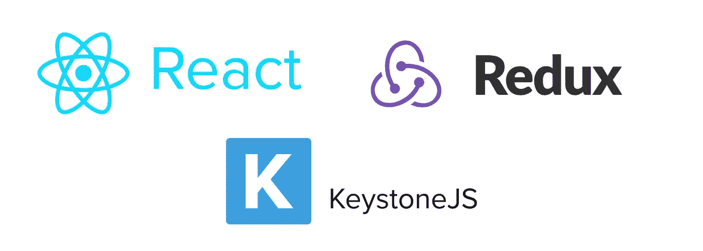
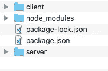
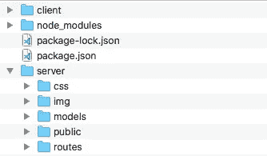
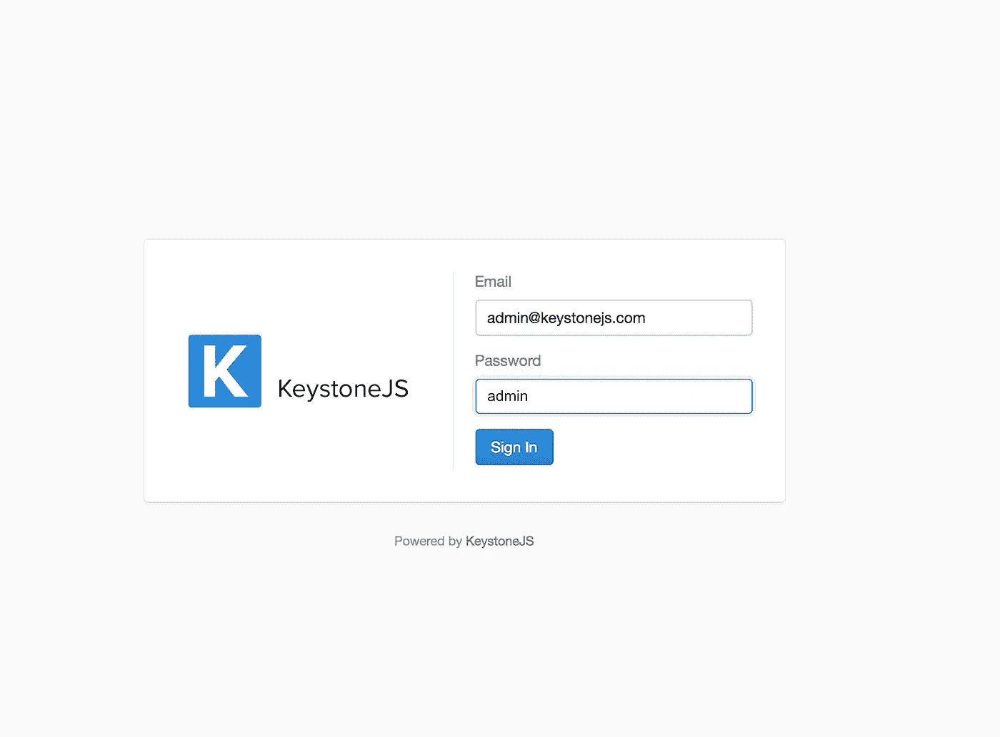
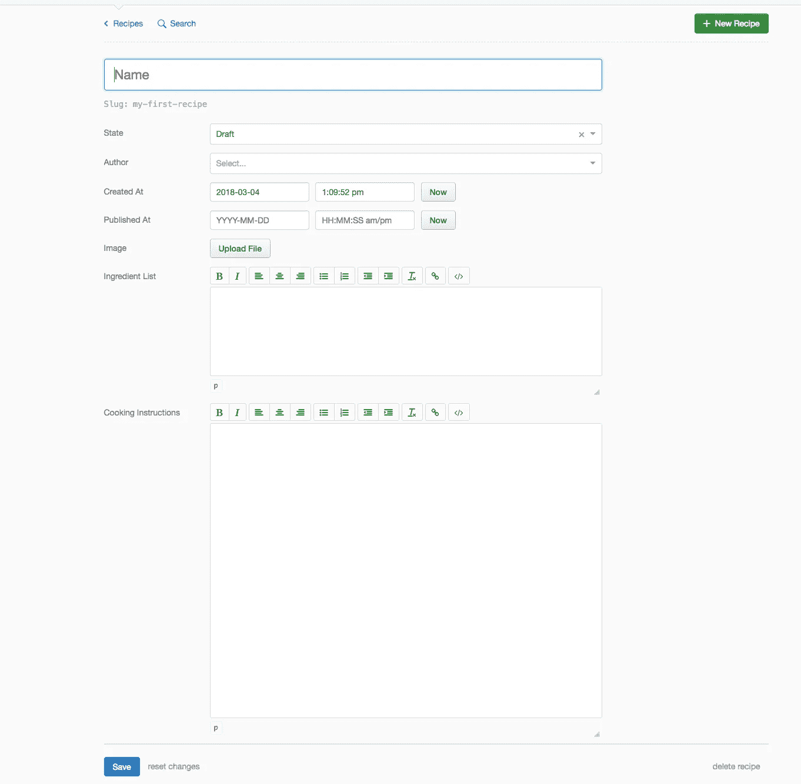

# 用 KeystoneJS、Mongo DB、React 和 Redux 构建节点 CMS 第一部分

> 原文：<https://itnext.io/building-a-node-cms-with-keystonejs-mongo-db-react-and-redux-part-i-ae5958496df2?source=collection_archive---------3----------------------->



[*点击这里在 LinkedIn* 上分享这篇文章](https://www.linkedin.com/cws/share?url=https%3A%2F%2Fitnext.io%2Fbuilding-a-node-cms-with-keystonejs-mongo-db-react-and-redux-part-i-ae5958496df2)

*如果你想看这个项目的最终版本，你可以从* [*github*](https://github.com/Colour-Full/medium-keystone-react-cms) 获得回购

安装 Keystone 并创建我们的第一个数据模型

在这个系列中，我们将看看如何使用 Node 和 KeystoneJs 作为基础构建一个纯 JavaScript 的 CMS，并添加一些令人兴奋的技术，如 React 和 Redux，使其真正成为下一代。

但首先什么是 KeystoneJs？

KeystoneJs 网站称:“Node.js 中用于开发数据库驱动网站、应用和 API 的开源框架，建立在 Express 和 MongoDB 之上。”

您将需要什么:

在开始之前，确保您的机器上已经安装了 NodeJs 和 MongoDb。我不会详细说明你如何做到这一点，如果你还没有安装它们，他们的网站上有一些非常好的安装指南:

[](https://nodejs.org/en/) [## 节点. js

### Node.js 是基于 Chrome 的 V8 JavaScript 引擎构建的 JavaScript 运行时。Node.js 使用事件驱动的非阻塞 I/O…

nodejs.org](https://nodejs.org/en/) [](https://docs.mongodb.com/manual/installation/) [## 安装 MongoDB - MongoDB 手册 3.6

### 对已填充集合的索引生成操作

docs.mongodb.com](https://docs.mongodb.com/manual/installation/) 

接下来，让我们为新项目创建一个文件夹

```
mkdir keystone
cd keystone
```

好了，现在如果你已经安装了 Node 和 Mongo，是时候进入有趣的部分了。

首先，我们将安装 KeystoneJs。根据 keystone 网站上的指南

 [## KeystoneJS

### 在您需要的功能上领先一步。KeystoneJS 是构建动态网站、应用程序和…

keystonejs.com](http://keystonejs.com/docs/getting-started/) 

有两种选择。简单使用 KeystoneJS 生成器和一个灵活的选项给你更多的控制。由于我们不会使用很多默认选项，我们将选择灵活的安装过程。

让我们进入我们的项目文件夹，运行 npm init，随意添加你喜欢的任何东西，你唯一需要留意的是启动脚本，它需要指向我们的应用入口点。如果您想继续，这是我的 package.json 在这一步之后的样子:

```
{
  "name": "keystone",
  "version": "1.0.0",
  "description": "Keystone JS CMS with React and Redux",
  "main": "index.js",
  "scripts": {
  "start": "node index.js",
  "test": "test"
  },
  "author": "Velizar Mihaylov",
  "license": "ISC"
}
```

好了，现在我们有了 package.json fail，我们可以安装 keystone 了。Keystone 还需要下划线 Js 库，所以让我们也添加它。

```
npm install keystone@^4.0.0-beta.8 underscore --save
```

**！！！重要！！！**

本文是在 Keystone 4 的测试版是最新版本的时候写的。Keystone 目前是第 5 版，这是非常不同的。因此，我们需要专门安装正确的版本，所以请确保您在安装 keystone 软件包时没有遗漏“@^4.0.0-beta.8”部分。

**！！！重要！！！**

在我们继续 keystone 设置之前，让我们花点时间为我们的应用程序创建文件夹。Keystone 团队推荐了一个文件结构，但是因为我们要在混合中加入一些 react 和 redux magic，所以我们将使用一个自定义的文件结构。

我们要做的是将应用程序的客户端和服务器端分开。我们所有的 react 组件和相关文件都将保存在客户端文件夹中，而所有与服务器相关的代码都将保存在服务器文件夹中。



我们应用程序的文件夹结构

现在，让我们把客户机文件夹留为空，让我们把注意力集中在服务器端。在我们的服务器文件夹中，我们将有一个公共文件夹，我们编译的 JavaScript 文件将在那里结束。我们还将为静态和样式文件添加一个 img 和 css 文件夹。我们还需要一个模型文件夹来存放我们的数据模型，还需要一个路由文件夹来为我们的网站建立快速路由。



这是我们的服务器文件夹应该有的样子

设置梯形失真

现在，当我们有了出路，让我们建立 Keystone。为此，转到您的根文件夹并创建一个 index.js 文件。您可以将该文件命名为您喜欢的任何名称。index.js 只是一个旧习惯，您可以随意将其替换为您认为合适的名称。只是不要忘记也指向 package.json 中的那个文件名。

在 index.js 中，我们希望添加以下内容。

这将足以在本地运行 keystone。但在此之前，我们需要登录系统。实际上，如果您现在尝试运行您的脚本，您将会得到以下错误:

```
KeystoneJS Update Error:An updates folder must exist in your project root to use automatic updates.
If you want to use a custom path for your updates, set the `updates` option.
If you don't want to use updates, set the `auto update` option to `false`.
See [http://keystonejs.com/docs/configuration/#updates](http://keystonejs.com/docs/configuration/#updates) for more information.
```

因此，要解决这个问题，我们首先需要建立一个数据模型来存储我们的用户。让我们转到模型文件夹，创建一个新文件 users.js，现在为我们的用户添加字段。

这就是现在我们有用户模型，但如果我们试图运行我们的脚本，我们会看到同样的错误。我们实际上从未创建过更新文件夹，对吗？好的，那么让我们开始吧，我们也将通过创建一个 [0.0.1-admin.js](https://gist.github.com/Colour-Full/b3916362ac2a0903da66040bcff91d13#file-0-0-1-admin-js) 文件并添加以下内容来手动创建我们的管理员用户:

好了，现在如果你启动 mongo 并在你的终端上运行`npm start`,你应该会看到下面的消息:

```
------------------------------------------------
KeystoneJS Started:
Keystone CMS is ready on [http://0.0.0.0:3000](http://0.0.0.0:3000)
------------------------------------------------
```

如果你跟踪那个链接，你会发现那里什么也没有。这很正常，我们实际上没有添加任何页面。你可以登录 Keystone 管理面板。为此，您需要访问[http://0 . 0 . 0 . 0:3000](http://0.0.0.0:3000)/keystone/sign in，并为您的管理员用户添加凭证。



这就是我们现在启动并运行 Keystone 的原因，但是除了添加一些额外的用户之外，我们实际上没有什么可以做的。

让我们通过创建另一个模型来解决这个问题，这个模型将保存一些数据…好了，让我们来做食谱

如果有些代码没有意义，可以直接跳到 Keystone Js[database](http://keystonejs.com/docs/database/)guide 来获得更多的信息。

现在，如果我们再次登录，我们可以看到现在我们可以添加食谱，就是这么简单。



释放你内心的厨师，你现在可以在你的网站上添加食谱

我认为这将是这个系列的第一部分。下一次我们将看到如何使用 react 和 redux 在前端展示我们的食谱。

# [用 KeystoneJS、Mongo DB、React 和 Redux 构建节点 CMS 第二部分](/building-a-node-cms-with-keystonejs-mongo-db-react-and-redux-part-ii-842a85ebd9f7)

# [用 KeystoneJS、Mongo DB、React 和 Redux 构建节点 CMS 第三部分](/building-a-node-cms-with-keystonejs-mongo-db-react-and-redux-part-iii-4c8b991cc3f)