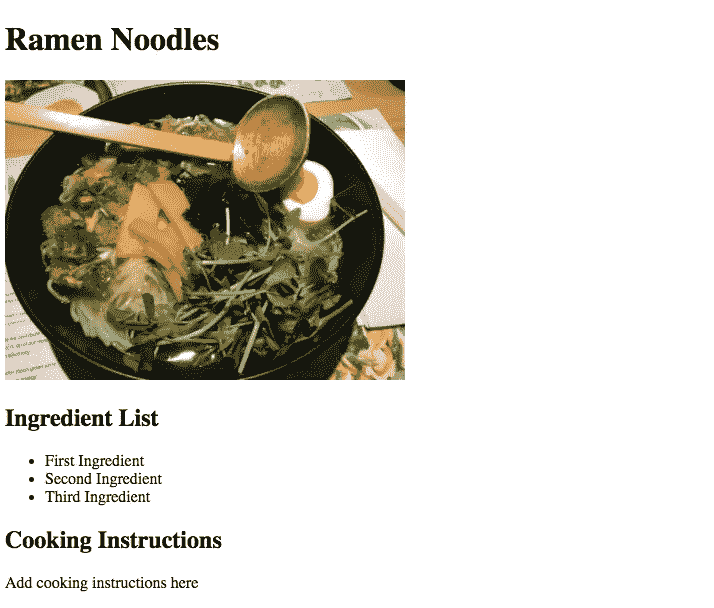

# 用 KeystoneJS、Mongo DB、React 和 Redux 构建节点 CMS 第二部分

> 原文：<https://itnext.io/building-a-node-cms-with-keystonejs-mongo-db-react-and-redux-part-ii-842a85ebd9f7?source=collection_archive---------1----------------------->


添加 React

如果你想看这个项目的最终版本，你可以从 [*github*](https://github.com/Colour-Full/medium-keystone-react-cms) 得到回购

在本系列的第一部分[中，我们成功地安装了 Keystone JS 并创建了我们的第一个数据模型。](https://medium.com/@velizarmihaylov/building-a-node-cms-with-keystonejs-mongo-db-react-and-redux-part-i-ae5958496df2)

到目前为止一切顺利，但如果一个非管理员来到我们的网站，他们看到的只是一条错误消息。让我们来解决这个问题。

如果你检查一下 Keystone 文档，你会看到他们使用 Jade 作为模板，但是我们会做一些不同的事情。如标题所示，我们将使用 React。

但是在我们跳到有趣的部分之前，我们需要为我们的应用程序设置一条路线。Keystone 运行在 Express Js 之上，如果您不知道 Express work 中的路由如何跳转到以下链接

 [## 快速路由

### 您可以使用与 HTTP 方法对应的 Express app 对象的方法来定义路由；比如 app.get()到…

expressjs.com](https://expressjs.com/en/guide/routing.html) 

即使你从来没有处理过快递也没有必要担心，设置路线是非常简单的。首先，让我们在 Keystone 中注册我们的路线。在根文件夹中的 Keystone 配置中，我们将添加以下内容:

```
keystone.set('routes', require('./server/routes'));
```

这指向一个我们还没有创建的文件，所以让我们这样做。在我们的服务器文件夹中，我们将转到 routes 子文件夹，创建一个新的 index.js 文件，并添加以下内容:

现在，如果我们从终端启动 Keystone 应用程序，当我们转到[http://localhost:3000/index . html](http://localhost:3000/index.html)时，我们应该会看到页面上写着 Hello World。

我知道你在想什么。这些都很好，但是 React 如何适应这一切呢？

好的，让我们在混合中加入一些反应魔法。对于这一部分，我们将切换到 ES6。由于 ES6 在 Node 和大多数浏览器中仍不完全支持，我们将使用 Babel 和 Webpack 将其编译为 ES5。

好了，继续工作，让我们安装 Babel 和 Webpack。在您的终端中，确保您位于项目根文件夹中，然后运行:

```
npm install babel-core babel-loader babel-preset-env babel-preset-react webpack webpack-cli -D
```

现在我们需要在我们的根目录下有一个 webpack.config.js 文件，没错，它将存储我们的 webpack 配置

为了在我们的 package.json 中利用这一点，我们将添加一个编译脚本，该脚本将从客户端文件夹中获取我们的所有代码，并将其捆绑到一个文件中，该文件将存储在“server/public/js/”文件夹中。转到 package.json 文件，在脚本部分添加以下内容:

```
"scripts": {"start": "node index.js","compile": "webpack --config webpack.config.js","test": "test"},
```

最后，我们需要将服务器指向 bundle.js 文件，这样我们就可以在浏览器中加载它。为此，我们需要转到我们的 Keystone 配置，并对其进行如下更新:

当我们在这里时，我们还添加了一个 img 文件夹的路径，我们的食谱图像将存储在这里。

现在我们有了开始写 React 所需的一切。

但是在此之前，我们需要实际安装 React 到我们的项目中

```
npm install react react-dom 
```

很好，我们已经添加了 React to 我们的依赖项，所以让我们快速构建一个简单的功能组件，它将让您了解来自 Keystone 后端的信息将如何呈现。我假设你有一些工作反应的知识，所以我不会深入到代码做什么，因为这不是本教程的目标。

在客户端文件夹中创建 index.jsx 文件，并添加:

现在让我们通过打开您的终端，导航到项目根文件夹并运行来编译它

```
npm run compile
```

现在如果你往里看。/server/public/js/`文件夹中应该有一个 bundle.js 文件。

让我们把文件导入到我们之前写的静态 HTML 中，同时去掉“Hello World”语句。

现在让我们在终端中运行启动脚本

```
npm start
```

如果我们在浏览器中去 index.html，应该会有这样的内容



好吃，那些拉面看起来很好吃

干得好，但不幸的是这都是静态标记。我们的后端和前端没有真正的联系。我们可以在管理面板中添加尽可能多的食谱，但是一旦我们进入我们的索引页面，什么都不会改变。

不要惊慌，这一切都将在本教程的最后部分得到解决，我们将添加 Redux 来粘合一切。

# [用 KeystoneJS、Mongo DB、React 和 Redux 构建节点 CMS 第三部分](/building-a-node-cms-with-keystonejs-mongo-db-react-and-redux-part-iii-4c8b991cc3f)