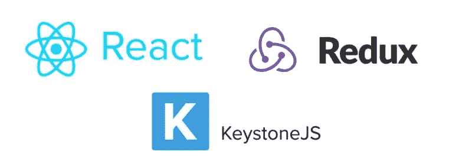
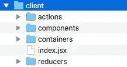
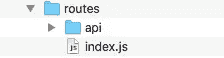
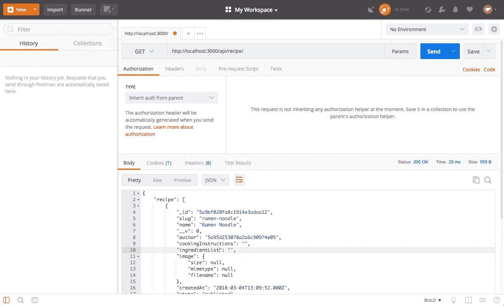
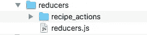
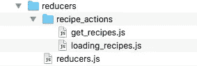
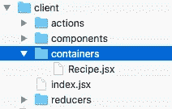
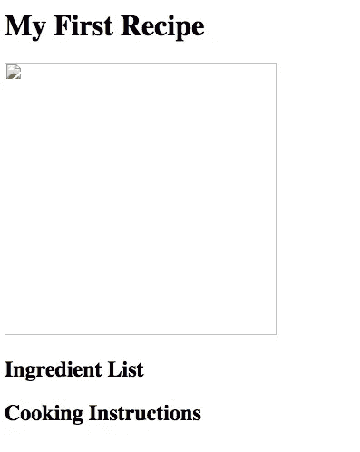
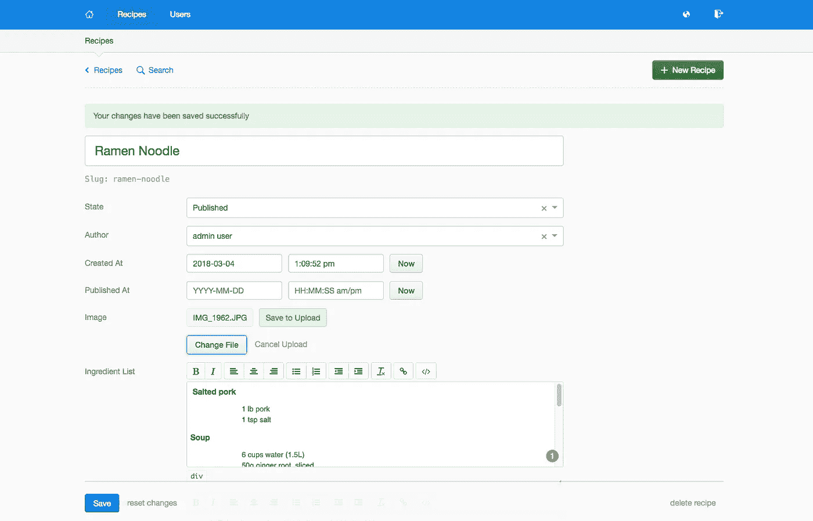
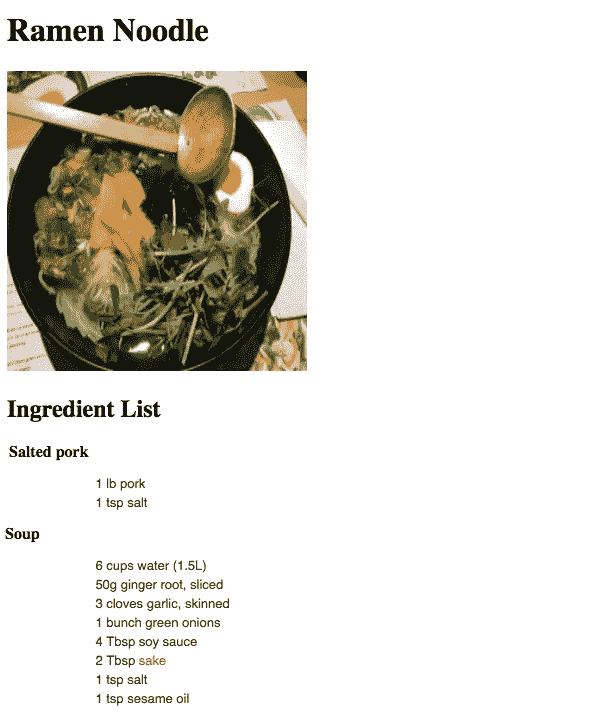

# 用 KeystoneJS、Mongo DB、React 和 Redux 构建节点 CMS 第三部分

> 原文：<https://itnext.io/building-a-node-cms-with-keystonejs-mongo-db-react-and-redux-part-iii-4c8b991cc3f?source=collection_archive---------3----------------------->

添加 Redux



> [点击这里在 LinkedIn 上分享这篇文章](https://www.linkedin.com/cws/share?url=https%3A%2F%2Fitnext.io%2Fbuilding-a-node-cms-with-keystonejs-mongo-db-react-and-redux-part-iii-4c8b991cc3f)

*如果你想看这个项目的最终版本，你可以从* [*github*](https://github.com/Colour-Full/medium-keystone-react-cms) 获得回购

欢迎阅读本系列的第三章，也是最后一章。在[第一部分](/building-a-node-cms-with-keystonejs-mongo-db-react-and-redux-part-i-ae5958496df2)中，我们成功安装了 Keystone Js，在[第二部分](/building-a-node-cms-with-keystonejs-mongo-db-react-and-redux-part-ii-842a85ebd9f7)中，我们添加了 React，现在我们将让它们与 Redux 进行通信。

现在 Redux 可能会有点混乱，所以如果你以前没有这方面的经验，我强烈建议你观看 Redux 的创造者 Dan Abramov 的视频课程:

[](https://egghead.io/courses/getting-started-with-redux) [## Redux 入门

### Redux 为管理 React 应用程序中的状态提供了一个可靠、稳定和成熟的解决方案。通过一把…

蛋头](https://egghead.io/courses/getting-started-with-redux) 

有许多工作要做，所以我们最好现在就开始。

首先，我们将安装 redux 和 react-redux

```
npm install redux react-redux
```

现在，我们将在客户端文件夹中添加几个子文件夹。



我们将在后面逐一介绍，但首先，我们需要在客户机上更新 index.jsx。

在我们继续之前，我想回到服务器。如果你看过一些关于 Redux 的教程，你可能会注意到它们通常处理从 REST API 获取数据。我们将做完全相同的事情，但是使用 Keystone API。Keystone 提供了一个 RESTful API，但不幸的是，这并没有很好的记录。我能找到的最好的文档是这个[线程](https://gist.github.com/JedWatson/9741171)。

让我们做这个例子，希望事情会变得更清楚。在我们的服务器/根文件夹中，我们将创建一个名为 api 的新的子文件夹。



在这个文件夹中，我们将添加一个新文件:

现在让我们把配方 API 端点放到我们的服务器上。在 server/routes/index.js 文件中，我们需要添加:

最后，让我们检查一下是否一切正常。为了测试 API，我们将使用 [postman](https://www.getpostman.com/)



太好了，我们已经为 redux 做好了一切准备，让我们继续吧。

首先，我们将创建一些动作来利用我们刚刚创建的 API。在这里，我们将为 axios 项目引入两个新的依赖项(如果您觉得使用 fetch 更舒服，可以使用 fetch)和 redux-thunks。

```
npm install axios redux-thunk
```

Thunks 是一个 Redux 中间件，允许您编写返回函数而不是动作的动作创建器。这主要是为了对 API 进行异步调用，这正是我们要做的。在 client/actions/中，我们将创建一个名为 actions.js 的新文件(请记住，这个命名并不常规，我只是这样命名该文件，以便更容易理解)，我们将添加

接下来，我们需要使用 reducers 文件夹中的操作，我们将添加一个新文件 reducers.js 和新文件夹 recipe_actions。



然后在 actions 文件夹中，我们将需要两个文件分别用于我们的每个操作



然后:

没什么特别的，只有两个函数在被调用时会更新我们的状态。你可能会认为把它分成多个文件是一种很麻烦的方法，但是我喜欢这样做，因为这样可以让你直观地看到你的应用程序中有哪些可用的操作。在您自己的项目中，您可能希望将所有操作合并到一个文件中。

好的，最后让我们把所有的都放在 reducers.js 中

很好，现在我们需要去我们的容器文件夹，并创建我们的食谱容器。



一个小的旁注，你们中的一些人可能想知道为什么我们把它添加到容器文件夹中，而不是组件文件夹中。简而言之，所有只关注事物的外观而不涉及状态的东西都应该是一个组件。现在，这是一个过于简化的问题，但是对于本文来说，它是可行的。要了解完整的故事，请阅读丹·阿布拉莫夫的以下文章:

[](https://medium.com/@dan_abramov/smart-and-dumb-components-7ca2f9a7c7d0) [## 表示和容器组件

### 你会发现如果你把组件分成两类，你的组件更容易重用和推理。

medium.com](https://medium.com/@dan_abramov/smart-and-dumb-components-7ca2f9a7c7d0) 

为了保持文章简洁明了，我将不做任何组件，我们将只在一个容器中构建我们的食谱，但是在现实世界中，你可能会想把它分成几个组件，例如

*   配方图像组件
*   成分列表组件
*   烹饪指令组件

然后可能使用所有这些组件来创建食谱列表、食谱张贴等。我会让你在自己的时间里探索这一点，或者这可以是另一篇文章…

总之回到我们的简单例子。在客户端/容器中，我们创建了 Recipe.jsx 文件。为此，我们还需要安装 lodash，所以不要忘记

```
npm install lodash
```

现在是最后一步，回到我们的应用程序根，我们需要填充我们的商店，并添加食谱组件，如下所示:

如果我们启动我们的应用程序，查看 index.html，您应该会看到如下内容



太好了，让我们跳到管理面板，添加缺失的数据



保存它，现在如果我们再次查看索引页:



好吧，我承认，它看起来并不令人印象深刻，但造型不是我们在这里的目标。我们实际上想要实现的是从我们的 Keystone 管理面板获取数据，并在前端呈现出来，这正是我们所做的。

本教程到此结束，希望对你有所帮助，并让你学到一些新东西。如果你有任何意见或问题，欢迎在评论中分享。