# 在外部系统中构建密码恢复服务

> 原文：<https://itnext.io/building-a-password-recovery-service-in-outsystems-38ca0606e841?source=collection_archive---------1----------------------->

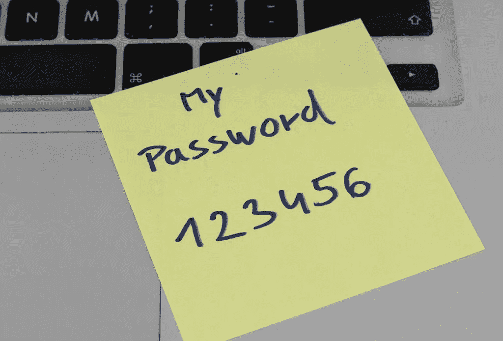

根据[知识共享 2.0](https://creativecommons.org/licenses/by/2.0/) 由 [Marco Verch](https://linktr.ee/wuestenigel) 拍摄的照片

使用电子邮件是允许用户重置密码的常见方式，通常有两个步骤，*忘记密码请求*和*重置密码*。

通常情况下，用户会参考一封电子邮件，应用程序会发送一条消息，其中包含一个带有令牌的链接，允许它确认用户就是他们所说的那个人，并继续注册新密码。

然而，对此有一些考虑。让我们使用 [OWASP 忘记密码备忘单](https://cheatsheetseries.owasp.org/cheatsheets/Forgot_Password_Cheat_Sheet.html#offline-methods)作为参考。

# 忘记密码请求

根据定义，该服务未经身份验证，任何人都可以多次使用。

它不应该确认电子邮件是否与注册用户相关联。这带来了一个额外的挑战，如果用户有多个电子邮件帐户，并且不记得使用了哪个帐户，该怎么办？你可以找到很多关于这个话题的讨论。

有些人喜欢含糊的“电子邮件已发送，请检查您的收件箱”，即使没有发送任何消息，因为电子邮件地址与用户无关。

有些人使用更明确的“如果找到，将发送电子邮件…”并且只发送给与注册用户相关的电子邮件。

有些人喜欢总是向引用的电子邮件发送消息。一条消息表明没有注册用户与该电子邮件地址相关联，另一条消息包括恢复链接，如果该电子邮件地址实际上与用户相关联的话。这是完美的，如果用户有多个电子邮件帐户，并且不记得哪个被使用。

为了避免用户失望，我们将实现第三个选项。如果电子邮件地址与用户相关联，则 **Token_Create** 方法仅返回恢复 **URL** 。有了这个，你的应用程序可以决定发送哪个电子邮件版本。

我们还需要防止滥发电子邮件帐户，稍后会有更多。

# URL 令牌

应该使用加密的安全随机数生成。令牌应该是全局唯一的，并且难以猜测，以使暴力或字典攻击变得非常困难。

传统的加密 API 提供了一种方法来做到这一点。

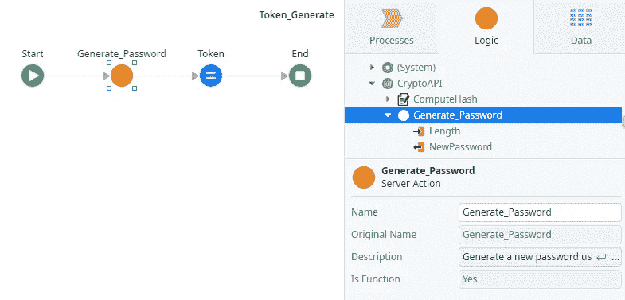

应该链接到一个单独的用户，并以一种安全的方式存储，这样即使数据库遭到破坏，您也无法重新生成一个有效的 URL。

应用程序将对令牌进行哈希处理，并且只存储哈希。我们可以使用一个简单的散列(没有盐或胡椒),因为由于令牌是唯一的，很难猜测，并且只使用一次，它可以防止字典和暴力攻击。

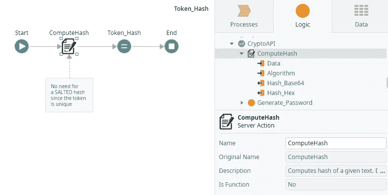

应该是短命的。通常令牌都有到期日期。

应该有一个硬编码的 URL，或者根据受信任域的列表来验证它。由于恢复 URL 很可能是根据应用程序的参数构建的，这将防止攻击者假冒您的 URL 链接，并将您的用户重定向到他们自己的重置密码页面。

# 垃圾邮件防范

攻击者可以使用您的密码恢复系统来骚扰和发送随机电子邮件地址，或者发送垃圾邮件给一个他知道该电子邮件的特定注册用户。

为了防止这种情况，我们需要阻止针对特定电子邮件的多次尝试。

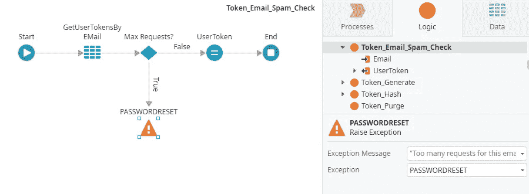

而且来自同一个 IP 地址的请求数量异常多。

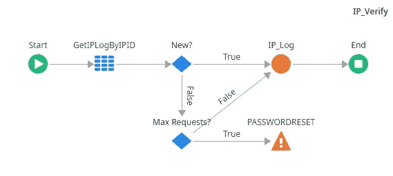

这不是完全充分的证据，但它确实使事情对攻击者来说更加复杂。

# 推荐策略

当我们在 URL 中包含敏感信息时，我们必须考虑[跨域推荐人泄漏](https://portswigger.net/kb/issues/00500400_cross-domain-referer-leakage)的可能性。

每当您从服务器外部的资源(如图像、java 脚本等)加载内容时，都会发生这种情况。

浏览器包含一个 referrer 头，让拥有资源的服务器知道谁在请求它。

现代浏览器通过在“Referrer-policy”上自动包括“strict-origin”(或类似的)头来限制这一点，这将只包括 Referrer 头上的域，而不是完整的 URL。

例如，如果我的重置密码页面上有一个外部图片，chrome 会添加一个“严格来源”的推荐策略:

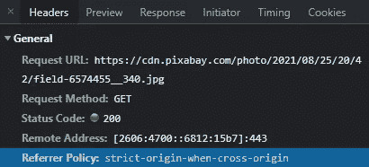

并且仅泄漏“referer”报头上的域部分。

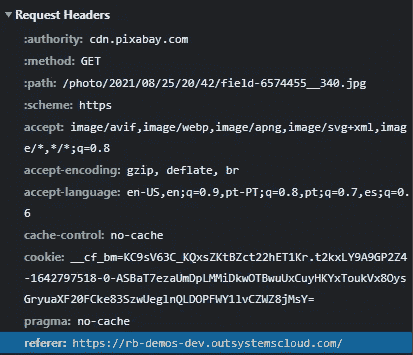

然而，你不应该相信浏览器在做什么。

你应该在你的重置密码页面上包含一个“禁止推荐”的指示，以防你的应用程序从其他地方加载内容。类似于:

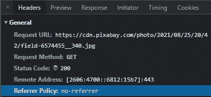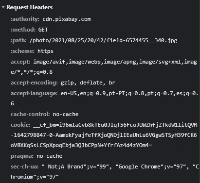

# 更新密码

一旦一切检查完毕，就只需要更新用户密码了。为此，您可以使用用户模块 API，并且不要忘记删除已使用的令牌。

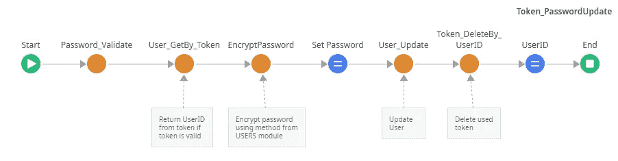

像往常一样，这个组件，演示和单元测试可以在[这里](https://www.outsystems.com/forge/component-overview/12355/password-reset-service)找到。

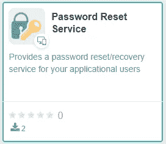

[密码重置服务](https://www.outsystems.com/forge/component-overview/12355/password-reset-service)

看看 YouTube 上的视频:

…现在，去构建那些应用程序吧！