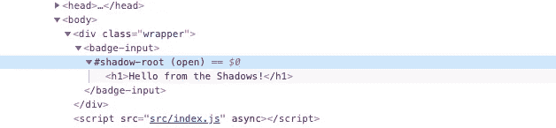

# 构建实用的 Web 组件

> 原文：<https://itnext.io/building-a-practical-web-component-9e84f5e4d63a?source=collection_archive---------1----------------------->


web 组件是未来 Web 的构建模块吗？Iker Urteaga 在 [Unsplash](https://unsplash.com/search/photos/lego?utm_source=unsplash&utm_medium=referral&utm_content=creditCopyText) 拍摄的照片

最近，我发表了一篇关于如何在 pure React 中创建电子邮件芯片的[教程。我的目标是向您展示在 React 中不使用任何第三方脚本或依赖项来构建这样的组件是多么容易。](https://medium.freecodecamp.org/how-to-create-email-chips-in-pure-react-ad1cc3ecea16)

在本文中，我想通过将 React 从桌面上移除来进一步加强游戏。是的，你没听错，没有反应！牵着我的手，放松，冒险进入一个没有任何依赖的无框架世界，构建管道或 NPM 脚本。你准备好了吗？

成品组件。去试试吧。

# 你为什么要这么做？

当您提到普通 JavaScript 时，许多开发人员会感到紧张。在 2019 年，在没有框架或库的情况下构建大型 web 应用似乎几乎不可能，或者至少是乏味的。老实说，React、Vue.js 和所有这些工具的存在都有很好的理由:它们让开发数据驱动的 ui 变得更加容易。一旦你理解了一个框架或库是如何工作的，你就可以构建令人惊奇的应用程序，而不用担心数据绑定、状态或其他复杂的概念。

这样做的坏处是 web 开发变得越来越复杂(有人可能会说臃肿)。在您考虑在 React 中编写一行代码之前，您需要准备好 Webpack 或 package 之类的构建工具。别忘了 Babel 可以为老版本的浏览器移植你的代码。多亏了这个社区，像`create-react-app`这样的东西才得以存在，并使项目搭建变得轻而易举。尽管如此，你必须首先安装数百个依赖项，它们并不总是相处得很好。

然而，近年来我注意到了一个变化。许多新的原生 ECMAScript 特性和 API 已经问世，网络平台也有了巨大的发展。今天，与 5 年前相比，我们可以在普通 JavaScript 上走得更远，而且事情还在继续改善。在本教程中，我们将使用其中一个新特性: [Web 组件](https://developer.mozilla.org/en-US/docs/Web/Web_Components)。

# 什么是 Web 组件？

Web 组件背后的理念与让 React 或 Vue.js 如此出名的理念是一样的:整个应用程序的可重用组件。

> “web 组件是一套不同的技术，允许您创建可重用的自定义元素(其功能封装在代码的其余部分之外)，并在您的 Web 应用程序中使用它们。”
> - MDN

Web 组件是 API 和技术的集合，如**影子 DOM** 、**自定义元素**或 **HTML 元素**。它们彼此独立，但可以顺畅地协同工作，给开发者带来良好的体验。

本教程不是对 Web 组件的介绍，它的目的是给出一个例子，说明如何从头开始实现一个实用的组件。如果你对整个事情都不熟悉，有一个关于 CSS 上的 Web 组件的很棒的系列[—](https://css-tricks.com/an-introduction-to-web-components/)。如果你仍然对整件事感到困惑，我建议你先读一下。

# 搭建项目

让我们亲自动手，为这个项目打下基础。振作起来:我们只需要 3 个文件！

*   `index.html`
*   `badge-input.js`
*   `styles.css`

继续在一个空文件夹中创建这些文件，您可以将其命名为`chips`或任何您喜欢的名称。就是这样。没有`create-react-app`，没有`npm install`，什么都没有。你上次这么轻松是什么时候？

**注意:**我们将使用旧浏览器中没有的 JavaScript 特性。如果你想跟进，确保使用最新的浏览器，如 Chrome 或 Firefox。

# HTML 标记

下一步是在我们的`index.html`文件中创建 HTML 标记。这将是非常直接的。我们首先需要基本的框架:

```
<!DOCTYPE html><html lang="en">
  <head>
    <meta charset="UTF-8">
    <meta name="viewport" content="width=device-width, initial-scale=1.0" /> <title>Email Chips</title> <link rel="stylesheet" href="styles.css">
  </head>
  <body> <script src="badge-input.js" defer>
  </body>
</html>
```

到目前为止，一切顺利。如果我们在浏览器中打开它，除了标题之外，什么也不会出现。注意头部`styles.css`和身体`badge-input.js`的链接。这两个文件当前都是空的。`script`标签具有属性`defer`，该属性告诉浏览器该文件可以异步加载，因此它提高了加载性能(尽管在这个小项目中很难注意到)。仍然是最佳实践。

将下面的代码片段放在 HTML 的主体中，就在`script`标签之前:

```
<div class="wrapper">
  <badge-input></badge-input>
</div>
```

其实就是这样。继续重新加载浏览器——它仍然是空的。这是因为我们正在“使用”我们的 Web 组件`badge-input`，但是它仍然是**而不是**在任何地方定义的，所以浏览器只是看到了标签并忽略了它。`div`仅用于造型目的。

# 基本造型

CSS 将与之前教程[中的一样，略有不同。这一次，我们不把我们 CSS 规则的**全部**放入`styles.css`，只放这三个:](https://medium.freecodecamp.org/how-to-create-email-chips-in-pure-react-ad1cc3ecea16)

```
@import url("https://fonts.googleapis.com/css?family=Open+Sans");:root {
  color: #565656;
  font-family: "Open Sans", sans-serif;
  font-size: 14px;
  line-height: 1.7;
}body {
  background-color: #eaeaea;
  display: flex;
  align-items: center;
  justify-content: center;
  height: 100vh;
}.wrapper {
  background-color: white;
  width: 400px;
  padding: 2rem;
  box-shadow: 0 1.5rem 1rem -1rem rgba(0, 0, 0, .1);
  border-radius: .3rem;
}
```

在我之前的 React 教程中，所有 DOM 元素(包括输入和芯片)都在同一层，即 [Light DOM](https://stackoverflow.com/questions/42093610/difference-between-light-dom-and-shadow-dom) 。然而，在本教程中，我们将使用 [Shadow DOM](https://glazkov.com/2011/01/14/what-the-heck-is-shadow-dom/) ，它作为组件标记的封装。因此，`styles.css`中的 CSS 将无法访问我们组件的标记，使它没有任何样式。


光影。Martino Pietropoli 在 [Unsplash](https://unsplash.com/search/photos/shadow-light?utm_source=unsplash&utm_medium=referral&utm_content=creditCopyText) 上拍摄的照片

“哇，等一下。这是怎么回事？”，看完这一段你可能会问自己。看起来很困惑，对吧？

让我再分解一下:传统上，我们有一个叫做 [DOM](https://developer.mozilla.org/en-US/docs/Web/API/Document_Object_Model/Introduction) 的东西，所有的 HTML 元素都在里面。只有一个 DOM，如果你写了任何 CSS 或者 JavaScript，你可以使用`document.getElementById()`等等来访问你的元素(比如段落或者标题)。

几年前，DOM 的兄弟 Shadow DOM 被引入 web 平台。它的工作方式基本上和我们通常的 DOM(现在称之为 Light DOM，说的是平衡)一样，但是不能使用 JavaScript 或 CSS 访问。

假设在 Shadow DOM 中有一个元素`<p id="text"></p>`。如果你尝试使用`document.getElementById("text")`访问它，它将找不到任何东西，甚至我们的 CSS 也无法对它进行样式化，因为它基本上对我们是隐藏的。就像床下的怪物，我们知道它在那里，却看不见。

"到目前为止一切顺利，但这对我有什么用？"我知道你在问。封装就是答案。你曾经使用过 HTML 5 的`<video>`或者`<audio>`元素吗？如果你在你的标记中添加了`<video>`标签，然后重新加载，你会看到一个带有样式化控件的视频播放器，但是你没有添加这些，对吗？他们也生活在阴影世界里。你不能设计它们的样式，你不能操纵它们，它们基本上不在你的能力范围内，由浏览器提供。最大的优势是它们不会与你在应用程序中设置的任何风格或逻辑相冲突。这也是我们想要的组件。

# Web 组件

现在，让我们进入项目有趣的部分，组件本身。在`badge-input.js`里面，我们将从简单的[生活](https://developer.mozilla.org/en-US/docs/Glossary/IIFE)开始:

```
(function() {
  "use strict"; // Code will be here...})();
```

我在生活中包装整个事物的原因是[封装](https://stackoverflow.com/questions/3597087/encapsulation-in-javascript)。除了 Web 组件本身，我可能还想定义其他函数或变量，它们不应该污染我的全局名称空间。通过将所有东西包装在一个生命中，我获得了自己的名称空间，并且不必担心应用程序其他部分的副作用。

接下来，让我们创建组件的基础:

```
class BadgeInput extends HTMLElement {
  constructor() {
    super();
  }
}customElements.define("badge-input", BadgeInput);
```

看起来有点像 React 吧？Web 组件基本上是扩展`HTMLElement`的类，它们可以有属性和方法。像在 React 中一样，如果你定义了一个构造函数(比如初始化变量)，你需要调用`super()`函数来继承`HTMLElement`的逻辑和行为。这使得它最终表现得像一个 Web 组件。

如果你保存并刷新你的浏览器，你仍然不会看到任何东西。不奇怪，因为我们的组件是空的。让我们添加一些标记:

```
constructor() {
  super(); this._shadow = this.attachShadow({ mode: "open" });
  this._shadow.innerHTML = "<h1>Hello from the Shadows!</h1>";
}
```

为了在影子 DOM 中插入东西，我们需要调用`this.attachShadow({ mode: "open" })`。`[attachShadow](https://developer.mozilla.org/en-US/docs/Web/API/Element/attachShadow)`是我们开箱即用的方法，因为我们的类`BadgeInput`扩展了`HTMLElement`。

稍后，我们将需要再次访问 Shadow DOM，所以我们保存了一个对`this._shadow`的引用(如果您愿意，可以用不同的方式命名这个变量)。将`mode`设置为`open`，这允许 JavaScript 访问其中的元素。在大多数情况下，你希望它是开放的。

在下一行，您将看到一个您应该很熟悉的 DOM 属性:`innerHTML`。像在 Light DOM 中一样，我们可以使用`appendChild`、`insertBefore`、`textContent`和所有其他 DOM 方法和属性来操作元素。

看看浏览器，我们终于可以看到发生了什么，如果你检查源代码，你会注意到我们的`h1`标签在影子 DOM 中:



当然，我们不想打印出一个简单的标题，所以再次删除第 4 行。下一步我们将添加真正的标记。

# 使用 HTML 定义标记`templates`

在我的[之前的 React 教程](https://medium.freecodecamp.org/how-to-create-email-chips-in-pure-react-ad1cc3ecea16)中，我们使用 JSX 在组件的`render`函数中定义了我们的标记结构。由于这不再是 React，我们需要一种不同的方式来构建 HTML。

就在我们定义`BadgeInput`类之前(但仍在生命中)，粘贴以下代码:

```
var template = document.createElement("template");
template.innerHTML = `
  <style>
    /* paste the styles here */
  </style> <ul></ul>
  <input type="email" placeholder="Type or paste email addresses and press 'Enter'...">
  <p hidden></p>
`;
```

所以，我们在这里做的是创建一个新的`[template](https://developer.mozilla.org/en-US/docs/Web/HTML/Element/template)`元素。然后，我们将`innerHTML`设置为我们稍后需要的结构。这几乎与 React 示例相同。

我们在第 3 行定义了一个当前为空的`style`块。在这里，我们需要粘贴`styles.css`中缺少的 CSS 规则。请继续操作，并从成品中自己粘贴它们，因为我把它们留了下来，以免不必要地夸大这篇文章。

好了，现在我们有了一个带有标记的模板，我们需要在组件中使用它:

```
constructor() {
  super(); this._shadow = this.attachShadow({ mode: "open" });
  this._shadow.appendChild(template.content.cloneNode(true);
}
```

瞧，你应该看到文本字段出现在你的浏览器中。
我们已经使用了`template`的`content`属性(它是一个[文档片段](https://developer.mozilla.org/en-US/docs/Web/API/DocumentFragment))和`[cloneNode](https://developer.mozilla.org/en-US/docs/Web/API/Node/cloneNode)`方法将模板的 HTML 结构的副本附加到组件本身中。`cloneNode`接收`true`作为参数进行深度克隆，这意味着所有子节点也被克隆。

> “但是这个模板是什么东西？”，你可能会问。

它用于存储我们的标记，这些标记可以在我们的代码库中重用。与通常的 HTML 元素相反，默认情况下，它不在浏览器中呈现，这提高了性能。模板的目的就是克隆它们的内容，并在需要的时候和地方重用它们。

您也可以将它添加到我们的`index.html`中，而不是用 JavaScript 以编程方式创建`template`:

```
<template id="badges">
  <style>
    /* paste the styles here */
  </style> <ul></ul>
  <input type="email" placeholder="Type or paste email addresses and press 'Enter'...">
  <p hidden></p>
</template>
```

现在我们可以使用`document.getElementById`在 JavaScript 中获得一个引用:

```
constructor() {
  super(); var template = document.getElementById("badges");

  this._shadow = this.attachShadow({ mode: "open" });
  this._shadow.appendChild(template.content.cloneNode(true);
}
```

这对您来说可能看起来更清晰，因为 HTML 不再是在我们的 JavaScript 中定义的了。然而，我更喜欢第一种方式，原因如下:

*   **可删除性:**通过将我们的整个组件(即 HTML、CSS 和 JavaScript)保存在一个文件中，它可以很容易地被移动或删除，而不会留下任何死代码。
*   **组织:**像 React 或 Vue.js 一样，将所有代码放在一起会使开发更容易，因为您不必在不同的文件之间切换来做更改或理解它们的逻辑。和这个组件相关的东西都在同一个地方。
*   干净的 HTML 页面:如果你只有一个组件，而有很多组件，这可能不适用。如果你把所有的模板放入，比如说`index.html`，这个文件将会被模板弄得杂乱无章。可能很难区分浏览器实际呈现的代码和组件使用的代码。

由于某种原因，模板是 Web 组件规范的一部分，因为它们使得在组件中重用代码块变得容易。

# 生命周期和事件监听器

那么，下一步是什么？与 React 非常相似，我们需要注册事件，例如当用户按 tab 键添加新的电子邮件地址时。我们还需要一个数组来保存这些电子邮件地址。让我们向组件实例添加一些属性:

```
constructor() {
  super(); this._shadow = this.attachShadow({ mode: "open" });
  this._shadow.appendChild(template.content.cloneNode(true)); this._items = [];

  this._input = this._shadow.querySelector("input");
  this._error = this._shadow.querySelector("p");
  this._list = this._shadow.querySelector("ul");
}
```

我们仍然在构造函数中。在第 5 行下面，您现在可以看到我们有 4 个新变量(或者说属性):

*   `_items`将存储我们的电子邮件地址。它被初始化为一个空数组。
*   `_input`是对`input`元素的引用，稍后我们将需要为其添加错误类。
*   `_error`再次是对一个 DOM 元素的引用。我们将需要这个引用来切换错误消息本身。
*   最后，`_list`是对`ul`元素的引用。每次添加或删除电子邮件地址时，我们都会更新。

你注意到我放在变量名前面的`_`了吗？这不是强制性的，但被认为是“私有”类属性的一种模式。当然，JavaScript [没有**也没有**像 PHP 或 Java 那样有私有/公共](https://github.com/tc39/proposal-class-fields#private-fields)属性。尽管如此，我还是用下划线将这些变量标记为私有变量(尽管这不会影响它们的行为或名称空间)。这是一件相当有组织性的事情。

太好了，我们有了对 HTML 元素的引用，但是仍然缺少事件侦听器。让我们添加它们:

```
constructor() {...}connectedCallback() {
  this._input.addEventListener("keydown", this.handleKeyDown);
  this._input.addEventListener("paste", this.handlePaste);
  this._list.addEventListener("click", this.handleDelete);
}disconnectedCallback() {
  this._input.removeEventListener("keydown", this.handleKeyDown);
  this._input.removeEventListener("paste", this.handlePaste);
  this._list.removeEventListener("click", this.handleDelete);
}
```

我向组件的类中添加了两个新方法。它们被称为[生命周期方法](https://developers.google.com/web/fundamentals/web-components/customelements#reactions)，你可能听起来很熟悉。在 React 中可以看到相同的概念:`componentDidMount`和`componentWillUnmount`是框架提供给我们的两个生命周期方法的例子。

与 React 中完全一样，一旦 Web 组件连接(或者说:安装)到我们的网站，就会调用`connectedCallback`。

在`index.html`中，我们通过使用`<badge-input></badge-input>`来“连接”组件。所以一旦浏览器遇到这段代码，它就会实例化我们的类并调用`connectedCallback`。

对于`disconnectedCallback`来说也是一样，但是一旦一个 Web 组件从 DOM 中被移除，这个就会被调用，例如通过`document.removeChild`。很整洁，不是吗？

在`connectedCallback`中，我们注册了三个事件监听器。与 React 不同，我们需要清理`disconnectedCallback`中的事件监听器，以避免内存泄漏。为什么？

想象一下在你的页面上添加和删除许多组件；如果您没有每次都删除事件侦听器，它们可能会继续存在，并通过消耗内存来降低整个应用程序的速度。在 React 中，这是为你处理的，然而，在这里我们必须自己清理，以保持应用程序的性能和干净。

# 处理输入

我们的事件监听器是注册的，但是我们还没有任何函数来实际做一些事情。我们来添加第一个，`handleKeyDown`:

```
constructor() {...}connectedCallback() {...}disconnectedCallback() {...}handleKeyDown = (evt) => {
  if (TRIGGER_KEYS.includes(evt.key)) {
    evt.preventDefault(); var value = evt.target.value.trim(); if (value && this.validate(value)) {
      evt.target.value = ""; this._items.push(value);
      this.update();
    }
  }
};
```

你首先会注意到的是`TRIGGER_KEYS`，我们还没有定义它。

```
const TRIGGER_KEYS = ["Enter", "Tab", ","];
```

我把这个代码放在生命的顶端，但是你可以选择任何其他的位置。然而，我建议将它放在 IIFE 中，因为它是我们组件的一部分，不应该污染全局名称空间。

因此，如果按下的键是 *Enter、Tab 键*或逗号，我们将在第 5 行获得输入值，并在第 7 行执行验证。`this.validate()`还不存在，所以我们来补充一下:

```
validate(email) {
  var error = null; if (this.isInList(email)) {
    error = `${email} has already been added.`;
  } if (!this.isEmail(email)) {
    error = `${email} is not a valid email address.`;
  } if (error) {
    this._error.textContent = error;
    this._error.removeAttribute("hidden");
    this._input.classList.add("has-error"); return false;
  } return true;
}isInList(email) {
  return this._items.includes(email);
}isEmail(email) {
  return /[\w\d\.-]+@[\w\d\.-]+\.[\w\d\.-]+/.test(email);
}
```

如果有错误，我们将使用我们的`this._error`引用来设置错误消息和可见性。此外，输入字段(`this._input`)将获得一个添加红色边框的类。

回到`handleKeyDown`，一旦验证通过(与我之前的 React 教程相同)，我们将输入的值重置为空字符串，并将电子邮件地址添加到`this._items`。最后一步是重新呈现我们的组件，在输入的顶部显示更新的电子邮件列表。

这就是`this.update()`的作用:

```
update() {
  this._list.innerHTML = this._items
    .map(function(item) {
      return `
      <li>
        ${item}
        <button type="button" data-value="${item}">&times;</button>
     </li>
     `;
   }).join("");
}
```

React 是*数据驱动的，*意味着 UI 是基于状态和道具呈现的。在 JSX，通过允许我们使用条件、循环等等来控制什么元素在什么状态下应该是可见的，这变得非常简单。

不幸的是，使用 Web 组件，我们没有 JSX 那样的奢侈，尽管我们试图实现同样的事情。相反，我们使用更传统的 DOM 操作方法，正如您在上面的方法中看到的。

每次调用`this.update`时，我们都会覆盖`ul`中的整个 HTML(如果您还记得，我们在模板中定义了它)。使用[模板文字](https://developer.mozilla.org/en-US/docs/Web/JavaScript/Reference/Template_literals)，我们可以很容易地将数据“注入”到 HTML 中，最后使用`innerHTML`追加数据。

结尾的`.join("")`很重要，因为`[.map()](https://developer.mozilla.org/en-US/docs/Web/JavaScript/Reference/Global_Objects/Array/map)`返回一个数组，而我们不能用数组来使用`innerHTML`，只能用字符串。`.join("")`获取数组中的所有项，将它们连接在一起(不用任何东西分隔，因此称为`""`)并返回一个字符串。

你可以重新加载你的浏览器并检查它，它应该工作正常。然而，有一个小小的错误:错误状态不会被重置，这意味着如果你输入一个无效的电子邮件，错误将会显示并永远存在。

让我们在我们的`handleKeyDown`方法中解决这个问题:

```
handleKeyDown = (evt) => {
  this._error.setAttribute("hidden", true);
  this._input.classList.remove("has-error"); // ...
}
```

每次按键时，这个方法都会隐藏我们的错误元素，并从输入中删除相关的类。这工作得很好！


到目前为止，情况看起来不错。

好的，现在深呼吸，放松，看看你已经走了多远。只少了两个功能:删除和粘贴邮件。

# 删除电子邮件

删除电子邮件芯片的逻辑与 React 示例非常相似:

```
handleDelete = (evt) => {
  if (evt.target.tagName === "BUTTON") {
    this._items = this._items.filter(
      item => item !== evt.target.dataset.value
    ); this.update();
  }
};
```

就这么简单。由于我们所有的电子邮件都存储在`this._items`中，我们可以轻松地[通过它过滤](https://developer.mozilla.org/en-US/docs/Web/JavaScript/Reference/Global_Objects/Array/filter)并删除已删除的电子邮件。
`evt.target.dataset.value`会包含我们想要处理掉的邮件。

还记得两分钟前我给你展示的`update`方法吗？在这里，我们定义了一个删除按钮:

```
<button type="button" data-value="${item}">&times;</button>
```

由于这个原因，`data-value`将始终是电子邮件地址，因此我们可以很容易地在`handleDelete`中使用这个值。`evt.target`是指按钮本身。但是等等！*“那第二行这个奇怪的 if 条件呢？”*，我听到你问。*“我们也没有为按钮设置任何事件监听器，那么这到底是怎么做到的呢？?"*

如果你也想知道这个，给自己一个标签。

我们使用一种叫做[事件委托](https://medium.com/@bretdoucette/part-4-what-is-event-delegation-in-javascript-f5c8c0de2983)的东西。事实上，按钮上没有事件监听器(永远也不会有)，而是在`ul`上。还记得生命周期回调，更确切地说是`connectedCallback`吗？

```
this._list.addEventListener("click", this.handleDelete);
```

神奇的是。我们的`ul`接收事件监听器，所以我们可以点击中的所有*来触发这个事件。里面有电子邮件文本和每个项目的按钮。可以点击按钮，触发事件处理程序。但是我们也可以点击文本，它将触发完全相同的处理程序`handleDelete`。*

当然，我们不希望这样。只有当用户单击按钮时，才会触发删除。这就是这个奇怪的 if 条件的作用。它检查被点击的元素是否确实是按钮(`event.target.tagName`)，然后才运行逻辑。

# 粘贴电子邮件

我们终于到了最后一步，只差一个特性:粘贴电子邮件地址。代码如下:

```
handlePaste = evt => {
  evt.preventDefault();

  var paste = evt.clipboardData.getData("text");
  var emails = paste.match(/[\w\d\.-]+@[\w\d\.-]+\.[\w\d\.-]+/g); if (emails) {
    var toBeAdded = emails.filter(email => !this.isInList(email)); this._items = [...this._items, ...toBeAdded];
    this.update();
  }
};
```

这段代码与 React 中的代码非常相似。

1.  我们首先防止第 2 行的默认浏览器行为，即输入中的复制文本。
2.  我们将第 4 行的剪贴板内容作为一个字符串。
3.  使用一个正则表达式和`[match()](https://developer.mozilla.org/en-US/docs/Web/JavaScript/Reference/Global_Objects/String/match)`，我们从字符串中提取所有有效的电子邮件到数组`emails`。
4.  如果数组中有任何电子邮件，我们运行一个过滤函数，只获取不在我们的`this._items`数组中的电子邮件。
5.  然后我们将`this._items`与第 10 行的新条目合并。
6.  最后一步是再次重新呈现列表，以便我们新粘贴的电子邮件可见。


# 结论

在这里，我们刚刚将一个 React 组件转换为一个 Web 组件，没有任何构建过程或依赖关系。普通的旧 JavaScript，被最新的 API 和标准所丰富。下面是最终结果:

我们的最终结果看起来和行为完全像我们在 React 中构建的结果。

这里的目标是向您展示从头构建一个实用的 Web 组件是多么容易。当然，我们还没有涵盖所有的内容，更多的主题还在前面，等待我们去发现:

*   [属性和属性](https://developers.google.com/web/fundamentals/web-components/customelements#properties_and_attributes)将数据传递到 Web 组件中。
*   真正的数据绑定，使用[库](https://lit-html.polymer-project.org/)或 JavaScript [代理对象](https://developer.mozilla.org/en-US/docs/Web/JavaScript/Reference/Global_Objects/Proxy)。
*   使用[可构造的样式表](https://developers.google.com/web/updates/2019/02/constructable-stylesheets)轻松应用全局 CSS，而不必对抗光影 DOM 之间的边界。
*   组件之间的交互，就像在 React 中一样。在整个应用程序中共享状态。

我希望你喜欢这个教程，随时告诉我你的建议或反馈。编码快乐！