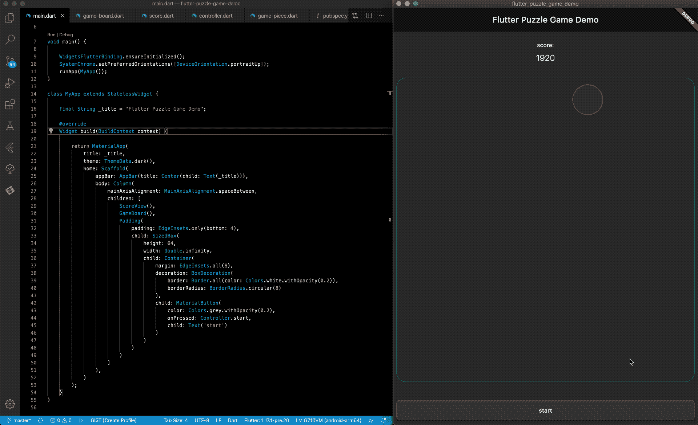
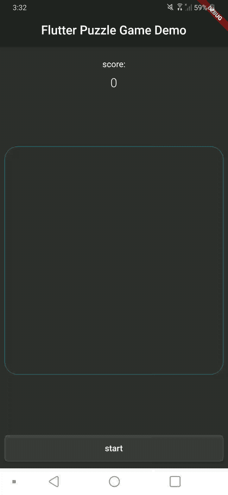

# 在 Flutter 中构建一个益智游戏

> 原文：<https://itnext.io/building-a-puzzle-game-in-flutter-41c6c1eee65a?source=collection_archive---------0----------------------->

## 如何建立一个飞镖和扑 2D 益智游戏

示例项目的屏幕记录

## 介绍

lutter 是构建跨平台应用的热门选择，它拥有简洁的用户界面、流畅的动画和闪电般的性能。在本文中，我们将回顾一个简单的 2D 益智游戏在 Flutter 中的设计和开发，利用几个概念和设计模式，这些概念和模式可以应用于任何需要复杂 UI 的应用程序。

为了构建和运行这个项目，需要一个颤振环境。有关安装 Flutter 的更多信息，请参见安装页面[这里](https://flutter.dev/docs/get-started/install)。

如需示例源代码的副本，请查看[这份报告](https://github.com/kenreilly/flutter-puzzle-game-demo)。

## 概念

在这个简单游戏的设计中使用了几个 Flutter UI 开发概念，每个概念在游戏状态和图形渲染的整体管理中都扮演着重要的角色。其中包括:

*   基本的 Flutter 小部件如[容器](https://api.flutter.dev/flutter/widgets/Container-class.html)、[大小框](https://api.flutter.dev/flutter/widgets/SizedBox-class.html)、[列](https://api.flutter.dev/flutter/widgets/Column-class.html)等。
*   使用[动画控制器](https://api.flutter.dev/flutter/animation/AnimationController-class.html)、[动画宽度](https://api.flutter.dev/flutter/widgets/AnimatedWidget-class.html)和[补间](https://api.flutter.dev/flutter/animation/Tween-class.html)
*   用[change notifier](https://api.flutter.dev/flutter/foundation/ChangeNotifier-class.html)/[change notifier provider](https://pub.dev/documentation/provider/latest/provider/ChangeNotifierProvider-class.html)管理状态
*   处理事件和利用[流](https://api.flutter.dev/flutter/dart-async/Stream-class.html) / [流控制器](https://api.flutter.dev/flutter/dart-async/StreamController-class.html)
*   使用[手势检测器](https://api.flutter.dev/flutter/widgets/GestureDetector-class.html)捕捉和消除手势反弹

这个演示游戏结合了这些概念的实现来定义游戏逻辑、状态管理、交互、渲染和动画行为，以一种简单有效的方式，使用干净的设计和最少的源代码。

## 概观

游戏的逻辑包含在五个源文件中，每个源文件都有处理各种任务的特定实现。这些是:

*   **main.dart** : app 初始化和顶层 UI widget 渲染
*   **game-board.dart** :手势检测和游戏板渲染
*   **game-piece.dart** :游戏棋子模型/渲染/动画
*   **controller.dart** :处理回合/更新棋盘/其他游戏逻辑
*   **score.dart** :跟踪比分，比分变化时刷新视图

示例项目的设计很简单，利用前面提到的概念来完成大部分繁重的状态管理、动画和其他任务。游戏棋盘基于游戏棋子在棋盘上的当前 x/y 位置来呈现游戏棋子。当检测到滑动手势时，进行一次旋转，评估棋盘以确定将棋子移动到哪里以及何时将它们组合成具有更高值的棋子，类似于经典游戏 2048。控制器处理棋盘计算，并在每回合刷新棋盘，根据需要更新分数。

每个游戏棋子在棋盘上都有一个 x/y 位置，以及一个从 0 到 6 的值，对应于可见光谱中七种颜色中的每一种。当一个游戏棋子被移动时，它会自动移动到棋盘上的新位置。当一个棋子与一个相同的值发生冲突时，目标棋子被移除，然后移动的棋子被提升并移动到目标位置。

## 应用入口点

游戏初始化和 UI 搭建包含在 main.dart 中:

main 函数首先确保在将方向锁定应用到纵向模式之前初始化 Flutter 小部件，然后运行应用程序。游戏小部件返回一个带有深色主题 UI 支架的标准 MaterialApp，由一个包含分数视图、游戏板和开始按钮的列组成。这个文件中没有太多内容，因为大部分工作都是在其他组件中完成的。接下来，我们将检查分数视图和游戏板，感受一下设计。

## 游戏分数

分数类很简单，说明了游戏中使用的一些概念，所以让我们来看看 **score.dart** :

游戏分数是用一个独立的模型和视图实现的，模型扩展 ChangeNotifier，视图*消耗*这个模型，这将允许视图在模型改变时自动更新。这是通过在分值设置器中调用`notifyListeners()`来完成的，它将通知传播给 ChangeNotifierProvider，使小部件用新的分值重新构建自己。

这说明了提供者的[状态管理的一个基本实现，并提供了一种在模型改变状态时更新视图的简洁方法。](https://flutter.dev/docs/development/data-and-backend/state-mgmt/simple)

Flutter 不允许 StatelessWidget 上的可变属性，也不允许直接访问 StatefulWidget 的状态，因此这是一个很好的解决方案，可以更新对象的状态，并让它的 Widget 根据任何需要的条件重新构建。

## 游戏板

手势处理和棋盘渲染位于**游戏棋盘中。**

游戏板定义了用于接收用户输入和呈现游戏内容的若干属性和方法。在`initState()`期间，事件监听器被设置为从控制器接收更新事件，以重新绘制 UI。由于 Controller 类(我们稍后将对此进行研究)只有静态属性，并且不需要实例，因此它使用流来手动通知侦听器，而不需要 ChangeNotifier 的实例。

手势检测器用于捕捉输入，该输入在整个平移事件的过程中进行平均，并在滑动动作完成时提交给控制器，然后为下一个输入手势重置。这可以消除输入的反弹，使控制器更容易理解预期的方向。

一个正方形的游戏板被定义为高度和宽度等于设备的宽度，并且游戏棋子被呈现为堆栈的子元素，这将在 z 轴上一个接一个地堆叠它们。每个游戏棋子的 x/y 渲染位置是在游戏棋子类内部使用对齐属性来处理的，我们接下来将对此进行研究。

## 游戏棋子

处理游戏棋子操作和小部件渲染的类位于 **game-piece.dart** 中:

该文件中的三个主要组件是:

*   GamePieceModel:管理数据，并在发生变化时通知监听器
*   游戏片段视图:渲染一个圆形，当它被移动时会自动移动
*   GamePiece:将 GamePieceModel 和 GamePieceView 包装在一个小部件中

游戏板渲染一个 GamePiece 对象列表，每个对象都有一个 GamePieceModel 支持，同时也驱动 GamePieceView 的渲染。

每个游戏块直接向游戏板上的父栈呈现一个 GamePieceView 小部件，并提供`get`访问器以在必要时暴露底层模型的属性和方法。这使得 GamePiece 小部件可以作为游戏部件与程序其余部分的接口，简化了对每个部件执行操作的任务。

通过使用 Align 和 FractionalOffset 在 GamePieceView 中完成每个棋子在父堆栈中的定位，在 x 轴和 y 轴上将每个棋子偏移棋盘总尺寸的七分之一。

当创建一个游戏棋子时，会传入一个 GamePieceModel 实例来存储该棋子的位置和值，并从游戏控制器中检索以前的滑动方向，以确定新游戏棋子将从棋盘的哪一侧滑入。

当棋子移动到一个新位置时，GamePiece 中的 ChangeNotifierProvider 会获取该更改，重新构建小部件并启动控制器，该控制器驱动小部件在屏幕上移动的动画。动画由游戏块状态上的 AnimationController 驱动，使用`TickerProviderStateMixin`使其自身与动画控制器同步，该控制器被传递给 GamePieceView，并最终传递给它所扩展的 AnimatedWidget。GamePieceView 的构造函数使用 Tween 和 CurvedAnimation 为 x 和 y 创建动画值，这将创建从上一个位置到当前位置的动画路径。一旦 GamePieceView 对象被渲染，先前的位置被设置为当前位置，以防止动画再次运行，直到下一次需要移动棋子。

## 控制器

把所有这些放在一起就是**控制器:**

控制器类执行游戏中的大部分逻辑，包括游戏初始化、输入处理、回合处理和评估。创建了一个随机数生成器和一个`List<GamePiece>`来存储游戏中的棋子，以及一个`Map<Point, GamePiece>`来作为方便的 x/y 查找索引。`bus`属性提供了 Stream 和 StreamController 的实现，以便在回合结束时广播事件。

输入由`on`方法接收，并通过调用从事件接收的偏移量上的`parse`转换成`Direction`。然后对转弯进行评估，并在总线上触发一个更新事件。如果棋盘上的所有 49 个空格都被占据，游戏重新开始，否则新的棋子被添加到棋盘上，游戏准备好下一步棋。

回合评估从`process`方法开始，在该方法中，接收到`Direction`并使用相应的循环参数调用`scan`，以评估与滑动方向相反的棋盘。这允许首先处理沿目标向量最远的项目，根据需要合并片段，并为评估中的剩余片段清除一条路径。

`scan`方法采用开始、结束、增量运算和轴。用这些参数构建一个循环，开始扫描棋盘并寻找游戏中的棋子。每个棋子被传入`check`,它将起点、增量操作、轴和游戏棋子作为输入，并检查棋子的预期路径，根据需要合并或重新定位每个棋子。

通过首先检查被合并的块是否处于最高可能值来处理合并操作，如果是，则它们都被移除并且奖励分数，否则目标块被移除，并且引入的块被提升并移动到目标位置。

重定位操作只需从索引中删除当前键处的块，调用块上的`move`来更新它并触发动画，最后将该项放回索引中更新后的 x/y 位置键处。

## 结论

该演示展示了 Flutter 中可用的一些功能和灵活性，并展示了如何仅使用 Flutter SDK 和 provider 包来制作简单的 2D 游戏，从头开始创建其他一切。

其中使用的概念可以直接转移到任何类型的 Flutter 应用程序，这些应用程序需要简单的状态管理、高度交互式的 UI、高效的动画和渲染周期，以及未来需要低维护开销的整体干净的架构。

请在 Medium 上关注我，了解更多关于现代软件技术的技术资源，从前端和移动到云、虚拟化和 API 开发工具。

感谢您的阅读，祝您的下一个颤振项目好运！

~ [8_bit_hacker](https://twitter.com/8_bit_hacker)