# 构建带有内置效果支持的 React 状态管理库

> 原文：<https://itnext.io/building-a-react-state-management-library-with-built-in-effects-support-36c5f5358dc2?source=collection_archive---------5----------------------->

在为 react 构建聊天业务逻辑库时，我意识到当前的状态管理解决方案很欠缺。聊天是一个实时的复杂应用程序，有许多听众——当我加入一个新的聊天室时，你必须确保有一个回拨，确保在每个房间收听新消息和阅读指示，确保在参与者更改他们的个人资料图片时收听。当人们谈论状态管理库时，他们总是谈论在其中处理 fetch 和其他基于 Promise 的异步操作是多么重要。但是处理基于事件的异步，以及事后清理以免留下任何内存泄漏，要困难得多。我们现在拥有的最好的解决方案是 redux-observables，这是解决这些问题的一种非常优雅的方式，但我相信它可以用一种更简单的方式来实现。面对这个问题，我决定尝试构建自己的状态管理解决方案，从零开始，边走边解决问题。

你可以在这里找到完工的图书馆—[https://www.npmjs.com/package/@plancky/state](https://www.npmjs.com/package/@plancky/state)。

首先，我创建了一个存储数据的类，当数据发生变化时，它能够与视图层进行通信。

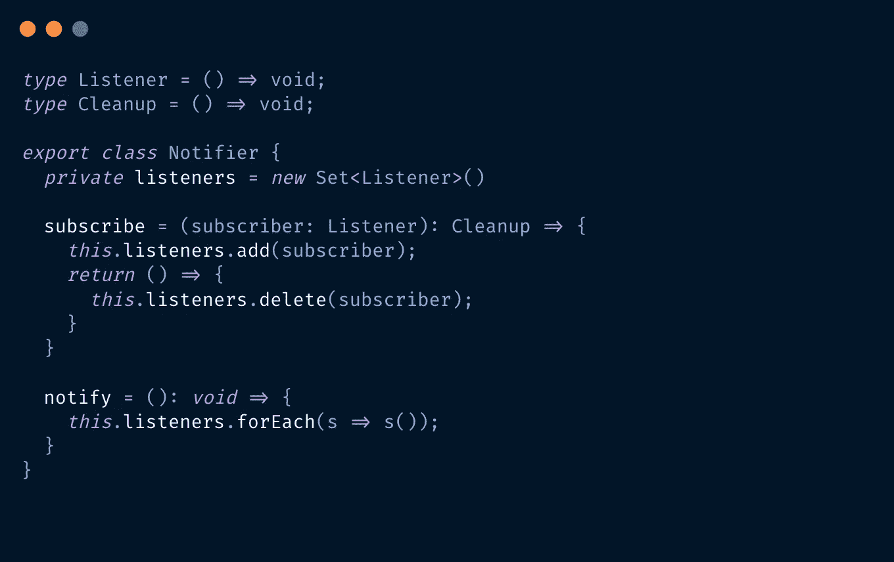

通知程序类

现在，从它扩展而来的任何类都可以拥有内部数据和修改它的方法，并在视图层需要知道这些变化时调用 **this.notify()** 。然后我们可以从视图层订阅它，并在调用 **notify** 时重新渲染，就像这样。

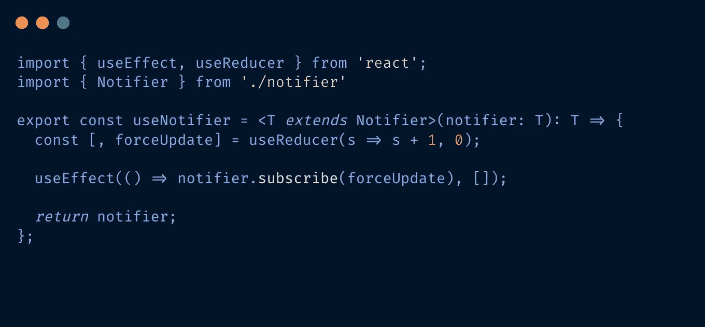

下面是 notifier 类的一个用法示例。

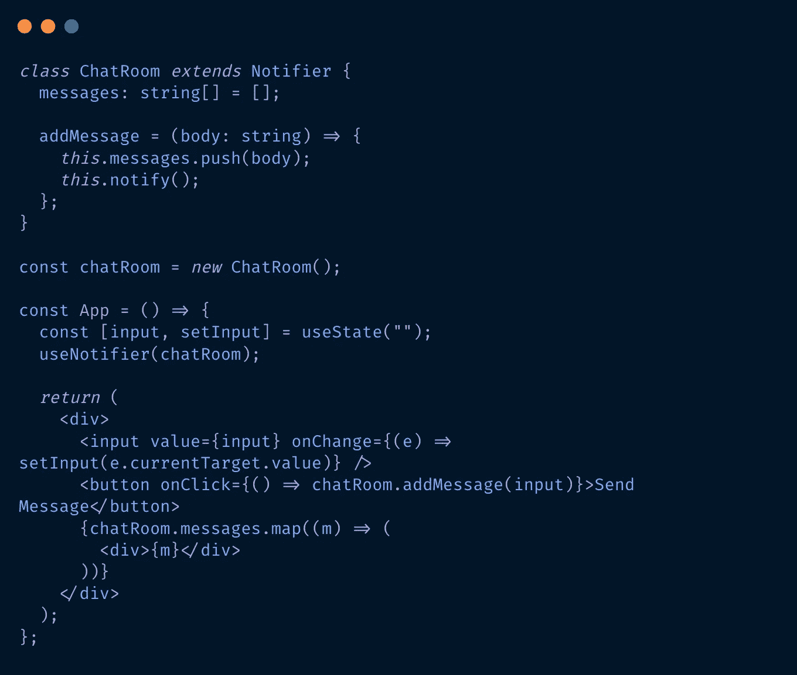

每次发生变化时都要记住调用 **this.notify()** 很麻烦，所以我决定用一种更习惯的方式来更新它——stateful notifier。

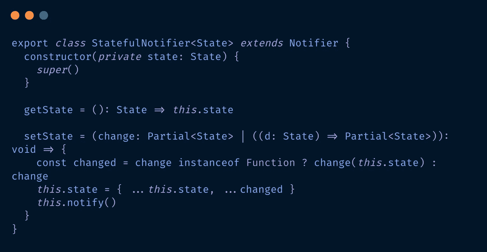

这个类不仅在数据发生变化时通知视图层，还实现了类似 React 的 setState 的 setState 函数，在内部调用**notify()**。现在我们可以从 StatefulNotifier 扩展，传递我们的初始状态，只使用 setState，而不用担心每次更改都要调用 notify。

我们可以将 StatefulNotifier 的创建封装到一个函数 **createStore()** 中，以便于使用。它将初始状态作为第一个参数，创建动作的函数作为第二个参数。我从国家管理图书馆得到了这个决定的灵感。此时，我们有了一个本质上类似于 Zustand 的 api。

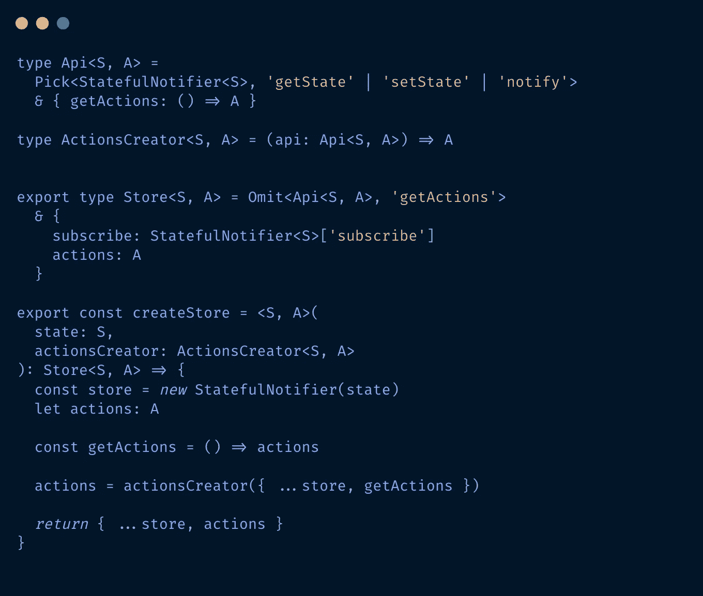

我们还可以创建一个简单的 **useStore(store，selector)** 钩子，在 react 中使用它，避免不必要的重新呈现。

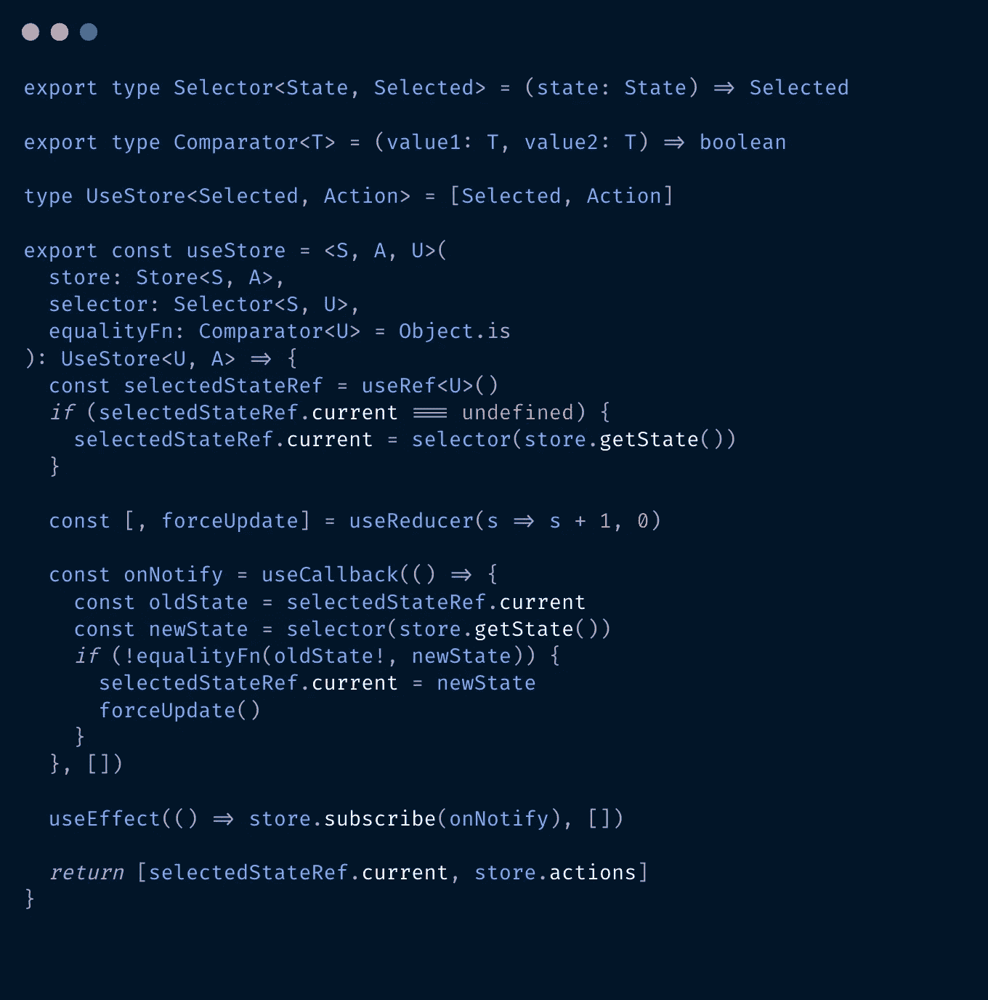

现在我们可以像这样创建一个商店:

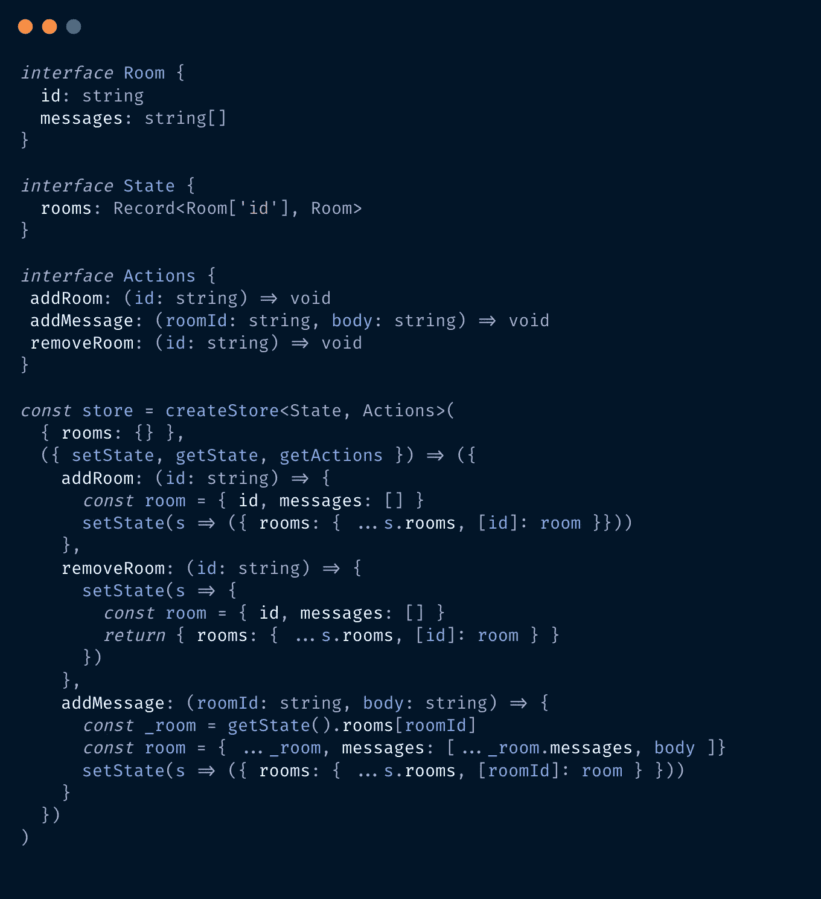

现在，在我们的 react 层，我们可以简单地调用

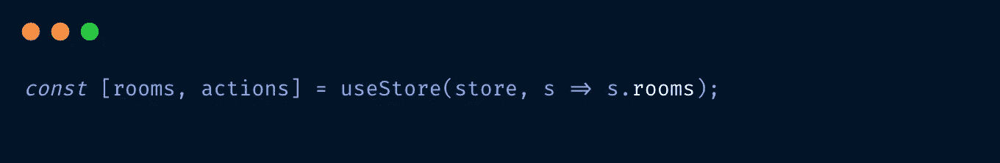

当房间自动改变时，它会处理重新渲染。我们还可以使用视图层中的任何操作。

现在，我们为 React 提供了一个成熟的状态管理解决方案。但是处理事件还是比较繁琐。假设我们想在每次调用 actions.addRoom()时为新消息添加一个事件侦听器。当然，我们可以在 actiona 中启动效果，并让 action 返回一个 **unsubscribe。**但是如果我们需要移除那个房间，我们必须确保我们有一个取消订阅功能的引用。此外，当我们调用 actions.removeRoom()时，我们还必须记住调用 unsubscribe 以避免内存泄漏。这不是被动的，错误肯定会出现。理想情况下——我们希望我们的州经理为我们处理这件事。我们希望它在 **addRoom()** 中添加事件监听器，并在 **removeRoom()** 中移除它。

> Effect 是一个启动某种进程(例如事件监听器)并返回清理结果的函数。React 的 useEffect 钩子就是一个很好的例子。

面对这个问题，我致力于实现对在商店中添加和删除 id 效果的支持。EffectiveStatefulNotifier 的实现如下所示。

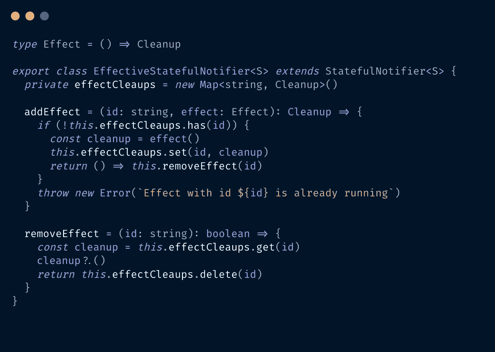

现在我们可以修改 createStore 函数来处理效果。我们只需要像这样修改 Api 类型。

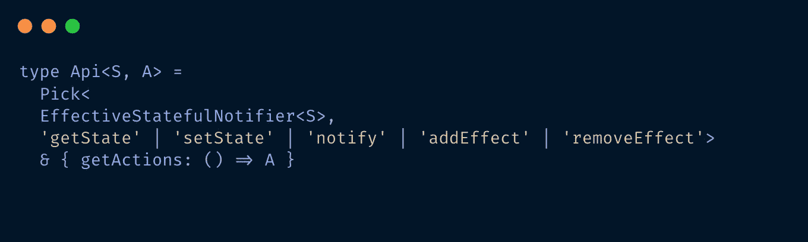

其余保持不变，除了我们现在称*为【新的有效状态通知程序(状态)】而不是*新的状态通知程序(状态)。**

现在我们的状态管理解决方案有了对效果的本地支持，我们可以像这样修改 addRoom 和 removeRoom 函数。

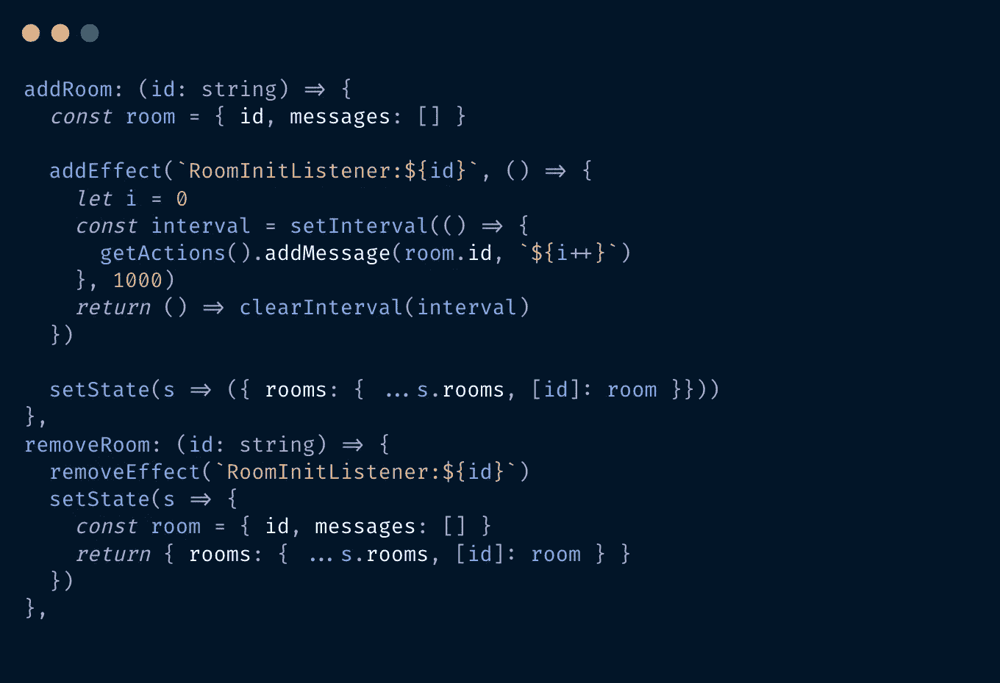

在 react 层中，我们可以调用 actions.addRoom('id ')，然后使用 actions.removeRoom('id ')进行清理，而不用担心内存泄漏——存储会为我们处理这些:)