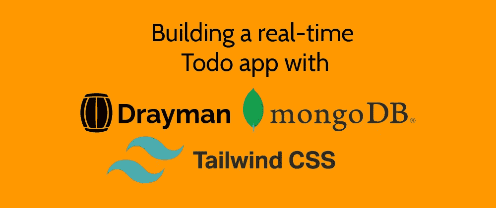
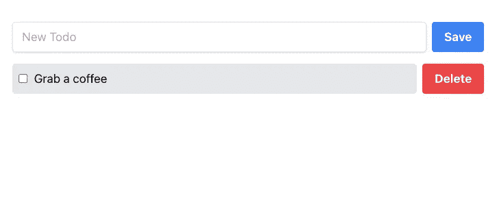
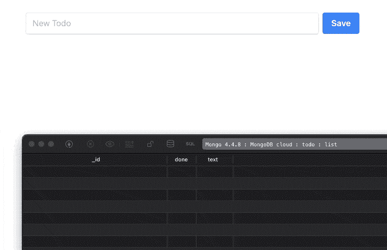
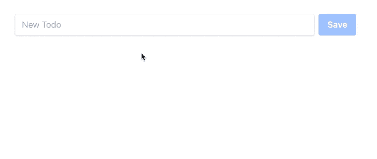
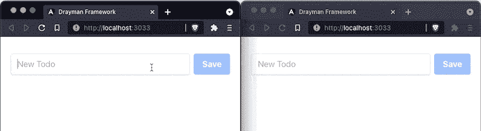

# 用 Drayman，MongoDB 和 Tailwind CSS 搭建一个实时的 Todo app

> 原文：<https://itnext.io/building-a-real-time-todo-app-with-drayman-mongodb-and-tailwind-css-25d57ed5cfda?source=collection_archive---------6----------------------->

在本指南中，我们将使用 [Drayman](http://www.drayman.io/) 、 [MongoDB](https://www.mongodb.com/) 和 [Tailwind CSS](https://tailwindcss.com/) 构建一个实时 Todo 应用程序。

如果您使用常规工具，您需要创建一个带有端点的服务器，一个使用现代框架或普通 JavaScript 的客户端应用程序。然而，对于 Drayman，它只是一个包含 100 行代码的脚本。

如果你是第一次接触 Drayman，你可以去我们的[官方文档](http://www.drayman.io/)查看它是如何工作的，或者阅读其他指南。

# 先决条件

本指南假设您:

*   已经在本地[安装了 Drayman 项目](http://www.drayman.io/docs/introduction/getting-started)或者正在通过 [new.drayman.io](http://new.drayman.io/) 使用；
*   安装 MongoDB 并启用[变更流](https://docs.mongodb.com/manual/changeStreams/)功能。对于本指南，您可以在这里创建一个免费的云 MongoDB 数据库[。通过这种方式，您可以默认启用变更流功能。](https://www.mongodb.com/try)

当 Drayman 项目准备就绪，MongoDB 启动并运行时，我们可以通过添加 Tailwind CSS 来开始开发我们的 Todo 应用程序。

# 设置顺风 CSS

首先，您需要安装`autoprefixer`和`tailwindcss`:

接下来，用这个命令生成`tailwind.config.js`和`postcss.config.js`文件:

现在修改`tailwind.config.js`文件，在编译时排除不使用的 CSS 类:

在`src/styles.css`创建您的主 CSS 文件，并添加以下代码:

最后一步是修改`public/index.html`文件以包含生成的 CSS 文件。Drayman 会将其生成到`public/styles.css`文件中:

# 创建待办事项应用程序

我们将从使用 Tailwind CSS 类添加基本 UI 开始，然后改进我们的解决方案，以包括实时功能和 MongoDB 支持。

# 添加基本用户界面

将这段代码粘贴到`src/components.home.tsx`中:

如果 Tailwind CSS 成功初始化，您应该会在浏览器中看到以下结果:

# 添加 MongoDB 支持

对于本指南，我们将使用 MongoDB 的[变更流](https://docs.mongodb.com/manual/changeStreams/)功能来使我们的待办事项列表实时工作。这样，如果数据库中发生了变化，我们的应用程序将会反映这些变化。让我们修改我们的`src/components/home.tsx`组件，并详细看看脚本内部发生了什么:

首先，我们向数据库添加了一个连接(不要忘记将`YOUR_MONGODB_CONNECTION_STRING`改为实际的连接字符串)。然后，我们通过将 Todo 列表转换成一个数组- `let todos = await todoListCollection.find().toArray();`来对其进行初始提取。

然后，我们通过观察数据库的变化添加了实时功能`todoListCollection.watch()`:

*   在`insert`上，一个 Todo 将被推送到`todos`数组；
*   在`update`上，来自`todos`数组的特定 Todo 将被更新；
*   在`delete`上，将从`todos`数组中删除一个特定的待办事项。

组件将反映所有这些变化，因为我们还调用了 [forceUpdate](http://www.drayman.io/docs/components-in-depth/helpers/force-update) 函数——如果捕捉到任何变化，组件将重新呈现自己。

最后，当一个组件实例被破坏时，我们使用 [onDestroy](http://www.drayman.io/docs/components-in-depth/helpers/the-component-instance-object) 生命周期方法来关闭到数据库的连接。

我们还通过映射`todos`数组和渲染每个 Todo 以及在 Todo 完成时动态更改 CSS 类，对我们的 UI 进行了更改。

因此，在数据库内部所做的任何更改(为此我使用了 [TablePlus](https://tableplus.com/) )都会在我们的组件内部得到反映:

我们的最后一步将是使输入字段和按钮按预期工作。

# 向 UI 元素添加功能

我们将从修改`<input>`元素开始:

变量`newTodo`被引入。当用户输入内容时，`oninput`事件被触发，将输入值保存到`newTodo`变量中，从而提供了一个真实的来源——输入值总是在`newTodo`中。

现在让我们修改`<button>Save</button>`元素:

我们修改了`class`和`disabled`属性，使其在用户没有输入时显示为禁用状态(`newTodo`为空)。当用户点击一个按钮时，`onclick`被触发，一个新的 Todo 被插入数据库。我们也不需要在这里调用`forceUpdate`,因为在监视数据库变化时，它已经被管理过了。现在我们可以输入一些东西，单击按钮，结果将出现在浏览器中:

我们的最后一步是修改`todos`列表映射:

在这里，我们为`
`添加了`onclick`事件处理程序，用于标记待办事项完成或撤消，为`<button>Delete</button>`添加了`onclick`事件处理程序，用于在点击待办事项时将其从数据库中删除。

我们的组件现已完成，您可以在多个选项卡中打开包含该组件的页面来检查实时功能:

# 最终组件脚本

# 结论

我们在一个脚本中用 100 行代码创建了一个实时的 Todo 应用程序。

如果您对此感兴趣，请访问[官方文档](http://www.drayman.io/)深入了解 Drayman 框架！