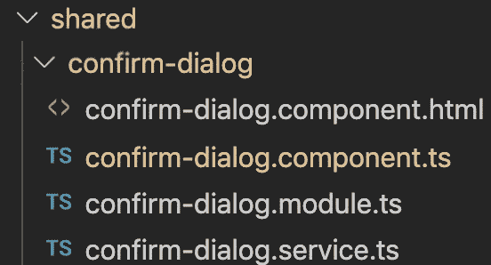
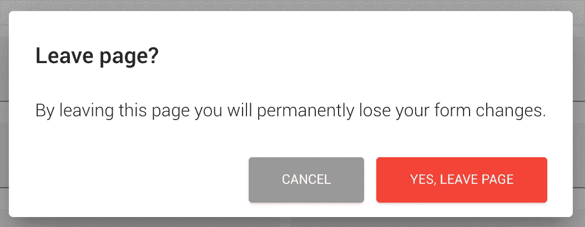

# 用角材料构建可重用的对话框模块

> 原文：<https://itnext.io/building-a-reusable-dialog-module-with-angular-material-4ce406117918?source=collection_archive---------0----------------------->

## 有棱角的手教程


照片由[拉拉·法尔](https://unsplash.com/@lara_far?utm_source=unsplash&utm_medium=referral&utm_content=creditCopyText)在 [Unsplash](https://unsplash.com/?utm_source=unsplash&utm_medium=referral&utm_content=creditCopyText) 上拍摄

在本教程中，我将向你展示如何为你的角度项目创建一个可重用的对话框模块。

# 先决条件

*   角度 7 或更高
*   角形材料 7 或更高

# **创建模块**

首先，您必须创建一个包含所有文件的文件夹。我选择在这里创建:`app/shared/confirm-dialog`

该模块的最终结构如下:



模块结构

让我们创建第一个文件。

从确认组件模板开始，将其命名为`confirm-dialog.component.html`

如前所述，我们将使用材料设计组件`Dialog`。

> 你可以在这里看到更多关于对话框的 API [的信息。](https://material.angular.io/components/dialog/overview)

这个组件有几个指令，帮助我们更容易地构建我们的对话内容。下面是材料设计文档中关于它们的一些信息:

> `mat-dialog-title`:对话框标题，应用于标题元素
> `<mat-dialog-content>`:对话框的主要可滚动内容。
> `<mat-dialog-actions>`:对话框底部动作按钮的容器。
> `mat-dialog-close`:添加到`<button>`中，使按钮关闭对话框，从绑定值中选择一个结果。

```
<div class="header">
    <h1 **mat-dialog-title**>{{ **data.title** } }}</h1>
</div>
<div **mat-dialog-content**>
    <p class="dialog-message">{{ **data.message** }}</p>
</div>
<div **mat-dialog-actions**>
    <button class="btn btn-cancel" style="margin-right:10px;" **(click)="cancel()"**>{{ **data.cancelText** }}</button>
    <button class="btn" **(click)="confirm()"**>{{ **data.confirmText** }}</button>
</div>
```

第一个文件准备好了！让我们来写这个组件的功能。创建第二个名为`confirm-dialog.component.ts`的文件

首先添加每个组件中常见的代码部分:导入、组件装饰、类定义。

请注意`templateUrl`添加正确的文件路径！

```
import { Component } from '@angular/core';@Component({
  selector: 'app-confirm-dialog',
  templateUrl: './confirm-dialog.component.html',
  styles: []
})export class ConfirmDialogComponent {
  constructor(){}
}
```

然后在构造函数中导入并注入`MAT_DIALOG_DATA`令牌，该令牌可用于访问传递给对话框的数据。还要定义数据的格式。

对于确认对话框，我们需要一个`title`，一个`message`和两个按钮:`cancel`和`confirm`。使用这些参数使组件可重用。

```
**import { MAT_DIALOG_DATA } from "@angular/material";****...**constructor(**@Inject(MAT_DIALOG_DATA) public data: {
                  cancelText: string,
                  confirmText: string,
                  message: string,
                  title: string
              }**){}
```

您还需要导入和注入`MatDialogRef`以及对通过`MatDialog`服务打开的对话框的引用。

```
import { Component**, Output** } from '@angular/core';
import { MAT_DIALOG_DATA**,** **MatDialogRef** } from "@angular/material";...constructor(@Inject(MAT_DIALOG_DATA) public data: {
                  cancelText: string,
                  confirmText: string,
                  message: string,
                  title: string
              }, **private mdDialogRef: MatDialogRef<ConfirmDialogComponent>**){}
```

剩下的就是为组件的行为定义一些方法。点击`confirm`或`cancel`或关闭按钮或按下 ESC 键会发生什么？

```
...**public cancel() {
    this.close(false);
  }****public close(value) {
    this.mdDialogRef.close(value);
  }****public confirm() {
    this.close(true);
  }****@HostListener("keydown.esc") 
  public onEsc() {
    this.close(false);
  }**
```

在每种情况下，我们都必须返回值，以通知调用者用户是否确认了消息。在`close`、`cancel`和`ESC`情况下发送`false`，在`confirm`情况下发送`true`。

你的文件差不多准备好了！唯一剩下的就是设置一些样式。没有什么花哨的，只是小写/大写一些文字，并使取消按钮红色。

```
...styles: [**`
  .header, .dialog-message {
      text-transform: lowercase;
  }
  .header::first-letter, .dialog-message::first-letter {
      text-transform: uppercase;
  }
  .btn-cancel {
      background-color: red;
      color: #fff;
  }
`**]...
```

把所有东西放在一起，这就是最后一节课。

你可以在这里看到最后一个类:

最终确认-dialog.component.ts

**确认服务**

我们将通过创建可注入服务来继续实现。这将有助于您在任何地方使用该功能！

让我们从添加每个服务中常见的代码部分开始:导入、可注入装饰、类定义。

```
import { Injectable } from '@angular/core';@Injectable()export class ConfirmDialogService {  
  constructor() { }
}
```

在我们的服务中，我们希望打开一个对话框并获得它的响应。创建两个这样的方法。

```
import { Injectable } from '@angular/core';
**import { Observable } from 'rxjs';**@Injectable()export class ConfirmDialogService {  
  constructor() { }   **public open(options) {}**  **public confirmed(): Observable<any> {}**}
```

`open`方法将使用给定的`options`打开一个对话框，因此不需要返回任何内容，但是`confirmed`方法必须向调用者返回一个`observable`，因为它必须等待响应。下一步是实现这两个方法。

这里最重要的是:

1.  定义正确的组件。这将被用作对话框
2.  注入材料设计的`MatDialog`服务。这将用于打开带有材质设计样式和动画的模式对话框。

```
...**import { MatDialog, MatDialogRef, MAT_DIALOG_DATA } from '@angular/material';**
**import { ConfirmDialogComponent } from './confirm-dialog.component';**...export class ConfirmDialogService {  
  constructor(**private dialog: MatDialog**) { } **dialogRef: MatDialogRef<ConfirmDialogComponent>;** public open(options) {
    **this.dialogRef = this.dialog.open(ConfirmDialogComponent, {    
         data: {
           title: options.title,
           message: options.message,
           cancelText: options.cancelText,
           confirmText: options.confirmText
         }
    });** 
  } public confirmed(): Observable<any> {}}
```

> 你可以在这里查看更多关于材质设计的内置对话框服务[。](https://material.angular.io/components/dialog/overview)

完成一个，剩下一个！因为我们已经打开了一个对话框，我们可以处理它的响应，所以让我们实现`confirmed`方法！

```
...
**import { map, take } from 'rxjs/operators';** ...public confirmed(): Observable<any> {
    **
    return this.dialogRef.afterClosed().pipe(take(1), map(res => {
        return res;
      }
    ));**
  }...
```

我们将返回一个可观察对象，当对话框关闭完成时会得到通知。

对话服务准备好了！

这是完整的类。在同一目录下另存为`confirm-dialog.service.ts`。

你可以在这里看到最后一堂课:

最终确认-dialog.service.ts

## 模块文件

你可以在这里看到类:

最终确认-dialog.module.ts

**不要忘记将组件添加到 entryComponents 中！**

# 在您的组件中使用它

按照以下步骤向组件添加对话框:

1.  导入服务
    `import { ConfirmDialogService } from 'app/shared/confirm-dialog/confirm-dialog.service';`
2.  注入服务
    `constructor(**private dialogService: ConfirmDialogService**, …)`
3.  准备对话框选项

```
const options = {
        title: 'CONFIRM.DOWNLOAD.JOB.TITLE',
        message: 'CONFIRM.DOWNLOAD.JOB.MESSAGE',
        cancelText: 'CONFIRM.DOWNLOAD.JOB.CANCELTEXT',
        confirmText: 'CONFIRM.DOWNLOAD.JOB.CONFIRMTEXT'
      };
```

4.打开
对话框 `this.dialogService.open(options);`

5.订阅确认的可观察

```
this.dialogService.confirmed().subscribe(confirmed => {
   if (confirmed) {
     //do something if confirmed is true
   }
});
```

# 示例案例

我们希望在单击保存按钮时显示一个确认对话框。
该对话框将包含以下数据:

*   **标题:**离开页面？
*   **消息:**离开此页面，您将永久丢失您的表单更改。
*   **取消文本:**取消
*   **确认正文:**是，离开页面

组件中按钮的模板(html 文件)

```
<button (click)="handleClick()">Save</button>
```

然后在组件类中实现`handleClick`方法。

```
import { ConfirmDialogService } from 'app/shared/confirm-dialog/confirm-dialog.service';...constructor(private dialogService: ConfirmDialogService) {}...**handleClick() {
  const options = {
    title: 'Leave page?',
    message: 'By leaving this page you will permanently lose your form changes.',
    cancelText: 'CANCEL',
    confirmText: 'YES, LEAVE PAGE'
  };

  this.dialogService.open(options);

  this.dialogService.confirmed().subscribe(confirmed => {
     if (confirmed) {
          this.saveData();
        }
      });
}**saveData() {
  ...
}
```

结果将如下所示:



确认对话框示例

# 结论

构建可重用模块，如本文中的对话框，对开发过程是有益的。减少代码重复、减少测试时间、UI 一致性和更干净的编码方式是最重要的好处。

如果添加其他对话格式(例如信息模态)，这个模块会变得更加强大。

我希望你发现这个媒体指南有用！