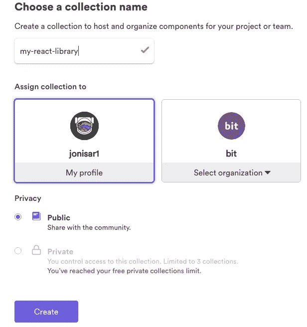
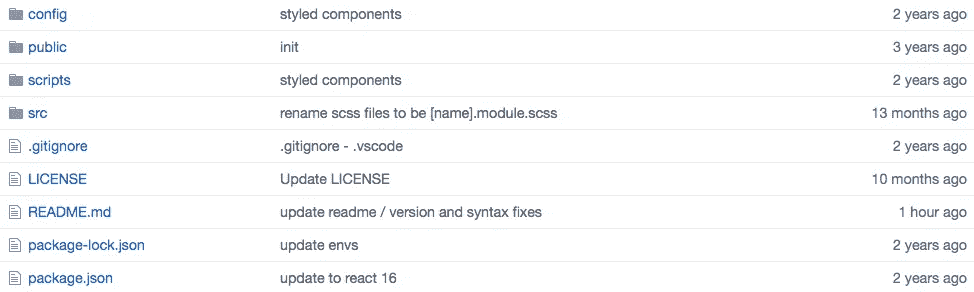
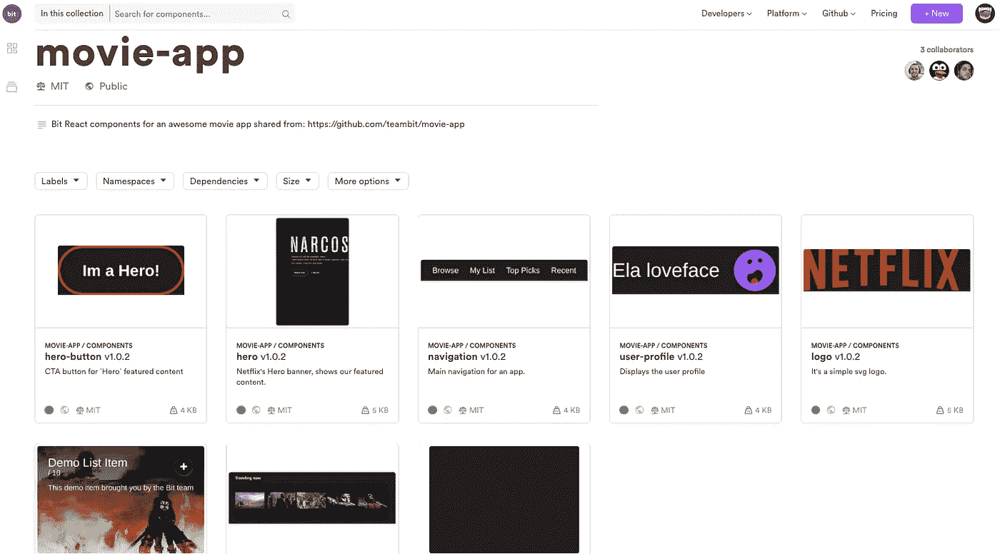
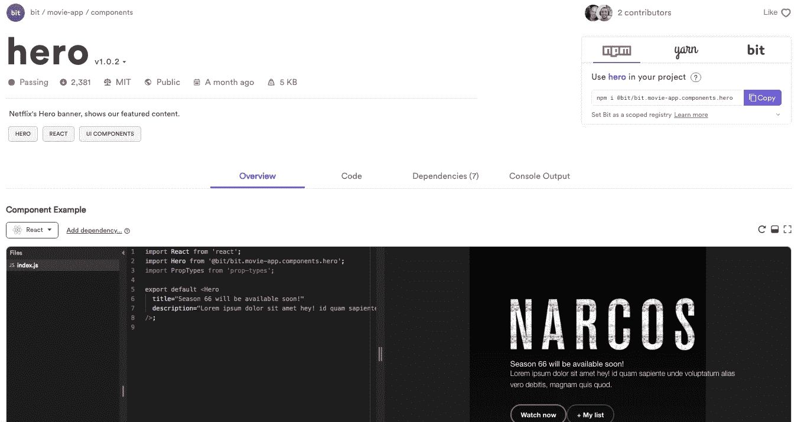
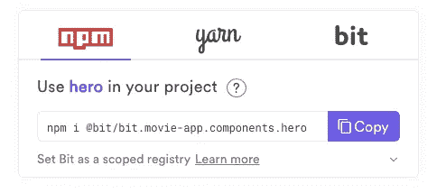

# 构建一个 React 组件库

> 原文：<https://itnext.io/building-a-scalable-ui-component-library-4607de91955a?source=collection_archive---------6----------------------->

## 在 Bit.dev 上创建一个模块化的动态 React UI 库，以便更好地跨项目和团队重用组件。

[](https://bit.dev/collections)

在 Bit.dev 上探索数千个社区 UI 库

React 组件库是重用代码、加速开发和跨不同功能和应用程序保持一致的 UI/UX 的好方法。

Bit.dev 是一种在云中托管库的新方法。如果说传统的单片库就像一张音乐 CD 专辑(许多歌曲硬编码到一个包中，只有一个版本)，那么 Bit.dev 就像 Spotify 或 iTunes 的组件。它是动态的、可扩展的、模块化的和协作的。

在这篇文章中，你将学习如何快速设置你的 Bit.dev 库，几乎没有任何开销。然后，您将使用 Bit 的 CLI 工具将现有应用程序中的多个组件打包、版本化并收集到您的库中。最后，您将学习如何安装、编辑和更新新项目中的任何组件。

这应该只需要几分钟。完成后，您就有了继续收集组件并一起重用它们的基础。

# 一个动态、可扩展和模块化的库

[**Bit.dev**](https://bit.dev) **是一个组件中枢**，托管、组织和可视化可重用组件。它提供了 UI 库所需的一切，从内置的注册表到自动生成的文档和可视化沙箱。

使用它有几个重要的优点:

1.  您可以使用 CLI-tool [**Bit**](https://github.com/teambit/bit) 将组件从您的应用程序中逐渐收获到您的 Bit.dev 库中。Bit 将为您自动完成这一过程，这样每个组件都被独立地包含和版本化。
2.  在任何规模下，组件总是有组织的，并且是可发现的。您可以获得自动生成的文档、沙盒游戏、标签、过滤器等等……全部开箱即用。
3.  您可以从内置的 Bit.dev 注册表中使用 npm 或 yarn 安装任何组件。你不必安装一个单一版本的整个库。这意味着你可以混合、更新甚至回滚独立的用户界面。
4.  您可以使用`bit import`派生出一个 componet 源代码进行本地编辑，就在任何新项目中。由于代码仍然是由 Bit 管理的，所以您可以在 Bit.dev 中对更改进行版本化，并且仍然可以获得新版本的更新。

还有更多的内容，但不要面面俱到，只需自己看一看[。底线是，Bit.dev 是一种更简单但更具可伸缩性的方式来重用和协作您的 UI 组件。](https://bit.dev)

# 1.创建您的 Bit.dev 库(1 分钟)

为了快速开始收集组件[注册 Bit.dev](https://bit.dev) (个人使用免费)并[创建一个集合](https://bit.dev/~create-collection)(这是你的库)。

[](https://bit.dev/~create-collection)

然后，打开终端应用程序。

# 2.选择包含组件的项目并设置工作空间

接下来，选择一个包含一些组件的项目。它可以是一个应用程序，现有的 UI 库或其他任何东西。

例如，您可以[从 GitHub](https://github.com/teambit/movie-app) 中克隆这个 React 演示应用程序。我们将使用 Bit 从应用程序中获取组件，如下所示:

[](https://github.com/teambit/movie-app)

可重用组件集合，如下所示:

[](https://bit.dev/bit/movie-app)

首先，安装 Bit 并在项目的根目录下初始化一个工作空间。

```
$ npm install bit-bin --global 
# Or
$yarn global add bit-bin$ cd project-directory
$ bit init
```

> 注意:如果您克隆了演示应用程序，请在根目录下运行`npm install`。

# 4.使用 Bit 包装组件

接下来，让 Bit 知道你的项目中的组件在哪里。

Bit 会把每个组件放在一个类似容器的环境里，叫做“胶囊”。它将自动定义和添加所有组件的文件和依赖关系到每个组件。

[使用](https://docs.bit.dev/docs/add-and-isolate-components) `[bit add](https://docs.bit.dev/docs/add-and-isolate-components)` [命令](https://docs.bit.dev/docs/add-and-isolate-components)让 Bit 知道元件的位置。您可以定义一个特定的文件路径，或者使用 glob 模式(/*)来跟踪单个目录中的所有组件。例如:

```
$ bit add src/components/* 
tracking 8 new components
```

如果您克隆了演示应用程序，您还需要添加样式组件:

```
$ bit add src/global.css --id style/global
tracking component style/global:
added src/global.css
```

现在运行一个快速的`bit status`来确保 Bit 成功跟踪了每个文件和每个组件的依赖关系。如果需要，只需添加缺少的内容。

然后，[添加一个可重用的配置组件](https://bit.dev/bit/envs)来为您的组件应用一个构建步骤。我们可以通过将一个配置模块从 Bit.dev 导入到我们项目的工作空间中来做到这一点。在演示应用程序中，我们将使用 Bit.dev 上的一个预制配置组件(包括最佳实践):

```
$ bit import bit.envs/compilers/react --compiler
the following component environments were installed
- bit.envs/compilers/react@1.0.11
```

> 请注意，现在您可以运行`bit build`并观察组件作为独立的可重用单元进行编译，除了任何项目配置。

就这样——您的组件现在可以导出到您的库中了！

# 5.版本并导出到 Bit.dev

接下来使用`bit tag`为每个组件应用独立的语义版本。

```
$ bit tag --all 1.0.0
...9 components tagged | 9 added, 0 changed, 0 auto-tagged
added components:  style/global@1.0.0, hero-button@1.0.0, hero@1.0.0, list-toggle@1.0.0, item@1.0.0, logo@1.0.0, navigation@1.0.0, title-list@1.0.0, user-profile@1.0.0
```

[这非常有用](https://blog.bitsrc.io/versioning-independent-ui-components-why-and-how-7ea60d8be5f2)，因为您可以在以后混合不同版本的组件，更新或回滚特定的组件，并获得更好的控制。

现在向您的 Bit.dev 帐户验证您的本地计算机…

```
$ bit login
```

并使用`bit export`组件到您的 Bit.dev libray！

```
$ bit export <user-name>.movie-app-example
exported 9 components to scope bit.movie-app-example
```

# 6.重复使用您的组件！

现在前往你在 [Bit.dev](https://bit.dev) 上的收藏。


您可以看到它现在托管了您导出的组件。这很酷，对吧？从在 React 应用中内部实现组件，到将它们放入可重用的云库中，只需要几分钟。只要随着时间的推移不断添加更多的组件来扩展您的库。

单击任何组件进行访问。例如，点击*英雄*组件。

[](https://bit.dev/bit/movie-app/components/hero)

您将注意到一个带有 npm、yarn 和 bit 标志的安装面板。



要在另一个项目中安装组件，只需复制粘贴您喜欢的包管理器的安装命令。该组件将从内置的 Bit.dev 注册表中安装！

如果您想派生组件并在本地编辑它，[在消费项目中初始化一个 Bit 工作空间后，使用](https://docs.bit.dev/docs/sourcing-components) `[bit import](https://docs.bit.dev/docs/sourcing-components)` [命令](https://docs.bit.dev/docs/sourcing-components)。

然后，您可以对代码进行更改，并*标记一个新版本。*你可以从 Bit.dev 获取新版本的更新，并通过 Git 的工作流合并它们之间的更改——这样你就可以始终与新版本保持同步。

# 7.不断添加组件以扩展您的库，邀请团队成员进行协作

一旦你的库启动了一些组件，邀请你的团队在你的库上合作，并开始添加他们自己的组件。

随着你的进行，你的集合将会建立，你可以开始重用你的组件来加速开发，确保 UI 的一致性，简化应用程序的维护和逐步重构。

尽情享受，有什么问题尽管问下面！干杯

# 了解更多信息

[](https://blog.bitsrc.io/5-tools-for-faster-development-in-react-676f134050f2) [## 在 React 中加快开发的 5 个工具

### 加速 React 应用程序开发的 5 个工具，侧重于组件。

blog.bitsrc.io](https://blog.bitsrc.io/5-tools-for-faster-development-in-react-676f134050f2) [](https://blog.bitsrc.io/11-react-component-libraries-you-should-know-178eb1dd6aa4) [## 2019 年你应该知道的 11 个 React UI 组件库

### 11 React 组件库与伟大的组件，用于在 2019 年构建您的下一个应用的 UI 界面。

blog.bitsrc.io](https://blog.bitsrc.io/11-react-component-libraries-you-should-know-178eb1dd6aa4) [](https://blog.bitsrc.io/how-to-easily-share-react-components-between-projects-3dd42149c09) [## 如何在项目和应用程序之间共享 React UI 组件

### 一个简单的指南，帮助您轻松地跨应用程序共享和重用 React 组件，以更快更好地构建。

blog.bitsrc.io](https://blog.bitsrc.io/how-to-easily-share-react-components-between-projects-3dd42149c09)