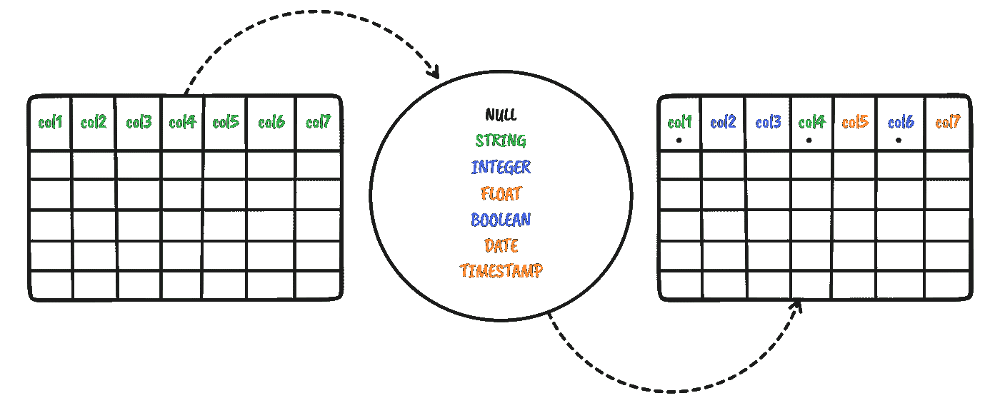
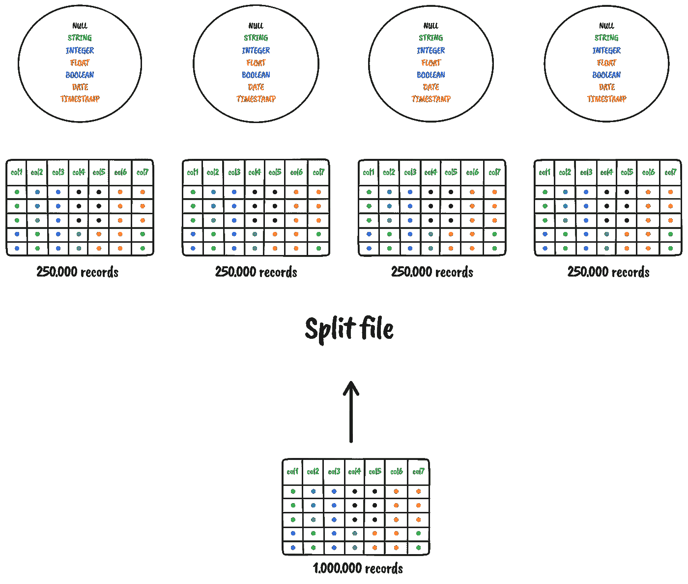
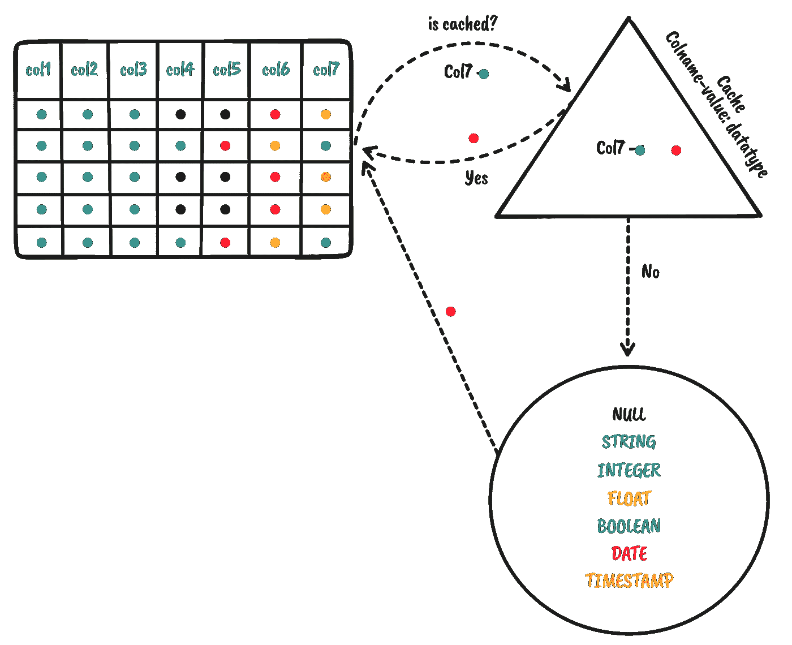
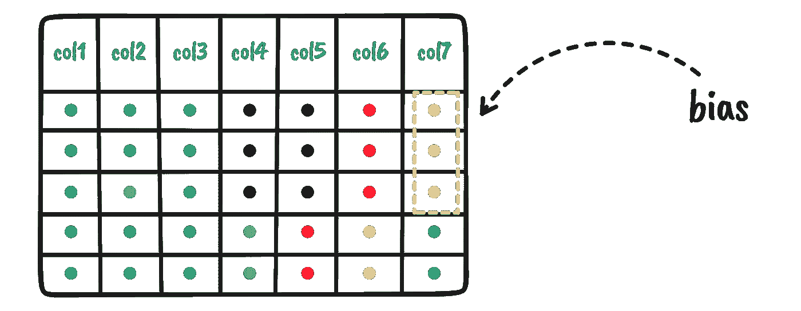
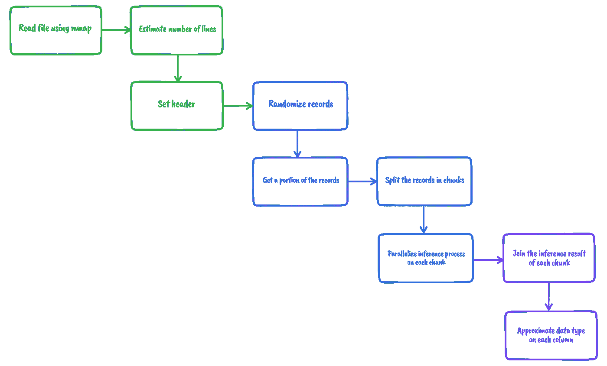
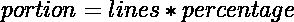
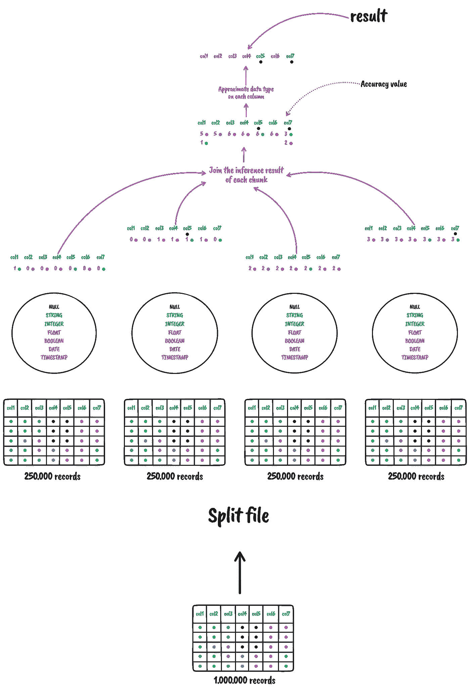
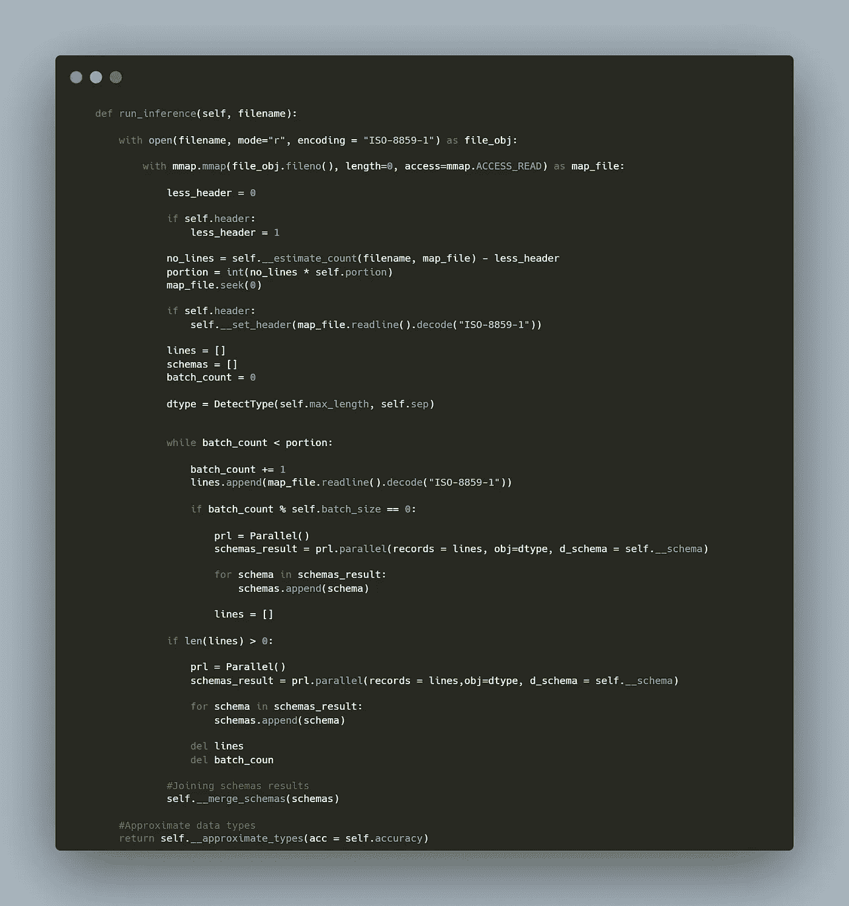
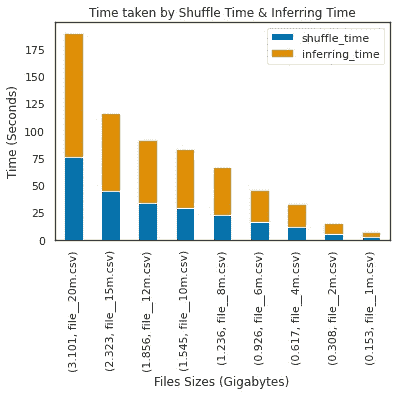

# 为大型 CSV 文件构建模式推理数据管道

> 原文：<https://itnext.io/building-a-schema-inference-data-pipeline-for-large-csv-files-7a45d41ad4df?source=collection_archive---------1----------------------->

## **python 的并行实现**



数据分析中最重要的任务之一是为[中的列分配、推断或推断数据类型。csv 文件](https://en.wikipedia.org/wiki/Comma-separated_values)，如果事先不了解业务中涉及的变量或者数据集非常大，这可能会非常复杂。在本文中，我将构建一个数据管道来推断大型 csv 文件中每一列的数据类型，还值得一提的是，为了构建一个可接受的工具，可能会出现一些障碍:

*   有必要迭代数据集中的所有记录和值吗？
*   在大型数据集中逐个查看值可能会花费大量时间来浏览数据并将数据类型分配给数据集中的所有像元。一个好的方法是并行化和分块浏览数据集。



*   如果已经浏览、检查了某个列的值，并为其分配了数据类型，则没有必要再做一次，每列中的每个值都将被缓存。



*   最初，我们不知道记录顺序的性质，这可能会导致重复偏差，并且只能看到一小部分数据集中的一组数据类型。



*   我们必须保证记录的分布是均匀的，这样我就可以只取其中相当大的一部分来更精确更快速地推断，所以我不需要 100%的记录。


*   空值不是一种数据类型，它是列的一个特性，在我们的例子中，如果列中有很多空值，那么我们将为它分配**字符串**数据类型。

我考虑了上面提到的所有障碍，它们将适合作为加速推理过程的策略。**那么让我们开始编码**。

# 用于模式推理的数据管道



**数据管道**:大型 CSV 文件的模式推断

*   我将使用带有 mmap 的 [***内存映射，这将通过避免几次系统调用来提高 I/O 性能，并将减少昂贵的数据缓冲传输。***](https://realpython.com/python-mmap/)
*   我还将估计文件有多少行，这将有助于我在记录均匀分布后获得文件的一部分，我已经提到了参数，我将使用公式:



*   一旦记录被均匀分布，并且这些记录中的一部分被取走，那么我将继续并行化推理过程，该过程负责将数据集分割成大小相等的块，并将每个块分配给单个处理器。
*   数据集的每个块的推断过程的结果将返回不同的模式，为了具有单个模式，有必要连接结果，使用来自多个结果的单个模式，我们现在可以推导或推断每个列的近似数据类型，并且还能够检测哪个列具有空值。下图显示了这一过程。



**连接来自并行运行的不同推理过程的多个模式**

*   精度值将帮助我们推断哪些数据类型将被拒绝作为可能的最终数据类型，它只接受大于或等于精度值的值

# 用于模式推断的数据管道代码



**推理过程**

# 让我们运行一个真实的例子

查看我的 GitHub 库[**CSV-schema-inference**](https://github.com/Wittline/csv-schema-inference)以获得关于代码的更多信息。

## 让我们首先检查 csv 文件

本例中的真实记录有 1.000.000 条

## 让我们安装库

```
pip install csv-schema-inference
```

## 让我们导入“CSV-模式-推理”库

```
from csv_schema_inference import csv_schema_inference
```

## **设置“CSV-模式-推理”配置**

```
csv_infer = csv_schema_inference.CsvSchemaInference(portion=0.7, max_length=100, acc = 0.8, seed=2, header=True, sep=",")pathfile = "/content/data.csv"
```

*   **部分**:请注意，我们将只使用原始数据集总记录的 70%
*   **max-length:** 对于字符串数据类型，它将只缓存 100 个字符。没有必要在内存中保存这么多数据。
*   **acc:** 本例的精度值将只考虑至少存在 80%的数据类型

## 运行推理

```
aprox_schema = csv_infer.run_inference(pathfile)
```

## 每列的近似数据类型推断

```
csv_infer.pretty(aprox_schema)
```

推理结果

上面的输出显示了哪些列是**可空的**以及什么是**近似的数据类型。**

## 让我们看看在特定列中找到的所有值及其出现频率。

```
result = csv_infer.get_schema_columns(columns = {"disc_6"})
csv_infer.pretty(result)
```

## 浏览特定列的所有可能的数据类型

```
result = csv_infer.explore_schema_column(column = "disc_6")csv_infer.pretty(result)
```

89 %是整数值，10.06 %是空值，它们自动表示为字符串。在这种情况下，正确的推断数据类型是整数，因为它最接近精度值。

# **基准**

这些测试是用 9。csv 文件，21 列，不同大小和数量的记录，每个进程平均执行 5 次，**洗牌时间**和**推断时间**。

*   file _ _ 20m . CSV:2000 万条记录
*   file _ _ 15m . CSV:1500 万条记录
*   file _ _ 12m . CSV:1200 万条记录
*   file _ _ 10m . CSV:1000 万条记录
*   诸如此类…

如果你想了解更多关于洗牌的过程，你可以查看另一个库:[一个自动洗牌的工具。csv 文件](https://github.com/Wittline/csv-shuffler)，洗牌过程将帮助我们:

*   增加在一列中找到所有数据类型的可能性。
*   避免迭代整个数据集。
*   避免在数据中看到偏见，这可能是其有机行为的一部分，也是由于不知道其结构的性质。



基准

# 结论

*   多处理代码可以通过使用一个可以被所有进程共享的数据结构来改进，尽管我已经尝试这样做了，但我还没有能够实现它，如果你能够修改代码以使用一个公共的数据结构，那就太好了。我确信这将缩短响应时间。
*   这段代码在非常大的数据集上进行了测试，从 1，000，000 条记录到 20，000，000 条记录，在所有情况下平均有 20 列，响应时间是可以接受的。
*   我非常确定，如果使用数据压缩策略将数据块传输到处理器，响应时间将会缩短，前提是压缩时间加上解压缩时间小于不压缩的时间。
*   代码还没有准备好投入生产，为了获得更精确的推断，需要考虑其他日期格式。
*   空值和布尔值也是可以参数化的特性。

> 查看我的 GitHub 库[**CSV-schema-inference**](https://github.com/Wittline/csv-schema-inference)以获得关于代码的更多信息。