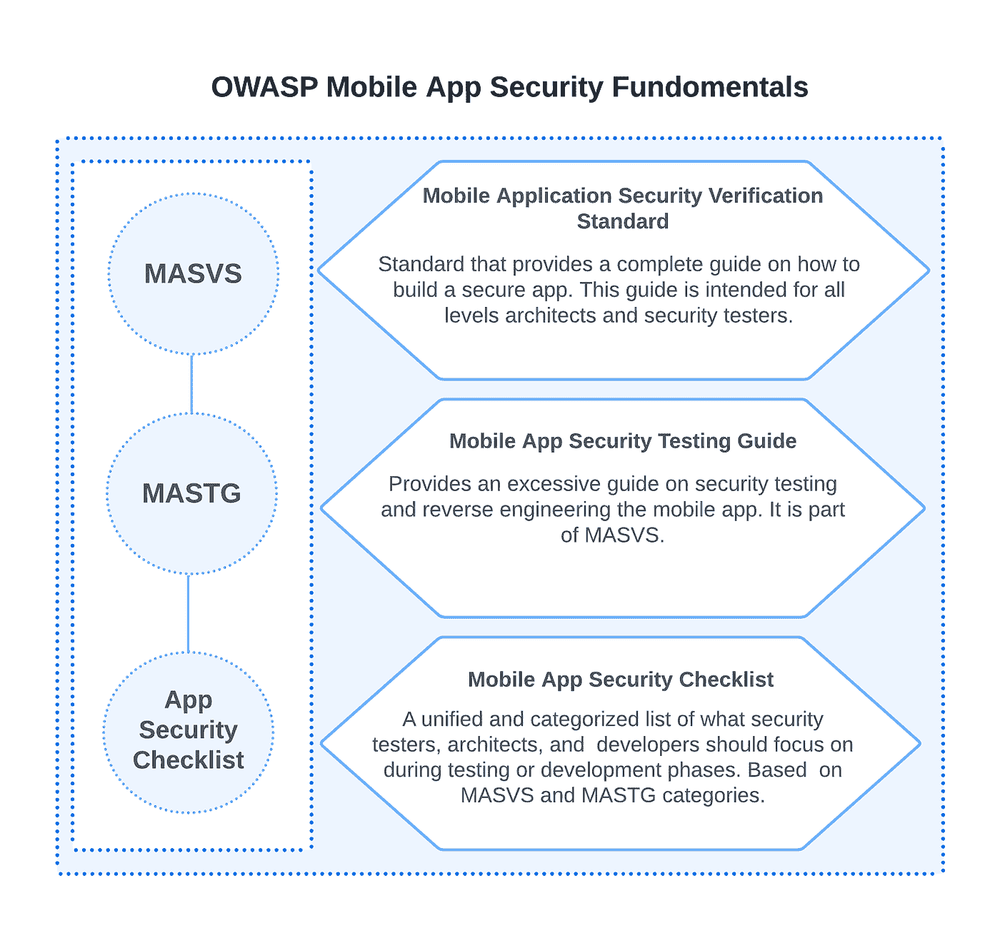
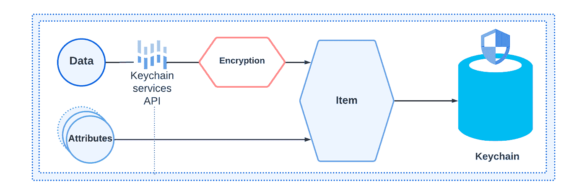

# 在云端构建安全的移动应用

> 原文：<https://itnext.io/building-a-secure-mobile-app-in-the-cloud-b292cadfc817?source=collection_archive---------7----------------------->

## 这份关于安全移动应用程序的指南展示了主要的安全漏洞、OWASP 构建/测试 iOS 和 Android 应用程序的最佳实践等等。

构建安全的移动应用程序是一个困难的过程，尤其是在云中。我们必须考虑到移动平台，像 iOS 和 Android，有完全不同的架构和质量准则。此外，我们需要关注后端的云架构。在本文中，我们将了解六大安全漏洞、OWASP 构建/测试 iOS 和 Android 应用程序的最佳实践，以及 iOS 和 Android 的指南。最后但同样重要的是，我们将探索一个用于移动应用程序的 DevSecOps 示例。

> *这是 DZone《2022 年企业应用安全趋势报告》中的一篇文章。更多:* [*阅读报道*](https://dzone.com/trendreports/enterprise-application-security)

# 三大攻击示例

为了理解移动应用程序安全性的重要性，让我们先来看看三个最突出的移动应用程序黑客攻击，它们给受影响的公司带来了巨大的财务和营销问题。

# 公园移动违规

在 2021 年对 ParkMobile 应用程序的网络攻击中，黑客成功窃取了 2100 万个用户账户。据《安全》报道，黑客成功窃取了电话号码、车牌号码和电子邮件地址。似乎所有未加密的数据都是偷来的密码。然而，信用卡是加密的，所以黑客无法加密数据，因为密钥没有被盗。

# Juspay 数据泄露

为优步、亚马逊、Swiggy 和 Flipkart 提供服务的支付运营商 Juspay 于 2020 年 8 月通过其移动应用程序遭到黑客攻击。黑客窃取了 3500 万条记录，包括信用卡数据、指纹和屏蔽卡数据。

# 沃尔格林手机应用程序泄漏

2020 年，沃尔格林的移动应用程序集成了恶意软件，可以查看个人消息和信息。它导致大量用户数据被泄露，包括姓名、处方号和地址。

# iOS 和 Android 中六大 OWASP 安全漏洞类型

在我们进入 iOS 和 Android 指南以及 OWASP 测试指南之前，让我们先来看看六大 OWASP 漏洞类型:

漏洞类型描述身份验证问题，不安全的通信移动应用程序需要验证未加密的 UI 表单、算法和协议。攻击者使用假冒的应用/恶意软件来扫描和观察应用传输层。此外，弱密码、使用地理定位来验证用户身份或使用永久验证可能会导致敏感数据泄漏。对该漏洞进行反向工程使得攻击者能够分析和混淆目标应用程序。这可能会导致敏感数据泄漏，这些数据是在应用程序配置变量或常量中硬编码的。此外，攻击者可能会找到后端服务器的 URL 和配置。数据存储安全漏洞该漏洞使得攻击者能够从数据存储中窃取数据。我们将其部分与“不当的平台使用”联系起来为了防止数据泄露，我们应该仅使用加密的数据存储，避免在设备中存储敏感数据(密码、卡号)，加密数据传输，并且仅使用加密的存储操作系统功能(例如，iOS 钥匙串)。我们可以参考手机漏洞注册表的 [CWE-922](https://cwe.mitre.org/data/definitions/922.html) 。不正确的平台使用这种类型的攻击依赖于开发人员没有使用(或不正确地使用)操作系统中包含的安全功能。安全功能包括 Face ID、iOS 钥匙串和触控 ID。例如，开发人员可能使用不安全的本地存储，而不是 iOS 钥匙串来存储敏感数据。代码篡改代码篡改是指攻击者下载应用程序并更改代码。例如，他们创建虚假的注册或支付表格，然后将应用程序上传回市场或创建克隆的应用程序。也可以是一个可以修改另一个 app 代码的假 app(比如免费的手机清理工具或者 app stores 的免费游戏)。通常，银行应用程序是目标场景之一，而[移动宙斯](https://securelist.com/zeus-in-the-mobile-facts-and-theories/36424/)或木马间谍可用于窃取移动 TAN 代码。

在我看来，这是最重要的漏洞类型列表。然而，OWASP 提供了 10 个列表，它还提供了标准和测试指南。我们将在下一节讨论这些。

# OWASP 移动应用安全基础知识

OWASP 移动应用安全基础由多个来源组成，包含 [OWASP 移动应用安全验证标准](https://mas.owasp.org/MASVS/) (MASVS)、 [OWASP 移动应用安全测试指南](https://mas.owasp.org/MASTG/) (MASTG)和[移动安全清单](https://github.com/OWASP/owasp-mastg/releases/tag/v1.5.0)。在下面的图 1 中，您将详细了解移动应用程序安全性的基础:

*图 1: OWASP 移动应用安全基础知识*

让我们更详细地看看移动应用清单。

# 移动应用安全清单

移动应用安全清单是 MASTG 的一部分。这是一组开发团队在保护移动应用程序时应该包括的规则/检查。它包含 100 多行，按以下类别组织:

*   架构、设计和威胁建模要求
*   数据存储和隐私要求
*   加密要求
*   身份验证和会话管理要求
*   网络通信要求
*   平台交互要求
*   代码质量和构建设置要求
*   弹性要求

每个规则(或支票)都有一个识别码和描述。所有规则都有优先级标记。“L1”或“L2”意味着应用程序应该实现规则/检查。“R”意味着它是必需的，因此团队必须实现所有标有“R”的内容。

接下来，让我们来关注针对特定平台的指南，并关注最受欢迎的平台:iOS 和 Android。

# iOS 和 Android 中的安全移动应用程序:指南

由于我们已经部分接触了一些 iOS 安全 API，我们将在添加 Android 的情况下继续讨论。在下面的第一部分，我收集了关于 iOS API 安全特性的指南和最佳实践。

# 苹果应用程序沙盒、数据保护 API 和钥匙串

Apple 应用沙箱提供了一个 API 来隔离一个应用程序，并阻止对主系统或其他应用程序的访问。它基于 UNIX 的用户权限，确保应用程序由特权较低的“移动”用户执行。此外，它还包括地址空间布局随机化(ASLR)和 arm 永不执行，这可以防止与内存相关的安全错误，并阻止恶意代码的执行。

数据保护 API 允许应用程序加密和解密其文件，它可以解决一些安全问题，如身份验证和逆向工程。每个文件都有四个可用的保护级别，默认情况下，它会在第一次用户身份验证时进行加密。但是，我们应该提高级别以提供最高的保护。

最后但同样重要的是，钥匙扣。它提供安全的硬件加速数据存储。iOS 提供了这个 API 来存储最高安全级别的证书和密码。对于钥匙串中的每个项目，我们可以定义特定的访问策略。特别是当用户需要请求 Face ID 或触控 ID 时，生物特征注册不会更改，因为该项目已添加到钥匙串中。

*图 2:钥匙链 API*

# Android 加密的键值存储、文件加密和加密 API

与 iOS 相同，Android 也有许多类似的功能来安全地存储数据。第一个是键值存储。它允许使用`SharedPreferences`设置存储中项目的可见性范围来存储数据。我们需要记住，默认情况下，存储的值是不加密的。因此，恶意软件可能会访问这些数据。

如果我们需要手动加密数据，我们可以从使用加密 API 中受益。我们可以用 KeyGenerator 生成一个安全的密钥，然后将加密的值保存并提取到 [Android Keystore](https://developer.android.com/training/articles/keystore) 。为了安全地处理文件和外部存储，Android 有[加密支持库](https://developer.android.com/guide/topics/security/cryptography)。它支持许多加密算法来加密/解密文件。

# HTTPS、SSL 锁定和推送通知

安全通信层是安全应用的下一个重要里程碑。首先，我们需要确保我们使用的是 HTTPS。iOS 有一个名为 App Transport Security (ATS)的功能，默认情况下会阻止不安全的连接，因此所有连接都必须使用 HTTPS/TLS。此外，SSL 锁定功能有助于防止中间人攻击。如果系统证书由根证书颁发机构签名，它将验证该证书。

若要使用此功能，应用程序应运行额外的服务器证书信任验证。推送通知是另一个应该受到保护的部分。我们应该使用苹果的[推送通知服务](https://developer.apple.com/documentation/usernotifications) (APNs)和`[UNNotificationServiceExtension](https://developer.apple.com/documentation/usernotifications/unnotificationserviceextension)` [扩展](https://developer.apple.com/documentation/usernotifications/unnotificationserviceextension)。这将允许我们为敏感的移动应用程序数据使用占位符，并发送加密消息。

还有，可以考虑用苹果的 [CryptoKit](https://developer.apple.com/documentation/cryptokit) 。它是 iOS 13 中引入的新 API，提供以下功能:

*   散列数据
*   使用消息认证码认证数据
*   执行密钥协议
*   创建和验证签名

Android 也有类似的选项。它只允许 HTTPS 使用 TLS 传输加密数据。SSL 固定也是如此。为了防止中间人攻击，我们可以对服务器证书执行额外的[信任验证。](https://developer.android.com/training/articles/security-ssl)

# Azure 和 AWS 中的安全移动应用

为了构建安全的应用程序，Azure 提供了 Azure App Center 等服务。它允许构建和分发移动应用程序，并提供了许多安全选项:

*   数据传输加密—默认情况下支持使用 TLS 1.2 的 HTTPS；另外[静止加密](https://learn.microsoft.com/en-us/azure/security/fundamentals/encryption-overview)
*   代码安全性—提供多种工具来分析代码依赖性，以检测安全漏洞
*   身份验证—包含类似于[微软身份验证库](https://learn.microsoft.com/en-us/azure/active-directory/develop/msal-authentication-flows) (MSAL)的特性，它支持多种授权授权和相关的令牌流

除了 Azure，AWS 在构建安全的移动应用程序时还需要考虑一些强大的服务。以 AWS Cognito 为例。这是一个用户状态服务，可以选择为用户开发唯一的身份。它支持:

*   安全应用认证
*   使开发者能够包括用户注册
*   专注于 web 和移动应用的轻松登录和访问控制

AWS 有一个名为 [AWS Device Farm](https://aws.amazon.com/device-farm/) 的独特服务。它不仅提供自动化测试和模拟环境，还包含验证应用程序依赖性和运行安全检查的功能。现在让我们来看一个构建具有安全特性的 DevOps 流程的例子。

# 用于移动应用程序的 DevSecOps 示例

在这一节中，我创建了一个 DevSecOps 场景的示例来交付安全的移动应用程序(参见图 3)。该流程可以在最流行的 CI/CD 平台和云提供商中重复使用:

1.  **Git 操作步骤** —包含源代码控制触发构建时的标准提交/推送操作。
2.  **运行静态分析和代码林挺步骤** —验证代码样式、可用性、数据流问题和安全问题(例如，Xcode 静态分析器)。
3.  **依赖性验证步骤** —通过应用程序中使用的库树提供过多的验证检查。这个验证步骤可能会暴露一个伪造的恶意库，该库可以操纵代码，甚至窃取个人用户数据。
4.  **应用程序日志验证步骤** —检查日志是否包含敏感数据，如环境密码、测试令牌或授权数据。在开发/测试过程后，应用程序包可能包含一些敏感数据，因为开发人员在调试应用程序后可能不会注意到这些数据。(这个步骤也可以在部署到开发/测试环境之后运行)。
5.  **QA 步骤**:

–将应用部署到开发/测试环境，供 QA 团队测试。

–推广并部署应用程序进行市场验证。

*图 3:一个安全的移动应用程序的通用开发流程*

# 结论

在本文中，我提供了一个关于安全移动应用程序的简短指南。我们发现 OWASP 社区具有重要的安全基础，OWASP 可以作为构建新应用程序或重构现有应用程序的强大基础。了解云服务和 DevSecOps 的例子使我们能够以最少的努力开始构建安全的移动应用程序，并使攻击者更难破坏我们的应用程序。此外，我们还浏览了 iOS 和 Android 的安全特性、安全 API，并发现了如何正确使用它们。

> *这是 DZone《2022 年企业应用安全趋势报告》中的一篇文章。更多:* [*阅读报告*](https://dzone.com/trendreports/enterprise-application-security)