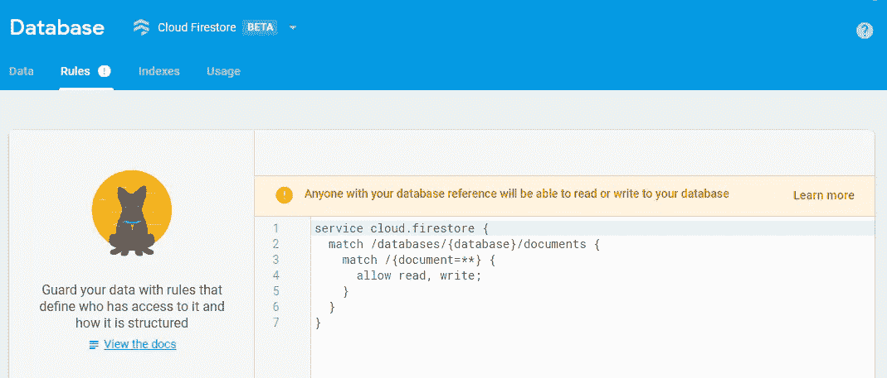
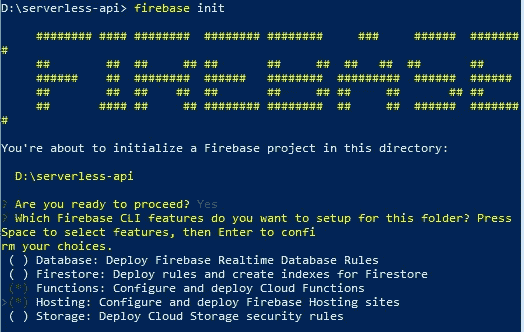
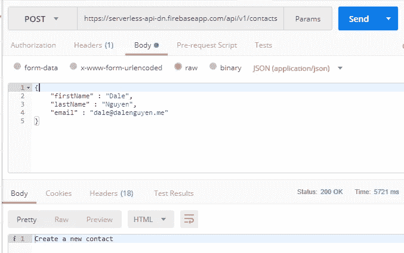
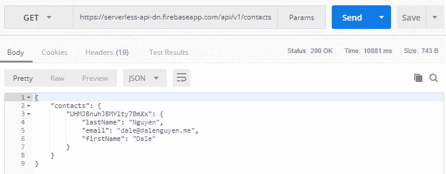
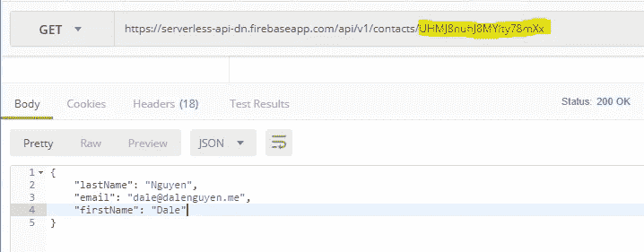
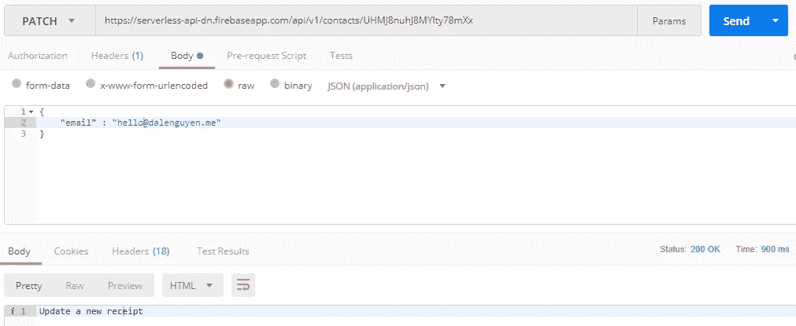

# 用云功能 Firestore 和 Express 构建一个“无服务器”RESTful API

> 原文：<https://itnext.io/building-a-serverless-restful-api-with-cloud-functions-firestore-and-express-f917a305d4e6?source=collection_archive---------0----------------------->


很明显，它运行在地球上某个地方的“a”服务器上；然而，好处是您不必配置或维护它。

我最近做了一个关于如何构建 RESTful HTTP 接口的练习，这让我很感兴趣，我可以尝试构建一个临时的 RESTful API 来测试这个概念。幸运的是，我正在从事几个使用 Firebase 云功能和云 Firestore 的项目。完全有可能创建这样的端点用于测试目的，甚至是一个完整的工作 RESTful API 项目。谁知道呢？！

因此，在这个项目中，我将使用 **Firebase 云功能、Firebase 托管、云 Firestore(数据库)和 TypeScript。**对，你没看错，云函数确实支持 TypeScript！这意味着您可以在编写函数时利用 ES6+。

你可以遵循这个指导或者检查这个项目的 git 库。

https://github.com/dalenguyen/serverless-rest-api

作为一个例子，我将使用这个 API 来管理联系人信息。

**第一步:准备好你的 firebase 项目**

嗯，你需要创建一个 [firebase 项目](https://firebase.google.com/)来使用。记得选择 Firestore 作为您的数据库。



这些规则对公众开放。在投入生产之前，您需要[实现 firestore](/setting-up-cloud-firestore-security-rules-1ad24438805a) 的安全性。

**步骤 2:在本地机器上启动 Firebase 托管和功能**

在开始之前，你需要安装 NPM 认为 firebase-tools

```
npm install -g firebase-tools
```

之后，您登录并初始化 firebase 项目

```
firebase login
firebase init
```

记得检查功能和主机。实现托管的好处是您将有一个自定义的 API 项目 URL。



请选择**打字稿**作为编写函数的语言。如果你愿意，你可以选择 JavaScript。

**步骤 3:安装软件包依赖关系**

这些包将位于 functions 文件夹中

```
cd functions
npm install --save express body-parser firebase-functions-helper
```

[firebase-functions-helper](https://www.npmjs.com/package/firebase-functions-helper)是我在使用 Cloud Firestore 时编写的包。如果你愿意，可以使用[原生向导](https://firebase.google.com/docs/firestore/quickstart)。

[](https://www.npmjs.com/package/firebase-functions-helper) [## 消防基地-功能-助手

### 用于 Firebase 云函数的辅助 NPM 包

www.npmjs.com](https://www.npmjs.com/package/firebase-functions-helper) 

第四步:编写你的函数

功能逻辑位于 **functions/src/index.ts**

您首先需要导入必要的包

```
import * as functions from 'firebase-functions';import * as admin from 'firebase-admin';
import * as firebaseHelper from 'firebase-functions-helper';
import * as express from 'express';
import * as bodyParser from "body-parser";admin.initializeApp(functions.config().firebase);const db = admin.firestore();const app = express();
const main = express();const contactsCollection = 'contacts';main.use('/api/v1', app);
main.use(bodyParser.json());
main.use(bodyParser.urlencoded({ extended: false }));// webApi is your functions name, and you will pass main as 
// a parameter
export const webApi = functions.https.onRequest(main);
```

在这个文件中，我们还为 API 创建了 CRUD 路径

```
// Add new contact
app.post('/contacts', async (req, res) => {
    try {
        const contact: Contact = {
            firstName: req.body['firstName'],
            lastName: req.body['lastName'],
            email: req.body['email']
        }const newDoc = await firebaseHelper.firestore
            .createNewDocument(db, contactsCollection, contact);
        res.status(201).send(`Created a new contact: ${newDoc.id}`);
    } catch (error) {
        res.status(400).send(`Contact should only contains firstName, lastName and email!!!`)
    }        
})// Update new contact
app.patch('/contacts/:contactId', async (req, res) => {
    const updatedDoc = await firebaseHelper.firestore
        .updateDocument(db, contactsCollection, req.params.contactId, req.body);
    res.status(204).send(`Update a new contact: ${updatedDoc}`);
})// View a contact
app.get('/contacts/:contactId', (req, res) => {
    firebaseHelper.firestore
        .getDocument(db, contactsCollection, req.params.contactId)
        .then(doc => res.status(200).send(doc))
        .catch(error => res.status(400).send(`Cannot get contact: ${error}`));
})// View all contacts
app.get('/contacts', (req, res) => {
    firebaseHelper.firestore
        .backup(db, contactsCollection)
        .then(data => res.status(200).send(data))
        .catch(error => res.status(400).send(`Cannot get contacts: ${error}`));
})// Delete a contact 
app.delete('/contacts/:contactId', async (req, res) => {
    const deletedContact = await firebaseHelper.firestore
        .deleteDocument(db, contactsCollection, req.params.contactId);
    res.status(204).send(`Contact is deleted: ${deletedContact}`);
})
```

**步骤 5:部署您的主机和功能**

在部署到 firebase 之前，我们需要对 firebase.json 进行一些修改

```
{
  "functions": {
    "predeploy": [
      "npm --prefix ./functions/ run lint",
      "npm --prefix ./functions/ run build"
    ]
  },
  "hosting": {
    "public": "public",
    "ignore": [
      "firebase.json",
      "**/.*",
      "**/node_modules/**"
    ],
 **"rewrites": [
      {
        "source": "/api/v1/**",
        "function": "webApi"
      }
    ]**
  }
}
```

我们将把函数映射到 URL，因此 webApi 将触发我们调用 URL。(*您的项目中的 URL 不同*

```
[https://serverless-api-dn.firebaseapp.com/api/v1/**](https://serverless-api-dn.firebaseapp.com/api/v1/**)
```

现在，您可以部署到 firebase

```
firebase deploy
```

这个命令将把主机和功能部署到 firebase。下一次，您只需要在对路由进行一些更改时部署功能。

```
firebase deploy --only functions
```

**步骤 6:测试你的 API 项目**

我将使用 [Postman](https://www.getpostman.com/) 来测试 API。首先，我们将通过发送 POST 请求和正文来创建联系人。



查看具有获取请求的所有联系人



我们可以传递联系人 Id 来只查看一个联系人



通过发送补丁请求来更新我的电子邮件地址



最后，我们可以通过删除请求删除联系人


有一些响应处理需要改进；然而，我们现在有了一个可以试验的工作 API。

如果你对构建 API 感兴趣，你可以看看我的另一篇文章:

[用 Node.js、Express、MongoDB 和 TypeScript 构建 RESTful Web APIs】](/building-restful-web-apis-with-node-js-express-mongodb-and-typescript-part-1-2-195bdaf129cf)

[**在 Twitter 上关注我**](https://twitter.com/dale_nguyen) 了解 Angular、JavaScript & WebDevelopment 的最新内容👐