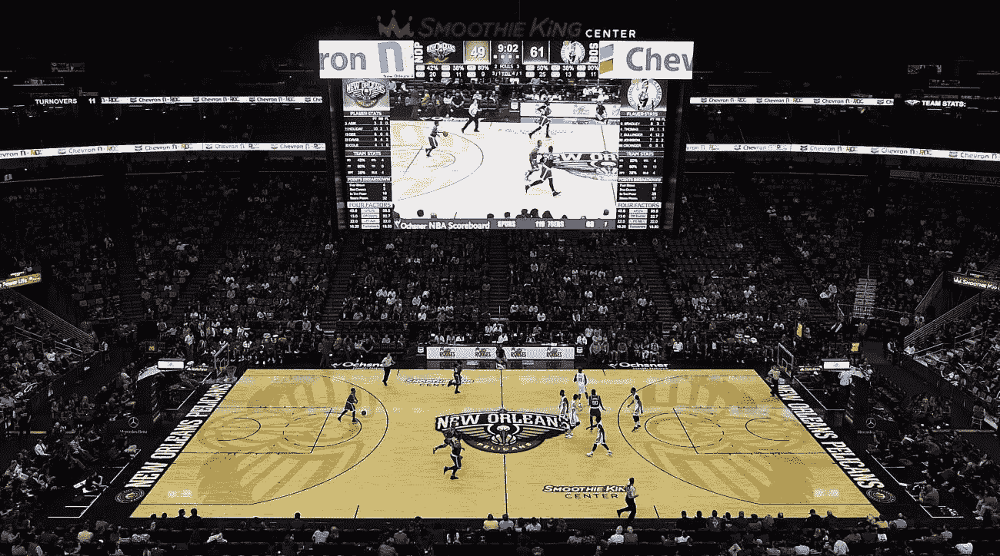
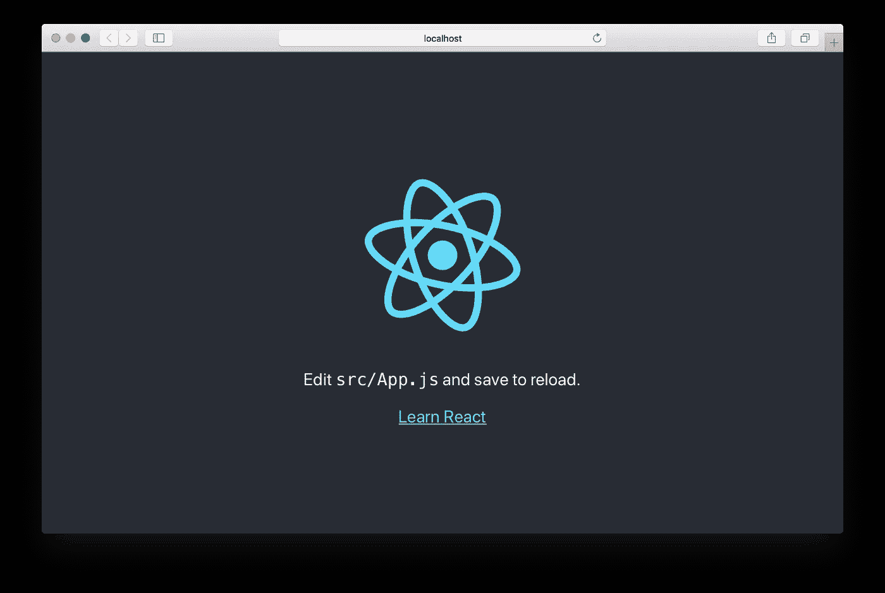

# 用 React 构建一个简单的记分板

> 原文：<https://itnext.io/building-a-simple-scoreboard-with-react-b4ee2b84fa9f?source=collection_archive---------3----------------------->

在我以前的一些帖子中，我们使用 React 组件、状态和事件处理程序开发了一个记分牌。令人兴奋的东西！有点:)然而，我们在那些文章中使用的方法并不完全是高质量的代码，相反，它们在简化 React 的基本概念方面起到了它们的作用。在这篇文章中，我们将把所有的东西都画在一起，来创建一个实用的、干净的和高效的记分牌。



如果你对 React 的基本原理没有很好的理解，我强烈建议你看看我的关于 React 中一些核心思想的系列文章。下面我来链接一下系列的文章！

[](https://hackernoon.com/passing-arguments-to-react-event-handlers-the-easy-way-3bf8e52f7705) [## 在 React 中将参数传递给事件处理程序——最简单的方法

### 一个简单易行的方法来提升你的反应专长！

hackernoon.com](https://hackernoon.com/passing-arguments-to-react-event-handlers-the-easy-way-3bf8e52f7705) [](https://hackernoon.com/the-road-to-react-mastery-handling-events-9da8bb1c6f1d) [## 反应精通之路——处理事件

### 如何利用 React 组件最强大的特性之一！

hackernoon.com](https://hackernoon.com/the-road-to-react-mastery-handling-events-9da8bb1c6f1d) [](https://hackernoon.com/the-road-to-react-mastery-understanding-state-29ef20572bc9) [## 反应掌握之路——理解状态

### React 中的状态是基于类的组件的一个非常强大的特性，有点类似于带有一些…

hackernoon.com](https://hackernoon.com/the-road-to-react-mastery-understanding-state-29ef20572bc9) [](https://medium.com/@ethoshansen/the-road-to-react-mastery-components-and-props-d17d2356a024) [## 反应精通之路——组件和道具

### 组件和道具是强大的工具，您将学习在 React 工具带中携带它们。他们开始介绍…

medium.com](https://medium.com/@ethoshansen/the-road-to-react-mastery-components-and-props-d17d2356a024) 

好吧，让我们开始吧！在这篇文章中，我将从头开始构建，从头开始构建一个 React 应用程序！

## 创建 React 应用

为了初始化我们的项目环境，我们将使用 React 的`create-react-app`命令。如果您不知道这个命令是做什么的，我会给你一个简短的总结。Create-react-app 构建了一个基本的单页 react 应用程序，它运行在本地的“开发”服务器上。我们一会儿就会谈到所有这些。

首先，转到 terminal，并导航到您希望构建这个项目的目录。然后运行以下命令。

```
> npx create-react-app scoreboard
```

您应该会看到一些快速的、本质上无关紧要的加载文本闪过，随后是一条成功消息！太好了。

*   为了避免任何混淆，请确保导航到 React 项目的目录。

让我们确保一切正常。

```
> npm start
```

这应该会自动将您带到开发服务器，您应该会看到这个令人厌烦的页面。



都赶上了？太好了。现在进行春季大扫除。首先删除 logo.svg 和 App.js 中 App 类内的所有内容(也可以在 public/index.html 文件中更改页面的标题)。从现在开始，我们将只使用/src 文件。所以忽略其他一切。

## 代码

啊终于！整篇文章的重点！让我们建立一个快速简单的记分牌。到目前为止，在我们的 app.js 文件中，您应该有这个。

```
import React, { Component } from 'react';
import './App.css';class App extends Component {
  render() {
    return (
      <div className="App"> </div>
    );
  }
}export default App;
```

空组件。让我们暂时就这样吧。让我们分解一下我们的问题。我们需要:

*   两个队的得分记录(可能还有球员、犯规、暂停等)
*   两个团队名称
*   按钮，当按下时增加适当的队分数 2

这些团队的基本结构是一样的。他们都有得分，球员，犯规，暂停和名字。因此，创建一个名为`team`的独立 React 组件是一个完美的用例。这直接将我们的分数和其他有用的信息与团队名称联系起来，但是它也使我们不必重写基本代码，从而简化了我们的程序。我们开始吧！

我们将从创建一个简单的组件开始，该组件仅利用 props(作为最初设置的唯一自定义方面——得分、犯规、超时都普遍从零开始)。

```
class Team extends Component {
  render {
    return (
      <h2>{this.props.name}</h2>
      <h1>{the-team-score}</h1>
      <button>+2</button>
    );
  {
}
```

现在我们可以创建两个不同的团队组件，并将它们呈现到更大的<app>容器中。</app>

```
import React, { Component } from 'react';
import './App.css';class App extends Component {
  render() {
    return (
      <div className="App">
        <Team name="Hawks" />
        <Team name="Eagles" />
      </div>
    );
  }
}export default App;
```

如果您检查您的 React 开发服务器，您现在应该会注意到两个词，Hawks 和 Eagles 笨拙地坐在彼此之上(我们不会设计我们的组件，因为我们将只关注 React，但是如果您希望这样做，您可以在 App.css 文件中！).但这是一个很好的开始。现在加上我们的分数。

```
class Team extends Component {
  constructor(props) {
    super(props);
    this.state = {score: 0}
  }
  render {
    return (
      <h2>{this.props.name}</h2>
      <h1>{this.state.score}</h1>
      <button>+2</button>
    );
  {
}
```

好了，我们刚刚在我们的`constructor`方法中初始化了我们的组件状态，并给一个名为 score 的变量赋值 0。然后我们通过在`this.state.score`中引用它来直观地显示那个分数。再次检查我们的页面，你应该看到一个响亮的大零，在两个团队的名字。

尽管这看起来很“漂亮”。如果不改变，我们的记分牌就没用了。因此，我们需要添加一个事件处理程序，并使用我们的按钮。为了简单和高效，我们将使用默认的 onClick 方法，当按钮被按下时，分数增加 2(这是不言自明的)。

```
class Team extends Component {
  constructor(props) {
    super(props);
    this.state = {score: 0}
    c
  }

  increaseScore() {
    this.setState({
      score: this.state.score + 2
    });
  }      render {
    return (
      <h2>{this.props.name}</h2>
      <h1>{this.state.score}</h1>
      <button onClick={this.increaseScore}>+2</button>
    );
  {
}
```

我们在那里走了几步，所以我会一步一步地向你介绍。

*   我们首先创建了一个名为`increaseScore`的方法，该方法在组件的状态中找到团队得分的值，并将其增加 2。
*   为了让我们的`increaseScore`方法工作，我们必须在`this.increaseScore = this.increaseScore.bind(this);`中将它绑定到组件的`this`实例。
*   最后，我们通过使用默认的`onClick`函数将按钮连接到`increaseScore`方法。

没那么复杂吧。让我们最后一次检查我们的页面。试着按下两个按钮… Anndddd，分数增加！这就是我们要做的！React 的神奇之处在于，当我们的值更新时，它会更新我们的 DOM。这意味着它处理了创建动态网页的大部分繁重工作，把有趣的部分留给了我们。

你有它！一个功能和干净的记分牌，用于你自己的篮球，足球，足球比赛。明智地使用它！

感谢阅读！