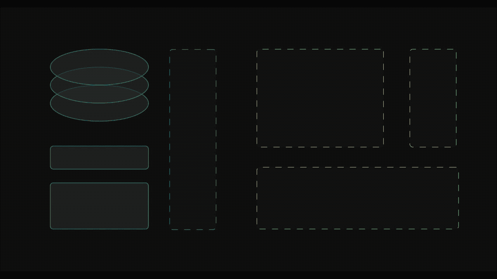

# 构建社交网络:第二部分

> 原文：<https://itnext.io/building-a-social-network-part-ii-1e6883ba27f6?source=collection_archive---------3----------------------->

## 使用公共数据模型创建 Dart 包

## 介绍

在本系列的[上一篇文章](/building-a-social-network-part-i-25856fc693e1)中，我们查看了带有内置安全和隐私特性的社交网络演示的底层 SQL 模式。在本文中，我们将研究该应用程序自底向上设计的下一个阶段:数据模型库。

通过在一个公共库中定义模型，可以在一个方便的位置维护数据模型和底层 DB 模式之间的完整性，允许将来构建任意数量的组件，并具有编译时类型安全性以提高可靠性。

数据模型反映了预期的模式，并为 JSON 序列化和其他特性提供了方便的方法。额外的哈希层用于避免以可读的明文形式发送密码。

之所以选择 Dart，是因为它具有强大的功能集，并且是 Flutter 中应用程序的开发语言，这对于快速构建具有高性能 UX 的跨平台客户端应用程序非常有用。

> *本系列文章的项目源代码可从 GitHub* *上的* [*处获得。*](https://github.com/kenreilly/social-network-demo)

## 包装定义

核心库的 Dart 包在`**core/pubspec.yaml:**`中定义

这就创建了一个简单的包，通过添加`core`包作为依赖项，可以轻松地将其导入 API、客户端应用程序、实用程序和维护功能，或者社交网络的任何其他组件。

## 核心

项目中主要的导出源文件是`**core/lib/core.dart:**`

该文件定义了`core`库，并导出数据模型和实用程序类，供软件的其他部分使用，例如认证请求模型、数据模型和密码散列实用程序。

## 可序列化

数据模型基类在`**core/lib/types/serializable.dart**:`

数据模型扩展了这个`Serializable`类，每个都为[序列化](https://en.wikipedia.org/wiki/Serialization)实现了 fromMap 和 toJson。这允许系统组件以函数方式对可序列化对象进行操作，而不需要在编译时或运行时了解每种类型的属性。

## AuthRequest

接下来让我们来看看`**core/lib/models/auth-request.dart:**`

这个类提供了一个方便的包装器，用于发出身份验证请求，带有电子邮件和散列密码的属性，以及一个用于创建新请求的`create`方法，以及`fromMap`和`toJson`的实现，允许请求被序列化以进行网络传输。

这通过提供 API 和所有支持的客户端应用程序理解的公共接口简化了未来的开发，这改善了从开发人员体验到安全性的一切，同时减少了未来必须编写的代码量。可以在编译时而不是运行时发现错误，并且可以开发高度可靠的测试和验证程序来确保始终达到产品质量。

## 用户图像

接下来是`**core/lib/models/image.dart**:`

图像可以是 JPG、PNG 或 GIF 文件，并且具有唯一的 ID 和一个标志来指示它当前是否被设置为个人资料照片。`ext`访问器返回一个典型的文件名字符串，该字符串可用于将图像数据存储在本地文件、云存储服务或其他位置。

## 用户

用户类别位于`core/lib/models/user.dart:`

这个文件包含一个基类`User`以及`AuthenticatedUser` 和`NewUser`，用于处理认证和创建新的用户帐户。以这种方式使用一组公共的类可以最大限度地减少身份验证和帐户创建代码中出现错误的可能性。

## 邮政

发布数据的公共类在`**core/lib/models/post.dart**:`中

`Post`类表示一个社交网络帖子，带有 id、相关用户、内容和一个`fromJSON` ，用于从数据库记录中创建一个`Post`实例。类`NewPost`定义了创建新帖子所需的参数，客户端应用程序将使用这些参数通过 API 发布内容。

## 房间

聊天室数据模型在`**core/lib/models/room.dart:**`中

Room 和 NewRoom 类将用于创建、列出和连接聊天室。格式与其他数据模型类相同。

## 测试

`core`包包括一个 TDD 的基本框架，以及一个测试模型类，用于验证序列化是否如预期的那样工作。测试模型位于`**core/lib/models/post.dart:**`

`TestModel`类扩展了`Serializable`的一些属性和方法，用于测试基本类型的基本序列化，并通过自定义实现`==`相等[操作符](https://en.wikipedia.org/wiki/Operator_overloading)来检查相等性。

测试本身位于`**core/test/test-runner.dart:**`

通过从头开始创建一个 TestModel 来测试序列化，然后根据第一个模型的属性创建另一个模型，使用前一个模型的`data`访问器创建另一个模型，通过 JSON 序列化方法传递前一个模型来创建另一个模型。

## 结论

这个包作为 API 和 UI 的一个公共库，在处理进出数据库的数据时，以一种确保现在和将来维护的兼容性和可靠性的方式来构建。

即将推出的是本系列的第三部分，其中导入了这个包，并在 REST API 中使用它来实现创建帐户、添加关注者和发布内容(包括图片)的端点。

感谢阅读！

***~***[***8 _ bit _ hacker***](https://twitter.com/8_bit_hacker)