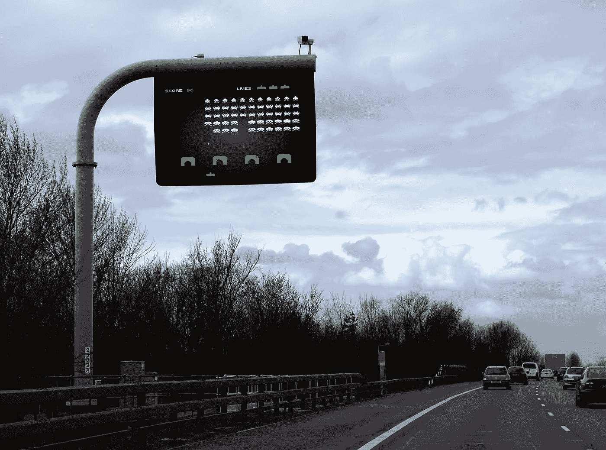
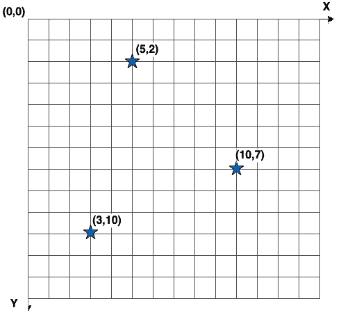
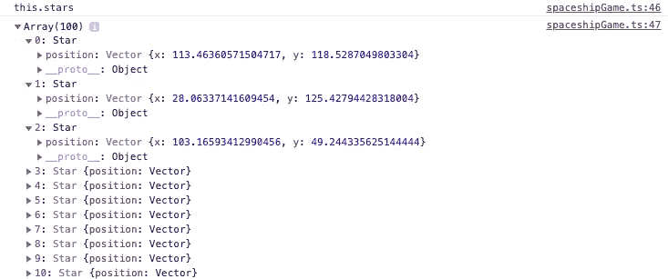
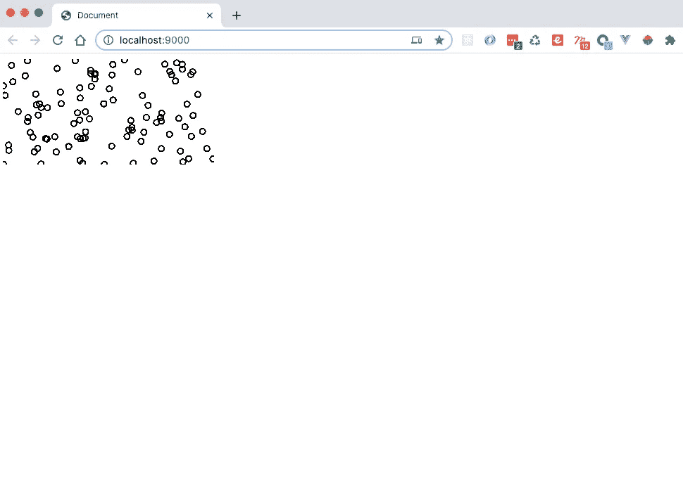
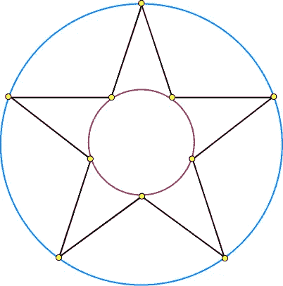
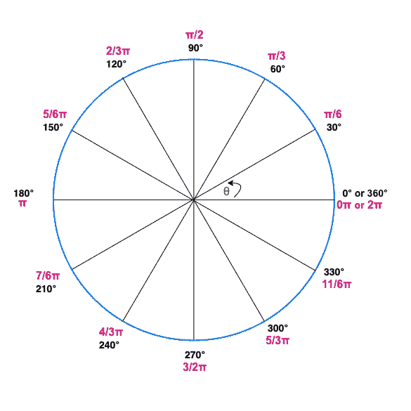
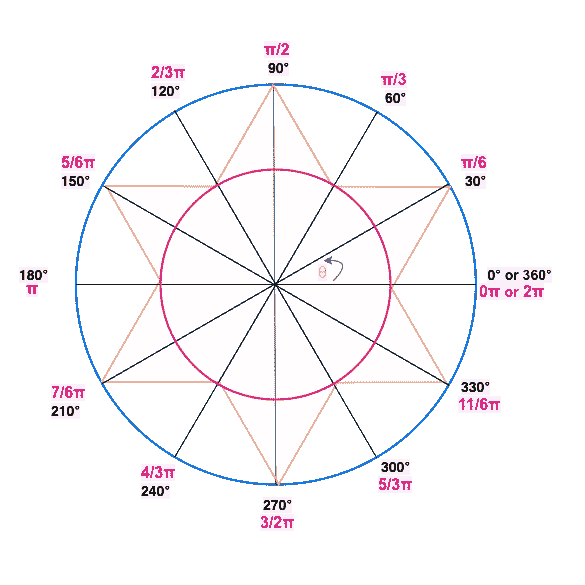
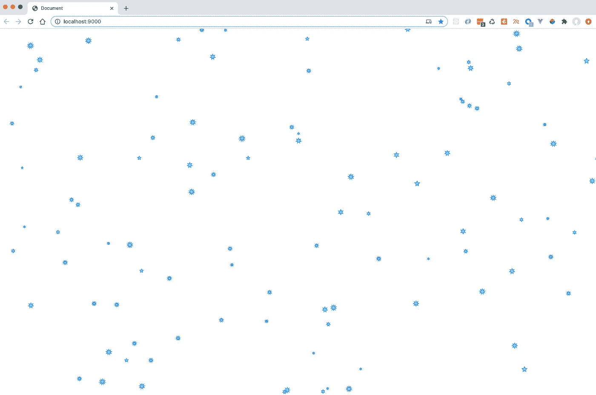

# 用 HTML5 canvas & Typescript 构建一个太空射击游戏—第 1 部分

> 原文：<https://itnext.io/building-a-space-shooter-game-with-html5-canvas-typescript-part-1-20663025c7f5?source=collection_archive---------3----------------------->

本文是由以下作者撰写的系列文章的第一部分:

第一部分-画星星⭐
第二部分-画一艘宇宙飞船并让它旋转🚀
[第 3 部分——让飞船移动并拍摄](https://andreteixeira.medium.com/building-a-space-shooter-game-with-html5-canvas-typescript-part-3-f1b2808e85bd)💨
第 4 部分-为移动🕹️制作操纵杆📱
第五部分——敌舰和碰撞💥

几个月前，在开始我的日常活动时，我被一个惊人的谷歌涂鸦吸引住了。一个非常简单的游戏，庆祝某个地方的板球锦标赛，我花了比预期更多的时间。

当然，这个游戏很有趣，但是我在第一轮之后就在开发者工具上发现了一些超越的东西:

```
<canvas width=”1080" height=”608" tabindex=”0"></canvas>
```

这不是我第一次看到这个标签，但这是我第一次真正思考它的可能用法。现在，几年后，我将实现我那天的想法，重温我在大学期间某个时候实现的一个太空射击游戏。



布雷特·乔丹在 [Unsplash](https://unsplash.com?utm_source=medium&utm_medium=referral) 上拍摄的照片

# 该项目

通过这个练习，我想在学习新东西的同时获得乐趣。我将探索 HTML5 canvas 的可能性，并记住一些待命已久的基本 2D 物理学概念。我将使用 Typescript 来制作它，并尽我所能从头开始，尽可能避免依赖。

> 游戏来源:[https://github.com/ateixeira/spaceship-game](https://github.com/ateixeira/spaceship-game)
> 游戏试玩(最新):[https://spaceship.andreteixeira.nl/](http://spaceship.andreteixeira.nl/)

# **结构**

我已经建立了一个 typescript 基础项目来开始，这里不再详述。但是我为空的基础项目[提交](https://github.com/ateixeira/spaceship-game/tree/empty_project)创建了一个标签。

它的基本配置如下:

*   以打字打的文件
*   巴比伦式的城市
*   网络包
*   Webpack 开发服务器
*   厚颜无耻

签出后，您可以安装依赖项并开始执行:

```
**npm install****npm run serve.**
```

# **创建画布元素**

第一步是创建一个 canvas 元素，并将其附加到文档主体。我将创建一个类 **SpaceshipGame** 并将它作为我的游戏外壳。

我们还需要在入口点文件中导入并执行它。

# 游戏循环

游戏循环是大多数游戏使用的模式，它至少执行 3 个我们在当前练习中感兴趣的操作。它在游戏过程中不间断地运行，并且对于循环的每次迭代，它:

*   **解析用户输入**
*   **更新状态**
*   **(重新)绘制场景**

## 最简单的方法

我想到的第一个也是最简单的循环具有以下形状:

一个简单的 while 循环，一直运行到有人让它停止为止(比如说，按下暂停按钮)。但是这段代码带来了一些问题，即:

1.  由于 JavaScript 是单线程的，循环是阻塞操作；
2.  我们无法控制这个循环的速度，它可能会根据硬件和每一步中执行的操作的复杂程度而有很大变化。

## **更好(但仍不理想)的方法**

我们可以通过将循环函数封装到 DOM 定时事件方法中来解决阻塞 UI 问题:

这将在游戏函数调用之间留出一些时间，并给线程空间来执行其他任务。但是使用这种方法，我们仍然不能完全控制每秒的循环迭代次数。鉴于事件循环的工作方式，您可能会计算出一些永远不会被绘制出来的状态变化。

这可能会导致一个古怪的动画，或者导致每秒钟处理太多操作的情况。超过人眼可以吸收的或者大于播放器的屏幕刷新率(通常为 60 fps)。

## 要走的路

所以在 JavaScript 世界中，最好的方法是将事件循环也用作我们的游戏循环。我们可以通过使用 **requestAnimationFrame** 并让它回调我们的代码来保持游戏运行。

# 创造⭐⭐之星

让我们向前迈进，开始制作游戏。我开始设置空间(拍摄可能会在这个系列的下一部分)。

首先，我很高兴有几颗星星随机分布在画布上。我们可以把它们想象成平面上的点。我最初的想法是这样的:



每个星形都将是一个类的实例，该类具有一个随机(X，Y)位置属性和一个 draw 方法来定义它在屏幕上的显示方式(现在，下面的代码片段显示了一个简单的圆)。

您可能已经注意到，代表星星的 position 属性是由它的 random static 方法创建的 Vector 类的一个实例。

> 你可能还会问，为什么我要用向量表示，而我刚才说星星可以用平面上的点来表示。嗯，对于我目前对实现的设想，用向量来表示我们的点就足够了。不过以后可能会改变。

现在我们在 SpaceshipGame 类上添加一个配置步骤:

```
private config() {
  this.stars = [];
  const { width, height } = this.canvas; for (let i = 0; i < this.STARCOUNT; i++) {
    this.stars.push(new Star(width, height));
  }
}
```

在构造函数上执行 this.config()之后，您可以在调试器上或通过一个简单的 console.log 看到，创建了几个随机位置的 Stars 对象，正如我们所需要的。



然后是时候迭代这个星星列表，并在画布上画出每一颗星星。在游戏 draw 方法内部，调用 Star draw 方法的简单 for 循环将使它们全部出现在画布上(在上一步计算的随机位置上)。

```
for (let star of this.stars) {
  Star.draw(star.position.x, star.position.y, this.ctx);
}
```

这是太空飞船游戏文件现在的样子:

## 让画布做出响应

我们仍然使用画布默认尺寸 150 x 300 px。您可能已经注意到，该应用程序显示如下内容:



第一步是在画布创建期间更改维度属性。因为我想让它填满整个屏幕，设置窗口的宽度和高度就足够了:

```
this.canvas.width = window.innerWidth;
this.canvas.height = window.innerHeight;
```

但是你也可以看到，如果我们保持这种方式，通过调整浏览器窗口的大小，画布将保持相同的大小/格式。

我们可以引入一种方法来检查每一次绘图，看画布的大小是否与窗口的大小相匹配。每当它改变时，我们可以调整画布的大小:

```
resizeCanvasIfNeeded() {
  if (
    this.canvas.width !== innerWidth ||
    this.canvas.height !== innerHeight
  ) {
    this.canvas.width = innerWidth; // resize this.canvas
    this.canvas.height = innerHeight; // also clears this.canvas
    this.config();
  } else {
    this.ctx.clearRect(0, 0, this.canvas.width, this.canvas.height); 
  }
}
```

# 画星星🤩

这个游戏用星星代表圆圈肯定不会成功…为了让它看起来好看，我们来思考一下如何改进星星类的抽签方法。



我们可以通过交替绘制线条(黑色)来绘制星形，在内径(红色)和外径(蓝色)上连接点(黄色)，如图所示。

该函数将接收我们希望星星具有的顶点数量和大小，因此我们可以动态地选择它们的形状。



> 记住以下几点很有帮助:
> 
> x(θ) = cos θ
> y(θ) = sin θ

基于前面的图像，我们可以找到θ除以半个圆周(***【π】***)我们希望恒星拥有的顶点数。然后我们可以使用 ctx.lineTo 交替绘制线条。



## 例子

这里我们有一个 6 顶点的星形，所以θ将是 30(或 ***π*** /6)。

然后，我们可以通过在整个圆周上循环和递增来找到下一步的初始 x 和 y 位置。

这是绘制普通星形的最后一个函数:

这是我们的星际空间的结果:



**本阶段之前的代码标记在:**[https://github . com/ateixeira/space ship-game/releases/tag/part 1 _ final](https://github.com/ateixeira/spaceship-game/releases/tag/part1_final)

**第一部分最终代码演示:**
[http://space ship-part 1-final . S3-website . eu-central-1 . Amazon AWS . com](http://spaceship-part1-final.s3-website.eu-central-1.amazonaws.com)