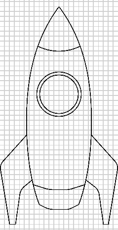
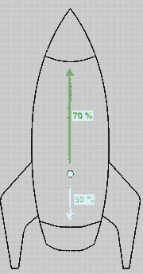
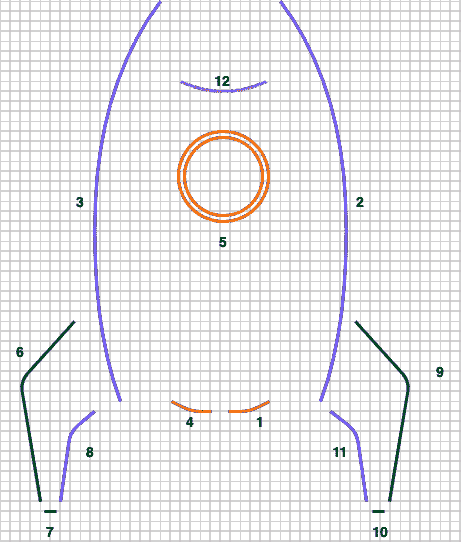
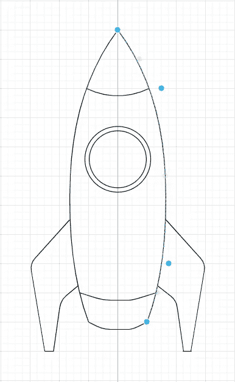
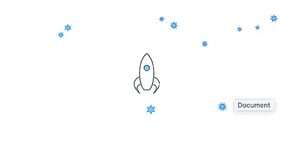
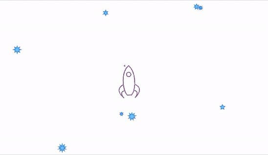

# 用 HTML5 canvas & Typescript 构建一个太空射击游戏—第 2 部分

> 原文：<https://itnext.io/building-a-space-shooter-game-with-html5-canvas-typescript-part-2-bf39f584c4be?source=collection_archive---------4----------------------->

本文是由以下作者撰写的系列文章的第二部分:

[第一部分——画星星](https://andreteixeira.medium.com/building-a-space-shooter-game-with-html5-canvas-typescript-part-1-20663025c7f5)⭐
第二部分——画一艘宇宙飞船并让它旋转🚀
[第 3 部分——让飞船移动并拍摄](https://andreteixeira.medium.com/building-a-space-shooter-game-with-html5-canvas-typescript-part-3-f1b2808e85bd)💨
第 4 部分—为移动🕹️制作操纵杆📱
第 5 部分——敌舰和碰撞💥

# 🚀🚀🚀🚀

我们需要一个功能游戏的下一件东西是一艘宇宙飞船。在本系列的第 1 部分中，我们讨论了游戏循环需要注意的 3 个基本操作:

1.  **读取用户输入**
2.  **更新游戏状态**
3.  **重新绘制画布**

本文将通过步骤，不一定按照上述顺序。

# 在画布上画画

让我们从第三步开始。我们现在需要的是一个飞船类，用一个 draw 方法来定义它在屏幕上的样子。



宇宙飞船插图

在左边，你可以看到我想在飞船绘制方法上实现的东西。我已经在一个基本的绘图工具上绘制了插图，以了解在画布上绘制时的比例。

它的身体有 10 个正方形的高度，最宽的宽度大约是 3.5 个正方形。当使用宽度和高度变量以及画布线条绘制方法时，这个比例将非常有用。



宇宙飞船中心

值得注意的是，以后当我们开始实现这个宇宙飞船的行为时，我们会希望它绕着自己的中心旋转。

为了在下一步中让我们的生活更容易，我们已经可以画出围绕中心的形状。在这个例子中，我把它移到了船的后部，靠近引擎。

## 宇宙飞船班

这是飞船类最初的样子，cx 和 cy 是飞船中心的坐标:

## 绘制零件



宇宙飞船插图 2

通过分解插图，我们注意到它由 13 段组成。我会试着按照显示的顺序画出来。

从上面的要点中，你可以看到表示为 **1** 的步骤已经包含在绘制方法中了(现在我对飞船的平底很满意)。

还要注意，在第一幅太空船插图中，分段 1 有 1 平方的宽度，相当于总宽度的 30%。因此，我们可以移动到提供的船将被放置的 X，Y 坐标，并画一条线到 **X + 0.3 *宽**。

```
ctx.moveTo(bottomCenter.x, bottomCenter.y);*// Half bottom line* ctx.lineTo(bottomCenter.x + width * 0.3, bottomCenter.y);
```

第二部分没有那么简单。这个**贝齐尔库托**方法应该能帮上忙。它接受 2 个控制点坐标 **(x，y)** 和曲线的最终点坐标。为了以更直观的方式快速找到控制点坐标，我的技巧是观察绘图工具的比例。

这是当我选择曲线线段时，曲线在我的绘图工具上的样子:



考虑到起点是当前路径的第一个点(或前一段的最后一个点)，我们看到第一个控制点靠近 **x = 1.75 和 y = 2** ，第二个控制点靠近 **x = 1.7** 和 **y = 8** 而终点在 x = 0 和 y = 10。所以飞船绘图的第二步可以是这样的:

```
ctx.bezierCurveTo(
  cx + width,
  cy - height * 0.2,
  cx + width,
  cy - height * 0.8,
  cx,
  cy - height
);
```

**曲线贝塞尔**方法在这里很有用，因为这条曲线需要 2 个控制点，而**四次曲线贝塞尔**方法可用于具有单个控制点的简单曲线，着陆平台**就是这种情况。**

## 最终绘制方法

我重复了这些步骤来构建所有组成飞船的形状。绘制它的最终代码如下:

这就是目前的情况，我很乐意继续下一步。



# 更新游戏状态

为了产生预期的行为，需要进行一些状态改变，例如:

*   画宇宙飞船；
*   旋转飞船；
*   向前和向后移动它；
*   开枪射击；
*   渲染敌人；

**画宇宙飞船**

为了渲染飞船，我们可以使用我们刚刚创建的 draw 方法。我们只需要在 SpaceshipGame 的 draw 方法中调用它。我是这样称呼它的:

**旋转飞船**

第二个预期行为是当用户选择方向控制(左和右)时，让飞船旋转。你可以在 spaceship draw 方法中看到一个旋转参数。它将绘制旋转到我们在调用时提供的角度的宇宙飞船。

因此，如果游戏循环不间断地调用 spaceship draw 方法并传递一个旋转值，我们所需要的就是读取用户输入并相应地更新游戏状态以进行旋转。

以下几行代码让这一切成为现实:

```
ctx.translate(cx, cy);
ctx.rotate(this.rotationRadians);
ctx.translate(-cx, -cy);
```

你可以注意到旋转前后的`translation`，这是因为我们想在飞船的中心旋转。否则，结果将是这样的:



# 读取用户输入

对于这个游戏的实际状态，我们(目前)对箭头键(以及 WASD 键)的键盘事件感兴趣。因此，让我们向构造函数添加一个 eventListener:

```
window.addEventListener("keydown",this.keyboardListener.bind(this));window.addEventListener("keyup", this.keyboardListener.bind(this));
```

## 此阶段之前的代码标记在:

[https://github . com/ateixeira/space ship-game/releases/tag/part 2 _ final](https://github.com/ateixeira/spaceship-game/releases/tag/part1_final)

## 第 2 部分最终代码的演示:

[http://space ship-part 2-final . S3-website . eu-central-1 . Amazon AWS . com](http://spaceship-part2-final.s3-website.eu-central-1.amazonaws.com/)