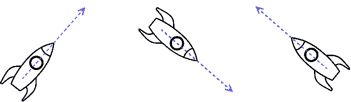
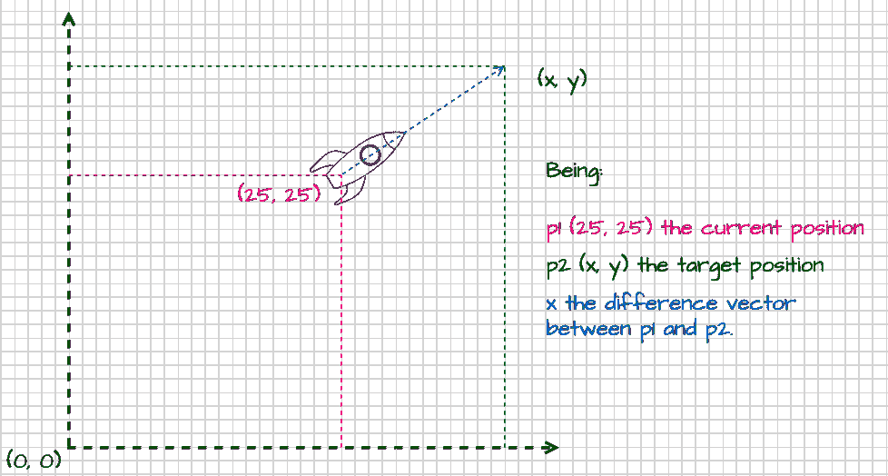
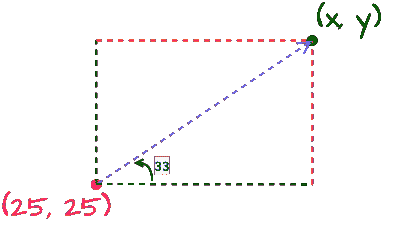

# 用 HTML5 canvas & Typescript 构建一个太空射击游戏—第 3 部分

> 原文：<https://itnext.io/building-a-space-shooter-game-with-html5-canvas-typescript-part-3-f1b2808e85bd?source=collection_archive---------2----------------------->

本文是由以下作者撰写的系列文章的第三部分:

[第一部分——画星星](https://andreteixeira.medium.com/building-a-space-shooter-game-with-html5-canvas-typescript-part-1-20663025c7f5)⭐
第二部分——画一艘宇宙飞船并让它旋转🚀
[第 3 部分——让飞船移动并拍摄](https://andreteixeira.medium.com/building-a-space-shooter-game-with-html5-canvas-typescript-part-3-f1b2808e85bd)💨
第 4 部分—为移动🕹️制作操纵杆📱
第 5 部分——敌舰和碰撞💥

在实现了本系列第 1 部分和第 2 部分中描述的步骤之后，我们有了一个星空和一个可以绕着中心旋转的宇宙飞船。依我看，这个游戏需要更多的动作。因此，第三部分将是关于让它飞来飞去和拍摄。

# 加速度和运动

这艘船有一个后置发动机:因此，推进力使它向机头方向移动。



假设游戏循环每秒调用 draw 方法约 60 次，我们可以考虑计算一个法向量，并在每个循环中将船向它移动 1 步。

下图显示了一个 draw 方法调用的快照。让我们更深入地了解一下这个单独的执行是如何进行计算的:



## TL/DR

此时，飞船更新函数已经知道位置 x，y，以及每次执行时飞船的旋转。它可以在图表中表示为:



我们现在可以定义一个常数来表示每次迭代中飞船运动的长度。这个常数，上面用蓝色向量表示，是这个例子的三角形的假设(我将为这个研究选择随机值 18.0277)。

知道我们可以使用**毕达哥拉斯定理**得到 p2 的 x 和 y 值。存在:

```
sin = opposite leg / hypothenuse;
sen = adjacent leg / hypothenuse;
```

我们可以肯定地说:

```
x = sin(33**) *** hypothenuse;y = cos(33**) *** hypothenuse;
```

或者，使用 JavaScript 的通用方法:

```
const x = Math.sin(this.rotation**) *** this.speed**;** const y = Math.cos(this.rotation**) *** this.speed**;**
```

# 让它飞起来

以下是使其工作所需的属性:

*   **速度**——代表飞船在平面上位移的长度；
*   **加速度**——合成矢量；
*   **减速**——代表松开油门后减少飞船运动的摩擦力。

## 变量

## 键盘监听器

## 运动

最后，在飞船更新方法中，我们通过将新的加速位置添加到当前飞船位置来应用更改值。我们可以通过向 spaceship update 方法添加以下块来实现:

矢量类也需要加法和减法运算，将加速度矢量与当前位置矢量相加，格式如下:

```
public add(vector: Vector): void {
    this.x += vector.x;
    this.y += vector.y;
}public subtract(vector: Vector): void {
    this.x -= vector.x;
    this.y -= vector.y;
}
```

## 重要细节

由于画布平面原点(0，0)位于左上方，我们需要通过将 Y 轴乘以-1 来反转 Y 轴计算方向。

## 部分演示

你可以在这里看到一个工作演示:
[http://space ship-part 3-partial . S3-website . eu-central-1 . Amazon AWS . com/](http://spaceship-part3-partial.s3-website.eu-central-1.amazonaws.com/)

# 射击

开火背后的理论并没有太大的不同。一旦用户点击触发器(空格键)，一个抛射体将被绘制在船的顶部/中心，并遵循给定的绘制功能执行的法向矢量投影。

射击的想法与移动是一样的，不同之处在于当创建一个子弹实例时，它会获得给定时刻的飞船角度。相比之下，飞船移动方法为每个绘图获取最新的方向。

作为最后一步，需要绘制和更新游戏类项目符号。我们需要一个项目符号列表，它将在每次游戏抽签时显示在更新的位置上(听起来像我们在第一部分中对星星所做的那样，对吗？).

## **此阶段之前的代码标记在:**

[https://github . com/ateixeira/spacex-game/releases/tag/part 3 _ final](https://github.com/ateixeira/spaceship-game/releases/tag/part3_final)

## 演示到这一部分:

[http://space ship-part 3-final . S3-website-eu-west-1 . Amazon AWS . com/](http://spaceship-part3-final.s3-website-eu-west-1.amazonaws.com/)