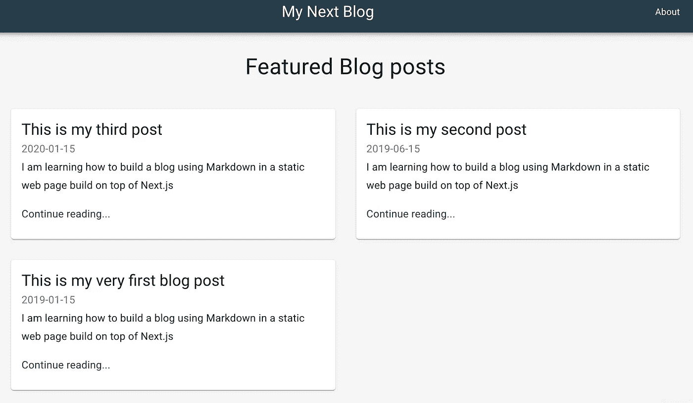
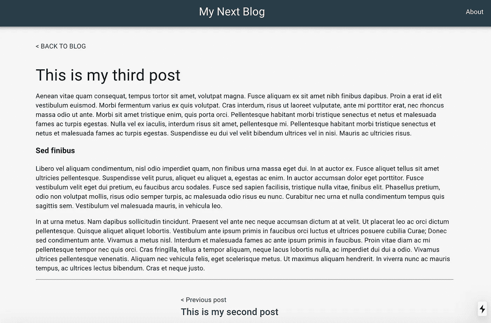

# 用 Markdown 和 Next.js 构建静态博客网站

> 原文：<https://itnext.io/building-a-static-blog-site-with-markdown-and-next-js-702c515389b3?source=collection_archive---------2----------------------->


最近，我们看到了新技术的出现，以及开发工具和服务的发展，其规模之大，是我们作为开发人员十年前只能梦想的。

我们现在可以使用高质量的开源库(在 **JavaScript** 中)和开箱即用的漂亮 UI 库来构建非常丰富的内容网站。使 web 开发人员的工作更容易，使我们能够在更短的时间内交付高质量的产品，并专注于功能、内容和缩短生产时间等。

有了所有的开发工具和服务，我们可以在不需要服务器的情况下建立一个完整的网站，我们开始怀疑，在某些情况下，在云中部署静态内容( **CDN** 实例)并通过持续部署进行更新( **CD** )就足够了。

另一方面，静态站点生成器和 **SSR** [ ]框架解决了 **SPA** 诞生以来所遭遇的问题之一。使用单页面应用程序在社交媒体上分享时，很难获得搜索引擎优化或特定子页面的预览，这可以通过预渲染和/或服务器端[ ]轻松完成。

此外，SSR 和静态页面很少比 SPA 更快，因为与 JS 捆绑包大小相比，从引导程序到单个页面应用程序上的完整呈现所需的 API 的连续调用减少了从服务器呈现的降价。

# 构建静态博客网站

今天我们将使用 [Markdown](https://en.wikipedia.org/wiki/Markdown) 和一个奇妙的 SSR React 框架 [Next.js](https://nextjs.org/) 来构建一个静态博客网站

对于这个项目，我们将使用以下软件包:

*   [React](https://github.com/facebook/react)UI 的声明性 JS 库。
*   [Next.js](https://github.com/zeit/next.js) 同构在服务器和浏览器上反应
*   [Material-UI](https://github.com/mui-org/material-ui) 华丽的 UI 设计开箱
*   [MDX](https://github.com/mdx-js/mdx)“JSX 为雄心勃勃的项目降价。”
*   [clsx](https://github.com/lukeed/clsx) “一个用于有条件地构造`className`字符串的小工具”

这个项目的源代码库可以在这里[获得。](https://github.com/sepineda/blog-next)

## 入门指南

让我们首先为我们的项目创建一个新目录，初始化一个`package.json`文件，然后安装 React 和 Next.js 包，

```
mkdir blog-next
cd blog-next
npm init -y
npm install --save react react-dom next
```

接下来，JS 内置了路由器系统，可以开箱即用；我们需要创建一个`pages`目录，

```
mkdir pages
```

随着我们构建博客应用程序的进展，我们将添加新的页面作为 React jsx 组件。

我们也在给`package.json`添加一些脚本，

```
"scripts": {
  "dev":
  "next",
  "build": "next build",
  "start": "next start"
}
```

分别以开发模式、构建静态内容和生产模式启动。

## 使组件与材料反应-用户界面

继续元件库选择选项( **Material-UI** )，首先安装元件库安装，

```
yarn add @material-ui/core
```

现在我们需要做一些修改，这些修改适用于我们站点中所有提供的页面。由于 Material UI 和其他 react 库依赖于 JavaScript(Material-UI 的 CSS-in-JS)中的样式引擎，因此不需要 Next.js 中默认提供的内置`jss-server-side`功能。为了修改这一点，我们通过在`/pages/_app.js`添加一个页面来覆盖配置，

```
import React, { useEffect } from 'react';
import Head from 'next/head';
import { ThemeProvider } from '[@material](http://twitter.com/material)-ui/core/styles';
import CssBaseline from '[@material](http://twitter.com/material)-ui/core/CssBaseline';
import PropTypes from 'prop-types';
import theme from '../components/theme';function MyApp({ Component, pageProps }) {
  useEffect(() => {
    // Remove the server-side injected CSS.
    const jssStyles = document.querySelector('#jss-server-side');
    if (jssStyles) {
      jssStyles.parentElement.removeChild(jssStyles);
    }
  }, []);
  return (
    <React.Fragment>
      <Head>
        <title>My Next Blog</title>
        <meta
          name="viewport"
          content="minimum-scale=1, initial-scale=1, width=device-width"
        />
      </Head>
      <ThemeProvider theme={theme}>
        <CssBaseline />
        <Component {...pageProps} />
      </ThemeProvider>
    </React.Fragment>
  );
}MyApp.propTypes={
  Component: PropTypes.oneOfType([PropTypes.node, PropTypes.func]),
  pageProps: PropTypes.object
}export default MyApp;
```

正如你可能注意到的，我们还添加了一个`ThemeProvider`来为 Material-UI 定制主题。所以下一步是创建一个新的文件夹`/components`来添加新的公共组件，同时创建一个新的`theme.js`文件，

```
import { createMuiTheme } from '[@material](http://twitter.com/material)-ui/core/styles';
import { red } from '[@material](http://twitter.com/material)-ui/core/colors';// Create a theme instance.
const theme = createMuiTheme({
  palette: {
    primary: {
      main: '#283E4A',
    },
    secondary: {
      main: '#19857b',
    },
    error: {
      main: red.A400,
    },
    background: {
      default: '#F5F5F5',
    },
  },
});export default theme;
```

有了这些变化，我们就可以开始用材料设计构建布局和新组件了👌。

## 网站布局

我们博客站点的布局包括一个 navbar，其中有指向主页的邮件链接(title)和一个 about 链接，一个专题博客文章的部分标题，以及一个两列网格显示卡片，上面有标题、发表日期和每篇文章的内容摘要，



我们需要定义的第一个组件是`/pages/index.jsx`，这也将是我们在`my-domain.com/`的登录页面，其中`my-domain`是生产领域，如果我们在开发中，则简称为`localhost:3000`。然后如下定义索引页，

```
import React from 'react';
import {
  Container,
  Typography,
  Box,
  Grid,
  CssBaseline
} from '[@material](http://twitter.com/material)-ui/core';
import { makeStyles } from '[@material](http://twitter.com/material)-ui/core/styles';
import Header from '../components/Header';
import PostCard from '../components/PostCard';
import blogPosts from '../data/blog-posts';
import Footer from '../components/Footer';const useStyles = makeStyles({
  container: {
    minHeight: '80vh'
  }
});const Index = () => {
  const classes = useStyles();
  return (
    <React.Fragment>
      <CssBaseline />
      <Header />
      <Container maxWidth="lg" className={classes.container}>
        <Box my={4} display="flex" justifyContent="center">
          <Typography variant="h4" component="h1" gutterBottom>
            Featured Blog posts
          </Typography>
        </Box>
        <Grid container spacing={4}>
          {blogPosts.map(post => (
            <PostCard key={post.title} post={post} />
          ))}
        </Grid>
      </Container>
      <Footer title="My Blog" description="Hi there, this is my blog!" />
    </React.Fragment>
  );
};export default Index;
```

这里我们使用了`/components`目录中的其他组件，比如顶部导航面板的`Header`，或者底部面板的`Footer`。这些组件相对较小且简单；你可以在我的 [Github repo](https://github.com/sepineda/blog-next) 看看这些组件。但我想对第三个组件`PostCard`和导入的数组`blogPosts`做更多的阐述，因为它们是微博引擎的核心元素。

先来看看`PostCard.jsx`，

```
import React from 'react';
import { makeStyles } from '[@material](http://twitter.com/material)-ui/core/styles';
import { Typography, Grid, Card, CardContent } from '[@material](http://twitter.com/material)-ui/core';
import PropTypes from 'prop-types';
import Link from './Link';const useStyles = makeStyles({
  card: {
    display: 'flex'
  },
  cardDetails: {
    flex: 1
  }
});const PostCard = ({ post }) => {
  const classes = useStyles();
  return (
    <Grid item xs={12} md={6}>
      <Link href={post.path}>
        <Card className={classes.card}>
          <div className={classes.cardDetails}>
            <CardContent>
              <Typography component="h2" variant="h5">
                {post.title}
              </Typography>
              <Typography variant="subtitle1" color="textSecondary">
                {post.publishedAt}
              </Typography>
              <Typography variant="subtitle1" paragraph>
                {post.summary}
              </Typography>
              <Typography variant="subtitle1" color="primary">
                Continue reading...
              </Typography>
            </CardContent>
          </div>
        </Card>
      </Link>
    </Grid>
  );
}PostCard.propTypes={
  post: PropTypes.object
}export default PostCard;
```

这是一个需要包含标题、发布日期、路径或 href 和摘要的属性`post`的组件，正如我们在布局图中看到的。

## 在 Next.js 中设置降价配置

因此，我们需要以某种方式将我们在 Markdown 中写的博客文章的这些属性提供给`PostCard`组件，以便在页面上显示预览。我们如何做到这一点？。嗯，答案是我们的站点是静态的，所以我们只是从文件系统中读取它们！。

但在此之前，我们需要安装和配置我们将用来与 Markdown 一起工作的包: [MDX](https://mdxjs.com/getting-started/next) ，幸运的是它已经准备好与 Next.js 一起工作了。

我们为 next.js 添加了 next 和一个插件，

```
yarn add @next/mdx @mdx-js/loader
```

然后创建文件`/next.config.js`并包含这些内容，

```
const withMDX = require('[@next/mdx](http://twitter.com/next/mdx)')({
  extension: /\.mdx?$/
});module.exports = withMDX({
  pageExtensions: ['js', 'jsx', 'md', 'mdx']
});
```

这告诉 next 自动导入扩展名为`.md`的文件，并像处理 JSX 文件一样处理它们，我们会看到我们的帖子实际上是两者，一个 JSX React 组件，同时也是一个 Markdown 文件。

现在让我们定义 JavaScript 实用程序来加载 markdown 中的文章。让我们创建一个文件夹`/data`并在文件`get-blog-posts.js`中，

```
const fs = require('fs');
const path = require('path');const META = /export\s+const\s+meta\s+=\s+(\{(\n|.)*?\n\})/;
const DIR = path.join(process.cwd(), './pages/blog/');
const files = fs
  .readdirSync(DIR)
  .filter((file) => file.endsWith('.md'));module.exports = files
  .map(file => {
    const name = path.join(DIR, file);
    const contents = fs.readFileSync(name, 'utf8');
    const match = META.exec(contents);if (!match || typeof match[1] !== 'string')
      throw new Error(`${name} needs to export const meta = {}`);const meta = eval('(' + match[1] + ')');return {
        ...meta,
        path: '/blog/' + file.replace(/\.mdx?$/, '')
      };
  })
  .filter((meta) => meta.published)
  .sort((a, b) => new Date(b.publishedAt) - new Date(a.publishedAt));
```

这个函数在文件夹`/pages/blog/`中查找任何扩展名为`.md`的文件，在每个文件中，它需要一个名为`meta`的对象，这个对象存放了文章的属性(标题、路径、摘要和发布日期)，这是函数最终导出的内容。

然后让我们看看博客帖子展示是什么样子的，

```
import BlogPost from '../../components/BlogPost';export const meta = {
  published: true,
  publishedAt: '2019-01-15',
  title: 'This is my very first blog post',
  summary:
    'I am learning how to build a blog using Markdown in a static web page build on top of Next.js'
};export default ({ children }) => <BlogPost meta={meta}>{children}</BlogPost>;Lorem ipsum dolor sit amet, consectetur adipiscing elit. Quisque maximus pellentesque dolor non egestas. In sed tristique elit. Cras vehicula, nisl vel ultricies gravida, augue nibh laoreet arcu, et tincidunt augue dui non elit. Vestibulum semper posuere magna, quis molestie mauris faucibus ut. Praesent ornare velit sit amet enim semper lacinia. Aenean nec sem lacus. Cras porta nunc nec leo lacinia sagittis. Aliquam ornare gravida cursus. Etiam ultrices massa quis erat scelerisque rhoncus. Vestibulum ante ipsum primis in faucibus orci luctus et ultrices posuere cubilia Curae; Proin lacinia sodales augue, non mattis ipsum pretium non. Morbi vehicula tempor blandit. Nam rhoncus, massa a maximus imperdiet, tortor risus aliquet tortor, nec lacinia eros nisi volutpat massa. Maecenas ut augue ipsum.
```

这是在`/pages/blog/my-first-post.md`的一篇文章的第一部分(注意，我在页面中添加了一个子目录`blog`，以将文章与其他页面分开)。它从导入一个 React 组件`BlogPost`开始，这是博客内容的框架，我们马上就会看到。然后我们有了包含博文元数据的元对象，这个 JSX 文件的默认导出(一个 react 组件)，最后是博文内容！就这样，我们在博客上写了一篇文章，简单明了。🙂

## 处理静态资源

回到我们在索引页面上的文章预览，我们现在应该能够导入元数据并在卡片中显示它。然而，我们仍然需要一个额外的步骤，因为我们处理静态数据，导入应该发生在编译时，而常规的`import`不会起作用，因为当它在浏览器中执行时，它会试图将服务器中的数据带出来。这个挑战的解决方案是什么？在提供给客户端之前，我们会在服务器上预先评估`get-blog-posts.js`给出的内容。为此，我们将使用 babel 中可用的几个插件:`babel-plugin-macros`和`babel-plugin-preval`，

```
yarn add --dev babel-plugin-macros babel-plugin-preval
```

添加一个文件`.babelrc`和内容，

```
{
  "presets": ["next/babel"],
  "plugins": ["macros"]
}
```

我们在`/data/blog-posts.js`添加了一个文件，这就是奇迹发生的地方，

```
import preval from "babel-plugin-preval/macro";module.exports = preval`module.exports = require('./get-blog-posts.js');`;
```

最后一行预先评估了由`get-blog-posts.js`获取的内容，所以我们实际上是在导出元对象的数组，而不是获取它们的函数。

## 将博客文章显示为独立页面

最后，我们将看到一篇博文会是什么样子



索引页上有导航和页脚面板。此外，在左上角有一个“回到博客”的链接，以返回到登录页面，在帖子的下半部分有几个链接，以转到上一个和/或下一个博客，我们需要在这里再次使用。

```
import React, { Fragment } from 'react';
import Link from './Link';
import Header from './Header';
import blogposts from '../data/blog-posts';
import { Container, Box, Typography } from '[@material](http://twitter.com/material)-ui/core';
import Footer from './Footer';const NextPost = ({ href, position, title }) => (
  <Link href={href}>
    {position}{' '}
    <Typography variant="h6" component="h6">
      {title}
    </Typography>
  </Link>
);const BlogPost = ({ meta, children }) => {
  const current = blogposts.map(({ title }) => title).indexOf(meta.title);
  const next = blogposts[current - 1];
  const prev = blogposts[current + 1];return (
    <Fragment>
      <Header />
      <Container maxWidth="md">
        <Box my={4}>
          <Link href="/">{'< '} BACK TO BLOG</Link>
        </Box>
        <Typography variant="h4" component="h1" gutterBottom>
          {meta.title}
        </Typography>
        {children}
        <hr />
        <Box my={4} display="flex" justifyContent="center">
          <Box mx={4}>
            {prev && (
              <NextPost
                href={prev.path}
                position="< Previous post"
                title={prev.title}
              />
            )}
          </Box>
          <Box mx={4}>
            {next && (
              <NextPost
                href={next.path}
                position="Next post >"
                title={next.title}
              />
            )}
          </Box>
        </Box>
      </Container>
      <Footer title="My Blog" description="Hi there, this is my blog!" />
    </Fragment>
  );
};export default BlogPost;
```

…这就是了！。你现在可以开始写你的博客了。🙌🏼

如果你想上线，在 zeit.com[有一个很好的托管选项，在那里你可以非常快速地部署你的项目，直接与 GitHub 集成 CD，你甚至不需要信用卡就可以启动。](https://zeit.co/)

谢谢你阅读我的博客！。请关注我的[频道](https://epineda.dev/contact)的最新动态。干杯！。

[ ]，[ ]: [客户端 vs 服务器端 vs Web 应用预渲染](https://www.toptal.com/front-end/client-side-vs-server-side-pre-rendering)。