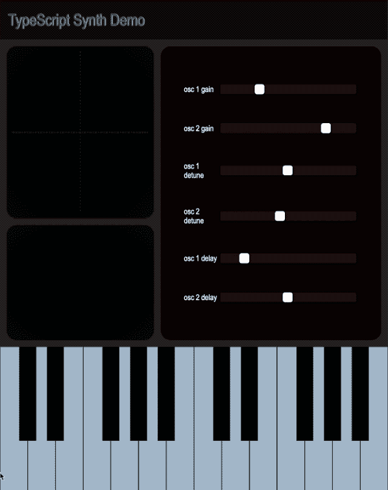

# 在 TypeScript 中构建合成器

> 原文：<https://itnext.io/building-a-synthesizer-in-typescript-5a85ea17e2f2?source=collection_archive---------1----------------------->

## 如何用 Web Audio API 在 TypeScript 中构建合成器

[示例项目](https://kenreilly.github.io/typescript-synth-demo/)的屏幕录制

## 介绍

Ttype script 语言提供了许多功能，使其成为音频工程的绝佳选择，音频工程具有挑战性，需要关注细节(*当出现问题时，可以清晰地听到结果*)。

在本文中，我们将了解如何在 TypeScript 中构建一个音乐合成器，包括一个键盘、音符读出器、示波器和两个具有增益、失谐和延迟功能的振荡器，并使用 Web Audio API 提供的许多功能来创建和处理声音。

对于示例应用程序源代码的副本，克隆这个 repo 。要观看该项目的现场演示，请查看本页[。](https://kenreilly.github.io/typescript-synth-demo/)

## 概念

该项目利用音频工程和编程中的一些概念，以模块化的方式定义合成器，每个组件都提供独立的功能以及与其他组件通信的清晰接口。这些概念是:

*   [音频信号、](https://en.wikipedia.org/wiki/Audio_signal) [波形](https://en.wikipedia.org/wiki/Waveform)和 [DSP](https://en.wikipedia.org/wiki/Digital_signal_processing)
*   [发布-订阅](https://en.wikipedia.org/wiki/Publish%E2%80%93subscribe_pattern)模式
*   HTML、CSS 和类型脚本
*   [FP](https://en.wikipedia.org/wiki/Functional_programming) 和 [OOP](https://en.wikipedia.org/wiki/Object-oriented_programming) 范例
*   [网络音频 API](https://www.google.com/search?client=firefox-b-1-d&q=web+audio+api)

虽然对这些概念的一些理解会有所帮助，但本文将为坚定的读者提供足够的指导，以学习用于构建该应用程序和其他类似应用程序的技能。

> 为了清楚起见，HTML 和 CSS 被省略了，因为它们是基本的，不包含任何在普通网站上不容易找到的内容。

## 主文件

应用程序的入口点是 **synth.ts** :

synth 类为键定义、synth 引擎、Synth 中每种类型事件的事件总线(信号和控制)以及 UI 中组件的 HTML 元素定义了属性。在初始化期间，synth 查询文档中所需的元素，创建键定义类、synth 引擎、示波器和控制滑块的实例，然后遍历滑块和键定义，将它们附加到 UI。

一个监听器连接到信号总线，将音符开/关事件传递到`on_signal`，它将使用当前音符更新显示。

## 事件总线

EventBus 是[发布-订阅](https://en.wikipedia.org/wiki/Publish%E2%80%93subscribe_pattern)模式的一个实现，对于需要独立于系统中其他组件在内部管理状态的音频组件来说，这是一个理想的选择，这些组件既相似又有不同之处。让我们来看看 **event-bus.ts** :

事件类扩展了基本合成事件，该事件返回其构造函数作为`type`属性，创建了一个非常精简的[反射](https://en.wikipedia.org/wiki/Reflection_(computer_programming))实现，使总线上的侦听器更容易`switch`事件类型并相应地处理它。每个事件都包含正在执行的操作的预定目标所需的数据。利用 EventBus 的两个实例，一个用于音符开/关事件，一个用于参数控制。UI 控件(*如按键和滑块* ) `fire`事件沿总线向下，由`listeners`接收并相应转发或处理。

这种体系结构非常适合于模拟硬件设备，这些设备总是相互传递信息，并且从来没有任何控制，甚至不知道系统内其他组件的内部工作方式。

## 合成引擎

下一个要检查的文件是 **synth-engine.ts** :

SynthEngine 定义了对传递到构造函数中的信号和控制事件总线实例的两个本地引用，以及音频上下文和增益、振荡器和延迟组件，我们将很快对此进行研究。构造器还将每个振荡器连接到同一通道的延迟，将每个延迟连接到主输出增益，然后使用单独的 SynthEvent 和 ControlEvent 处理程序监听事件。

当引擎接收到音符开/关事件时，该事件被转发到两个振荡器中的每一个，以触发开始/停止操作。类似地，当接收到控制事件时，在具有匹配类型和通道的组件上设置属性。每个属性在内部处理所提供的值，并将在内部执行必要的数学和其他操作，以允许它完全控制自己，同时提供一个干净、简单的接口。

## 合成键

SynthKey 和 KeyDefinition 类在 **synth-keys.ts** 中定义:

KeyDefinition 定义了一个八度音程的`notes`和两个八度音程的`scale`，这将被`keys`属性用来生成一个 HTML 按钮数组。当对每个键定义调用`SynthKey.create`时，会创建一个按钮，并将 [arrow](https://www.tutorialsteacher.com/typescript/arrow-function) (lambda)函数分配到按钮事件处理程序中，以触发总线上的音符开/关事件。

## 滑块

slider 小部件类位于 **slider.ts** 中:

滑块设计简单，返回一个放置在 synth 参数控制面板上的 range input 元素，带有最小值/最大值/默认值，以及输入上的一个事件处理程序，该处理程序将通过通道、控制类型和更新值在事件总线上触发一个事件。

## Synth 组件库

让我们检查一下 **synth-component.ts** 中的组件基类:

这个简单的抽象类为`node`定义了一个类型化的属性，它可以是任何 Web Audio API 对象，这些对象被包装在一个扩展这个对象的类中。每个组件都将继承音频上下文、通道和组件的属性，以便从这个组件的输出接收信号。

还继承了`drive`方法，用于将音频信号数据转发到信号链中的目标器件。这允许每个组件根据需要自动重新启动和重新连接到目标，并简单地通过批处理操作。

这充分利用了函数式和面向对象的范例，允许 synth 在保持良好工作状态的同时进行扩展和升级。这种架构类似于真正的音频设备，具有用于音频和控制数据的标准化 io 连接。

## 获得

最简单的音频组件是增益，在 **gain.ts** 中定义:

Gain 创建一个内部使用的 GainNode，并简单地通过`gain`属性传递该对象的 gain 属性。因此，处理这个对象的对象可以修改节点的增益，而无需访问 GainNode 实例上的其他属性。如果提供给构造函数的通道是`CHANNEL.MASTER`,组件将连接到音频上下文的目的地(您设备的音频驱动程序)并将增益设置为 10%,这很重要，因为默认情况下合成器的声音非常大。这是音频工程中的一个重要概念，因为吹喇叭和损坏耳膜并不难，这两者都是非常机械敏感的。

## 振荡器

接下来，我们来看看 oscillator.ts 中的振荡器组件:

振荡器保存对网络音频振荡器节点的引用，每次播放音符时都会重新创建该节点，因为内部振荡器一旦停止就无法重新启动。波形可以是正弦或方波，并且创建了两个内部增益节点，一个用作可控音量，另一个用作音量包络，当音符开始时快速提高音量，当音符停止时降低音量(这消除了内部振荡器开始或停止时可以听到的“砰”声，这种声音很大，在高音量下可能会损坏设备)。

`gain`和`detune`属性允许引擎在处理控制事件时从外部设置这些参数，并且每个属性执行将传入的原始滑块值转换为与目标音频节点兼容的值所需的数学运算。

当`play`被调用时，一个新的振荡器节点被创建并配置了频率、失谐和波形，然后内部音频链被建立，振荡器被启动并增大音量。

## 耽搁

延迟组件在 **delay.ts** 中定义:

Delay 包含一个`node`属性，它将使用该属性接收来自其他组件的信号，以及一个网络音频延迟节点和两个用于干/湿混合的附加增益节点。创建延迟组件时，会设置内部音频链，并设置 0.2 秒的延迟值。延迟也覆盖了组合湿/干输出的`drive`方法。

## 示波器

合成器的最终输出波形由 **scope.ts** 渲染:

示波器的核心是网络音频[分析器节点](https://developer.mozilla.org/en-US/docs/Web/API/AnalyserNode)，它为它作为输入接收的任何音频信号提供实时频域和时域分析，以及 HTML [画布](https://developer.mozilla.org/en-US/docs/Web/API/Canvas_API)，它提供 2D 图形功能，非常适合呈现音频波形。使用大小为 2048 的 [FFT](https://en.wikipedia.org/wiki/Fast_Fourier_transform) 创建一个 AnalyserNode，设置 canvas 呈现属性，范围从`run` 开始，它将从分析器中检索数据并呈现它。

渲染周期用`requestAnimationFrame`排队，它将在下次浏览器引擎准备重画屏幕时运行这个周期。通过步进音频样本并跟踪当前[相位来检索波形，当相位达到 360 度时](https://en.wikipedia.org/wiki/Phase_(waves))返回捕获的波形。然后，通过计算水平步长并在画布的宽度上迭代，绘制捕获的波形，沿 y 轴绘制一个点，对应于每步的样本幅度。还沿 x/y 轴添加了虚线以供参考。

## 结论

TypeScript 为实现高性能应用程序提供了出色的功能，其体系结构适用于音频工程、图形和其他异步程序，在这些程序中，用户可以听到和/或看到小的性能错误。

这个 synth 演示了 Web Audio API 提供的用于生成、处理和播放各种声音的几个组件。

感谢阅读！

~ [8_bit_hacker](https://twitter.com/8_bit_hacker)