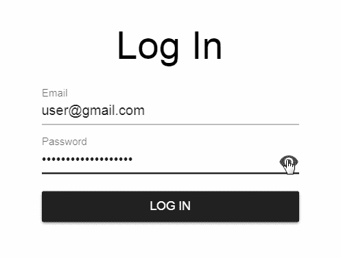
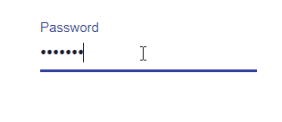
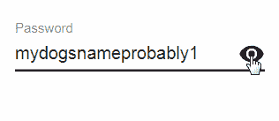

# 使用 React 和 Material UI 构建“Mask Toggle”密码输入组件

> 原文：<https://itnext.io/building-a-toggled-mask-password-input-component-w-react-and-material-ui-f55e6bd73434?source=collection_archive---------1----------------------->

众所周知，允许用户切换密码输入可见性消除了摩擦并改善了用户体验。我将在本教程中向你展示如何构建一个可切换的密码输入！

# 设置/依赖关系

本文假设你已经有了一个 React 应用，并安装了 **@material-ui/core 1.0.0+** 和 **@material-ui/icons 1.0.0+** 作为依赖项。如果你需要这方面的帮助，从这里的[开始](https://reactjs.org/docs/add-react-to-a-new-app.html)，然后到这里的。

# 构建组件

首先，我们从呈现材质 UI 文本字段的 **PasswordInput** 类组件开始。

这里我们有一个标准的密码输入。

值得注意的是，我将组件的道具分布到渲染的 TextField 上。这允许您将 PasswordInput 组件视为带有密码类型的 TextField 组件。

在进入屏蔽/取消屏蔽按钮逻辑之前，重要的是要理解在材质 UI 中， **TextField** 组件基本上只是一个**输入**组件的包装器。由于您可能想要自定义**输入**的底层属性，Material UI 在**文本字段**上提供了一个名为 *InputProps* 的属性，允许您通过**文本字段**将自定义属性传递到底层**输入**中。有道理吗？恰好**输入**组件有一个我们需要通过**文本字段**传递给它的重要道具，叫做*endadornation*。这是代码。

看看第 15–31 行。这给了我们一个嵌入在输入右侧的漂亮图标。让我们让它真正切换遮罩。

这里我们给组件添加了一个 *passwordIsMasked* state 属性，然后在眼睛被点击时切换它。当切换属性时，它会触发组件的重新呈现，作为密码或文本输入。

向图标添加了样式，以便在用户单击时将光标变为指针。

好了，我们完成了！

如果你觉得这篇文章有用，请随意为我鼓掌，发表评论，或者在这里或社交媒体上关注我(我的 [Instagram](https://www.instagram.com/shawn.webdev/) 最近火了)！